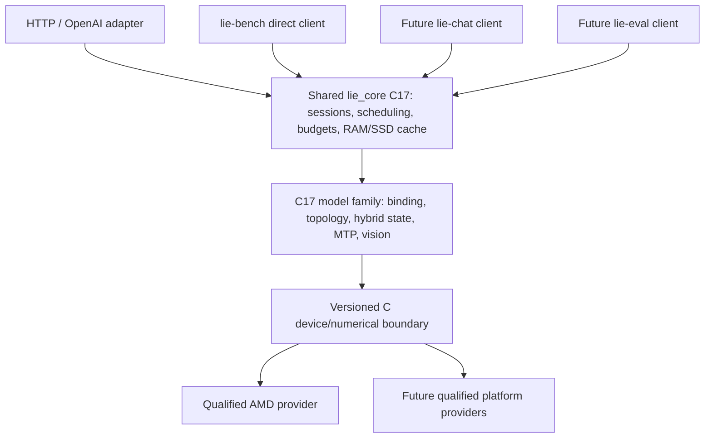

# Architecture and ownership

**Authoritative evolution policy:** [BACKEND.md](BACKEND.md). An explicit embedded
Gufo adapter is permitted for bootstrap, then refactored toward LIE-owned model,
session, memory and execution according to requirements and new developments.
The earlier blanket exclusion of an in-process adapter is superseded; delegation
must still never be presented as an autonomous backend.

## Implemented decisions through the T0 candidate

1. Separate Git repository, `develop` seed and `feature/initial-runtime`.
   Source, temporary files, binaries and evidence stay here. This repository is
   not a worktree of DS4. No deployment, weight download or package installation.
2. C17 for the runtime, registry, HTTP and monitor. libuv owns nonblocking
   listeners/lifetimes; llhttp is the maintained HTTP/1 parser rather than a new
   parser; json-c owns JSON trees; libcurl is used by the monitor and is a link
   dependency of unexposed upstream image helpers in the optional Gufo build.
   This uses installed libraries and no JVM/Python inference dependency.
3. One registry, short mutex-protected updates/copy, serialization outside the
   mutex. Registration copies names/descriptions/tags. No callbacks into GPU or
   hardware polling during health/metrics. Handles remain valid until destruction.
4. Separate API and management listeners (19879/19880 by default). Both use the
   same loop, strictly bounded connections/request bytes and timeouts. This is
   a functioning control plane, not a promise of latency under all loads.
5. Gufo is independently fetched from upstream, not copied from the DS4 port.
   The C++ adapter delegates to Qwen Model/Session. It now links optionally into
   the C worker/flow/HTTP path; default builds still have no numerical provider.
   Scoped original-weight smoke, C1 baseline and HTTP lifecycle GPU results are
   now recorded. No owned numerical backend or full independent numerical/
   hardware qualification is established.

## Reactive pattern: Reactor is only the transport layer

The [reactive contract](REACTIVE.md) is authoritative for demand/backpressure,
stream ordering, dispatch cancellation and buffer retirement. The new C `lie_flow`
component implements these primitives with preallocated bounded storage and two
coalesced eventfd directions. Worker and HTTP bindings now use them. CPU tests
exercise real threads and sockets with a separate synthetic provider; the
separate original-weight lifecycle run also exercises real cancellation and
pressure/isolation. Full independent GPU/model correctness remains an open gate.

The target is publisher -> bounded subscription -> output subscriber, with
credits/releases flowing back to the device-owner scheduler and cancellation on
a separate control path. No inference or disk wait on the network loop, no queue
that grows to hide a slow client, no token dropping during normal generation,
no one-thread-per-agent execution, no unbounded operator chain. Admission is
bounded and the current worker supports one through eight active sequences.
The shared C readiness/credit dispatcher immediately submits scalar work for
one ready row or native AR batching for multiple ready rows, with one device owner.
SSE write completion returns demand; disconnect latches cancellation with pinned
lifetimes. Measured memory admission, advanced fairness, persistence and broader
inference instrumentation remain open; libuv alone is not those properties.

A separate [pure-inference investigation](INFERENCE-REACTIVE.md) evaluates whether
readiness/dependency-driven execution can reduce GPU idle gaps, overly broad
synchronization, launch overhead or conservative buffer lifetimes. These are
hypotheses, not benefits guaranteed by the architecture. Moving a synchronous
forward into a worker is not itself a faster forward; C1, concurrency and HTTP
results must remain separate. No per-tensor callback framework is required.

## Target execution architecture (not all implemented)

- HTTP loop: admission parsing, request ownership, ordered output and disconnect
  events. It never launches model inference. Bound all queues and output bytes.
- One device-owner worker: the only LIE admission/scheduling authority for
  mutable execution. Initially it may invoke pinned Gufo Model/Session through
  the isolated transitional adapter, never a second Gufo serving scheduler.
  Subsequent slices move model/state/layer-graph ownership into LIE C code and
  invoke selected numerical operations through a narrow device/kernel ABI.
  Work never blocks the network loop. Qwen rendering may initially be adapted
  upstream code, with tested semantics and no upstream types leaking to clients.
  Evolve the LIE contracts explicitly for requirements/CUDA, not around hidden
  assumptions of the bootstrap implementation.
- Future CPU preparation workers: T0 currently renders/tokenizes on the device
  owner, off the HTTP loop. Splitting this requires a thread-safe contract;
  no CPU model forward.
- Disk workers: bounded save/load jobs, immutable frontier payloads and completion
  messages to the owner. No direct GPU restore from a disk/client thread.
- Resource manager: weights + active session state + retained prefixes + workspace
  + speculative rollback + I/O buffers on shared RAM, not independent pools.
  Runtime admission values must come from actual backend/host measurements.

Sequence states will be `queued -> prefill -> ready/decode -> output_paused ->
completed/cancelled/failed`, with a separate retained/tool-waiting state. Agent
count is not ready-row count. A cancelled row admits no new work; references and
buffers remain pinned until its in-flight work completes. Do not cancel peers
in a shared batch or expose speculative tokens before verification.

Scheduling policy to qualify: immediate C1 dispatch, true native shared steps
where supported, decode plus bounded prefill chunks with new-arrival fairness,
backpressure per sequence, controlled deadline expiry, idle-prefix reclamation
before admission refusal. Budgets (active rows, token/chunk/speculation/memory)
are explicit instance settings. Measured step-time targets are not instantaneous
kernel preemption. Native AR throughput is measured in
[REACTIVE-INFERENCE-RESULT.md](REACTIVE-INFERENCE-RESULT.md); advanced fairness,
mixed-arrival latency and internal asynchronous forward remain unqualified.

## Backend inspection

At Gufo `f783fedb`, Qwen's Model owns resident weights and an Executor, and
sessions carry independent history/state. `EvaluateBatch` and `DecodeBatch`
exist, with per-row `BatchOutcome`; a failed call can contain completed peers.
The experimental adapter exposes native **AR batching through eight rows** and
no MTP. The additive C contract validates completed per-row frontiers before
publication; a loop over single-row calls is not native batching.
Owned batching follows the replacement gates. Upstream payload version is **14**,
not DS4 native19 or an automatically portable future LIE state format.

## Separation target and immediate state work

The [2026-10-02 assessment](BACKEND.md#separation-assessment--2026-10-02) recommends
starting extraction now. The target separates three independent responsibilities:

This is the ownership target, not the current implementation. Gufo still owns
the model layer and numerical execution. Model-family semantics, tensor formats
and device capabilities are separate identities; adding one requires qualifying
its actual operations and combinations. Preserve fused kernels and native batch
granularity across the boundary. Porting model/control code to C17 is a distinct
milestone from eliminating the retained C++/HIP numerical sources/dependencies.

The first runtime extraction is a shared, transport-independent C core, used by
the HTTP adapter and a direct engine benchmark path. Prefix policy and delegated,
version-qualified complete hybrid capture/restore are then added to that core.
Qualify RAM reuse and clone isolation, then optional SSD persistence and restart.
Define MTP/vision state requirements before freezing payload framing. Device-owner
capture/restore and bounded immutable disk jobs use the same cancellation,
retirement and resource rules as inference. The [state design](STATE.md) and
[future ABI requirements](ABI.md#planned-state-mtp-vision-and-owned-execution-contracts)
describe these unimplemented contracts.

## Shared core and client boundary

The owner requires engine features to be reusable by HTTP, `synapse-lie-bench`
and future `lie-chat`/`lie-eval` clients. `lie_core` is the proposed shared C17
library boundary; **it is not an implemented CMake target or stable API yet**.
Clients consume the same core directly without starting an HTTP server.

Current source audit:

- `lie_flow` and `lie_inference` are already independent of HTTP. The production
  worker and reactive direct benchmark share ready-row/credit batch dispatch.
- `lie_runtime` currently combines `worker.c` with Chat/Responses parsing, tools
  and wire code. `worker.h` accepts `lie_chat_request`, whose ownership includes
  a `json_object` and whose fields include wire streaming options.
- The benchmark creates/manages sequences itself through the executor ABI. Its
  shared dispatch does not yet mean shared job/session/cache lifecycle.

Required responsibility split:

| Shared core | Client or protocol adapter |
|---|---|
| Engine/session lifecycle, capability admission, model selection at composition, scheduler, batching, cancellation, output credit and retirement | HTTP routing/status, request-body limits, JSON/SSE framing, sockets, connection deadlines and disconnect mapping |
| Owned normalized inputs: messages/tools, physical tokens and future prepared images; tokenizer/template and model semantics | Parse OpenAI input into core descriptors; acquire CLI/corpus/image transport input and format client output |
| Sampling, stop/tool semantics, MTP verification, vision execution, cache RAM/SSD and memory budgets | CLI flags/TUI, dataset iteration/scoring policy, benchmark repetitions, report/graph export |
| Typed confirmed events, execution errors, usage, timings and resource snapshots | Map events/errors to OpenAI responses, terminal text or evaluation records; export JSON/Prometheus |

Core request ownership must not retain an HTTP parser tree or streaming/SSE
options. Copy or transfer explicitly owned C data with bounded lifetimes; opaque
JSON schema strings can be model data, but a protocol parser's `json_object`
cannot own an admitted core job. Public core headers expose no libuv/llhttp or
protocol JSON types. The core must build/link without the server or HTTP adapter.

Provide direct normalized-message and physical-token entry paths. The latter
preserves benchmark/evaluation inputs without formatting a fake conversation;
scoring/logit operations must be explicit bounded capabilities when introduced.
Clients may configure admitted policies, but cannot bypass shared memory/cache
accounting or independently schedule mutable backend work. They cannot consume
Gufo classes or manage a second production session/cache implementation.

Benchmark coverage has three explicit scopes: the shared core lifecycle, the
HTTP path including transport cost, and low-level executor diagnostics/reference
measurements. Preserve historical labels; an executor-only result does not
qualify shared cache or job lifecycle. Add the direct core consumer as part of
the extraction, rather than claiming a renamed library is sufficient.

Extraction acceptance: headless core build; direct-message/token and HTTP paths
using the same engine policy; matched physical inputs/outputs where semantics
match; cancellation, pressure, ownership and retirement tests without sockets;
HTTP regression tests and focused ASan/UBSan on `.157`. Later cache/MTP/vision
features require direct-core tests as well as their HTTP projection tests.
Original-weight GPU correctness/performance remain separate coordinated gates.
Each engine instance owns its state and device worker; sharing a library does
not implicitly share resident weights or mutable sessions across processes.

## Increment plan and departure from requested order

- A: inventory, isolated source, provenance, model metadata and inherited baseline
  identities recorded. Fresh pristine baseline verification still needs a private
  comparator and admitted run. Completed operator windows are not permanent lease
  acknowledgement; this numerical gate is not marked complete.
- Independent part of B/E: compiled C management runtime, metric registry,
  monitor and compile-checked adapter delivered while hardware is blocked.
- Reactive/T0 slice: primitive and worker/HTTP/executor bindings are implemented,
  HIP-linked and CPU/synthetic-tested. A separately leased original-weight C1
  JSON/SSE smoke passed in `t0-model-smoke-r4`; `t0-model-lifecycle-r1` later passes
  actual dispatch cancellation, slow-client pressure, peer isolation and recovery.
  These are not full T0 qualification.
- Next B / T0: under a fresh admitted run, qualify the pinned pristine comparator
  and physical-token/frontier/logit equivalence; GPU failure gates remain open.
  Do not transfer synthetic results to GPU correctness.
- C / T1: refactor one responsibility at a time against requirements and evidence;
  qualify lifecycle, admission/chunks, C1/2/4/8 and MTP on their actual paths.
  Trace and test reactive pure-inference hypotheses separately from serving gains.
  T2 removes whole-engine delegation from the qualified owned path; no big-bang
  rewrite or permanent-wrapper claim is implied.
- D: RAM prefix snapshots then SSD atomic persistence/restart and failure tests.
- E remainder: actual inference metric wiring, streaming/backpressure metrics,
  percentiles, broader monitor/UI and instrumentation overhead measurements.
- F: CUDA on DGX Spark through the same contracts, after AMD baseline stability.

This ordering delivers reusable tested code without using GPU idleness as an
implicit permission or claiming fixtures establish inference.
