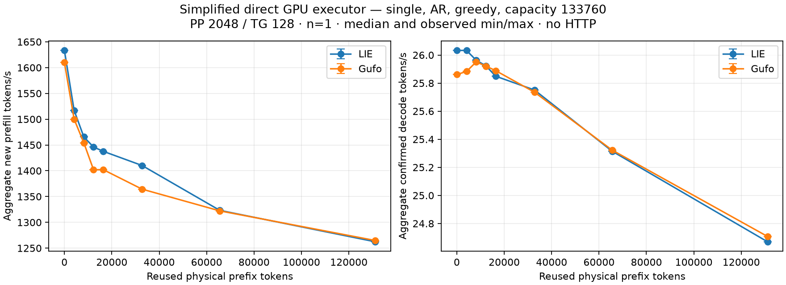
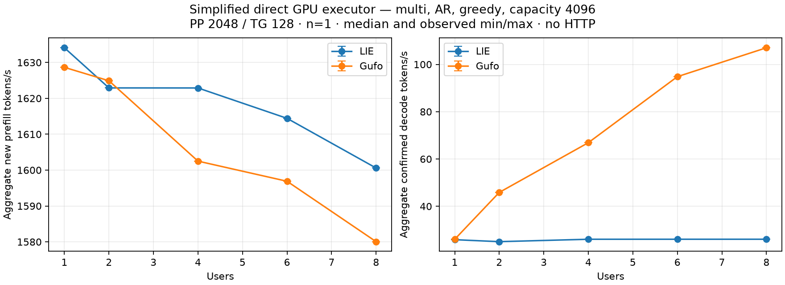

# Simplified GPU benchmark results — 2026-10-01

Original-weight tests ran on `.157` in the isolated `feature/openai-reactive-api` worktree. The C17 `synapse-lie-bench` compares the production LIE adapter with a benchmark-only direct Gufo binding using the same independently fetched pinned numerical archives (`f783fedb`). This isolates executor dispatch, not independent numerical engines.

These are the historical serial-adapter measurements at checkpoint `ad02a01`.
The subsequent shared C dispatcher and native batching are tracked in
[REACTIVE-INFERENCE-RESULT.md](REACTIVE-INFERENCE-RESULT.md); the observations
below are retained unchanged.

AR, greedy, pp2048/tg128; one warm-up and **one measured sample per point**. Rates below are observed values, without confidence intervals or outlier removal. The complete protocol, differences from official Gufo measurements and CLI are in [CONTEXT-COMPARISON.md](CONTEXT-COMPARISON.md).

## Occupied context through 128K

Capacity 133760. Each fresh session processes the exact physical prefix outside the PP clock; only the new suffix counts in PP. Every output completed 128 tokens. Cross-arm physical inputs, output IDs and full PP/TG frontier hashes agree at all eight points.

| Prefix tokens | LIE PP token/s | Gufo PP token/s | LIE TG token/s | Gufo TG token/s |
|---:|---:|---:|---:|---:|
| 0 | 1633.37 | 1610.13 | 26.03 | 25.86 |
| 4096 | 1517.17 | 1500.01 | 26.03 | 25.88 |
| 8192 | 1465.62 | 1454.18 | 25.96 | 25.95 |
| 12288 | 1446.02 | 1401.94 | 25.92 | 25.92 |
| 16384 | 1437.71 | 1402.14 | 25.85 | 25.89 |
| 32768 | 1410.20 | 1364.33 | 25.75 | 25.74 |
| 65536 | 1323.24 | 1322.22 | 25.31 | 25.32 |
| 131072 | 1262.38 | 1264.80 | 24.67 | 24.71 |

C1 decode differs by less than 0.7% across these observations. At prefix 131072, physical prompt length is 133120; this is occupied context rather than merely a large allocation. LIE HTTP still has its 32K capacity limit: these are direct executor measurements.

## Concurrent decode

Capacity 4096, identical physical 2048-token prompts. All sequences are prefilled before the common decode interval; confirmed aggregate output tokens are divided by that interval. This differs from the published Gufo sum of individual request rates. Physical/output IDs and complete frontier hashes match across both arms at every concurrency.

| Users | LIE aggregate TG token/s | Gufo native batch TG token/s | Gufo / LIE |
|---:|---:|---:|---:|
| 1 | 25.88 | 26.05 | 1.01 |
| 2 | 25.05 | 45.87 | 1.83 |
| 4 | 26.06 | 66.89 | 2.57 |
| 6 | 26.07 | 94.82 | 3.64 |
| 8 | 26.07 | 107.03 | 4.11 |

The adapter measured here set `decode_concurrency = 1` and invoked one `Session::DecodeStep` per sequence. Its C worker interleaved synchronous single-row calls. The reference invoked `DecodeBatch` with independent states; upstream HIP `ForwardBatch` shares weight reads/projections across rows. This explains the measured flat LIE throughput and increasing Gufo throughput. The subsequent implementation adds a batch executor ABI with per-sequence credits, cancellation and failure semantics; its results are recorded separately.

## Validation and preserved failure

Fresh `.157` CPU fixtures passed **18/18 debug and 18/18 ASan/UBSan** in `bench-cpu-r4`, including graph export with space-containing paths. Fixtures are NOT-INFERENCE. The initial `bench-suite-r1` root remains FAILED: both eight-point single arms passed, then the first small-context multi calibration exceeded the renderer safety bound before producing a timing sample (actual exit 1). The bound remains intact. The small-context binary-search upper bound was corrected; an old-code regression failed with actual exit 1, while the corrected fixture passed. `bench-suite-r2` reruns only the previously missing arms.

The single-arm raw data and failed arm are preserved in `evidence/bench-suite-r1`; CPU receipts in `evidence/bench-cpu-r3` and `evidence/bench-cpu-r4`. All 29/7/13 archived files respectively match remote collection SHA-256 manifests. Raw multi data, sample counts, output budgets and graphs are preserved in `evidence/bench-suite-r2`. Each run binds model stat identities, runner/manifest and binary/DSO identities, actual exits and owned cleanup. No heavyweight model hash, foreign termination, installation, deployment or publication occurred.

MTP, HTTP snapshot restoration, cold-file/HTTP-ready loading and allocation-exact peak memory are not replicated. This is a simplified AR benchmark, not full QUALITY.md numerical or model-quality qualification.

## Loading, memory estimates and final retirement

The follow-up `bench-suite-r2` completed PASS at 17:53:48 UTC; all six
helpers and their GPU children exited 0. Both memory workloads completed full
outputs with matching physical/output IDs and full frontier hashes. At capacity
133121 both bindings report 82,384,141,824 model bytes and 3,517,025,300
per-session bytes as **upstream estimates**, not allocation-exact HIP peaks.
Sampled system/device telemetry is retained separately in each results directory.

AR model loading at capacity 262144 measured 20.473 s for LIE and 20.370 s
for the reference, one observation each under existing OS cache conditions.
This excludes cold-file eviction, MTP sidecar and HTTP-ready time. Estimated
session bytes at this capacity are 6,786,984,980 for both bindings.

Every follow-up raw measurement and manifest SHA-256 matches its run receipt;
model stat identities and admitted files remained unchanged. All helper
postflight KFD lists are empty. Read-only `/proc/locks` collection after the
last run shows no holders of the four known lease identities; final lock-path
stat identity was not rechecked in that collection. All thirteen owned
controller/helper/child PIDs are observed absent. The SCP retirement check
correctly exits 1 for missing `/proc/<pid>/stat` files; its actual receipt is
preserved separately and is not a benchmark failure. Follow-up evidence was
collected via authorized SCP; local collection hashes supplement the per-run
remote measurement/manifest hashes rather than claiming a remote archive hash.

Graphs and machine-readable summaries for context, concurrency, memory workloads
and loading are under `evidence/bench-suite-r1/comparison-single` and
`evidence/bench-suite-r2/comparison-{multi,memory,loading}`. No GPU process remains
from this campaign. No merge, push or deployment occurred.

Compact summaries, plots and validation receipts are versioned under
[`benchmarks/2026-10-01`](benchmarks/2026-10-01/). Full raw evidence remains
under the local `evidence/` directories described above.
