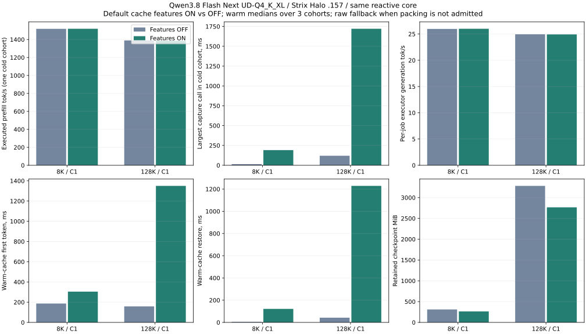
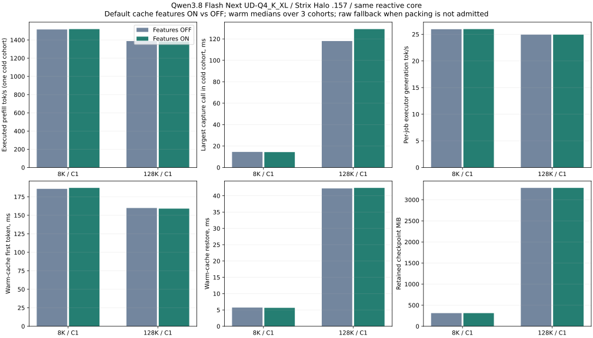

<!-- SPDX-License-Identifier: MIT -->
# Qwen checkpoint compression: cost, correctness and admission

The numeric-byte codec passes exact original-weight restoration, but its measured
15–16% saving is insufficient for the observed latency cost. The owner rejects
that tradeoff. The current C17 admission policy requires at least 2:1 reduction
of retained allocation and first probes at most 48 KiB. This threshold is a
condition for packing, **not a claim that Qwen achieves 2:1 compression**.
Active device KV remains F16. The policy and codec are shared by core clients;
HTTP owns neither. Both compile-time features remain ON, with raw fallback;
SSD persistence alone remains an explicit runtime opt-in.

## R6: exact compressed-state qualification, unfavorable performance

Source `8932c5f`, `.157` Strix Halo/gfx1151, Qwen3.8 Flash Next UD-Q4_K_XL,
unchanged pinned Gufo numerical engine `f783fedb`. All six arms pass. R6 uses
the old 12.5% payload saving threshold; it predates the stricter current gate.
OFF disables utility and compression; ON enables both. No kernel or worker count
change. Each core arm has one retained cold warmup and three measured warm
cohorts, C1, TG128, chunk 2048. All output IDs match and full hits execute no PP.

8K uses context 262144 and 4 GiB RAM budget. 128K uses context 133120 and 8 GiB RAM
budget so the raw source, candidate and codec/restore buffers fit. Compare ON/OFF
within these matched configurations; do not mix with R5's 128K capacity/budget.
MB below means decimal bytes/1,000,000, including the retained descriptor.
Warm columns are medians; cold PP/capture have only one observation per build.

| Prompt | Build | Cold PP tok/s | Capture ms | Warm restore ms | Warm TTFT ms | Executor TG tok/s | Output/wall tok/s | Retained MB | Saving |
|---|---|---:|---:|---:|---:|---:|---:|---:|---:|
| 8192 | OFF | 1518.512 | 14.904 | 5.629 | 186.701 | 25.973 | 25.215 | 326.699 | 0.00% |
| 8192 | ON | 1519.623 | 191.459 | 121.534 | 304.278 | 26.002 | 24.672 | 276.533 | 15.36% |
| 131072 | OFF | 1389.393 | 120.229 | 42.456 | 158.406 | 24.949 | 24.385 | 3441.461 | 0.00% |
| 131072 | ON | 1384.960 | 1721.107 | 1228.780 | 1350.014 | 24.922 | 19.872 | 2900.848 | 15.71% |

At 128K, packing saves 540,612,971 bytes (15.71%), while warm restore rises from
42.46 ms to 1228.78 ms and aggregate output/wall falls about 18.50%. Executor
TG itself remains near 24.9 tok/s; this is a host restore penalty, not slower
attention math. Capture is about 1.72 s instead of 120 ms. Small cold-PP
variations are not a causal codec estimate: packing happens after prefill.
Three sequential warm repeats do not establish a statistical confidence bound.

A separate 128K producer writes compressed v2/codec2 to the SSD; a new process
loads it with the same stable identity. All three fresh/restored pairs match
every logit frontier and 16 output token IDs: greedy, seeded sampling and an
independent greedy clone. The file is 2,900,839,229 bytes; read/validate/repack
costs 3.966 s, with restore measured separately at 1.248–1.262 s. Current SSD
import expands then optionally repacks the data before owner upload; those
redundant passes are included, not hidden. The staging metric is the 8 GiB
reservation, not measured RSS. This proves exact same-provider replay, not
independent model quality or compressed HTTP/C2 responsiveness.

The independent observer records 951 samples: CPU peak 97.875 C, GPU peak 99 C
in six isolated samples, each bracketed within at most 2.018 s. One boot ID,
no observed reboot/crash/device error. NVMe composite peaks 62.85 C; this is not
the hottest NVMe sub-sensor. Full sensor records are retained. No tuning.

Closure at **12:30:26.836170 UTC** confirms twelve owned helper/child identities
absent, KFD empty and four unchanged/free leases. Independent status confirms
controller retirement; observer exits 0 at 12:30:42.174668 UTC. All 68 collected
files SHA-verify. Root retains the window only for separately admitted R7.

[JSON](benchmarks/2026-10-02/cache-features-r6/summary.json),
[CSV](benchmarks/2026-10-02/cache-features-r6/summary.csv),
[receipt/archive](benchmarks/2026-10-02/cache-features-r6/receipt.json) and
[thermal graph](benchmarks/2026-10-02/cache-features-r6/thermal.svg) retain all
samples, source/commands and exact exits. The source capsule preserves the old
policy even after current admission changes.

## R7: strict benefit admission

Source `71a4599` requires at least 50% saving of the complete retained allocation,
including its descriptor. A preliminary deterministic sample may decline packing;
a passing sample never bypasses the final size check. The decoded state is never
quantized. Thirteen ON and six OFF sanitizer suites pass, including modest-saving
rejection, an adversarial sample and exact special floating-point bit patterns.
[CPU receipt](benchmarks/2026-10-02/cache-benefit-cpu/receipt.json).

All four matched GPU arms pass, with the same workload/capacity/budgets as R6.
Each ON arm correctly falls back to raw and matches its OFF output IDs. All
sixteen jobs reach TG128; full warm hits execute no prefill. Same one-cold/three-
warm methodology and limits apply. Both build features change together, so this
is a feature comparison, not an isolated utility-policy experiment.

| Prompt | Build | Cold PP tok/s | Capture ms | Warm restore ms | Warm TTFT ms | Executor TG tok/s | Output/wall tok/s | Retained MB |
|---|---|---:|---:|---:|---:|---:|---:|---:|
| 8192 | OFF | 1514.904 | 14.522 | 5.734 | 185.752 | 25.952 | 25.195 | 326.699 |
| 8192 | ON | 1518.930 | 14.369 | 5.651 | 187.024 | 25.972 | 25.204 | 326.699 |
| 131072 | OFF | 1387.514 | 118.003 | 42.251 | 159.837 | 24.932 | 24.367 | 3441.461 |
| 131072 | ON | 1382.628 | 129.148 | 42.414 | 159.023 | 24.928 | 24.362 | 3441.461 |

At 128K, the warm output/wall ratio ON/OFF is 0.99979, with restore 42.41 ms
versus 42.25 ms. The repeated decompression penalty is gone. The one cold capture
is 129.15 ms versus 118.00 ms: retain that observation; do not claim zero overhead
or attribute the entire difference to the probe. The checkpoint stays 3.441 GB:
there is **no memory saving on these inputs**, and no claim of high compression.

The observer records 373 samples, CPU peak 98 C in one sample, GPU peak 100 C in
one sample bracketed within 2.018 s. GPU episodes >=98 C have at most two
consecutive samples, bracketed within 3.025 s. Same boot ID; no observed
crash/reboot/device error. These are sampled observations, not a maximum safe
temperature or proof of no throttling. Hardware settings remain unchanged.

Closure at **12:37:26.556477 UTC** verifies eight owned identities absent,
KFD empty and four unchanged/free leases. Controller retirement is independently
observed; observer exits 0 at 12:37:42.541409 UTC. All 50 collected files verify.
Root returned the coordinated window to Q2 and notified Point, with no remaining
owned GPU job or automatic waiter.

[JSON](benchmarks/2026-10-02/cache-features-r7/summary.json),
[CSV](benchmarks/2026-10-02/cache-features-r7/summary.csv),
[receipt/archive](benchmarks/2026-10-02/cache-features-r7/receipt.json),
[thermal graph](benchmarks/2026-10-02/cache-features-r7/thermal.svg).

## Remaining compression work

This implements benefit admission, not a new high-ratio Qwen representation.
The reviewed upstream Qwen save path uses live F16 KV and F32 recurrent state;
LIE's separate lossless stream must not be described as the same antirez codec.
See the [source audit and model boundary](STATE.md#retention-policy-and-compression-boundary).
Low-bit KV, shared/delta checkpoints, persistent utility metadata and compressed
HTTP/C2 responsiveness remain separate work. Low-bit state would require explicit
representation/versioning and quality evaluation; exact lossless replay results
cannot qualify a lossy format. No Qwen compression ratio from another model,
backend, branch or weight-only quantization is inherited by these measurements.
