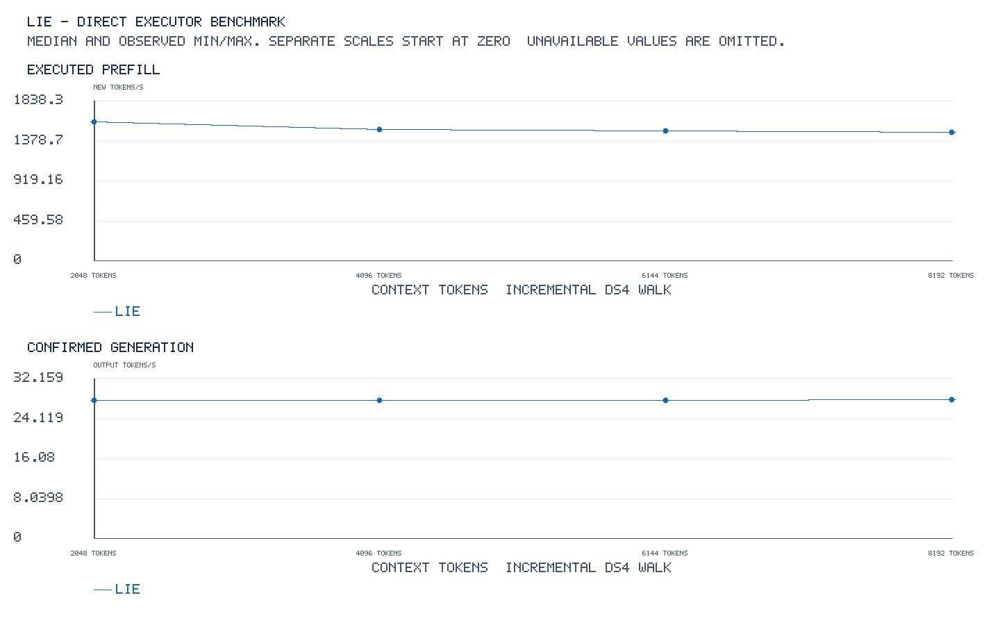

<!-- SPDX-License-Identifier: MIT -->

# Historical Q2 qualification: DS4 walk

The current C17 executable selects `--suite ds4-walk` explicitly; its
[current commands and measurement contract](guides/BENCHMARKS.md#incremental-raw-corpus-walk)
use `--corpus`, `--context` and `--restore auto|replay`. This page retains the
earlier isolated Q2 binary's CLI and GPU evidence. Its capsule and archives
are not the build inputs or qualification receipt for the current runtime.

That historical binary's default direct mode follows the measurement loop in
[`antirez/ds4` `ds4_bench.c` at `0aaea5a`](https://github.com/antirez/ds4/blob/0aaea5a238fb41a35106a551e73c8409dfb751ac/ds4_bench.c).
It loads one model and tokenizes one raw-text corpus before timing. For each
walk it creates one logical sequence and advances the same token prefix by a
fixed step: 2048, 4096, 6144, 8192, and so on by default. The monotonic
prefill timer brackets only the newly appended tokens. Its numerator is the
frontier minus the previous frontier, so every default point reports 2048
prefill tokens. Greedy decode follows each frontier. Before the next step,
the benchmark restores the pre-decode frontier from a snapshot of at most
1 GiB, or replays the prefix if the snapshot is larger or unsupported. Neither
restoration path enters the prefill or decode timing window.

LIE's state API restores only into a pristine sequence. The benchmark therefore
replaces the underlying sequence handle outside the timer while preserving
the advancing logical prefix. DS4 restores its snapshot into the same session.
LIE's decode API may stop at EOS; DS4 explicitly excludes EOS when choosing a
greedy token. A run with fewer than the requested output tokens is flagged and
cannot enter the matched TG128 comparison. These backend differences remain
visible and should not be described as byte-for-byte DS4 execution.

The default is one walk with no warmup. `--warmups 1` runs an entire unscored
qualification walk before the measured walk; it does not reset the sequence
at every context point. For a fixed four-point check:

```sh
synapse-lie-bench --model MODEL.gguf --prompt-file promessi_sposi.txt \
  --output walk.jsonl --sizes 2048,4096,6144,8192 \
  --prefill-chunk 2048 --pp 2048 --tg 128 --warmups 0 --repetitions 1 \
  --context-capacity 133760 --restore snapshot-auto --graphs graphs
```

`--restore replay` forces the DS4 replay fallback for diagnostic checks. For
4K/8K steps, set both `--pp` and `--prefill-chunk` to 4096 or 8192 and use
contiguous exact sizes. The `fresh`, `single`, `multi`, `loading`, and `memory`
direct suites remain explicitly selectable as deprecated historical modes
pending review. Reports reject comparisons between their distinct timing
contracts. HTTP, core, and state suites retain their separate APIs.

The [CPU fixture](../experiments/ds4-walk-bench.patch) checks both snapshot
and replay paths, the exact append intervals, and that each actual prefill call
falls inside its reported monotonic bounds. It is synthetic and supplies no
model-performance evidence. The [source capsule](../config/ds4-walk-bench-source.json)
and [local GPU-linked binary provenance](../config/ds4-walk-bench-build.json)
record reproducible inputs and the unchanged numerical archives. The focused
four-point run is governed by [its frozen plan](../config/q2-ds4-walk-promessi-plan.json).
The previous [full-prefill table](Q2-PROMESSI-SHORT.md) starts from an empty
sequence at every point and measures all tokens; its rates answer a different
question and are kept as separate evidence.

## Q2 result on `.157`, 2026-10-08

The real Q2 run used the same `I promessi sposi` bytes as the pinned DS4
repository (SHA-256 `f53e0d80…209f`), chunk 2048, context capacity 133760,
IOMMU off, C1 greedy AR and TG128. One walk with no warmup ran at four exact
frontiers. All four prefill/decode frontiers, logits hashes and 128 output
token IDs match the earlier measured full-prefill samples exactly. The first
three points used bounded snapshots of 181,971,056; 222,873,712; and
274,786,416 bytes. Snapshot restoration happened outside timed phases.

| Context | New PP tokens | New PP seconds | New PP token/s | Decode seconds | TG token/s |
| ---: | ---: | ---: | ---: | ---: | ---: |
| 2048 | 2048 | 1.281172706 | 1598.535459 | 4.591452259 | 27.877890 |
| 4096 | 2048 | 1.351445508 | 1515.414412 | 4.591393521 | 27.878246 |
| 6144 | 2048 | 1.363234988 | 1502.308859 | 4.587317327 | 27.903018 |
| 8192 | 2048 | 1.378216359 | 1485.978589 | 4.577237508 | 27.964465 |



[All values and the old full-prefill measurements (CSV)](figures/q2-ds4-walk-promessi.csv),
[validated result](../config/q2-ds4-walk-promessi-results.json),
[retained raw JSONL and telemetry](../evidence/q2-ds4-walk-promessi-r1/results/00-q2-c2048.jsonl).
The previous full-prefill rates at 2048/4096/6144/8192 were
1612.737061/1562.428666/1535.011659/1511.433870 token/s, but their
numerators were 2048/4096/6144/8192 and they used one warmup per point.
Those rates must not be ranked against the new incremental rates as if they
were the same workload. The identical logits and output IDs establish that
the advancing state reaches the same numerical frontiers.

The native child and runner exited 0; all 15 result files hash-verified after
collection. The window [release](../evidence/q2-ds4-walk-promessi-r1/release.json)
and [independent closure](../evidence/q2-ds4-walk-promessi-r1/strong-closure.json)
confirm empty KFD, nine retired process identities, eight retired groups,
five free original leases and unchanged reference model stats. Telemetry
observed peak CPU 76.25 °C and GPU 81 °C. This is a single measured walk,
not a distribution or a performance claim beyond the four frontiers.
