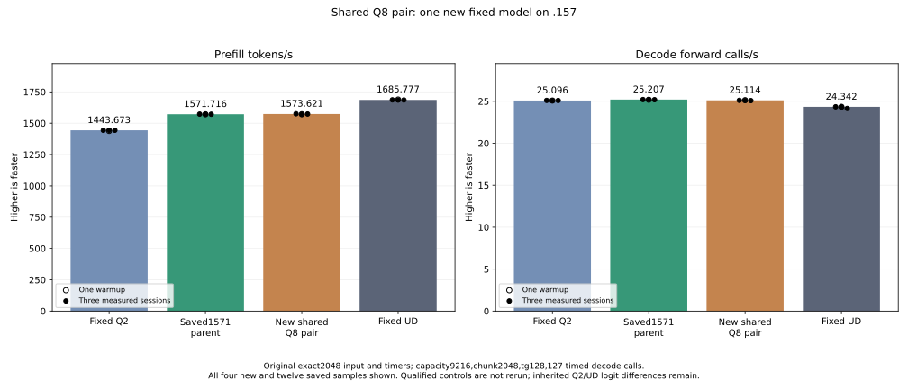
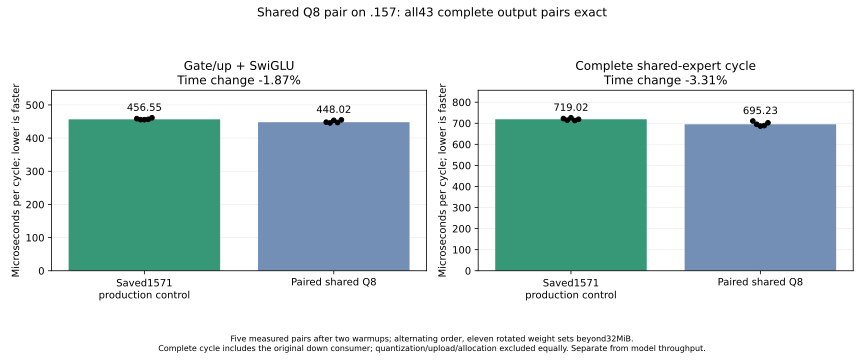

<!-- SPDX-License-Identifier: MIT -->

Native Q8 SSM wave assignment rejected — 2026-10-07 UTC: the private
[unchanged-tile candidate](Q2-SSM-WAVE-BALANCE.md) completes on .157 with72
exact whole-output pairs and144 passing independent FP64 checks. Median
projection/convolution time rises4918.818333→5677.352667us (+15.421068%),
despite20% fewer logical LDS operand reads. Local resources are220→237VGPR,
48KiB LDS and zero spill; the test does not isolate the cause of regression.
Eleven raw artifacts collect/hash before10:25:05UTC release f7703956, KFD
empty, five leases free and seven model stats unchanged. No model trial or
promotion follows. The lossy Q5 track stays closed.

Original antirez Q2 has no native Q5 — 2026-10-07 UTC: the retained GGUF
header inventory lists337 `Q8_0`,96 `IQ2_XXS`,48 `Q2_K` and zero Q5 tensors.
The private Q5 overlay was a lossy in-memory conversion of original Q8, not
original model support. A paired exact2048 direct-executor `shared-down`
model trial on .157 exits0 in both arms. Median TG is25.611559 Q8 versus
25.636525 Q5 calls/s (+0.0975%); all128 generated tokens and prefill logits
match, but final logits differ7.7198% relative RMS. The candidate is rejected
and no further Q5 overlay work is planned. The window released09:59:15UTC:
KFD empty, five leases free, seven model stats unchanged, no cleanup.
[Full result](../config/q2-q5-model-shared-down-results.json),
[scope](Q2-DENSE-DECODE-FEASIBILITY.md).

Private decode-only Q5 converter passes — 2026-10-07 UTC: the coordinated
`.157` synthetic 257×2560 Q8-to-Q5 guarded GPU fixture exits0. Weight RMS
against original Q8 is3.1859%; independent quantized-operand decode oracle
RMS is1.513e-7. This separates representation error from decoder arithmetic
but does not establish original-model quality, C1 throughput or 128K prefill.
Release1296c307 verifies empty KFD, five original leases free, seven model
stat tuples unchanged and no remote cleanup. The retained provider is
unchanged. [Result](../config/q2-q5-overlay-converter-results.json),
[scope](Q2-DENSE-DECODE-FEASIBILITY.md).

Private decode-only Q5 model arm prepared — 2026-10-07 UTC: an opt-in
in-memory Q5 overlay covers four named dense tensor families while retaining
original Q8 for the unchanged batched prefill. The original GGUF file remains
unchanged. A zero-fuzz patch reproduces six changed provider
files; local gfx1151 builds of the guarded conversion fixture, model fixture
and original C17 direct benchmark exit0. Focused ASan-configured CPU CTest
passes2/2. No new GPU run, model inference, quality or native C1 result has
occurred for this arm. The next gate is a coordinated .157 converter/oracle
run, then original-input family-selective model comparison if it passes.
[Source and limits](Q2-DENSE-DECODE-FEASIBILITY.md),
[hashes](../config/q2-decode-q5-overlay-source.json).

Private Q5 dense decode component passes — 2026-10-07 UTC: corrected r2
oracle uses the encoded F16 `Q8_1.s`; device image is byte-exact to r1.
Six shapes, 60 sampled FP64 oracles, 30 guarded whole-output pair diagnostics
and 56 timings pass. Five measured, paired repetitions after two warmups
show completed component time reductions of35.472% (16384×2560 SSM input),
33.749% (2560×6144 attention output),21.050% (shared down) and29.345%
(gated). All HIP event durations are invalid zero; these are host-wall
medians over at least64 calls and more than48MiB rotated weights per arm.
Q5 uses fewer bytes despite higher VGPR. Original model weights, C1,
prefill and task quality remain untested; no production dispatch changes.
Release6e6a7bc6 is the latest .157 event, with KFD empty,5 leases free,7
models unchanged and no cleanup. [Full gate](Q2-DENSE-DECODE-FEASIBILITY.md),
[values](../config/q2-decode-q5-r2-results.json).

Private Q5 decode gate, first attempt — 2026-10-07 UTC: a synthetic equal-
effective-weight Q8/Q5 scalar component compiles locally for gfx1151; Q5
plain/gated uses36/60 VGPR versus retained Q8's14/20, with no spills. Debug
and ASan-configured CPU runner tests pass. The coordinated .157 r1 component
stops at the first tiny FP64 oracle before timing (component exit2): the
oracle used exact Q8_1 integer-sum correction, while the Q5 helper uses the
separately F16-rounded encoded `Q8_1.s`. A CPU formula replay finds2.12e-4
RMS between them; GPU confirmation requires a new admitted run with the fixed
oracle. The r1 release is complete: KFD empty, five leases free, seven model
stats unchanged, no cleanup. No PP/TG or quality gain is claimed.
[Details](Q2-DENSE-DECODE-FEASIBILITY.md),
[failure receipt](../config/q2-decode-q5-r1-failure.json).

Halogen performance lead after current gates — 2026-10-07 UTC: rechecked the
public 0.16.4 README, 0.14.1/0.12.x release notes and checkpoint precision
map against LIE's saved component and full-model evidence. The 128K routed-
expert prefill gain is real on Halogen's own workload, but LIE's 256/160-token
gate/up tiles and stage-pair layout fail their saved-routing gates. The next
prefill experiment must affect the complete gate/up→pack→down chain or dense
Q8/F16 projection; it must retain the exact cold 130,925-token request for
model acceptance. Halogen's same-engine 4-bit versus 8-bit dense comparison
supports Q8 traffic as the leading serial-decode hypothesis. Its selective
6/8-bit quality allocation makes a blanket LIE Q5 conversion unjustified;
first test a private decoder component, then independent model quality and
native C1. The published sparse indexer and cache-capture gains do not
establish a LIE 128K saving. No GPU run, model read or host tuning in this
source-only recheck. [Analysis](Q2-HALOGEN-TRANSFER.md).

IQ2 token160 handover inventory corrected — 2026-10-07 UTC: the terminal
release stored retired process/group counts instead of the full lists needed
by the next preflight. An append-only, separately tested receipt now binds the
original release and previous full receipt, rechecks empty KFD/five leases/
seven model stats and records all1,952 retired identities and1,558 groups.
Its verified SHA256 is66e35d380df5dfbfdb01d9fabf722505ddf1ecb4f7c2f9cb71725be27cb0e38b;
Core receives the corrected handover. No model or GPU run occurs in the
correction. [Summary](../config/q2-iq2-token160-handover-summary.json).

Halogen follow-up, smaller IQ2 tile screen — 2026-10-07 UTC: the public
0.14.1 routed-expert release is still the strongest prefill algorithm lead,
but its numerical kernels are unpublished. A private 160-token LIE gate/up
body compiles locally at173 VGPR/29,824B LDS versus retained128 at150/
25,728; all164 retained device bodies preserve ISA and resource counts.
The C17 map covers all48 saved routing layers and18 edge shapes exactly,
selecting508,126/983,040 real routed rows. Focused CTest and the guarded
HIP build pass. The coordinated .157 component has15 exact maps,51 guarded
byte-exact whole-output replays and84 interleaved timing records. On saved
layers0/3/22 candidate time changes −0.200%/+0.930%/+1.174%; reject before
model. The window releases08:36:43UTC with KFD empty,5 leases free,7 model
stats unchanged and no cleanup. No new PP/TG result; the original128K/30C1
goals remain open. [Transfer analysis](Q2-HALOGEN-TRANSFER.md),
[samples](../config/q2-iq2-token160-component-results.json).

Dense-Q8 decode representation screen — 2026-10-07 UTC: read-only .157 GGUF
directory reports337 Q8_0 tensors /3.897GB. Four bounded tensor samples cover
393216 Q8 blocks; every block needs eight code bits under a simple per-block
range codec, with marginal code entropy7.54–7.65bits. Separate sampled
Q5/Q6/Q7 requantization gives4.67–5.38% /2.26–2.62% /1.13–1.35% extra
weight-domain RMS respectively, not logits or task quality. An ideal Q6
full-Q8 traffic saving is at most0.917GB (~4.02ms at228GB/s), short of the
native32K C1 step gap5.27–5.35ms even before decoder overhead. Thus no
compressed representation is promoted; a future one needs component speed,
full-model quality and another stage gain. Both read-only scripts run exit0,
model stat and KFD checks pass, no GPU admission/conversion/tuning/cleanup.
[Bounded analysis](Q2-DENSE-DECODE-FEASIBILITY.md).

Original32K live-grid matched A/B complete — 2026-10-07 UTC: distinct r2
admission07:53:44/d4790ef7 runs saved binaries A-B-B-A on the unchanged
32711-token request. All four original preparations, sixteen prefill calls,
zero prefix hits and exact output/usage checks pass. Mean retained1424.717
versus live-grid1431.531 token/s is +0.478% and109.314 ms at32K; no 128K
benefit is established. All21 raw files collect with remote/local SHA match
before release07:57:37/d1480588. Eight owned identities retired, KFD empty,
five leases free, seven model stat tuples unchanged and no cleanup; Core is
notified. The private live-grid change remains unpromoted. The next high-impact
prefill work is in the complete routed-expert or dense-Q8 chain, with the
original fixed request as model gate.

Original32K live-grid A/B r1 closed — 2026-10-07 UTC: retained arm
1423.942975PP completes, then the runner exits2 at the next port bind before
any candidate run. Six files collect exactly; release verifies empty KFD,
retired owned children, free leases and unchanged models. This partial result
cannot resolve the earlier candidate regression. Distinct r2 plan changes only
the loopback port probe; remote CPU-only verify passes. At this stage r2 had
no GPU result.
[Failure and retry](Q2-SELECT-LIVE-GRID.md).

Original32K live-grid A/B prepared — 2026-10-07 UTC: a same-session A-B-B-A
replay will resolve whether the former10.7% model regression survives under
matched conditions. It uses the exact original32711-token prompt after its
three preparation requests, saved binaries, capacity133760/chunk2048/C1 AR
and no prefix hits. Core non-use and .157 read-only preflight pass; staged
runner CPU-only verify exits0. At this preparation stage there was no GPU
admission or new rate.
[Scope and gates](Q2-SELECT-LIVE-GRID.md), [coordination](COORDINATION.md).

Halogen transfer recheck — 2026-10-07 UTC: public release notes identify the
0.14.1 routed-expert kernel and the 0.12.0 sparse indexer as the two most
relevant numerical leads; neither implementation is published. Its 0.12.1
cold-cache DeltaNet replay bug is not present in the inspected LIE snapshot
path. Saved `.157` profiled128K telemetry reports2635MHz median GPU clock
when busy>90%, so a simple sustained underclock is not established. The
previous bounded selector's32K model regression occurred in a separate
lower-clock session; any renewed trial needs matched original-input A/B.
No GPU window, inference change or new performance result in this audit.
[Evidence and next gates](Q2-HALOGEN-TRANSFER.md).

IQ2 stage-pair layout GPU screen closed — 2026-10-07 UTC: the corrected .157
host gate passes44/44 Debug and44/44 ASan/UBSan tests. Under fresh admission,
the private component exits0 with15 exact route maps,51 byte-exact guarded
whole-output replays and84 timing rows across three rotating weight banks.
HIP events all report invalid zero duration; five completed host-wall samples
per arm show saved routing layers0/3/22 at+0.306%/+0.725%/+0.142% time.
Synthetic uniform160/skew64 improve1.757%/2.100%, but uniform512 regresses
0.252%. Stop before model trial and retain production dispatch. Four artifacts
collect before release2ac6b4de at07:27:53UTC; KFD empty, original leases
free, seven model stats unchanged, no remote cleanup. The first window ended
without GPU work after a parser allowlist error (exit2); its distinct receipt
is preserved. [Experiment](Q2-IQ2-STAGE-LAYOUT.md),
[results](../config/q2-iq2-stage-layout-component-results.json),
[coordination](COORDINATION.md).

IQ2 stage-pair layout preparation — 2026-10-07 UTC: Halogen's documented
routed-expert prefill gain motivates an independent, lossless LIE weight-layout
probe. A private BN128 body reads contiguous stage-pair planes; production
dispatch stays unchanged. The C17 transpose/inverse test passes focused CTest
and ASan/UBSan. Local gfx1151 compilation preserves 164/164 retained bodies'
ISA/resources and adds one body using 153 VGPR, 25,728B LDS, no private
scratch. The HIP whole-output/timing fixture links but has **no GPU or model
result yet**. The fixed 128K target still needs 12.592734s removed; the sum
of the largest recorded CPU API gaps per chunk is only 4.510309s, even before
considering overlap. [Experiment and limits](Q2-IQ2-STAGE-LAYOUT.md).

Halogen bandwidth and arena follow-up — 2026-10-07 UTC: its published
same-engine comparison uses serial short-context35.4 token/s on its own
4-bit dense trunk versus25.4 on a losslessly repacked UD-IQ4_XS GGUF with
8-bit dense layers; Halogen attributes this to about2GB extra weight traffic
per token. LIE's large Q8 decode components already read roughly222–228GB/s
of logical weight traffic. This is a stronger C1 decode lead than another
Q8 instruction shuffle, but changing weight precision is not lossless and
would need opt-in quality and original-input gates. Halogen also reports a
roughly9% prefill cost from halving its arena at262K; its arena does not map
to LIE's fixed2048-token chunks. Its own1517PP at131K and GGUF served
1465PP at32K are distinct controls. No LIE numerical source, weights or throughput
changed. [Comparison and limits](Q2-HALOGEN-TRANSFER.md).

Original128K launch census — 2026-10-07 UTC: the existing hash-verified trace
also binds valid submission identities/grid dimensions, despite invalid GPU
durations. It shows3024 score/mark slice pairs,768 full-attention kernels and
6144 IQ2 gate/up launches across the unchanged64-chunk prefill. The former
selector extrapolation applied a one-query decode component to multi-query
prefill slices, so neither its old8.36ms estimate nor a32.93ms multiplication
is a valid prefill saving. Capacity-sized scoring
dispatches contain about50% logically inactive threads, but the previously
tested bounded-grid model candidate regressed at32K under different clocks;
neither dispatch count nor component timing is a128K speedup. The repeated
score arithmetic and complete expert chain remain separate possible larger
mechanisms. [Exact census](../config/q2-long-profile128-results.json),
[interpretation](Q2-LONG-PROFILE.md).

Original128K critical-path diagnostic closed — 2026-10-07 UTC: the unchanged
130925-token request completes with four primary command exits0 and native
client exit0. The profile matches all95 embedding calls: the original three
preparations,64 prefill chunks and eight output steps. Eleven artifacts collect
with verified hashes. The default128MiB collector refused the313MiB trace
(exit1, `Oversized collection`); a scoped512MiB collector verified the already
downloaded archive, preserving that failure in its receipt. The GPU window was
released06:43:51.791005 before offline analysis, with empty KFD, original
leases free, seven unchanged model stats and no remote cleanup; Core was
notified. All178605 GPU dispatch and4187 copy durations are invalid zero, so
the [result](../config/q2-long-profile128-results.json) uses completed host
intervals only. Across four successive16-chunk quarters, mean completion
is1468.3/1544.2/1599.2/1606.5ms, while the twelve full-attention boundaries
are437.4/502.5/556.1/591.1ms. These boundaries also include prior-layer
expert/shared and current-layer HC work, so this is a depth-dependent lead,
not kernel attribution. Profiler rates do not replace the saved cold unprofiled
1310.874605 PP /25.344213 eight-output record. No numerical provider or
production dispatch changed. [Interpretation](Q2-LONG-PROFILE.md),
[coordination closure](COORDINATION.md).

Original128K critical-path preparation — 2026-10-07 UTC: the retained
rocprofv3 diagnostic now accepts only the exact saved130925-token request
after its original three preparations. Capacity133760,64 prefill calls
(63 full2048 chunks and1901 tail), C1 AR output8, zero prefix hits, saved
server/client binaries and model inputs are fixed. The existing32K analyzer
still replays unchanged. Fresh .157 read-only preflight06:36:51 checks the
latest Q2 releasef2b163b6, empty KFD,1909 retired identities/1522 groups,
seven unchanged model stats and five free original leases; Core reports no
own .157 use. The CPU-only host cohort finishes06:38:00 with43/43 Debug and
43/43 ASan/UBSan tests, six zero exits and seven collected artifacts
f3f23d1e. Frozen planbb41342b binds one **instrumented original-model**
diagnostic, no rebuild or throughput promotion. GPU admission,128K trace
and attribution are still pending. [Prior32K limitations](Q2-LONG-PROFILE.md),
[frozen plan](../config/q2-long-profile128-plan.json).

IQ2 token256 component closed — 2026-10-07 UTC: exact-plan GPU admission
147f1c8c followed the43/43 Debug and43/43 ASan/UBSan host gate. The only
.157 component ends06:23:05.091371 with three zero command exits and no model
access. Its collected archive ef60f17e contains15 exact route maps,51 exact
whole-output replays with rotating weights and guards, and84 completed timing
records. HIP events are all invalid zero; use the five measured completed-wall
samples per arm. The saved routing layers0/3/22 regress by2.410%/3.653%/
2.525% in median gate/up time. Uniform synthetic cases are essentially flat;
skewed synthetic routing regresses3.871%. The 256-token body has242 VGPR and
42,112B LDS versus150 VGPR/25,728B for128 tokens; greater occupancy pressure
is a plausible cause, not an isolated attribution. Release f2b163b6 at
06:24:14.801994 closes the window with empty KFD, original leases free and
seven unchanged model stats; remote cleanup=false and Core notified. Production
dispatch remains128/64. No complete-chain or model PP/TG trial follows this
negative screen. [Exact samples](../config/q2-iq2-token256-component-results.json),
[Halogen transfer assessment](Q2-HALOGEN-TRANSFER.md).

IQ2 token256 host qualification — 2026-10-07 UTC: fresh read-only .157
preflight confirms the latest Q2 release, no KFD client, 1898 retired process
identities, 1513 retired groups, seven unchanged model stat identities and five
free original leases. The new launcher is component-only and binds the private
provider inventory. The .157 host cohort passes43/43 Debug and43/43
ASan/UBSan tests; all six commands exit0 and seven artifacts collect. Frozen
plan41f872d1 names only one guarded gate/up GPU comparison. There has been no
GPU admission, remote GPU build, original-model inference or performance
result **at the time of preparation**; the component result is recorded above.
[Protocol and scope](COORDINATION.md),
[source and component gate](Q2-HALOGEN-TRANSFER.md).

Halogen token-side IQ2 probe preparation — 2026-10-07 UTC: a private provider
and C17 route map pair 128-token descriptors within each expert into a
256-token tile. All 48 saved routing layers and 18 boundary cases have exact
64-row coverage; focused host CTest passes. The gfx1151 HIP fixture links
locally without changing production dispatch, and static device assembly
preserves all 164 retained bodies. The new BN256 body has no private scratch
but grows 150→242 VGPR and 25,728→42,112 LDS bytes against BN128, a substantial
occupancy risk. No GPU component or model run has occurred, so there is no
numeric or speed claim. Halogen 0.15.2's optional unpacked trunk is not an
untested shortcut here: LIE's 5.35GB Q8 mirror already regressed original2K
prefill by 2.165%. 0.15.3/0.16.1 report further gains without public
kernel detail or matched C1 rates. [Audit and exact probe scope](Q2-HALOGEN-TRANSFER.md).

Halogen transfer audit — 2026-10-07 UTC: public 0.14.1 measurements point to
routed-expert prefill as the most relevant algorithm family; its published
131K uplift is not a LIE control. The archived 48-layer LIE route has 6813
wide IQ2 descriptors, with 67.4% in expert/layer pairs receiving at least256
rows. A distinct token-tile weight-reuse component is proposed with static,
numeric and complete-chain gates before any unchanged 32K/128K model run.
Halogen's 0.12.0 long-depth indexer gains, 0.12.1 cache-capture fix and matrix
plan do not by themselves establish the 1500 PP/30 C1 TG target here. No GPU
run, host tuning or retained-provider change. [Audit](Q2-HALOGEN-TRANSFER.md).

Grouped selector scoring closed — 2026-10-07 UTC: checkpoint e825dff3,
plan119bc361, admissionfc82491d. All component commands exit0;16 complete
score/mask pairs are byte-exact, eight sampled FP64 checks pass (worst
3.709e-7), and four output shapes include32K,128K, final tail and the sparse
budget crossing. All28 HIP event durations are invalid zero, so only completed
host wall samples are used. At32K the grouped scorer regresses from2812.945
to6036.020us median (+114.580% time); at128K from6132.057 to25057.123us
(+308.625%). The candidate uses185 instead of115 VGPRs and removes grid
parallelism; those are plausible causes, not isolated attribution. Do not
integrate it or infer a model PP/TG gain. Four artifacts collect before
05:39:19.793500UTC release c087ce07;1898 identities/1513 groups retired,
KFD empty, original CPU/four GPU leases free, all seven model stats unchanged,
and mirror receipts exact. Core was notified. No .157 Q2 job, lease, window,
waiter or reservation remains. [Full samples](../config/q2-select-score-group4-results.json).

Grouped selector scoring preparation — 2026-10-07 UTC: the retained provider
and model dispatch remain unchanged. A private HIP component scores four
adjacent query rows per resident FP16 block key while preserving the original
four-head FP32 FMA and reduction sequence. It compares every score byte and
every resulting top-512 mask with the retained kernel at full2048-row 32K and
128K starts, plus final-tail and budget cases; sampled FP64 scores, guards and
immutable inputs are checked. Local gfx1151 compilation succeeds. Assembly
shows115 VGPRs for the original scorer and185 for grouped scoring, with zero
private bytes in both: the extra register pressure is a reason to measure, not
a speedup claim. Fresh .157 preflight anchors release7018e5b6, KFD empty,
original leases free and model stats unchanged. The final .157 host capsule
passes42 Debug and42 ASan/UBSan checks, six zero exits. A frozen component-only
[plan](../config/q2-select-score-group4-plan.json) binds349 fixtures and the
unaltered model reference; **GPU admission and component timing remain pending**.

Exact partition selector closed — 2026-10-07 UTC: checkpointd12fa4c8/
planf7ac47ef, admission11edfaa8 at05:02:15.597681. Three component commands0
finish05:03:55.969861; four artifacts collect2a5a41c4 before05:06:57.034002
release7018e5b6cbc3eb2e4fc515400b092c6a5b774791187fe8132e70f027ddc0fc5f.
1880 IDs/1498 groups retired, KFD empty, original CPU/four GPU leases free,
seven model stats unchanged. Canonical/main/remote mirrors exact; Core notified
before analysis. No remote job/build/client/window/lease/handle/waiter/reservation
remains on .157/.161/.158/TB and no cleanup occurred.

All56 full masks match both the retained kernel and independent CPU sort;
16 cases include ties, sparse boundaries, clipped windows and subnormals.
All88 GPU event durations remain invalid; completed HIP-graph wall times apply.

| Synthetic C1 selector case | Retained median us | Partition median us | Time change |
|---|---:|---:|---:|
|32K |25.459|39.489|+55.108%|
|64K |33.269|38.499|+15.720%|
|128K |48.549|37.660|-22.429%|
|128K, all equal scores |138.387|63.959|-53.783%|

Preserve the36KiB candidate for deep contexts. It is not a whole-model decode
speedup or an unconditional default. Integration needs live-position dispatch
compatible with HIP graph reuse and explicit scratch lifetime/accounting.
Complete original native inputs still gate adoption; saved controls remain
unchanged. [All samples and checks](../config/q2-select-partition-results.json).

Attention V staging closed — 2026-10-07 UTC: checkpoint3fa26c59/plana72cf63b,
admission6c4631f4. Component0/0/0 finishes04:50:29.871938; four artifacts
collect42390a04 before04:50:51.277229 release7c5193f944c7e135e678b48bc62e2517d2c913c80e6215f4817a25f03ee7042b.
1869 IDs/1489 groups retired, KFD empty, original leases/models unchanged,
mirrors exact and Core notified before analysis. All30 output pairs exact;
12 sampled FP64 checks pass(max4.102e-6). Late V time changes+4.50%/+5.33%/
-1.74%/+0.66% at16/32/64/128K, with overlapping deep ranges. Keep current
model dispatch; no model trial. [Complete evidence](../config/q2-attention-v-stage-results.json).

Exact partition selector preparation — 2026-10-07 UTC: globalpreflight04:58:07
anchors7c5193f9; Core own non-use remains explicit. Host-r1 ends04:59:05 with
42 Debug/42 sanitizer checks, six exits0, seven collected artifacts0d503fa5.
The new component compares retained C1 selection against nine4096-block local
selections plus an exact merge over4608 candidate slots,36KiB scratch. Entire
masks are checked against a full host sort, including ties and sparse bounds.
Provider/model dispatch unchanged. Fresh admission required; no model/control
replay, .161/.158/TB use or cleanup is authorized by this preparation.

Attention V staging preparation — 2026-10-07 UTC: fresh Core own non-use and
global preflight04:47:11 anchor570f32f1. Host-r1 finishes04:48:19 with42 Debug
and42 ASan/UBSan checks, six exits0; seven artifacts collected(dd2bfbff).
Plana72cf63b binds339 fixtures for one new component comparing the two existing
WMMA V-loading schedules on2048-row shapes at16/32/64/128K, plus untimed tails.
Synthetic masks and sampled FP64 checks are component evidence only. Retained
provider and model dispatch stay unchanged. No saved model/control replay or
.161/.158/TB use. Fresh admission remains required before remote GPU build/run.

## Active C1 decode30 / full-prefill1500 goal — 2026-10-07 UTC

The [new BF16 row-sized reader](Q2-PLE-ROW-BYTES.md) changes only
`ngram.cpp` in the retained1028-file provider. It requests320 bytes for a
BF16/160 row while retaining cache capacity, workers, ordering and arithmetic.
Debug42/ASan42 pass on .157 (six zero exits, seven artifacts collected).
Plan56c1948c binds332 fixtures for one new original nine-request native trial
through32711 tokens, with saved client/MMQ/control evidence reused. No model
gain or128K result was claimed before measurement; buffered file-cache memory
is an explicit part of the candidate. The model now completes:32K
PP1402.245716→1440.767919 (+2.747%), TG26.234155→26.483395 on the original
eight decode calls. Shorter-prefix results are mixed, with regressions at4K
and the first8K attempt; all nine replies match. Six exits0/12 artifacts verify
and release91b98645 closes the window before analysis. Prepare only new64K/
128K candidate observations using saved server8d15434d; no model build, old
control rerun or global promotion.

The64K/128K follow-up now completes without any model rebuild: PP1369.779064/
1296.437473 versus saved1388.420346/1310.874605, −1.343%/−1.101%. TG26.201624/
25.660359 on the original eight calls is nominally+0.805%/+1.247%; it does
not establish sustained TG128. All eight replies match, eight commands0,
20 artifacts verified before release570f32f1. Keep the previous provider;
the32K reader improvement did not generalize. Complete table/PNG/SVG/CSV
are linked from the reader report, with no overwritten retained graph.

The [native32K diagnostic](Q2-LONG-PROFILE.md) now completes with original
counts and inputs. All device timestamps have zero duration, so GPU busy and
kernel-stage claims are rejected. Valid CPU completion intervals identify
depth-dependent attention and45–70ms late-chunk gaps before the20MiB PLE
upload. Warm C1 completion-to-next-submission gaps are only0.092–0.097ms;
the old5.33ms direct-harness gap cannot be assigned to this server. No model
throughput gain is claimed. Eleven artifacts collect before releasecb2b68d9;
profiler-induced shutdown−9 is preserved separately from four command exits0.

Preserve the old fixed-point pause while pursuing the new active target through
the original130925-token input. Retained128K is1310.874605 PP /25.344213 TG
(original eight output calls, not TG128). PP needs12.592734 seconds less than
the99.876067-second saved measurement. No new model gain is claimed.

Prepare one diagnostic on retained server9993fdce and native bench87d856cf:
original three preparations plus exact32711-token prefix, capacity133760,
chunk2048, C1 AR and no prefix hits. Kernel/HIP/copy tracing attributes growing
selection/attention time and C1 synchronization; no model/provider rebuild,
input mutation, control timing rerun or full curve. New guards reject modified
input/count/cache contracts. The .157 host cohort passes40 Debug and40 sanitizer
checks with six zero exits, then collects seven artifacts. Fresh committed-plan
admission remains required before GPU work. [Priority](Q2-REMAINING-WORK.md).

## Resume decode/128K work after an unjustified stop — 2026-10-07 UTC

Core's own deferred campaigns did not pause Q2. Resume the owner's decode and
full-prefill128K priority, retaining the earlier fixed-point pause and saved
benchmark contracts. A compact scalar Q8 candidate removes generic lane-bound
and reduction instructions without changing its dot order. All77 existing
MMVQ bodies are exact; new14/20VGPR kernels add no LDS or private scratch.
[Mechanism and qualification boundary](Q2-DECODE-128K.md).
The actual .157 component now completes: large projections−0.057%/−0.026%
time, shared-down−2.298%, gated+3.063%. Preserve the small shared-down result
without global/model promotion. All2038 GPU output pairs match. Exit1 comes
from four invalid FP64 reports for a host out-of-bounds sample in the31-row
boundary, not new GPU arithmetic; all4060 timed-shape oracles pass. The fixed
row helper passes .15740 Debug/40 ASan checks. Original failure evidence stays.

Four component artifacts collect before release4a7c9768 at02:57:50 UTC; mirrors
match and Core is notified. The CPU fix cohort also collects/retires03:05:33.
The retained source audit distinguishes eager C2 dispatch and one readback/sync
per request from the existing C1 graph. Consolidated readback needs bounded
host capacity and has no measured performance claim yet. No saved model
controls, Q4 or full curve were rerun.

## Live-grid model completed without a retained gain — 2026-10-06 UTC

Original native full-prefix history through32K completes, all nine streamed
replies/usage exact. PP changes−0.377%,−0.581%,+0.143%,+1.125%,−0.149%,−10.731%
for4K, both8K attempts,12K,16K,32K. The32K point is1251.774 versus1402.246 tok/s;
sampled GPU clocks differ. No causal attribution or corrected rate is invented.
Do not promote or expand this candidate to128K. [Full table](Q2-SELECT-LIVE-GRID.md).

All six commands exit0; launcher exit1 is a missing `archive` field in its
postflight receipt. Preserve the failure. Read-only supplemental hashes verify
12 collected artifacts plus unchanged archives/binaries/model stats; no model
rerun. Release1d62a3a5 at22:15:00 precedes analysis. The receipt fix/regression
passes fresh .157 Debug39/ASan39; seven host artifacts collect and all its
processes/groups retire22:20:25. No GPU window remains. Decode/reactive notes
now distinguish existing real model batching, PLE overlap and CPU token work.

## Bounded selector grid reaches private model qualification — 2026-10-06 UTC

The component passes62 exact score/mask pairs and62 independent checks.
Completed wall means nominally improve62.29%/26.78% in the original4K/32K
selector slices; all samples remain visible and128K ranges overlap widely.
These are component measurements. Four artifacts collect before release
21:56:42 UTC /358b1fd0, with original leases free and all owned groups retired.
[Results and integration](Q2-SELECT-LIVE-GRID.md).

The private model changes only the prefill host launch bound, preserving164
device bodies, captured decode and buffer layout. New .157 HOST39+39 passes;
plan55bf5bcb selects original native full-prefix history through32K, using the
saved client and retained MMQ archive. No saved control or full curve rerun.
Offline decode analysis locates recurring gaps at token boundaries, where
CPU sampling/copies also occur; they are not all removable reactive overhead.

## Exact selector query reuse is slower — 2026-10-06 UTC

The score-plus-top-k component passes48 exact score/mask pairs and48 independent
reports, but takes33.71%/79.86%/55.91% more time on the32K full-chunk slice,
128K full-chunk slice and original128K final tail slice. No model run follows.
HOST39+39 and component0/0/0 pass; four artifacts collect before21:47:04 UTC /
f40710f4 release. [Details](Q2-SELECT-QUERY-PAIR.md). Next inspect bounded prefill
grids: current graph-safe capacity grids launch many empty blocks before the
context is full. Any restriction must apply only to eager prefill and preserve
captured decode capacity, all arithmetic and the original chunk boundaries.

## Q8 decode grouping measured; reactive limits documented — 2026-10-06 UTC

The new four-row component passes303 exact pairs and606 FP64 checks. Large
plain projections change by+0.641%/+0.093% time; shared down is nominally1.120%
faster with overlapping ranges, and gated is5.981% slower. No general adoption
or model rerun follows. All56 zero HIP event durations are invalid and retained;
completed monotonic wall times supply the comparison. HOST39+39 passes; four
component artifacts collect before .157 release f08fa953 at21:28:17 UTC.
[Results and decode/reactive analysis](Q2-DECODE-128K.md).

The executor already overlaps asynchronous PLE reads with prefix graph work.
Saved diagnostic gaps are5.332ms per token, not established removable overhead.
No new reactive C1 gain is claimed. Fixed parity remains paused. Long-prefill
work next probes reuse of one key across two exact query reductions; the old
rejected paired-lane selector experiment remains distinct.

## Fixed-point parity paused; decode/prefill128K takes priority — 2026-10-06 UTC

The owner-requested final HC-down trial is47.60% slower in its complete
projection/SiLU/narrowing component, with160 exact output pairs. The same16
independent peak-error failures occur in both arms; timing remains available.
No model promotion follows. All artifacts collect and .157 releases631f1117
before analysis. The goal tool now records fixed-point parity as paused.

New work prioritizes quick, substantial contributions through128K. Offline
inspection of saved1571 decode traces identifies261.537326ms of533.881388ms
GPU time in dense Q8 GEMV (49.0%); this is historical attribution, not a current
128K profile. A four-row workgroup draft will preserve each32-lane dot tree,
original encoded weights and input quantization. Long-prefill attention
selection remains a separate candidate; no measured new speedup is claimed.

## Priority change and last HC-down attempt — 2026-10-06 UTC

The owner requests pausing fixed-point Q2/UD parity after the current HC-down
attempt, then prioritizing prefill/decode through128K and quick changes with
larger contribution. Historical results and inputs remain unchanged.
SSM resident now completes with72 exact pairs/144 passing oracle reports but
+71.082511% component time, so it is not promoted. Closure8410ceb7 and every
artifact are retained. The new HC direct-weight component has local compilation
and actual .157 host39+39 qualification; fresh GPU admission remains required.
[Mechanism and measurement contract](Q2-HC-DOWN-DIRECT-WEIGHT.md).

## Resident SSM component prepared — 2026-10-06 UTC

The new BM128/BK2 composition combines a 32KiB XOR transpose with phased
operand lifetimes:158 actual VGPR, zero scratch, original K-stage/barrier and
per-output arithmetic order preserved. Output-row blocks double, so resource
reductions do not establish a speedup. Local object compilation passes.

The fixture compares the retained launcher to the private fenced draft across
five shapes,72 complete output pairs and144 sampled FP64 checks. Three timed
destinations per arm prevent rotation overwrite; all42 actual timed pairs
are checked. Wall/HIP timers stay separate and finite mismatches retain timing.
Host/GPU qualification is pending. [Contract](Q2-SSM-RESIDENT.md).

## HC-up model completes with only a marginal change — 2026-10-06 UTC

Original2048/TG128 HC-up candidate: **1589.732497 PP /25.15389128 TG**, versus
retained1587.893545/25.12414406 and fixed UD1685.777092/24.34174251. Nominal
PP +0.115811% saves1.491952ms, with overlapping observed ranges. This does not
establish a material or repeatable gain; keep the retained performance default.
Inputs and generated tokens remain exact, all nine internal replays are exact,
but eight PP logits arrays change. Independent task quality is unqualified.

All four model commands exit0;26 model+7 host artifacts collect before
20:29:30.363010UTC release39a36b31.1704 identities/1360 groups are absent,
KFD empty and original leases/model stat identities unchanged. No Q2 workload,
window, waiter or cleanup remains. Next is the already prepared SSM32KiB
resident composition, whose component/model performance is unmeasured.
[Full original comparison and all samples](Q2-HC-UP-SHORT-CHAIN.md).

## HC-up component collected; original-model candidate connected — 2026-10-06 UTC

The component completes safely with exits0,0,1:234/234 independent formula
checks pass per arm, while the changed reduction differs from parent by at
most8.94e-8 F32. Completed wall means fall5.7483% ordinary and6.8874% deferred.
All28 HIP-event values are zero/invalid and remain unusable for GPU timing;
they are not replaced by wall values. All68+7 artifacts collect before release
79baceee; no remote process/lease remains. The1029-file private model now calls
the same two measured bodies, with all166 device bodies/resources verified
unchanged after integration. The next run is only this new original2048/TG128
candidate. [All values and limitations](Q2-HC-UP-SHORT-CHAIN.md).

## HC-up short-chain prepared; no new measured gain — 2026-10-06 UTC

Saved-profile reassessment isolates HC up85.327ms versus historical UD55.498ms,
while expert gate/up and down are already competitive in those diagnostic
traces. This is not a new fixed reference or causal attribution of its gap.
The new original-F16 HC-up draft uses256 threads and one20-step accumulation
chain, changing FP32 rounding deliberately. Operand phasing eliminates the
initial draft's spills; ordinary and deferred variants compile with248 VGPR,
24KiB LDS and zero scratch. All164 retained device bodies remain exact.

A guarded component retains every finite disagreement and all timing samples,
with100MiB rotated weights and actual timed destinations checked before reuse.
GPU/model results are pending. Two SSM resident-tile compiler probes remain
separate and untested. [Mechanism and scope](Q2-HC-UP-SHORT-CHAIN.md).

## Whole640 chain completed; retained parent remains faster — 2026-10-06 UTC

One original model candidate measures1576.766972 PP /25.17428377 TG,
−0.700713% PP versus retained1587.893545. All21 parent model files and nine
internal replays remain exact. The mixed component has51 exact complete
output pairs and24,027,244 independently reconstructed packing values, but
its complete-chain mean is11.081958% slower. Do not promote this candidate.
Saved fixed Q2/UD controls and the full curve remain unchanged.

All13 command exits0;173 artifacts collect before19:32:22UTC releasecb652eb5.
No remote workload/lease/window remains. Preserve the mechanism and negative
evidence; dense Q8/SSM operand reuse and complete HC pass removal are the next
priorities. [All original comparisons and samples](Q2-IQ2-WHOLE640.md).

## Whole640 LDS integrated chain prepared — 2026-10-06 UTC

A separate1034-file provider now connects the qualified LDS tail producer to
selective ordinary-row packing and the unchanged down consumer. The original
164 device bodies and measured LDS body remain ISA/resource exact. C17
partitioning preserves capacity and descriptor units, without new allocation,
stream or count download. New tests exercise partial-F32 ownership through the
complete expert chain. Actual .157 host39+39 passes, with six zero exits and seven artifacts
collected; GPU/model qualification is pending. The retained1587.893545 PP and fixed UD1685.777092 references are unchanged.
[Contract and qualification scope](Q2-IQ2-WHOLE640.md).

## Sixteen-wave whole640 measured; model benefit unproven — 2026-10-06 UTC

The new component completes [0,0,0], with 104 exact output pairs, 21 actual
timed-buffer replays and 9,381,676 independently reconstructed packing values.
LDS means are 539.336/543.308/615.053 microseconds for 4/8/16 rows versus
502.546/572.859/641.944 for the parent: +7.32%/−5.16%/−4.19% time.
High parent and candidate samples remain included; the nominal gains do not
prove model benefit. Keep the marginal LDS candidate available, with its
mixed routing/packing/down integration still to qualify. No saved model
reference changes, model rerun or promotion. All 380+7 artifacts collect before
verified 18:54:18 UTC release d4c60136; no remote workload remains.
[All values and next integration boundary](Q2-IQ2-WHOLE640.md).

## Sixteen-wave whole640 component prepared — 2026-10-06 UTC

The new block shape handles 128 gate/up columns per group, halving sequential
groups to five. Each wave owns one full row in the epilogue. Register spill
falls from 1380 to 136 bytes/thread; the LDS version remains spill-free,
uses 169 allocated VGPRs and 61568 shared bytes, with 686 static instructions.
All 164 parent bodies are exact. Only the new pair is scheduled for component
qualification; previous drafts and model controls will not rerun. New .157
host 38+38 passes, seven artifacts collect and plan e85d58ab freezes 254 files.
No new GPU admission or model gain yet. [Scope and earlier result](Q2-IQ2-WHOLE640.md).

## Whole640 component measured and retained as negative — 2026-10-06 UTC

Both new drafts complete on .157 with [0,0,0] command exits, 104 bit-exact
output pairs and 21 actual timed-buffer replays. Offline original packing is
exact for 9,381,676 saved values/scales. All 63 timing records remain, including
the high 16-row observations. LDS gate/up+packing takes 618.025/631.133/763.476
microseconds for 4/8/16 live rows versus 505.059/518.792/644.021 for the parent:
18.55–22.37% slower. Register spilling makes the other draft substantially
slower. Keep retained 1587.893545 PP; no model rerun or integration.
380 component and seven host artifacts collect before verified .157 release.
The next compiler-only draft doubles waves and halves sequential groups.
[Full results, exact scope and retained source](Q2-IQ2-WHOLE640.md).

## Whole640 producer/packing preparation — 2026-10-06 UTC

Prepare register and LDS variants that own all 640 values of an IQ2 expert
tail and write original scaled F16/inverse directly. All 1028 retained provider
files and 164 original device bodies remain exact. The register draft spills
1380 bytes/thread; the LDS draft uses 52352 shared bytes with no spills.
Compiler-only checks pass after fixing the fixture's generated codebook include.
The new component retains finite disagreements, times both candidates and
checks actual timed buffers. .157 host 38+38 passes with seven artifacts
collected; the plan freezes 246 files/four manifests. No GPU admission,
model selector or measured improvement yet.
[Scope, provenance and pending GPU comparison](Q2-IQ2-WHOLE640.md).

## PP/TG graph from existing measurements — 2026-10-06 UTC

Export the original eight-token decode observations alongside the complete
prefix prefill, retaining both historical Q2 controls and UD. All eight exact
requests have eight completed output tokens and eight timed AR decode calls;
Q2 measures 26.471407 token/s at 4K and 25.344213 at 128K. The low archived UD
64K observation remains visible. The exact-2K/TG128 reference is in separate
panels, with its original capacity, 127 timed calls and saved aggregation.
Raw hashes, semantic requests, output budgets and count/time rates are checked.
Export and layout correction exit 0; report and CSVs stay exact during redraw.
No new inference, TG128 curve, numerical candidate or performance claim.
[Graph and data](Q2-FULL-PREFILL128.md).

## Restore the omitted 2K comparison — 2026-10-06 UTC

The full-prefix table began at 4K because only historical `prefix` requests
were selected. Add the already measured exact-2048 reference explicitly:
initial Q2 1443.672867, latest Q2 1587.893545 and UD 1685.777092 token/s.
Its capacity remains 9216, distinct from the 133760-capacity long-prefix
campaign. No rerun, new aggregation, token substitution or warmup-as-result.
[Complete comparison and conditions](Q2-FULL-PREFILL128.md).

## Complete saved-input prefill through128K — 2026-10-06 UTC

Eight exact full-prefix observations are collected and audited. Current retained
Q2 measures1310.874605 PP at130925 tokens/64 calls, versus archived UD1253.555692,
nominal+4.573%;64K is1388.420346 versus1349.798341. Both old Q2 controls and all8K
attempts remain visible. Each prefix has zero cached tokens; all model messages,
physical counts and server settings are exact. Original fixed-point targets remain
unchanged. The initial thermal stop, pre-model port failure, separate cooled
64K/128K sessions and archived-reference limitations are explicit. No sustained
thermal, statistical parity, independent-quality or overall-goal claim follows.
[Full table, times and graphs](Q2-FULL-PREFILL128.md).
[Updated intervention order and measured limits](Q2-REMAINING-WORK.md):
expert-chain ownership, dense Q8 operand reuse, then an actual HC buffer-pass
removal. The fixed input and archived controls remain unchanged.

The full-prefill replay reaches32K with exact saved counts and zero cached
tokens, then stops during64K at CPU98.125C. Recovery is limited to the unfinished
64K/128K prefixes, separated by cooling outside all measured calls. The original
corpus, chunks, executor timer, binaries and98C stop remain unchanged.

## Full-prefill scope correction — 2026-10-06 UTC

The latest owner instruction explicitly requests the latest optimized Q2 on
the complete prefill, with no invented token variations. Replay the exact saved
messages, full2048-token intermediate chunks and only the natural last remainder.
The previously launched continuation curve was an assistant scope error; it
terminates on correction with retained partial evidence and verified release.
[Exact input replay and limits](Q2-FULL-PREFILL128.md).

## Superseded continuation-curve preparation — 2026-10-06 UTC

The assistant interpreted the request to show results through 128K as a new
cached-continuation curve. The owner corrected that interpretation; the launch
was stopped and its partial evidence preserved. The subsequent explicit
full-prefill request is completed above. The native client and retained binary
were reused, with no control rebuild. [Retired plan and scope](Q2-CURVE128.md).

## Benchmark comparability correction — 2026-10-06 UTC

The 256K campaign does not reproduce the historical capacity and UD baseline;
it cannot establish historical improvement, regression or parity. The experiment
design incorrectly interpreted 256K as cached prefix plus continuation/output,
raising capacity to 266240 and changing sparse attention dispatch even at
earlier depths. This was an implementation decision, not a requested change to
the comparison. Completing the requests did not satisfy the comparative test.

The [preservation audit](../config/q2-comparison-recovery-audit.json) verifies
the retained provider and fixed benchmark evidence against saved identities.
Initial Q2 1443.672867, retained Q2 1587.893545 and UD 1685.777092 PP remain the
recorded fixed-point observations. No claim of long-context gain follows from
them. The [comparability decision](../config/q2-curve256-comparability.json)
preserves all raw measurements and the historical UD references.

The prepared 128-row attention fixture has no GPU admission or run and is not
scheduled. New Q2 performance trials must preserve the original physical input,
timer and settings and reuse saved controls. Any later native 256K frontier
must account for cached, new and output tokens within model capacity; matching
the original 0–128K curve requires its original capacity and recipe.

## Sparse attention capacity correction prepared — 2026-10-06 UTC

The new paired private providers distinguish visible context from mask pitch, extend the scan to nine words per thread and size shared union storage to2080 while keeping the2052 compact-list limit. Static comparison preserves162/164 device bodies and unchanged VGPR/no spills in the two changed bodies, with112 additional shared bytes. Production assembly, fixture host/device compilation and launcher checks pass. The new header/fixture format passes;101 inherited shared-check diagnostics remain. Fresh .157 handover15:55:53UTC revalidates release3e59f417, original leases/process retirement, empty KFD and unchanged model stats. Host38+38 completes15:56:48UTC, all six command exits0/seven artifacts collect. Plan a3d8148a binds226 fixtures/six manifests. No GPU admission or model result yet. [Scope and evidence](Q2-ATTENTION-CAPACITY.md).

## 256K curves completed; capacity changes attention dispatch — 2026-10-06 UTC

Both native curves complete:20 accepted measurements,48 requests,12 zero model-command exits and30 model artifacts plus7 host artifacts. Q2 PP at128K/256K is695.423/665.593 versus UD819.081/729.470; TG is24.8567/24.3669 versus24.5138/23.4692. Historical prefill rates are higher, but the266240 capacity makes sparse-mask pitch2080 exceed WMMA's2048-word limit in both new arms. The old/new comparison therefore does not isolate numerical optimizations. This source finding is explicit in the [complete values, timings and graphs](Q2-CURVE256.md). No stable speedup or quality verdict follows.

All evidence collects before15:02:59.961437 UTC release3e59f417;1575 identities/1260 groups retired, KFD empty, original leases free/model stats unchanged. Core informed before local audit; audit/plot exit0. No remote cleanup or further GPU activity. Fixed1587.893545 versus1685.777092 remains the priority. Owner clarification is recorded: only the final chunk of contiguous prefill can be partial; broadening partial-row buffer contracts helps tails/continuations, not intermediate2048 chunks or the fixed reference. Existing partial-row evidence is reused, not recast as a new experiment.

## 256K capacity headroom and full optimization assessment — 2026-10-06 UTC

Curve r2 exposes the original GGUF262144 guard before upload/inference;9 artifacts collect before14:13:29 UTC/d866e817 release. An exact private AR-only262144→266240 effective capacity edit precedes DeviceModel upload in both providers, preserving numerical/MMQ files and RoPE; model files remain untouched. Host44+44 includes C17/C++ guard boundaries and exact engine-only archive reuse;7 artifacts collect. Fresh GPU admission remains required. The [complete current analysis](Q2-REMAINING-WORK.md) distinguishes already-completed negatives, substantial remaining dataflow work and two exact2048 guards that do not cover typical canonical continuation sizes. Fixed-point parity remains first priority.

## Curve startup correction qualified — 2026-10-06 UTC

The first server rejects a3600000-ms timeout before model initialization, exit2; no curve client starts. Nine artifacts collect before13:59:35 UTC release30872b71. Correct to the existing1800000-ms limit; retain all workload, provider and client settings. Host-r3 now passes44+44 including actual no-model startup on private ports. The210-fixture retry plan is frozen; new GPU admission is pending. [Details](Q2-CURVE256.md).

## Parallel 256K curve prepared — 2026-10-06 UTC

The owner explicitly requests the full context curve while preserving the fixed-point optimization priority. New `.157` qualification passes 44 Debug and44 ASan/UBSan tests; seven artifacts collect. The frozen plan binds207 fixtures/seven manifests for retained Q2 and original UD, native benchmark client/MMQ reuse, pp2048/tg128, ten depths through262144 and common capacity266240. Preserve the first host failure (incorrect test-message expectation) and its exit codes. GPU admission and curve results remain pending. [Recipe and boundaries](Q2-CURVE256.md).

## Down null-contract result and owner steering — 2026-10-06 UTC

The model measures 1586.586480 PP /25.16050717 TG, nominal −0.082314% PP versus retained1587, overlapping ranges. All132 operator pairs/five post-timing buffers and21 parent model files are exact. Component improvements0.69–1.98% remain available for composition; no new headline gain. Host37+37 and13 primary commands pass;37 artifacts collect before release13:23:10 UTC/268296b2. The owner requests a complete curve through256K in parallel with deeper analysis, explicitly retaining the prior fixed-point optimization priority. A local GDN full-window draft compiles, but VGPR120→157 and instruction growth make it insufficient grounds for GPU priority. [Complete values](Q2-DOWN-FIXED-CONTRACT.md).

## Down null-contract preparation — 2026-10-06 UTC

The new provider derives from retained IQ2 bounds, specializing only proven null arguments and the active full-row/aligned down route. Static binding preserves 164 parent bodies and three draft bodies; VGPR 85/96/104 becomes 84/95/103 with unchanged LDS/no spills. New .157 host 37+37 checks pass; 198 runtime fixture hashes/six manifests/1029 provider files freeze. One new component and one fixed original2048/tg128 model are prepared, with no control reruns. GPU admission and runtime measurements are pending. [Contract and scope](Q2-DOWN-FIXED-CONTRACT.md).

## Fixed down original-model result — 2026-10-06 UTC

The model completes at1584.926383 PP /25.18297866 TG, nominal −0.186862% PP versus retained1587.893545. All132 component pairs/five post-timing buffers and21 model files match the parent; nine internal replays are exact. Captured routing cycles save0.33–0.61%, much less than the static instruction count; preserve the negative model result. Host37+37 and13 commands pass;37 artifacts collect before13:01:06 UTC release497f5d32. The next compiler-only draft specializes null down-output arguments:469/764/880 instructions,VGPR84/95/103, no provider or GPU admission yet. [Full values](Q2-DOWN-FIXED-BOUNDS.md).

## Fixed Q2 down preparation — 2026-10-06 UTC

Three private m2560/k640 half-output down kernels preserve the parent arithmetic, routing and memory layout. A guarded selector requires 16-byte output alignment; all other rows/alignment use the original implementation. Parent 164 device bodies and three private draft bodies match saved ISA. Host 37+37 checks pass on .157; 190 fixtures/six manifests/1029 provider files freeze for one new component and one original model. Preserve 1587.893545 PP until measured evidence. [Scope](Q2-DOWN-FIXED-BOUNDS.md).

## HC raw-Q8 model result — 2026-10-06 UTC

The new original model measures 1583.808188 PP / 25.10789589 TG, −0.257282% PP versus the retained 1587.893545. Output tokens and nine internal replays match; eight logit files change, maximum matched-history KL 0.004175090750 versus the parent. Preserve the experiment without promotion. Host 37+37 and all ten commands pass; 33 artifacts collect before 12:38:34 UTC release 962b229f. Fixed Q2/UD/input/timers remain unchanged. [Complete samples, scratch contract and limits](Q2-HC-INJECT-RAW-Q8.md).

## HC raw-Q8 integration prepared — 2026-10-06 UTC

The component-tested raw-Q8 producer/reducer is integrated on the retained IQ2 fixed-bound parent. C17 policy checks allocation identity, byte capacity, fixed geometry and pending MoE output before borrowing existing down_e scratch. All 164 parent device bodies and both qualified component bodies match saved ISA. No new device memory, stream, callback or persistent borrow. Host 37+37 Debug/ASan tests pass on .157 and seven artifacts are collected. The model-only plan freezes 182 fixtures, six manifests and 1030 provider files; numerical component differences remain recorded. Fresh GPU admission is still required. [Contract and limits](Q2-HC-INJECT-RAW-Q8.md).

## Fixed IQ2 bounds original-model result — 2026-10-06 UTC

One new unchanged exact2048/tg128 model concludes11:35:47UTC:1587.893545 PP/
25.12414406 TG, nominal+0.163032% PP versus saved1585.308983, overlapping ranges.
All113 whole operator pairs/21 parent files/9 repeat checks exact. Retain this
small private prefill observation for composition without claiming stable gain;
saved SSM/Q2/UD remain unchanged. New point needs6.164365% PP/74.889015ms to fixed
UD1685.777092, whole-curve parity unmet.70 HIP events invalid zero; complete-cycle
wall saves0.2–0.85%, far smaller than26–29% static instruction reduction.

Host36+36/13 primary commands pass,37 artifacts collect before release
11:36:23UTC/56ab4a49.1440 IDs/1153 groups retire,KFDempty,original Core CPU/four
GPU leases/model stats unchanged/free;mirrors exact,Core informed before local
analysis. No job/window/reservation/cleanup. Export all16 model/70 operator
samples. Next source hypothesis is exact DPP quad broadcast in active IQ2 commit,
with no new plan/admission/model yet. [Values and limits](Q2-IQ2-FIXED-BOUNDS.md).

## Fixed IQ2 gate/up bounds host-qualified — 2026-10-06 UTC

Prepare one private m640/k2560 BN64/128 candidate from retained1585, preserving
original signs, rounded arithmetic, maps and all162 original ISA bodies. Static
instructions1351→1004/2361→1685, no VGPR/LDS increase or spills. New fixture113
complete pairs/70 timings includes actual-shape short cases and untouched
ragged fallbacks. .157 host36+36 passes11:28:28UTC, six exits0/seven artifacts
collected; freeze160 fixtures/six manifests and1028 provider files. New terminal
collection regression guard also passes. GPU admission/model remain pending;
fixed controls/benchmark/full-curve priority unchanged.
[Coverage and static limits](Q2-IQ2-FIXED-BOUNDS.md).

## IQ2 sign arithmetic measured and released — 2026-10-06 UTC

One new fixed exact2048/tg128 model measures1582.080007 PP/25.15197322 TG,
−0.203681% PP versus saved1585.308983. Component32768 sign/code pairs/101 outputs
and21 parent model files are exact; retain private evidence, keep1585 best.
All70 HIP times are invalid zero; complete wall cycles are1.2–2.1% slower.
Host36+36 and13 primary commands exit0,39 final artifacts verify. Preserve an
early local collection snapshot and failed overwrite retry, then collect final
26 artifacts without model rerun. Release11:21:43UTC/40974980 retires1424 IDs/
1140 groups, empty KFD, original leases/model stats unchanged/free. Core is
informed before analysis. Full curve/Q4 remain deferred; next local IQ2 fixed
bounds probe removes26–29% static instructions without a runtime speed claim.
[Complete samples, graph and disposition](Q2-IQ2-HALF-SIGN-ARITHMETIC.md).

## IQ2 half-byte sign arithmetic host-qualified — 2026-10-06 UTC

Prepare one private unpacked m640/k2560 BN64/128 gate/up candidate, no table,
buffer, callback, stream or public contract change. All128 sign tags match the
original table; all162 production ISA bodies/resources remain exact, two new
bodies remove four loads/add11 instructions, no spills or VGPR/LDS increase.
Fixture host/device retries compile after correcting the global table name;
failures remain. .157 host-r1 passes36+36 at11:12:21UTC, six exits0/seven artifacts
collect. Freeze153 fixtures/six manifests and1028 provider files. GPU component
and original model are pending fresh admission. Best1585.308983 PP versus fixed
UD1685.777092 remains, no controls/full curve/Q4 rerun.
[Coverage and retained comparison](Q2-IQ2-HALF-SIGN-ARITHMETIC.md).

## Ordinary RMS original-model retry complete — 2026-10-06 UTC

One new Q2 exact2048/tg128 arm measures1584.244040 PP/25.16964571 TG versus
saved1585.308983/25.16079073 parent:−0.067176% PP/+0.035194% TG, overlapping
prefill ranges. All21 full model files equal the parent and nine repeat checks
are exact. Retain the private marginal experiment; keep SSM bounds as the
performance best. Fixed Q2/UD and component are reused, benchmark unchanged.
Host36+36 and all ten qualified host/model exits0;26 model/seven host artifacts
collect before release10:44:44.338440UTC/6b3c8f27. Two actual CPU [0,0,8]
launcher failures remain collected.1408 identities/1127 groups absent,KFDempty,
original Core CPU+four GPU leases free/unchanged,seven model stats unchanged.
Core informed before local analysis; no remote job/window/reservation/cleanup.
Export all16 new/saved samples as CSV/SVG/PNG. Full-curve parity remains open;
next unmeasured priority is whole640 IQ2 producer/packing, with no new admission.
[Complete values and disposition](Q2-HC-RMS-OWNER-MODEL-RESULTS.md).

## Ordinary RMS model launcher qualified — 2026-10-06 UTC

Register one rebuilt original-counting Q2 provider only. Fresh .157 Core closure,
original CPU lease, KFD and registry checks pass at10:34:54UTC. Two CPU attempts
retain [0,0,8] failures caused by launcher diagnostic expectations; corrected
host-r3 passes36/36 Debug and36/36 ASan/UBSan at10:37:43UTC. All three CPU
cohorts collect. Freeze146 fixture hashes/six manifests and1028 provider files;
component qualification and Q2/UD/1585 parent are reused. No MoE, scalar/decode,
allocation, callback, stream or public ABI/state/metrics change. GPU admission
and this single model result remain pending; full-curve parity is unmet.
[Model plan](../config/q2-hc-rms-owner-ordinary-plan.json),
[host receipt](../config/q2-hc-rms-owner-ordinary-host-results.json).

## RMS owner component exact and measured — 2026-10-06 UTC

All38 cases/120 whole output records pass exactly on .157, including post-timing residuals and absent outputs. Ordinary complete-cycle wall improves1.682111%; MoE median time changes+0.260699% with overlapping ranges. All28 HIP timings are invalid zero. Preserve all warm/measured samples and graphs without projecting model rates. Host36+36 and all nine host/component command exits0; seven host/four component artifacts collect before release10:17:30.469914UTC/27506424.1388 identities/1111 groups retire, KFD empty, original leases free/unchanged and seven model stat tuples unchanged. Mirrors agree, Core informed before local analysis, no live job/window/waiter/reservation or cleanup.

Prepare only the qualified ordinary route in a new private1028-file provider:one launch file changes/one include added; all162 original bodies and the qualified ordinary body are exact in ISA/resources. n>=96 selects owners; original smaller/decode/MoE dispatch stays. No lifetime, allocation, stream or callback changes. Source/assembly/static exits0; no new model arm/runtime wiring/plan or model rate yet. Retain1585.308983 PP/25.16079073 TG and unchanged UD1685.777092/gap76.991736ms. [All values and next model gate](Q2-HC-RMS-OWNER-RESULTS.md).

## RMS owner host qualification — 2026-10-06 UTC

Wire the complete fixture into the explicit component-only remote pair and standalone HIP target. Nine focused coverage/counter/phase/history methods plus the new mode/source guard run on .157.36/36 Debug and36/36 ASan/UBSan pass at10:13:05UTC, all six command exits0/seven artifacts collected. Freeze140 tested fixture hashes/eight manifests with the1027-file retained provider and unchanged model benchmark. Fresh Core non-use/original CPU closure/KFD/registry revalidation succeeds10:06:19UTC; the initial sandbox-denied socket attempt stays preserved. GPU admission/qualification and model performance remain pending. [Host](../config/q2-hc-norm-owner-host-results.json), [plan](../config/q2-hc-norm-owner-plan.json).

## Four-owner RMS whole fixture prepared — 2026-10-06 UTC

After the released HC cycle, prepare38 ordinary/MoE cases,120 whole output
records,38 immutable-input checks and28 complete-cycle timing samples. Include
normal/tiny inputs, absent gamma/optional half, expert counts1/10/16, four-byte
misalignment and gate stride3. Guards/written/finite/unused-payload checks are
explicit; safe numerical rejection preserves full arrays and timings.

Host syntax/device assembly compilation and static audit exit0. All164
numerical bodies/resources equal the earlier owner compiler probe, with162
production bodies and1027 retained provider files unchanged. The generator's
first incorrect flag lookup exits1 and is preserved; its corrected retry only
reuses exact partial preparation bytes. No behavioral/GPU test, CMake/remote
variant, new window/lease/reservation, model rate or production adoption exists.
Keep1585.308983 PP/25.16079073 TG versus UD1685.777092, gap76.991736ms.
[Exact fixture coverage and remaining execution gates](Q2-HC-RMS-OWNER-PREPARATION.md).

## HC reuse component measured and released — 2026-10-06 UTC

The owner's retry completes the bounded no-model HC window. Actual GPU
configure/build/run exits[0,0,1] are a safe exactness rejection:140/200 output
records exact,60 injection differences; all guards/written/finite checks safe.
All124 artifacts and differing full arrays collect before release. Maximum
absolute error4.768e−7/relativeL2 1.012e−7, with original raw-injection ISA
starting its product chain y,x while the private draft uses x,y. No full-model
harmlessness, tolerance change or quality acceptance is inferred.

Two warm/five measured alternating complete cycles retain all42 samples.
Raw/raw-Q8/deferred wall time changes+0.224988%/−0.211436%/+0.602352%; preserve
the marginal Q8 result without a robust speedup or model t/s claim. All HIP
elapsed samples are zero/invalid. Current host35+35 and130 frozen fixtures pass.
The plotting KeyError is preserved; corrected plotting reuses only the exact
already emitted CSV and exports every sample. No GPU rerun follows that fix.

Release06:15:12.481241UTC/dcb9d12a retires1377 identities/1102 groups, empty
KFD, four unchanged free GPU leases/Core CPU lease and seven unchanged model
stat tuples. Mirrors agree and Core receives release before analysis. No
job/build/window/lease/waiter/reservation/restart/cleanup remains. Keep model
1585.308983 PP/25.16079073 TG, fixed UD1685.777092 and76.991736ms remaining
PP gap. Next qualify four-owner RMS; borrowed injection scratch stays unadopted.
[Complete values, numerical findings, graph and scope](Q2-HC-INJECTION-REUSE-RESULTS.md).

## HC host qualification after reconnection — 2026-10-06 UTC

The owner's retry reaches `.157`06:06:12UTC. Fresh original Core identities,
groups and CPU lease, empty KFD and previous release registry verify; Core
freshly confirms own non-use. The first new host run fails one launcher guard
(CTest8/transport1), preserves four verified artifacts and stops before ASan.
Its newly allowed HC variant was missing from the final generic whitelist.
Correct only that guard; r2 host35+35 passes and collects seven artifacts.

Add explicit retirement of all prior HC CPU cohorts, including failed r1,
before GPU admission/release. Two focused history tests forbid using a failed
CPU run as a qualified host, changed receipts, unfinished work or model scope.
Current r3 capsule passes35+35 on `.157`06:11:42UTC, six exits0/seven artifacts.
The freezer binds130 actual tested fixtures, the unchanged1027-file parent,
original/supplemental ownership and both collected historical CPU receipts.
No GPU admission or new numerical/performance result yet. Retain1585.308983 PP
/25.16079073 TG; fixed UD1685.777092 PP still needs76.991736ms.

## Q2 network blocker revalidated — 2026-10-06 UTC

The previous turn progresses through checkpoint661a6e0e. A fresh Core handover
check now terminates05:32:30.892575UTC with SSH255/No route before connection.
This same blocker spans three consecutive goal turns. The next HC component
is prepared, but mandated `.157` host checks and runtime timing cannot execute.
There is no live job/window/lease/reservation/waiter or remote staging to wait
for. The parity objective remains unmet at1585.308983 versus1685.777092 PP.
The blocked audit requires external network recovery, not additional approval.
[Evidence and exact resumption boundary](Q2-NETWORK-BLOCKED.md).

## HC analyzer and component-only window preparation — 2026-10-06 UTC

Complete the analyzer for200 outputs/57 logged scratch/19 Q8 checks/42 timings,
including safe numerical failure arrays, exact raw HIP float identities and
actual arm order. Invalid HIP durations remain invalid; complete-cycle wall
evidence retains its separate submission/synchronization scope. New freeze,
window and phase helpers require matching tested capsules, original leases,
registry and retirement before a component-only launch. No model arm exists.
Ten parser/phase regression methods register in one new CTest; new host35+35
and all runtime gates remain pending. Prior frozen preparation receipts remain
historical, not retroactively rebound to the changed root wiring.

The third consecutive Core handover SSH attempt fails255/No route before
connection. Core freshly reports its own `.157` non-use; no global closure
is inferred from that message. No remote staging/job/lease/reservation/window
or waiter starts. Last release e64145d6 is unchanged. Retain1585.308983 PP and
25.16079073 TG; fixed UD1685.777092 PP still requires76.991736ms/6.337447%.
[Priority, prepared gates and borrowed workspace boundary](Q2-HC-QUALIFICATION-PREPARATION.md).

## HC full fixture and second scale-owner draft — 2026-10-06 UTC

Complete the candidate-only HC raw/raw-Q8/deferred fixture and its component-only
launcher/runner/HIP target.42 cases,57 replay sets,200 whole output records and42
timings are prepared, including full macro-token Q8 padding, guards, immutable
inputs and39,321,600-byte weight rotations. Safe numerical rejection retains
timings; guard/runtime faults stop. Wall time is a labeled complete cycle;
invalid raw HIP times remain invalid. Current host syntax/device-only compilations
exit0; all165 fixture numerical bodies/resources match the prior draft exactly.
The earlier fixture/bindings remain retained before metadata refinements.

A new independent compile probe assigns four final RMS scales to four owner
threads, preserving their original eight sequential partial additions/runtime
divisor/rsqrt source. Both combine probes lower VGPR84→65, have zero private
bytes,16 additional LDS bytes and one extra barrier. Instructions1634→1623 and
1763→1740; compiler occupancy16 stays unchanged. All162 production bodies and
the1027-file parent inventory remain exact. No GPU, quality or performance
acceptance follows from these counts.

Fresh Core own non-use is acknowledged, but the Core/lease closure check fails
before connection: SSH255, No route to host. Raw evidence is retained; no staging,
remote host/build, model payload, window, lease, reservation, waiter or retry.
Last verified release remains04:27:46UTC/e64145d6, with no new remote availability
claim. Current host Debug/ASan checks and GPU qualification wait for connectivity
and fresh admission. Retain1585.308983 PP /25.16079073 TG; UD1685.777092 still
requires6.337447% PP or76.991736ms. No control/full-curve/Q4 run or cleanup occurs.
[Candidates, exact static evidence and qualification boundary](Q2-HC-TARGET-CANDIDATES.md).

## HC injection coefficient reuse prepared — 2026-10-06 UTC

Following the down model result, inspect the first HC reuse draft's repeated
coefficient reads. A128-token CTA shares one4096-byte tile. It fits after the
16640-byte gate transpose in the existing24576-byte LDS allocation; the final
projection barrier retires old staging and the first existing gate-publication
barrier precedes all coefficient reads. No barrier, persistent allocation or
LDS capacity is added. The original dot and reducer order remain unchanged.

Device-only compilation passes. Static raw/deferred instructions fall
5234→4761/5610→5148 against the first draft, global128 load instructions
176→49/208→81. Both remain242VGPR/24576LDS/zero private; SGPR31→32/40→32.
All162 original production bodies/resources are exact;10240 coefficient
address vectors and source publication order verify. The first audit retains
exit1 because it includes a renamed reducer symbol header; the additive fix
excludes only that line and verifies all remaining operands/resources exact.
This is not numerical runtime qualification or measured performance.

The parent1027-file inventory and fixed input/comparators are unchanged.
Retain1585.308983 PP /25.16079073 TG; fixed UD1685.777092 requires6.337447%
more PP or76.991736ms less prefill. Historical injection39.548835ms alone cannot
close that gap. The full raw/raw-Q8/deferred cycle needs a guarded fixture,
independently valid timers and borrowed-scratch lifetime qualification before
an isolated original-model trial. No GPU/client/build/lease/reservation is
started remotely; previous release e64145d6 remains historical closure.
[Candidate, compiler facts and next boundary](Q2-HC-INJECTION-REUSE-DRAFT.md).

The [Q2 down register-palette trial](Q2-DOWN-REGISTER-PALETTE.md) completes on
`.157`04:26:31UTC at1579.532131 PP /25.17055431 TG, nominal-0.364399%/+0.038805%
against retained1585.308983 /25.16079073. All new measured PP values are below
the saved parent range; keep1585. Every123 component pair and21 parent model
files are exact,nine internal replays pass.70 zero HIP timings are rejected
with no component speed inference. Original model wall timing remains unchanged.

Host34+34/focused registry CTest1/1 pass;13 primary commands exit0/37 artifacts
verify. Ten transport/orchestration/analysis failures remain classified,including
the zero-timing analyzer guards and registry last-event mistake. Bound additive
corrections preserve frozen originals,all safety checks and the original model
scope. Only the new candidate runs; no qualified control/component repeat,
Q4/full curve or tuning occurs. Six figures/CSV exports retain70 invalid timing
and16 model/comparison samples,with both charts visually checked.

Release04:27:46UTC/e64145d6 verifies1351 primary/historical identities and1081
groups retired,KFD empty,four original leases free,seven model stat tuples
unchanged. Supplemental CPU test identity/group is separately revalidated
retired before release. Canonical/main/remote mirrors agree and Core receives
closure before analysis. Peak CPU84.375/GPU74C;resident/deferred/session bytes
remain unchanged. No Q2 job,build,lease,waiter,reservation,restart or cleanup.
Next priority is HC normalized-input reuse from retained1585,not this candidate;
its static draft is ready but needs a full producer/consumer fixture. The
fixed-point77ms/6.337447% budget and independent/full-curve qualification remain.

Reconnection04:09UTC revalidates the original Core CPU lease/closure, retired
processes/groups, empty KFD and previous GPU-release registry event. Fresh
down r2 host34/34 Debug and34/34 ASan/UBSan passes04:10:50UTC. Collection
verifies six exit0 commands/seven artifacts. The newly frozen r2 plan binds
122 fixtures/13 manifests/1028 provider files and both staging capsules;
window helper also retires the earlier r1 CPU cohort without rerunning it.
Component/model require fresh original GPU-lease/model-stat admission.
No GPU window or throughput result is claimed at this preparation checkpoint.
Previous outage notes and failed r1 transports remain historical evidence.

The [new fixed-point priority audit](Q2-TARGET-PRIORITIES.md) keeps saved
1585.308983 PP /25.16079073 TG against fixed UD1685.777092. The remaining
76.991736ms budget directs two new mechanisms: wave-private Q2 down staging
(historical161.558060ms) and HC normalized-input reuse for injection
(historical39.548835ms). Both start from retained1585; no performance increment
is claimed. The saved1571 trace is cost attribution, not a changed comparator.

Down now has an isolated1028-file production provider, literal-parent control,
123-pair guarded GPU fixture and70 timed samples including captured routes.
Local ISA preserves161 other bodies, LDS18560→8320/VGPR96→102/private0.
Fresh `.157` host33+33 passes03:42:10UTC before SSH becomes unreachable.
Admission255 timeout, publication1 and component255 no-route preserve the
sequencing error; no SSH connection, remote GPU build, admission or model
started. Later no-route probes retain255. The current phase helper rejects
failed/stale admissions and existing cohorts; five new cases are prepared.
Current host34+34/r2 plan/runtime remain pending, with no local host test pass
claimed. Reconnection must revalidate all leases/coordination, then run only
the new candidate, preserving failed r1 evidence and saved comparisons.

HC input reuse adds only private compiler probes. Raw/deferred mixer versions
compute the original first MUL/15 ordered FMAs while normalized values are
loaded and emit20MiB of dots into proposed dead `down_e` scratch. A second
kernel retains the original wave/block/chunk reductions. Device-only compilation
and symbolic tails/row-group coverage pass; all162 existing bodies are exact.
Producer242VGPR/24576LDS/private0 and16WMMA/26barriers are unchanged; SGPR and
instructions increase. The final reducer has178 static instructions against
405/492 in the original standalone injectors. Full-cycle GPU timing, complete
output replay and executor lifetime integration are not yet performed.

No Q2 process, lease, waiter or reservation exists. Last verified release
remains03:31:16UTC/57b67078; no fresh global closure is claimed while `.157`
cannot be reached. Core confirms fresh non-use. Sources/evidence are durable,
no remote cleanup or DS4 changes occur, and full curve/Q4 stay deferred.

The [IQ2 register-stage trial](Q2-IQ2-REGISTER-STAGE.md) completes at
**1575.134325 PP /25.21702868 TG**, nominal-0.641809% PP versus saved1585.
All96 component pairs/21 parent files are exact, but the small component
improvements do not survive the original model benchmark. Keep1585.308983
/25.16079073 against fixed UD1685.777092; required PP increase6.337447%.
Host33+33 passes,13 runtime exits are0 and37 artifacts verify. The .157
window is released at03:31:16UTC (57b67078), without cleanup or control reruns.

The next [Q2-down register-stage drafts](Q2-DOWN-REGISTER-STAGE-DRAFT.md)
address the active128-output/48-token geometry. Local compiler probes reduce
LDS18560→8320 bytes but increase VGPR96→102 and instructions2641→2699 for
the palette variant. No spills;162 production bodies remain exact. These are
unqualified source/ISA probes, with no GPU test or speed claim. Next isolate
this path and HC normalized-input reuse; full curve/Q4 remain deferred.

The [IQ2 tail16 trial](Q2-IQ2-TAIL16.md) completes on .157 at
2026-10-06T02:56:33UTC:1561.419263 PP /25.16419202 TG, nominal
-1.506944%/+0.013518% versus saved1585.308983 /25.16079073. Every new measured
PP sample is below the saved parent range. All 96 component pairs, 21 parent
model files and nine internal replays are exact. All192 observed maps match
the captured parent geometry; the component's real layers0/3/22 increase
time7.955%/3.624%/9.292%. This experiment is complete; keep1585.

Host33+33 and the new component/model yield13 zero runtime exits and37
verified artifacts. The116 fixtures,12 manifests,1029 provider files and
72 exported samples bind; both charts are visually checked. Two earlier
local wiring-script failures remain classified and preserved. Release
02:57:24UTC SHAb7da267d retires1312 identities/1049 groups with empty KFD,
four original leases free and seven model stat tuples unchanged. Canonical,
main and remote mirrors agree; Core receives closure. No Q2 job, build,
waiter, reservation, restart or cleanup remains. Fixed-point PP still needs
6.337447%; full curve/Q4 and independent task qualification remain open.

Earlier static preparation introduced the isolated [IQ2 register stage](Q2-IQ2-REGISTER-STAGE.md)
from saved1585. Symbolic ownership confirms that all weight-stage consumers
stay within their producer wave, allowing a register exchange to replace the
code/scale LDS stage. The1028-file v2 preserves161 other compiled bodies;
BN128 LDS25728→16512, VGPR150→142, private scratch0, WMMA32 and barriers18
unchanged. The earlier1027-file shared-template candidate changed nine other
Q2 bodies; its audit exit1 and complete source are retained. Five preparation
commands pass and that one classified scope audit fails. No new runtime
fixture/launcher/host/GPU/model test is claimed. The next priorities are this
new kernel, equivalent Q2-down ownership and HC injection input reuse.

Current fixed-input routing diagnosis completes on .157 with96 exact count
arrays, unchanged full prefill logits/first16 tokens, and no GPU build.9016 of
12753 IQ2 tails (70.697%) contain at most16 rows. Next test the existing BN16
path on those tails: saved ISA has86 vs104 VGPR and11392 vs17536 LDS bytes.
This is a measured workload and static opportunity, not a measured speedup.
Best1585.308983 PP /25.16079073 TG and fixed UD remain unchanged. The failed
first supervision attempt is retained; corrected host32+32 passes. .157 is
released at02:29:27UTC (5f4d8c13), with no job or reservation remaining.
[Routing results and next candidate](Q2-CURRENT-ROUTING.md).

Routing r1 is retained as an orchestration failure: GDB launched an owned
child in a separate process group, rejected by the original group-only check.
Release02:23:11UTC/c90966bb confirms empty KFD and free unchanged leases.
The diagnostic-only correction recognizes groups within its private session,
pins identities with pidfd for shutdown and still rejects foreign sessions.
New .157 host32+32 includes real GDB under the supervisor and all passes.
No inference or speed improvement is established by these host checks.

Saved1585 routing diagnosis is prepared with the original fixed2048 prompt,
without rebuilding the qualified executable. Host32+32 and seven GDB child
lifecycle cases per build pass on .157. Diagnostic times are ineligible for
performance comparisons. GPU execution still requires fresh admission.
[Plan](../config/q2-current-routing-plan.json).

The [IQ2 four-wave experiment](Q2-IQ2-FOUR-WAVE.md) completes at
02:03:58UTC with1572.745422 PP /25.16571902 TG, nominal-0.792499% PP versus
saved1585.308983. All96 component pairs/21 parent model files/nine replays
are exact. Component time changes-0.810%/+2.029%/-2.944% at64/128/512 experts;
the positive512 case has zero BN128 tiles, unlike every layer in the saved
model profile. The new bound routing-coverage audit establishes that mismatch,
not the regression's cause. Keep1585; no new throughput increment is claimed.

Fresh host31+31 and new component/model yield13 zero exits/37 artifacts;
107 fixtures/nine manifests/1027 provider files and six complete exports
verify. Both charts are reviewed. Release02:04:37UTC SHAcf9f3b99 retires1274
identities/1018 groups, KFD empty, four unchanged free leases/seven unchanged
model stat tuples, canonical/main/remote mirrors exact. Core receives closure.
No Q2 job/build/waiter/reservation or cleanup remains. This turn advances the
goal by measuring a new candidate and narrowing the next experiment to actual
expert shapes. The6.337447% fixed-point PP requirement remains; full curve/Q4
are deferred. Preparation entries below retain their historical state.

The [IQ2 four-wave candidate](Q2-IQ2-FOUR-WAVE.md) now has a source/assembly
audit,96-pair guarded fixture and matched component/counting launcher modes.
Only nonpacked BN64 changes;161 other bodies/resources remain exact.
Ownership matches across63 ragged shapes. VGPR104→193,LDS17536 unchanged,
private scratch0; compiled resources are no runtime performance result.
Six local preparation commands pass, including146 launcher guards. Fresh
.157 host31+31 passes01:55:56UTC; six exits0/seven artifacts verify. The plan
binds107 fixtures,nine manifests/1027 provider files; both staging capsules
verify. GPU admission remains pending. The previous goal turn produced no
SSM model gain; this turn prioritizes the401ms expert family against the
roughly77ms remaining gap. Saved Q2/UD controls, Q4 and full curve are not rerun.

The [SSM channel-predicate experiment](Q2-SSM-CHANNEL-BOUNDS.md) completes at
01:36:01UTC:1584.785508 PP /25.15417889 TG versus retained1585.308983 /25.16079073,
nominal-0.033020%/-0.026278% with overlapping ranges. No incremental model gain
is established; keep1585. All30 complete component pairs,60 sampled FP64 checks,
both21-file model comparisons and nine internal replays pass. The component's
4946.393331→4836.396217us (-2.223784%) uses the older1580 control and includes
prior retained changes; it is not the latest patch's isolated improvement.

Host31+31 and new component/model yield13 zero exits/37 verified artifacts.
All105 fixtures/13 manifests/1027 provider files and complete sample exports
verify; both charts are visually checked. Release01:36:46UTC SHA8ffd9efb retires
1258 identities/1005 groups, KFD empty, four original leases free, seven model
stat tuples unchanged and canonical/main/remote mirrors exact. Core receives
closure; no Q2 job/build/waiter/reservation or cleanup remains. This turn adds
actual measurements and rules out this predicate simplification as a way to
close the remaining6.337447% PP requirement. Full curve/Q4 remain deferred.

SSM channel-bounds runtime preparation now passes fresh .157 host31+31 at
01:27:38UTC: six exits0/seven artifacts,105 bound fixtures and1027 provider
files. New component/counting modes retain all historical source registries
and model controls. The frozen plan identifies the older1580 component control
and retained1585 construction parent separately. GPU admission remains pending;
no speed or numerical acceptance follows from host checks.

A new [SSM channel-bound candidate](Q2-SSM-CHANNEL-BOUNDS.md) derives directly
from retained1585. Local generation proves the channel partition across4096
float4 owners/16384 rows. Equivalent block-uniform predicates reduce static
instructions3864→3825 (-1.009317%);161 other bodies are exact, with unchanged
VGPR/SGPR/LDS/private storage. Production assembly, fixture host/device syntax
and patch reconstruction pass; all five preparation commands exit0. Compiler
F32 packing changes remain visible, so this is no numerical or runtime gain.
The existing syntax-checked fixture uses saved1580; next work must bind the new
source into the runner and preserve explicit control identities before a fresh
.157 admission. No remote operation, GPU lease/job/reservation or cleanup is
started; release7a3722f3 remains current. Q2 stays1585.308983 /25.16079073,
6.337447% PP short of fixedUD. Original antirez/ds4 cache identification and
its measured1576.007692 /24.32799080 regression are reconfirmed without a rerun.

Counter calibration r2 completes01:03:35UTC: SQ_WAVES_sum512 on every dispatch
alone and co-collected with GRBM_COUNT (20 total); FETCH_SIZE131079.8125KiB
first and131072.125KiB nine times for262144KiB expected. All50 complete output/
guard checks pass. CSV/JSON records agree exactly. This excludes FETCH_SIZE
from bandwidth diagnosis and permits only the two tested wave groups; other
metrics remain unqualified. The first compiler attempt failed exit1 on an
unsupported flag and is preserved. A corrected launcher passes fresh31+31;
primary12 commands exit0/26 artifacts/105 fixture identities verify.

The initial analyzer also preserved an exit1 after conflating HIP
multiProcessorCount20 with profiler cu_count40. Corrected analysis retains
both observed fields and all original expected waves/traffic/tolerances;
no GPU rerun was needed. Release01:04:20UTC SHA7a3722f3 retires1242 identities/
992 groups, KFD empty, four original leases free, seven model stats unchanged,
mirrors exact and Core notified. No process/build/waiter/reservation/cleanup
remains. Q2 stays1585.308983/25.16079073; full-curve parity remains open.
[Report and all samples](Q2-COUNTER-CALIBRATION.md).

The [counter calibration](Q2-COUNTER-CALIBRATION.md) is implemented as an
isolated fixture under the existing leased supervisor. Fresh .157 host31+31
passes at00:54:41UTC; six exits0/seven artifacts verify and105 fixture files
are frozen. Expected512 wave32 waves,256MiB read payload, complete output/
guard checks and per-dispatch5% read-count tolerance are fixed before GPU use.
Only this small fixture will be built; model/reference binaries are untouched.
The preceding goal turn yielded verified profiler capability limits; this
turn advances the real calibration rather than repeating that status.

The [retained counter audit](Q2-RETAINED-COUNTERS.md) reads installed .157
profiler definitions, package metadata and ELF dependencies without initializing
GPU runtimes. Five collection commands exit0;64 explicit gfx1151 definitions
are bound, and all26 newly named metrics from official PR10041 are absent.
Official GL2C/SQ corrections are identified and their resolutions preserved.
The SDK test skips gfx1151 SQ positivity, but the saved40-CU8060S identity is
not the harvested-part reproducer: no broken counter is asserted on .157.
Next is a small known-work calibration before profiling the saved1585 binary.
No model/fixture/launcher change, GPU job, lease, reservation or control rerun
occurs. The audit adds a reproducible measurement constraint, not a speed gain;
retained1585.308983/25.16079073 and the6.337447% PP gap to fixedUD stay unchanged.

The [compact-LDS SSM campaign](Q2-SSM-COMPACT-LDS.md) completes on .157 at
2026-10-06T00:30:02UTC:1555.078658 PP /25.13403225 TG, down1.906904% PP versus
retained1585 and1.591421% versus construction1580. All30 component pairs,
60 FP64 checks, both21-file parent comparisons and nine internal replays pass.
Component time4928.835869→5439.676285us increases10.364322%, despite theoretical
maximum blocks1→2 from49152→32768 LDS bytes. Preserve the regression and keep
ssm-fixed-bounds1585.308983/25.16079073. Fixed UD still needs6.337447% more PP;
full-curve parity remains open. No gain follows from static occupancy alone.

The102 fixtures/fifteen manifests/1027 provider files verify. Host30+30 is
reused byte-for-byte; only seven new runtime commands run, all exit0, with30
new artifacts. Saved model controls are neither rebuilt nor rerun. Both charts
are visually checked; overlapping draft labels were corrected with the first
exports/audit preserved locally and samples unchanged. The wrapped1585
reference verifies its own archive, with three corrupt identities rejected.
Release00:30:45.862213UTC SHAa47f405b retires1219 identities/973 groups, KFD
empty, four original leases free and seven model stat tuples unchanged.
Mirrors agree and Core receives closure; no Q2 job/build/waiter/reservation,
restart or cleanup remains. This goal turn adds measured negative evidence
and rules out composing either compact-LDS or prior pingpong into1585 on
occupancy arguments. Data movement/producer-consumer costs remain candidates;
the existing1571 timing profile is not a fresh1585 hardware-counter profile.

The corrected [compressed expert cache](Q2-COMPRESSED-CACHE.md) completes at
2026-10-06T00:15:11UTC:1576.007692 PP /24.32799080 TG, a0.586718%/3.309912%
regression against saved1585.308983/25.16079073. Keep that resident base.
Original antirez/ds4 supplies the mechanism reference: compressed slots,
protected selected hits, LRU and completion before reuse. All117 byte checks,
216 component pairs,21 parent model files and nine internal replays pass.
The model observes302037 hits/16124 loads, zero evictions or failed loads.
Warmup171.307127 PP is exported; subsequent PP samples1576.007692,
1574.086828 and1576.132112 retain the original benchmark/timers. No control
is rerun. The32GiB quota replaces original expert allocation and saves
1.852607GiB of known allocations after dynamic IDs and persistent upload
buffers; this is not process-peak memory. GPU overflowing-cache behavior,
serving concurrency and independent task quality remain unqualified.

Source1030 files/102 fixtures/nine manifests and both charts verify. Final
host30+30 plus component/model give13 exits0/37 artifacts; preliminary host
adds six exits0/seven artifacts. Release00:15:46.954550UTC SHAa94c8b81 retires
1210 identities/966 groups, KFD empty, four original leases free and seven
model stat tuples unchanged. Mirrors agree and Core receives closure; no Q2
job/build/waiter/reservation/restart/cleanup remains. Preserve this memory
experiment, without promotion or a throughput claim. Full-curve parity stays
open; fixed UD still needs6.337447% PP from the retained resident candidate.
The earlier FP16 mirror result below is separate and uses the wrong reference.

The owner clarifies the cache reference as **antirez/ds4**, not its Gufo port.
The initial FP16 expert-mirror experiment completes but loses5.565692% PP
against retained1585; all21 parent files stay exact. Thirteen runtime exits0
and37 artifacts verify; .157 is released without cleanup. This experiment
does not satisfy the requested compressed slot-cache mechanism. Official
antirez/ds4 source is independently fetched at0aaea5a238fb41a35106a551e73c8409dfb751ac
for the corrected implementation; no other agent's DS4 tree is accessed.
The 225GiB figure describes hypothetical full FP16 expansion, not DS4 needs.
Older pending entries below are historical.

The owner explicitly prioritizes enabling/testing Q2 expert caching. The
[expert-cache candidate](Q2-EXPERT-CACHE.md) now implements upload-time IQ2 and
Q2_K half mirrors with original prefill arithmetic and a C17 memory quota.
Six evenly spaced layers retain all512 experts, adding30199062528 bytes;
original encoded weights/decode remain. First compilation exit1 exposes the
epilogue LDS/include order issues; preserved revision3 compiles with all162
original kernels exact and12 scratch-free additions. Host28+28,142 existing
launch checks and focused routing/parser checks pass. Two capsules verify1029
files/98 fixtures; nine manifests freeze. The cache-answer turn was no progress;
this turn changes source and completes host/static qualification. Compact-LDS
is deferred by the user's new priority; no performance gain is claimed yet.

The [BN64 shared-down result](Q2-SHARED-DOWN-N64.md) completes at
23:13:05.950401UTC. Original Q8 is 236.051699us; generic F16/fixed Q8/fixed F16
are slower 24.189110%/34.202947%/2.811486%. All 126 output pairs, 168 FP64
checks and 42 format checks pass. Preserve the failed speed hypotheses; no
model dispatch changes. All 28 samples and three exports remain, PNG reviewed.
Nine runtime exits0/11 artifacts, 92 fixtures/nine manifests/1028 provider
files verify. Host27+27 is fresh. Release 23:13:40.480692UTC SHA97338822 retires
1171 identities/934 groups; KFD empty, four leases free, seven model stat tuples
unchanged. Mirrors agree and Core is notified. No Q2 work/reservation remains.
The compact-LDS SSM candidate is the next unmeasured larger-cost target.
Saved1585 and fixed Q2/UD remain unchanged. The preceding cache-answer turn
rechecked existing evidence without changing authoritative state; this turn
completes the BN64 checkpoint and advances the next safe experiment.
Shared-down BN64 now has matched component-only routing, with seven focused
launcher checks and142 existing checks passing. Analysis/plot/finalization
reuse the same code with an explicit campaign name; three numerical parser
checks preserve safe failures and reject missing writes or changed timing scope.
Fresh .157 host27+27 completes at23:10:17UTC and seven artifacts collect. The
new plan binds92 fixtures/nine manifests and1028 provider files; no GPU result
exists yet. The original whole-model fixed Q2/UD and retained1585 remain saved.

The [shared-down component](Q2-SHARED-DOWN-MIRROR.md) completes at 22:59:42UTC:
original Q8 228.576839us, generic F16 306.882997us (+34.258133%), fixed
Q8 259.328286us (+13.453440%), fixed F16 254.426618us (+11.309011%). All 126
output pairs,168 sampled FP64 and 42 format checks pass. The result rejects
these implementations as component improvements without asserting a model
regression; the original model benchmark remains untouched at1585.308983 PP.

The next local 64-token prototype removes 68-byte/thread spills in both fixed
paths, reduces VGPR 256 to 194/218 and LDS 24576 to 20480. Static instructions
812/690 become 567/439, with 164 other kernels exact and complete source
reconstruction verified. This also reduces weight reuse and needs GPU evidence;
it is not wired or reserved. Both 1028-file providers and the measured failures
remain. No kernel is discarded on static/numerical flags alone.

New host 27+27 plus component give nine exit0 commands/11 verified artifacts.
The 92 fixtures/eight manifests/helper and three exports bind; all 28 timing
samples remain. The initial local test-label failure is preserved/classified.
Release 22:59:58.189609UTC SHA c4efdddb retires 1160 identities/925 groups,
KFD empty, four original leases free and seven unchanged model stat tuples.
Mirrors agree and Core is notified. No Q2 work/reservation/cleanup remains.
This goal turn provides measured rejection plus a concrete spill-free follow-up;
fixed-point UD still requires 6.337447% additional PP, with full parity open.

The next [shared-down component](Q2-SHARED-DOWN-MIRROR.md) now has direct HIP
build/launch routing, immutable provider checks and complete four-arm analysis.
Six focused and 142 existing launcher checks pass; three analyzer checks keep
safe numeric failures distinct from incomplete/unsafe evidence. The initial
local test label failure is retained and corrected. Fresh .157 host gates pass
27 Debug and 27 ASan/UBSan tests at 22:55:33 UTC. Their seven artifacts and
92-fixture/1020-file capsule verify; GPU admission remains a separate step.
The component source is unchanged at 1028 files. Eight manifests bind analysis,
provenance, the saved1585 report and fixed Q2/UD references. No new model run,
old control rerun, cleanup, tuning or dependency change occurs at preparation.

The [fixed-bounds SSM campaign](Q2-SSM-FIXED-BOUNDS.md) completes on .157 at
22:45:11UTC with1585.308983 PP /25.16079073 TG. This retains a nominal
+0.155659% PP against saved1582, +0.321616% against construction parent1580,
and +9.810818% against fixed1443. The three PP samples are1586.342395,
1584.079076 and1585.308983; every saved comparison is reused without rerun.
All30 complete component pairs,60 FP64 checks,21 model files against each
saved parent and nine internal replays pass. Inherited quality gaps remain.
Component time4999.54255422 to4841.17444356us improves3.167652%; this is a
separate paired component result, not the model speedup.

Host27+27 evidence is reused after90-fixture/raw-byte verification. Seven new
commands exit0/30 new artifacts verify, with six earlier host commands/seven
artifacts separate. The14 manifests/helper/1027 provider files and six exports
verify; all14 component and20 model samples plus elapsed times are preserved.
Compilation154.247917s/load10.91203465s are excluded; model CPU/GPU80.75/74C.
Release22:47:04.899994UTC SHAfc00b067 retires1149 identities/916 groups, KFD
empty, four unchanged original leases free and seven model stat tuples unchanged.
Canonical/main/remote mirrors agree and Core is notified. No Q2 workload,
reservation, waiter, restart or cleanup remains. Checkpoint candidate becomes
ssm-fixed-bounds, retaining1582 and1580. The fixed UD gap needs6.337447% PP;
compact LDS/shared-down remain unmeasured, with Q4/full curve still deferred.

The expert-cache source review confirms resident encoded expert weights in
Qwen DeviceModel, without persistent routed-Q2 dequantized copies. Pinned
official Gufo DS4 additionally caches selected Q8-to-F16 tensors, including
shared experts. The measured broad mirror trial remains negative; the small
shared-down component is a distinct pending experiment.

The previous turn makes concrete progress by retaining measured1582.845143 PP.
The next [fixed-bounds campaign](Q2-SSM-FIXED-BOUNDS.md) freezes90 identical
fixtures/14 manifests and explicitly includes that saved1582 comparison while
preserving fixed1443/UD and construction parent1580. The additional-reference
analyzer reproduces21 exact self-comparison files and rejects two corrupt
bindings; no model is rerun. Host27+27 is reused. Fresh22:38:24UTC observation
confirms previous release81d7fcbb, Core closure, free CPU lease and empty KFD.
Only the new component/model are planned; GPU admission remains separate.

The [fixed-M/K SSM campaign](Q2-SSM-FIXED-SHAPE.md) completes on .157 at
22:30:47 UTC: 1582.845143 PP /25.11696030 TG, nominal +0.165699%/+0.051154%
versus saved1580.226725/25.10411864. Retain this small prefill improvement as
the next composition candidate and preserve the parent. All three measured
PP samples (1582.793699,1583.044462,1582.845143) exceed the saved parent's
three values; this is a historical comparison, not a causal confidence bound.
Decode ranges overlap. All 21 parent files and nine internal replays are exact;
inherited fixed-Q2/UD logit differences remain unchanged.

The component median changes4936.565081→4884.353638us (-1.057647%), with
30 exact output pairs/60 passing sampled FP64 checks. Static instructions
4027→3882 coexist with the original staging geometry and 161 exact other kernel
bodies. All 90 fixtures/12 manifests/1027 provider files verify. Qualified
host27+27 is reused after raw artifact and byte verification; seven new runtime
commands exit0 and30 new artifacts verify, separately from six earlier host
commands/seven artifacts. Six charts/CSVs retain every sample. Build154.752054s
and load10.73189422s are outside PP/TG; model CPU/GPU peaks80.5/73C.

Admission22:25:10UTC from94331f2 follows persistent Core non-use and fresh
release22289680 verification. Release22:31:03.357917UTC retires1140 identities/
909 groups with empty KFD, four free original leases and seven unchanged model
stat tuples. Main/remote/canonical mirrors agree and Core is notified. No Q2
job, reservation, waiter, restart or cleanup remains. The previous turn made
progress through measured pingpong rejection; this turn retains a marginal
improvement. Next fixed-bounds must compare against saved1582 as well as the
unchanged fixed1443/UD references. Remaining fixed-point PP gain is6.502970%;
full-curve and independent task-quality acceptance remain open.

The [SSM pingpong campaign](Q2-SSM-PINGPONG.md) completes on .157:
1554.624652 PP /25.17458636 TG against saved1580.226725/25.10411864,
nominal-1.620152%/+0.280702%. All21 parent files and nine internal replays
are exact. Component4932.395617→5545.700073us is12.434211% slower, with all30
output pairs exact and60 FP64 checks passing. HIP confirms49152→32768 LDS,
222→212 registers, zero scratch and theoretical block limit1→2; active occupancy
and hardware causes were not measured. Keep1580 and retain the experiment.

After the prior informational caching answer, concrete goal progress consists
of this new measured rejection and the applied launcher checkpointc75e03e.
Six integrated launcher checks,142 existing guards,11 analysis checks and27+27
remote host tests pass. All13 runtime exits0/37 artifacts/90 fixtures/ten manifests
verify. Both numerical providers bind1027 files. Original exact2048/tg128 and
all saved fixed-Q2/UD/1580 controls remain unchanged and are not rerun. Six
CSV/SVG/PNG exports retain every component and model sample. Model CPU/GPU
peaks81.375/74C; build154.752473s/load10.92958722s are outside PP/TG.

Fresh22:11:58UTC admission follows explicit Core closure/non-use and registry
release413de339. Release22:17:43.200520UTC verifies1131 retired identities/
902 groups, empty KFD, four original leases free and seven unchanged model
stat tuples; canonical/main/remote mirrors agree and Core is notified. No Q2
job, client, waiter, reservation, restart or cleanup remains. Next priority is
the prepared fixed-M/K specialization, preserving geometry while reducing
static instructions4027→3882. It still needs separate GPU measurement. The
retained fixed-point gap remains6.6794445%; no Q4/full-curve expansion or
independent task-quality acceptance follows from this campaign.

The [composed SSM row-group campaign](Q2-SSM-ROW-GROUP.md) completes on .157:
component projection/convolution4941.275597→4875.997225µs (-1.321083%),
but original exact2048/tg128 model1576.943074 PP /25.12187977 TG is
-0.207796%/+0.070750% against saved1580.226725/25.10411864. All30 component
pairs are exact,60 FP64 checks pass,21 parent model files and nine internal
replays are exact. Inherited fixed-Q2/UD differences remain unchanged.
Retain the experiment without replacing1580. No isolated causal or decode
speedup claim follows from the different component/model outcomes.
Fresh Core CPU closure/non-use precedes admission21:48:54UTC. Host27+27,
13 runtime exits0,37 verified artifacts,88 fixtures/five manifests/1027 provider
files pass. Six CSV/SVG/PNG exports show all14 component timings and all16
new/saved model samples. CPU/GPU model peaks82.125/74.0°C; no thermal stop.
Release21:55:33.594774UTC verifies1115 retired identities/889 groups, empty
KFD, four free original lease inodes and seven unchanged model stat tuples;
canonical/main/remote mirrors agree and Core is notified. No Q2 job, waiter,
reservation, restart or cleanup remains. Next priority is the separately
prepared alternating-buffer SSM, after new plan binding and fresh admission.
The fixed-point gap remains6.6794445% from retained1580; full-curve and
independent task-quality acceptance remain open.

The [SSM follow-up result analyzer](Q2-SSM-FOLLOWUP-ANALYSIS.md) now covers
all four prepared sources without modifying the frozen row-group tools.
It reuses30-pair/60-FP64/14-timing validation, retains safe numerical failures,
rejects unsafe/incomplete output and keeps HIP theoretical resource limits
separate from actual timing. Model reports bind original2048/tg128, revalidate
raw component evidence and compare with saved fixed Q2/UD/1580 samples; the CLI
prints all references with PP/TG and elapsed times. Eleven synthetic/parser and
saved-log checks pass, including exact reproduction of the historical comparison
values. No inference is rerun. New campaign freezing and actual GPU output
remain pending after first row-group qualification and fresh handover. At
21:33:40UTC the original Core-19 supervisor20794 and runner20860 remain alive
on .157; no Q2 remote work or ownership starts. Measured1580 is unchanged.

The [SSM follow-up runtime patch](Q2-SSM-FOLLOWUP-RUNTIME.md) is now prepared
on a durable local copy and remains unapplied. Four component modes and four
matched original2048/tg128 modes bind their1027-file sources and exact fixtures.
Seven focused test methods cover matching/crossed modes and altered source,
parent and fixture rejection; all142 existing launcher checks also pass against
the prepared copy. Eight source archives reach an intercepted first SSH call,
with1035 bindings verified each and no subprocess executed. Patch applicability
passes. Existing88 frozen fixtures/five manifests/window helper remain exact;
no old numerical reference is rebuilt or rerun. Fresh21:25:55UTC observation
finds the original Core-19 supervisor20794 and runner20860 alive on .157, so no
Q2 remote host/build/client/lease/reservation starts. New candidate-bound result
analysis, campaign freezing and GPU qualification follow after the first SSM
campaign and fresh handover. Measured1580 and full-goal status remain unchanged.

The [SSM alternating activation slots](Q2-SSM-PINGPONG.md) retain32768 LDS
bytes and zero scratch at212 actual VGPRs, versus207 for compact LDS and222
for the saved parent. Source block barriers fall160→81, with80 wave barriers
and mandatory final block retirement.129 integer schedules pass82560 versioned
stage reads; unsafe one-slot and missing-final-barrier controls expose their
expected conflicts. These are ownership models, not GPU execution. Source
reconstruction,161 unchanged kernels and host/device fixture syntax pass.
The same30-pair/60-FP64/14-timing fixture is reused unchanged; no new runtime
or admission is started. Initial inherited manifest counts were corrected
with the initial JSON retained and no source change. Frozen row-group88/5
remains first and exact. Measured1580 and the fixed Q2/UD target do not change.

The [compact SSM transpose](Q2-SSM-COMPACT-LDS.md) reduces compiled shared
allocation49152→32768 bytes and actual VGPRs222→207, with zero scratch.
BK1 preserves ordered K16 fragments but doubles source K-loop barriers80→160;
static instructions increase4027→4120. No speedup or active-wave measurement
is inferred. The generator proves1024 unique stores and3808 scalar read
coordinates per wave; source reconstruction and161 unchanged kernel bodies
verify. Host/device fixture syntax passes, preparing30 pairs/60 FP64 checks/
14 timings and two HIP resource-limit records. The fixture remains unwired
and unexecuted on GPU; frozen SSM88/5 and its helper are unchanged. Original
model input/timers and retained1580 remain fixed. Read-only20:53:59UTC still
finds Core-19 supervisor20794 and runner20860 alive on .157; no Q2 remote work
or ownership is started.

The [shared-down cache investigation](Q2-SHARED-DOWN-MIRROR.md) now prepares
a four-arm M2560/K640 component: original Q8, generic F16 mirror, fixed Q8,
fixed F16. It isolates a shape excluded from the negative large-mirror trial.
Static instruction counts3056/3067/812/690 coexist with0/64/68/68 scratch bytes;
the shorter arms remain unmeasured. Both1028-file sources and patches are kept,
162 original kernels match saved ISA, and converter ISA matches its qualified
predecessor. Final fixture host/device syntax passes.126 complete pairs,
168 sampled FP64 checks and28 timings are prepared; zero have run on GPU.
An initial static checker assumed equal WMMA opcode totals; its exit1 is
retained and corrected for the compiler's peeled final stage, with no candidate
changes or numerical rejection. Model upload/dispatch and frozen SSM88/5 stay
unchanged. Read-only20:48:42UTC still finds the original Core-19 supervisor/
runner alive on .157. No Q2 remote work or ownership is started.

Local [SSM fixed-shape/bounds experiments](Q2-SSM-FIXED-SHAPE.md) preserve
161 other kernels and reduce SSM static instructions4027→3882/3864. Both host
and device fixture compilations pass, with zero scratch and unchanged static
occupancy. Bounds specialization adds24 LDS loads; no speedup is inferred.
Its initial analyzer exit1 is preserved and corrected without candidate changes.
The separate producer audit identifies ten producer blocks per640-value row;
naive F32 consumption in every down tile raises logical payload625→1050MiB/layer.
Whole-row fusion remains open. Neither candidate has GPU/model results or
runtime admission. The row-group88-fixture/five-manifest plan remains unchanged.
Read-only20:32:11UTC observation confirms the same Core-19 supervisor/runner
still alive on .157; Q2 has no host/build/client/lease/reservation. Saved1580
and the fixed Q2/UD benchmark remain unchanged.

The SSM experiment is now composed with retained1580.226725/25.10411864,
without recompiling the saved parent. Its inherited register-scatter bodies
and161 other kernel bodies/resources match; only the SSM row-group changes.
The new launcher, frozen88-fixture/five-manifest plan and both local source
capsules verify, with142 launcher and eight analysis checks. Thirty complete
output pairs, sixty sampled FP64 checks and fourteen timings are prepared;
only2048 is timed. Safe numerical rejection retains performance; missing
writes/guards stop further device work. The original2048/tg128 model follows
the component with saved Q2/UD/1580 comparisons, without Q4 or a curve sweep.
No remote host/build/client/lease/reservation is started during core's full19
CPU .157 window. Read-only20:11:40 observation verifies supervisor20794/start
179631020 and runner20860/start179631128 alive. Host27+27 and numerical
execution remain pending after actual closure and fresh handover.
An initial parser test expected the wrong exception class; its actual failure
and corrected tests are retained. A composition-verifier naming collision was
corrected by restoring the historical verifier exactly and using a separate
composition tool; both initial and corrected preparation receipts remain.
[Composition preparation](../config/q2-ssm-row-group-compose-preparation.json),
[plan](../config/q2-ssm-row-group-plan.json).

The standalone preparation below is retained as history.

Local [SSM row-group preparation](Q2-SSM-ROW-GROUP.md) selects the existing
group4 mapping for the fused projection, changing exactly two source fragments.
Saved-parent assembly comparison preserves161 other bodies/resources; SSM
uses222 actual VGPRs/241 descriptor reservation,49152 LDS bytes and zero scratch
in both arms. The changed body adds ten static instructions.1292 integer grid
shapes preserve tile ownership and convolution masks. The new30-pair/60-sampled-
oracle fixture passes host/device syntax, without GPU execution or launcher
wiring.85 register-scatter fixtures/four manifests stay frozen. This SSM
preparation uses saved1574; the subsequent register-scatter result below
advances the retained model candidate. No SSM speedup or quality is inferred.

The [register-scatter experiment](Q2-DOWN-REGISTER-SCATTER.md) completes at
1580.226725 PP /25.10411864 TG, nominal+0.363371%/-0.285080% versus saved1574.
All705 down pairs,93 consumers and21 parent numerical files are exact. Component
time regresses1.841551% down/0.883903% down-combine, yet the fixed model gains
5.721293 PP tokens/s. Keep both sources and the marginal model candidate;
different component/model traffic and historical controls leave causality
unisolated. Scalar decode is unchanged. Host27+27,13 runtime exits0,37 verified
artifacts,85 fixtures/four manifests/1027 source files. CPU/GPU model peaks
81.125/75C. Release19:46:56.076123UTC SHA b9e05fd2 verifies1099 retired IDs/
876groups,KFD empty,four original leases free,seven model stats unchanged;
mirrors match/core notified. No Q2 work/reservation/cleanup remains. Fixed UD
needs another6.679444% PP; independent quality and full curve stay open.

The [producer-Q8/integer-down experiment](Q2-PRODUCER-Q8.md) completes at1090.135499 PP /
25.17363991 TG, losing30.763307% PP against saved1574.505432. All64 Q8 format
comparisons and sampled FP64 checks pass; strict MMQ replay retains exit1
for rounding differences. Full-chain component time increases104.0% balanced
and130.8% skew. Preserve the candidate and keep saved1574 as the base. All
1125 artifacts are collected; .157 is released. Independent task quality and
full-curve parity remain open.

The [compact expert chain](Q2-COMPACT-EXPERT-CHAIN.md) completes at 1572.956730 PP /
25.17514880 TG, nominal -0.098361% PP versus saved 1574.505432. All 96
component pairs and 21 parent model files match; independent routing and
packing checks pass. Complete component time increases 0.287% balanced and
0.413% skew. Preserve the experiment and keep scaled-wave-pack as the base.
All 13 runtime commands exit zero; 469 artifacts verify and the GPU is released.
Full parity and inherited task quality remain open.

Expert-ordered scaled-Q2 activation trial completes at1571.009498 PP, nominal
-0.222034% versus saved1574.505432. Its packing/down component saves4.745116%,
but all21 exact parent model files accompany no whole-model speed gain. Keep
saved1574; see [results and graphs](Q2-SCALED-EXPERT-ORDER.md). Full parity and inherited quality remain open.

Wave-owned scaled-Q2 packing completes from19b38b1 at1574.505432 PP /
25.17589001 TG, nominal+0.056191%/+0.247877% versus saved1573.621201/25.11363913.
PP samples1573.956493/1576.398959/1574.505432 overlap the parent's historical
range. Retain both and the marginal gain; scalar decode is unchanged.52
component pairs and21 complete parent model files are exact, with nine exact
within-arm replays. Packing369.315624→354.565889us (-3.993802%); complete
packing/down3690.278689→3666.972796us (-0.631548%). The independent component
exit1 remains:110080 negative-zero→positive-zero cells per arm fully account
for all reported oracle errors; production packing passes its scalar oracle.
No guard/nonfinite fault, altered golden or repeated candidate/control run.

All13 runtime exits are retained (component numeric1, twelve0),141 artifacts
include104 full arrays;77 fixtures/four manifests/1027 provider files verify.
Model finishes16:34:25.556897UTC and collection precedes release16:35:19.738986UTC
SHA6abd77bc.1035 identities/824groups retired,KFD empty,four original leases
free,seven modelstat tuples unchanged; mirrors match/core notified. CPU/GPU
peaks65.375/41C component and84.5/74C model/build. No Q2 job,reservation,restart
or cleanup remains. UD needs+7.067086% PP; quality/full curve still open.
[Full result and samples](Q2-SCALED-WAVE-PACK.md),
[disposition](../config/q2-scaled-wave-pack-disposition.json).

The preparation record below is historical; its runtime scope is now complete.

Wave-owned scaled-Q2 packing preparation follows checkpointc64ca6c. One wave
retains/reduces/packs one640-value row; eight rows per block remove both block
barriers and reduce the20480-slot grid to2560 blocks. VGPR13→30,LDS36→0,
private0;161 other kernels retain exact instructions/operands/resources.
No arithmetic/layout/lifetime/public contract change is intended. New25-case
packing oracle,2 down replays and28 timing samples are prepared; numerical and
model evidence remain pending. Local132 guards and .15727 Debug+27 ASan pass;
six host exits0/seven artifacts collected. Initial format/import failures and
corrected results are retained. [Plan](../config/q2-scaled-wave-pack-plan.json),
[design and scope](Q2-SCALED-WAVE-PACK.md).

Shared-Q8 pair completes on .157 from checkpointaed98f2. The original fixed
exact2048/tg128 comparison measures1573.621201 PP /25.11363913 TG, nominal
+0.121187% /-0.371646% against saved1571.716479 /25.20732109. Historical PP
ranges overlap: retain this marginal candidate for subsequent composition and
the saved1571 parent. Scalar decode dispatch/kernels are unchanged; the measured
TG difference is not causally assigned to this prefill fusion. Fixed original
Q21443.672867 and UD1685.777092 are unchanged and were neither rebuilt nor rerun.
Reaching UD still requires7.127248% more PP; no context-curve expansion follows.

| Sample | PP seconds | PP tokens/s | Decode seconds | Decode calls/s |
| --- | ---: | ---: | ---: | ---: |
| Warmup | 1.302888892 | 1571.891519 | 5.053410088 | 25.13154440 |
| Measured1 | 1.299892328 | 1575.515107 | 5.057013018 | 25.11363913 |
| Measured2 | 1.303571798 | 1571.068048 | 5.056180622 | 25.11777357 |
| Measured3 | 1.301456792 | 1573.621201 | 5.063508496 | 25.08142331 |

All21 parent model files and nine within-arm replays are exact. The new
component verifies43 full output pairs and24 sampled FP64 projection/SwiGLU
checks, maximum relative RMS0.0003905143 against0.002. Its projection cycle
falls456.551812→448.024836us (-1.867691% time), and the complete shared cycle
including down falls719.017722→695.225542us (-3.308984%). All five candidate
samples are faster than all five component controls for both scopes. These
local times are separate from complete-model throughput and independent tasks.

All13 runtime commands exit0;37 standard artifacts and86 separately collected
complete output arrays verify.75 fixtures/four manifests and1027 provider
files match. Both initial spilling compiled sources and shared-formatter exit1
remain preserved. CPU/GPU peaks are68.25/38C for component and83.125/73C for
model/build; no thermal stop. Collection completes before release at
15:49:37.623036UTC (SHA10329ad7), with1019 retired identities/811groups, empty
KFD, four original leases free and seven unchanged model stat tuples. Mirrors
match and core is notified. No Q2 job/reservation/restart/cleanup remains.
Inherited F16 task-quality differences remain open; no production promotion.

[Disposition](../config/q2-shared-q8-pair-disposition.json),
[model result](../config/q2-shared-q8-pair-model-results.json),
[component result](../config/q2-shared-q8-pair-component-results.json),
[final audit](../config/q2-shared-q8-pair-final-audit.json),
[all model samples](figures/q2-shared-q8-pair-model-wrapped.csv).

The following preparation record is historical; its runtime gates are complete.

Shared-Q8 gate/up fusion preparation adds one kernel and dispatch from the
saved1571 provider, with no new allocation, stream or weight conversion.
The original ordered W8A8 K32 updates feed the existing SwiGLU/F16 boundary;
the original down consumer and unsupported-shape fallback remain. Pair mapping
keeps total CTA count equal to the two old projections; no halving of activation
reads is claimed. Two initial versions compile with148 private bytes/thread;
the retained F32 LDS epilogue version removes spills at VGPR180/LDS18432.
All161 original bodies/resources are exact.130 launcher guards, fixture/device
and executor compilation, plus .157 host27 Debug/27 ASan checks pass. The shared
formatter exits1 with88 violations across seven files; modified-file formatting
with include sorting disabled passes. Both outcomes remain recorded.

The new plan freezes75 fixtures/four manifests and1027 provider files for
43 complete output pairs,24 sampled FP64 operator checks and28 timing rows.
Eleven rotated gate/up weight sets exceed32MiB even for the projection-only
scope; complete-cycle timing adds shared down. Arrays written in the owned
component cohort root are separately collected and bound to the original log,
without changing the original result receipt. Original exact2048/tg128 follows
even after safe numerical/timing rejection. No GPU run/performance gain or
quality acceptance is claimed yet. [Plan](../config/q2-shared-q8-pair-plan.json),
[static result](../config/q2-shared-q8-pair-static.json),
[host result](../config/q2-shared-q8-pair-host-results.json).

Aligned Q8 pair fetch completes at1496.176691 PP /25.17052112 TG, nominal-4.806197% /-0.145989% against saved1571.716479 /25.20732109. All102 component pairs and21 parent model files are exact; component time increases10.840–16.393%. Keep1571 and retain the negative source/results. Host27+27,13 runtime commands exit0,37 artifacts and74 fixtures/four manifests verify. Initial include-sort preparation exit1 remains preserved. Release15:04:53.959507UTC SHA986ffa09; core acknowledges, no Q2 job/reservation remains. Remaining-work recap updated without a new GPU run. See Q2-Q8-ALIGNED-PAIR.md and Q2-OPTIMIZATION-FOLLOWUP.md.

Saved1571 diagnostic completes with11 zero exits/31 verified artifacts including host27+27. No GPU build or comparator rerun. Current PP1321.833498ms kernel sum/1326.923958ms span; TG15calls533.881388ms/613.861203ms. Q8/F16 dense293.227ms remains largest; fused SSM160.218ms motivates a new aligned-pair compact fetch audit. Input, saved prefill logits/first16tokens,1026provider files and51libraries match. All72fixtures/four manifests verify. Release14:33:58.538462UTC SHA c8a42fec; no live work/reservation/cleanup. Original1571.716479 PP/25.20732109 TG, inherited quality and curve gate unchanged. See Q2-CURRENT-BEST-PROFILE.md.

Fixed-width half consumer completes at1569.533792 PP /25.16043516 TG (-0.138873% PP vs1571 parent). Preserve the negative candidate and keep1571.716479.105 residuals exact;93 scale outputs and61 half outputs differ, max2/1ULP. All42timings retained; component exits0/0/1, model exits0/0/0/0 and generated tokens match while eight logit files change (parentKL0.007411541178). All874 artifacts verify across13 runtime commands. Release14:11:27.395434UTC; no live work/reservation/cleanup. A new saved-best profiling proposal is recorded; no new profiling result. See Q2-HALF-FIXED-WIDTH.md.

Half-consumer-eight completes at1571.716479 PP /25.20732109 TG, nominal+1.610095 PP (+0.102547%) against saved1570.106384. Historical PP ranges overlap; retain both sources without a stable-gain claim.105 complete component comparisons,35 immutable cases and21 parent model files are exact. All13 runtime commands exit0/37 artifacts verify; the initial local CMake-anchor error is preserved. GPU released13:49:16.626977UTC. A fixed-width integer-indexing proposal is retained for subsequent work; no new runtime result. See Q2-HALF-CONSUMER-EIGHT.md.
# Progress — Q2 compatibility workstream

The [eight-half output-store candidate](Q2-DOWN-HALF-VECTOR.md) completes from
checkpoint746605f at1570.106384 PP /25.18915597 TG, nominally+0.201424% /
−0.013635% against retained1566.950178 /25.19259094. The small3.156206 PP
increase is retained with both sources. All720 down pairs,108 consumers,21
parent model files and nine internal replays are exact. Scalar decode dispatch
is unchanged; no timing change there is attributed to this prefill kernel.

Local121 guards, .157 host27+27 and all13 runtime commands pass. All37
artifacts,68 fixtures/four manifests and1026 provider files verify. Release
13:22:07.300470UTC follows collection and retires942 identities/748 groups,
with empty KFD, four original leases free and seven model stat tuples unchanged.
All mirrors agree and core is notified. No Q2 job/reservation/waiter/restart
or cleanup remains. The fixed Q2/UD/input/timers are unchanged; parity needs
another7.367062% PP. Independent inherited F16 quality remains open.

A [read-only consumer audit](../config/q2-half-consumer-vector-opportunity.json)
confirms the current half-input MoE consumer already issues64-bit loads.
Eight-value per-thread ownership is a distinct source proposal for fewer outer
passes, preserving ordered sums and later HC/norm arithmetic. It is not yet
implemented or measured and is not counted as a performance improvement.

The [paired-half epilogue](Q2-DOWN-HALF-PAIR.md) completes from checkpointe71a834
at1566.950178 PP /25.19259094 TG, nominally+1.271715%/+0.081855% against saved
1547.273268 /25.17198641. All513 guarded down pairs,99 ordered consumers,21
parent model files and nine internal replays are exact. Component down-only
time falls6.18–12.37%; down+combine falls4.28–8.01%, with all samples retained.
The original fixed Q2/UD input and timers stay unchanged; no control is rerun.
PP remains7.048792% below UD and needs another7.583324% throughput increase.

Local119 launcher guards, .157 host27+27 checks and all13 runtime commands
pass;37 artifacts,66 fixtures/four manifests and1026 provider files verify.
Release12:59:27.317557UTC retires926 identities/735 groups with empty KFD,
four original leases free and seven model stat tuples unchanged. Canonical,
main and remote mirrors agree; core receives closure. No Q2 job, reservation,
waiter, restart or cleanup remains. The inherited F16 quality gap stays open;
the new parent-exact optimization does not qualify the full context curve.

The [scaled Q2 down output-reuse candidate](Q2-DOWN-OUTPUT-REUSE.md) completes
from checkpoint259503b, using the measured1509 parent. All135 complete GPU
pairs and21 parent model files match exactly; nine internal replays also match.
The component changes -2.618742%/+1.550516%/+3.811054% time at64/128/512
experts. Original-model PP samples1503.446273/1500.058918/1501.068984 yield
median1501.068984, -0.581733% versus saved1509.852296. TG25.11985944 changes
-0.342741%; no scalar decode kernel changes, so this variation is not causally
attributed to the new tile. Keep1509 as the base and preserve all new evidence.

All111 launch guards,27+27 host checks and13 runtime commands pass;37 artifacts,
61 fixtures/four manifests and1025 provider files verify. Release11:03:17.478662
UTC retires866 identities/686 groups, KFD empty, four original leases free and
seven model stat tuples unchanged; all mirrors agree and core is notified.
No Q2 GPU job/reservation/waiter/restart/cleanup remains. No qualified comparator,
Q4 or full curve is rerun. A [source-only composition audit](../config/q2-iq2-live-stage-composition-opportunity.json)
checks the existing IQ2 live-stage predicate against the current compact/four-lane
producer:20 slot-ownership cases preserve every reader. It is not a new GPU or
model result. Original component evidence is retained for the next composition.

The [IQ2 wide-pair candidate](Q2-IQ2-WIDE-PAIR.md) completes from checkpoint
41e5a1d. Its PP samples are 1494.649738 / 1494.661516 / 1492.591920;
median 1494.649738 is 1.006890% below the saved 1509.852296 parent. Decode
median is 25.19840692. All 84 component pairs, 21 parent model files and nine
within-arm replays are exact. Component time changes +0.030532%, +2.930050%
and -3.083296% for the three expert distributions; these do not imply a model
gain. Retain the negative candidate and keep the 1509 parent as the next base.

Host 27+27, 109 launcher guards and all 13 runtime commands pass; 37 artifacts,
59 fixtures, four manifests and 1025 provider files verify. Release at
10:41:18.352210 UTC retires 850 identities / 673 groups, with empty KFD, four
free original leases and seven unchanged model stat tuples. All mirrors agree
and core receives the release. No new GPU test, old comparator, Q4 or curve
run follows. The owner-requested [remaining-work recap](Q2-OPTIMIZATION-FOLLOWUP.md)
also records the unimplemented Q2-down BM256/BN48 output-reuse opportunity.

The [four-lane IQ2 commit candidate](Q2-IQ2-LANE-COMMIT.md) completes from
checkpoint56b816a. All81 complete component pairs and21 parent model files
match exactly, with nine exact internal replays. The component slows0.61–2.41%,
but original-model PP samples1510.259601/1509.852296/1508.620907 yield median
1509.852296, nominally+0.312263% versus saved1505.152258; TG25.20625148.
Retain the new nominal best as a composition source, with historical controls
and opposite component behavior preventing a stable causal-gain claim.
Fixed Q2/UD remain1443.672867/1685.777092; further PP needed11.651788%.
No independent quality, full-curve parity or qualified-runtime promotion.

All107 launcher guards, host27+27,13 runtime commands and37 artifacts pass;
57 fixtures/four manifests/1025 provider files verify. Release10:12:32.599494UTC
retires834 identities/660 groups, KFD empty, four original leases free and
seven model stat tuples unchanged. Main/remote/canonical/active/ready agree;
core is notified. No Q2 job/reservation/waiter/restart/cleanup remains.
No old cohort, Q4 or full curve runs. A new source-only ownership audit proposes
BM256 for IQ2 BN64: same-wave gate/up would halve output-grid blocks and share
activation fetches, with larger accumulators/LDS. No implementation or speed
claim yet. [Retained decision](../config/q2-iq2-lane-commit-retained-update.json).

The [1KiB IQ2 sign-mask candidate](Q2-IQ2-SIGN-MASK.md) completes its new
component and original fixed model. Component times fall0.371712–1.121926%;
PP1504.885103/TG25.17103717 changes-0.017749%/+0.063998% versus saved best
1505.152258/25.15493858. PP samples overlap, so retain the marginal source
without an additional model gain; the1505 parent stays the base. All81
component pairs/21 parent model files/nine replays are exact. All13 commands/
39 artifacts verify,97 guards and host25+25 pass; the GPU window is released.
Q4, qualified controls/cohorts and the full curve are not rerun.

The [fused IQ2 sign/code table](Q2-IQ2-FUSED-GRID.md) completes on .157:
PP1331.128807/TG25.11415619. Prefill regresses11.561850% against saved best
1505.152258 despite31–32 fewer static instructions. All81 component outputs
and21 parent model files are exact; all42 operator timings and16 new/saved
model sessions remain available. Keep the measured1505.152258 parent and
preserve this negative candidate. All13 commands/39 artifacts verify,95
launch guards and25 Debug/25 ASan pass, and the GPU window is released.
No qualified control/cohort, Q4 or full-curve test is rerun.

The original Q4 one-shot fails during metadata binding with exit1 before Upload/Forward: missing qwen4exp.rope.dimension_sections. There are no PP/TG samples or numerical verdict. The failure and all artifacts are retained, the GPU window is released, and the owner explicitly resumes Q2 and defers Q4. No UD followup is admitted or started.

The owner requests one [original Q4 comparison](Q4-ONESHOT.md) of the cumulative
applicable Q8/shared-path changes. The frozen plan reuses the actual fixed
reference and best retained binaries without rebuilding, with the original
exact2048/tg128 tester. Nineteen new runner guards pass and qualified host
Debug/ASan25/25 evidence is reused. This is not added to future Q2 checks;
no engine source or original evidence changes. GPU work awaits a fresh
checkpoint admission after the explicit core non-use handover.

The [new IQ2 raw/selective-Q2 composition](Q2-IQ2-RAW-SELECTIVE.md)
completes on .157 at PP1503.961988/TG25.19241290. Its nominal prefill change
is-0.079080% versus the saved IQ2 raw parent1505.152258, with overlapping
samples; that parent remains the base. All21 parent model files and nine
replays are exact. The marginal selector and full composition stay preserved;
10 commands/33 artifacts verify, host Debug/ASan25/25 each pass and the GPU
window is released. No old component or qualified control is rerun.

The [ordered Q8 K16-phase candidate](Q2-Q8-K16-PHASES.md) now completes66 exact
component output pairs and its original fixed model on .157.
PP1501.482502/TG25.17806319 changes prefill
-0.243813% versus saved IQ2 parent1505.152258. The retained
base is PP1505.152258; fixed UD1685.777092 remains unmet. All21
parent model files are exact, host Debug/ASan25/25 each pass and the GPU window
is released. No qualified controls/cohorts or curve are rerun; full values and
graphs are retained.

The [new scaled-Q2 down extraction candidate](Q2-DOWN-RAW-PREFETCH.md)
now completes117 exact component output pairs and its original fixed model on
.157. PP1503.711045/TG25.16358276 changes PP
-0.095752% versus saved IQ2 parent1505.152258. The retained
base is PP1505.152258; fixed UD1685.777092 remains unmet. All21
parent model files are exact, host Debug/ASan25/25 each pass and the GPU window
is released. No qualified controls/cohorts or curve are rerun; full values and
graphs are retained.

## IQ2 raw prefetch measured: exact model, small PP increase — 2026-10-05 UTC

New deferred IQ2 expansion retains compact LDS/tile geometry and original
arithmetic. New component passes81 complete guarded outputs and reduces IQ2
median time6.316743/4.563306/4.407492% for64/128/512 active experts. Original
exact2048/tg128 model measures1505.152258 PP /25.15493858 TG; measured PP samples
1505.152258 /1503.530071 /1505.315370. All21 parent files/logits and nine
within-arm replays are byte-exact. PP is nominally+0.423859% versus parent,
+4.258540% versus fixed Q2; TG ranges overlap. Retain the new source as next
composition base, without default/independent quality promotion. Fixed UD
1685.777092 needs12.000436% more PP throughput; no full curve yet.

R2 host gates pass25+25, all13 commands and37 artifacts verify;36 fixtures/
four manifests and1025 provider files are frozen. Build154.256086 seconds is
outside PP/TG; CPU/GPU maxima82.750/72 C. Release04:04:02.651364UTC retires683
identities/538 groups, KFD empty, four original leases free and six model stats
unchanged; exact main/remote mirrors. Core receives release; no Q2 GPU job,
reservation/waiter/restart/cleanup remains. The initial duplicate-manifest
launch fails locally before SSH/GPU; original plan/failure and unused closure
remain. Named binding/new87th guard and distinct R2 plan/host resolve it. A
separate local staging preflight's import-path failure/correction is retained.
No qualified controls or old components rerun; nineteen original reports remain
immutable. [All values, graphs and result](Q2-IQ2-RAW-PREFETCH.md).

## Deferred IQ2 raw prefetch prepared — 2026-10-05 UTC

One new candidate uses the retained compact parent and moves unchanged IQ2
codebook/sign expansion and scale conversion from fetch to LDS commit. Only
the raw group/header stay live across prior-stage compute. Local assembly
preserves149 unrelated bodies, reduces next-free VGPR by5–6 in eight IQ2 bodies,
keeps LDS/private scratch unchanged and preserves ordered WMMA/half arithmetic.
Static counts do not establish performance. A new guarded81-output fixture
and42 rotated timings precede one original exact2048/tg128 model arm; saved
format qualification, old candidates and Q2/UD controls are not rerun.
All86 scope guards and new production/fixture compilation pass. Initial
fixture wrapping and nine unchanged inherited format failures are retained.
New `.157` host Debug/ASan gates each pass25/25 with all six commands zero;36 fixtures/four manifests are frozen. GPU evidence awaits fresh admission anchored to release58d6fd7e.
Initial component launch fails locally before SSH/GPU because a copied manifest
filename contains a duplicated `iq2-`. Original command/plan/staging retained;
the unused window closes03:52:26UTC, KFD empty and original leases/stats intact.
A distinct corrected plan uses a named binding and new87th guard; new host
capsule passes25+25. No production arithmetic changes or qualified model/component
reruns. At that stage, R2 needed fresh handover/admission anchored to this closure.
[Mechanism, scope and corrected frozen plan](Q2-IQ2-RAW-PREFETCH.md).

## SSM row128 measured: exact outputs, slower model — 2026-10-05 UTC

The new candidate starts from retained compact IQ2 PP1498.799455 and changes
only fused SSM geometry, BM256/BN128/BK2/WM8/WN1 to BM128/BN128/BK2/WM4/WN2.
Accumulator values per thread halve128→64; explicit convolution transpose
storage makes LDS49152→36864. Original Q8 half arithmetic, ordered K16 WMMA,
32-token convolution/live-output mask and all other dispatches remain intact.
The grid doubles and repeats activation reads, so static reduction is no gain
claim. Local assembly replaces one body, preserves156 exactly, has zero private
scratch and next-free-VGPR241→217, instructions4027→2102 per block.

New fixture completes24 exact guarded full-buffer pairs over1024/1025/1057/2048 tokens,
including all required raw values and every convolution value. Unused raw
cells must remain poisoned, correcting the previous fixture contract without
rewriting its failure. Only2048 is timed,14 alternating samples with133693440
rotated weight bytes. Component median time increases86.359829%,4917.015076
to9163.340886 microseconds. The model still runs with original exact2048/tg128:
PP samples1434.840841 /1432.211177 /1434.616272, median1434.616272, TG25.16688019.
All21 parent files and nine within-arm replays are byte-exact; PP regresses
4.282306% versus retained parent. Q2/compact-parent/UD controls stay saved and
no full curve is admitted. Best compact PP1498.799455 remains the base,
still needing12.475160% more throughput to reach original UD.

All85 scope guards, production/fixture compilation and new-file formatting
pass. Shared formatter exit1 remains for nine unchanged inherited files;
an initial local wrapper-path exit2 is retained separately. New `.157` host
fixtures pass25/25 Debug and25/25 ASan/UBSan, no model/GPU access. Plan freezes
four manifests and34 fixtures. All13 host/component/model commands exit0,
and all37 artifacts verify. CPU/GPU maxima including153.747153-second build
are84.125/74 C. Release03:24:18.993858 UTC verifies660 identities/519 groups
absent, KFD empty, four free original leases and six unchanged model stat tuples;
main/remote mirrors agree, SHA58d6fd7e... Core receives the release. No Q2 GPU
job, reservation, waiter, restart, cleanup or promotion remains.
The initial admission exits1 before GPU/lease/registry access because a copied
helper points PREVIOUS to the new release. A distinct corrected helper/plan
anchors the saved Q8-pair release; all manifests/fixtures stay identical and
the qualified host capsule is rebound without rerun. Original failure retained.
[Every sample, exact replay and graph](Q2-SSM-ROW128.md),
[retained decision](../config/q2-ssm-row128-retained-update.json).

## Exact Q8 pair lookup measured: false coverage flag, strong regression — 2026-10-05 UTC

The new candidate starts from compact IQ2 PP1498.799455 and changes only the
dense Q8 weight conversion, adding a generated256KiB signed-int8 pair table.
All131072 integer format checks pass. Local assembly changes eight Q8 bodies,
preserves149 others and keeps VGPR/LDS/zero scratch. Indexing adds instructions
even though all magic half adds disappear; no runtime speedup is inferred.
Original scale/FMA, K16 order, fused convolution and model weights stay intact.

The new GPU fixture completes1048576 exact format entries /2097152 packed-word
pairs,12 whole guarded output comparisons and28 alternating rotated timings.
It shares one stream for initialization and work, poisons outputs, verifies
write stamps/guards and saves numeric rejections without suppressing timing.
The three reported raw SSM failures come from checking unused output cells:
all12 buffer hashes are exact, and read-only analysis of six saved arrays proves
all16515072 required values written/finite, with17039360 intentionally unused
poisoned cells each. Raw command exits0/0/1 remain. Component median time grows
160.431214% /177.132768% for SSM/output. All84 launch guards pass.

Only its new original exact2048/tg128 model follows despite rejection. Measured
PP is1114.763382 /1116.929432 /1113.653610, median1114.763382; TG25.16483410.
PP regresses25.622913% versus saved compact parent; all21 parent files and nine
within-arm replays are exact. Saved Q2/compact-parent/UD controls stay fixed;
no old cohort or full curve is rerun. The retained base remains1498.799455,
still requiring12.475160% PP increase to original UD. The false fixture flag
does not turn this exact but slower candidate into a useful optimization.

The new `.157` CPU cohort passes25/25 Debug and25/25 ASan/UBSan, six command
exits0. It accesses no GPU/model. Shared formatter exit1 remains for seven
unchanged inherited files; a local omitted-style failure is corrected without
changing fixture bytes. The first local model analyzer uses the previous
window enum and exits1; correcting only that enum gives exit0 without a rerun.
Actual failures remain retained. All43 artifacts/33 frozen fixtures verify.
CPU/GPU recorded maxima including154.248971-second compilation are83.625/72 C.
Release02:49:29.395288 UTC checks644 identities/506 groups absent, KFD empty,
four free original leases and unchanged six model stat tuples; main/remote
mirrors match SHA d11f482b... Core receives the release. No GPU reservation,
waiter, cleanup, promotion or parity claim remains.
[Mechanism and scope](Q2-Q8-HALFPAIR.md),
[all samples and graph](Q2-Q8-HALFPAIR.md#original-fixed-model-result),
[retained decision](../config/q2-q8-halfpair-retained-update.json).

## Compact IQ2 model measured; marginal candidate retained — 2026-10-05 UTC

Only the new compact half-byte component and model run on `.157`. All 81 whole
outputs and 3,670,016 packed format-word pairs are exact, including every half
scale bit pattern. Component median time changes −0.238133% / −1.053920% /
−0.842420% for 64/128/512 experts; all 42 samples are retained.

Original exact2048/tg128 model PP samples are 1498.754109 / 1501.954777 /
1498.799455, median 1498.799455 and TG 25.16866636. Nominal PP differs
+0.131514% versus MoE parent and +0.079688% versus saved selective tiles.
All 21 parent files and nine within-arm replays are exact. The marginal new
source is retained for compositions, without default promotion or stable-gain
proof. Original fixed UD 1685.777092 still requires +12.475160% throughput.
The new source does not include/selectively add the earlier tile dispatch.
No qualified control, old component or full curve is rerun.

All 13 new host/component/model commands exit 0, and all 37 artifacts, 32 frozen
fixtures and source inventories verify. CPU/GPU maxima including the new full
MMQ build are 85.25/74 C. Release at 01:57:25.099623 UTC verifies 628 retired
identities / 493 groups, empty KFD, original lease/model identities unchanged.
Main/remote canonical/active/ready SHA b776d025... agrees; core receives the
release. No Q2 GPU job, reservation, waiter, restart or cleanup remains.
[Complete samples, exact replay and graph](Q2-IQ2-HALFBYTE.md),
[retained update](../config/q2-iq2-halfbyte-retained-update.json).

## Compact IQ2 half-byte candidate prepared — 2026-10-05 UTC

The new one-byte half-bit weight representation removes all 32 static packed
half adds while retaining the half FMA and ordered WMMA. Parent LDS sizes and
load/store counts remain; permutation VGPR stays equal at widths 48/64/128.
Local assembly preserves 149 unrelated bodies and changes eight paired IQ2
bodies. The shift variant adds instructions and is retained without GPU work.
Both format encodings pass 262,144 scalar and 1,296 packed host bit checks.

The new component adds exhaustive half-scale bit replay to 81 complete outputs
and 42 rotated-weight timings. Only its new original exact2048/tg128 model is
planned afterward, including after numerical/timing rejection. Qualified model
controls and old components remain saved; no full curve runs before fixed-point
parity. Initial formatter/scope failures are preserved and explained; the new
file/fixture formatting, device syntax and all 83 scope guards pass. GPU/model
performance remains pending fresh coordinated admission.
The new `.157` CPU capsule passes 25/25 Debug and 25/25 ASan/UBSan; all six
commands, seven artifacts, 32 frozen fixtures and 1020 source files verify.
[Mechanism, static resources and scope](Q2-IQ2-HALFBYTE.md),
[frozen plan](../config/q2-iq2-halfbyte-plan.json).

## IQ2 halfstage measured: exact outputs, slower prefill — 2026-10-05 UTC

The new component preserves81 complete outputs across ragged/packed widths
and rotated large cases. All42 timings remain: median time regresses13.796%,
13.640% and16.820% for64/128/512 active experts. The original fixed model is
still tested, with three measured PP values1468.116021/1465.267121/1463.943842,
median1465.267121. This is2.108708% below saved MoE parent1496.830907. All21
parent replay files and nine within-arm replays are exact; the128 tokens match
Q2/UD. Numerical rejection does not prevent either performance test.

The candidate halves static packed add/FMA and permutation counts but doubles
weight LDS width and increases registers. BN128 remains32768 LDS bytes and
has no private scratch. More LDS traffic/lifetime cost is a plausible cause,
not isolated by a new counter/trace measurement. The candidate and initial
variant are retained without promotion. Compact staging is the next direction.
The earlier retained composition and marginal selective tile result remain;
fixed UD1685.777092 and whole-curve/independent quality gates remain open.

All37 new host/component/model artifacts, all frozen fixtures and source
inventories verify; six/three/four command exits are0. CPU/GPU maxima including
the model build are82.25/74 C. Release at01:11:17.660053UTC verifies612 retired
identities/480 groups, empty KFD, four original leases free and six model stat
tuples unchanged. Canonical release SHAeb0d6785... and main/remote mirrors
agree. No Q2 GPU job, reservation, waiter, restart or cleanup remains.
[Complete samples, tradeoffs and graph](Q2-IQ2-HALFSTAGE.md),
[release](../config/q2-iq2-halfstage-window-release.json).

## New IQ2 producer-half staging prepared — 2026-10-05 UTC

One numerical provider file changes from the retained MoE-deferred composition;
1024 files remain exact. Paired IQ2 producers retain CodesToHalves add/FMA,
stage each weight in F16 once and eliminate duplicate consumer expansion.
XOR quarter/token activation layout keeps BN128 at32768 LDS bytes. A separate
corrected row swizzle avoids repeated producer bank groups. The initial source
and assembly remain retained. Local gfx1151 compilation changes eight IQ2
paired bodies while149 other bodies are exact, with zero private scratch.
Larger LDS and register requirements remain unmeasured tradeoffs.

The new fixture compares81 complete parent/candidate outputs, covers four
widths and ragged/packed paths, and records42 timings on three rotating weight
sets exceeding MALL. It measures fused gate/up and SwiGLU, not a complete MoE
cycle. Numerical mismatches retain buffers and do not prevent performance
collection; corrupted guards stop device work. Initial local scope failure1
is preserved and corrected; final82 launch guards pass before staging.
One new `.157` CPU host capsule passes25/25 Debug and25/25 ASan/UBSan,
with six command exits0, seven artifacts and31 frozen fixtures verified.
GPU/model performance remains
pending fresh coordinated admission. Fixed exact2048/tg128 references remain
unchanged and no qualified controls or full context sweep run.
[Mechanism and risks](Q2-IQ2-HALFSTAGE.md),
[frozen plan](../config/q2-iq2-halfstage-plan.json).

## Recovery explanation reconciled with completed integrations — 2026-10-05 UTC

The detailed rejected-test explanation now leads with the final selective
recovery status: eleven candidate families comprise five mechanisms already in
fixed Q2, five new measured compositions and one measured complete-cycle
regression. Zero selective integrations from that inventory remain pending.
Its older two-pending table and one-pending narrative are explicitly historical;
their receipts and family CSV remain unchanged. Nineteen report records do not
establish nineteen distinct false failures or additive speedups.

The saved original exact2048/tg128 comparison remains Q2 1443.672867 PP,
retained MoE 1496.830907, selective 1497.606050 and UD 1685.777092. The selective
median is +3.735831% over Q2 and needs +12.564789% more throughput for UD;
the marginal +0.051786% over its parent has overlapping sample ranges.
This reconciliation changes documentation. No component, control, model,
context curve or GPU build runs. All nineteen original report hashes and the
saved result arithmetic are checked locally. Independent quality and parity
remain open. [Reconciled explanation](Q2-REJECTED-TEST-REAUDIT.md),
[retained final receipt](../config/q2-rejected-recovery-scaled-update.json).

## Selective Q2 down measured with actual routing — 2026-10-05 UTC

Only the new selective model is run on `.157`; the old component and all saved
Q2/UD/parent references are reused. Original exact2048/tg128 samples are
1496.484629 / 1497.606050 / 1498.948698 PP; median 1497.606050 differs by
+0.051786% versus parent with overlapping ranges. The marginal candidate is
retained without stable-gain proof or default promotion. TG is 25.15356932.
Overall PP is +3.735831% over fixed Q2 but still needs +12.564789% throughput
to reach fixed UD. No full-context curve is admitted.

All 21 parent input/output/logit files are exact and nine within-arm replays
pass. Original Q2 logit differences are inherited unchanged. Actual routing
metadata records all 192 layer/session maps after the original complete event:
28.591105% of rows select64, descriptors decrease5.227040% but reserved rows
only0.400847%. These counts do not establish occupancy or kernel timing.
Preparation and split launches remain timed. The limited reservation change is
consistent with the small overall PP difference; these records do not isolate
its cause or invalidate the old component gain.

The final selective family is now model-composed and measured. All19 original
report hashes verify again; disposition is five mechanisms already in fixed Q2,
five new measured composition families and one measured regression, with zero
pending selective integration families. Numerical acceptance, independent quality
and full parity remain open; no blanket false-failure or additive-gain claim.

Host25/25 Debug and25/25 ASan/UBSan pass. All four model exits are0,26 artifacts,
29 fixtures and1027 provider files verify. Window releases00:21:01.418692Z:
596 identities/467 groups retired, empty KFD, four original leases free and six
unchanged model stats. Core acknowledges; no Q2 GPU job/reservation/waiter/
restart/cleanup remains. All16 model samples and192 routing records are exported.
[Complete values, source and routing](Q2-SCALED-SELECTIVE.md).

## Selective Q2 down map prepared — 2026-10-05 UTC

The remaining rejected family is composed into the saved MoE provider as an
owned C17 per-expert selector: 64-row down tiles only at >=256 padded rows
and no larger row reservation than the original 48-row map. Small buckets
retain 48; existing IQ2 gate/up maps and all numerical kernels are unchanged.
The new map reuses existing device/pinned capacity and adds no stream or
synchronization. Bounded routing metadata emits at teardown outside original
PP/TG timers; map preparation remains timed. Host coverage exhausts bucket
lengths/splits through 4096 and includes exact buffer bounds and failure
immutability. Syntax passes and local launch guards pass 81/81.

The frozen scope allows only one new original exact2048/tg128 model, no
qualified comparator or old component rerun. The retained old tile64 gains
and regressions, whole-output equality and independent rejection stay intact.
No GPU result follows from this preparation; fresh admission is required.
[Policy, contracts and planned scope](Q2-SCALED-SELECTIVE.md).

## Grouped Q8 measured on the original fixed model — 2026-10-04 UTC

Only the new Q8 grouped candidate is built and run on `.157`; no qualified
Q2/UD/parent model or old component cohort is rerun. The source changes one
of 1025 provider files and decodes/stores eight signed Q8 codes at a time,
retaining the original numerical operations and LDS addresses. A compiler
scheduling barrier adds no GPU stream synchronization or reactive policy.
Static instructions rise by 40; the SSM kernel retains 222 VGPRs, 49152 LDS
bytes and zero private bytes/thread. No instruction-count gain is claimed.

Host Debug and ASan/UBSan pass 24/24 each. The new literal-parent differential
component passes 12/12 complete outputs with 28 retained timings and exits
0/0/0. Weight rotations exceed MALL; SSM median time falls 2.279684% and output
projection 1.208064%. The original exact2048/tg128 model then measures
1497.493010 / 1494.494113 / 1495.403157 PP; median 1495.403157 differs by
-0.095385% versus saved MoE parent 1496.830907. Ranges overlap, and a whole-model
gain is not observed. TG is 25.16620404. All 21 input/output/logit files are
byte-exact to the parent and nine within-arm replays pass. Inherited differences
to original Q2 remain; independent model quality is still open.

The best measured composition remains 1496.830907 PP, +3.682139% over fixed
Q2 and needing +12.623081% throughput for fixed UD 1685.777092. The candidate
is retained without promotion; no full curve is run. Nineteen original report
hashes verify again, but they represent eleven candidate families rather than
nineteen independent gains or confirmed false failures. Selective scaled-tile
integration remains the pending recovered family.

All four new model exits are zero; 26 artifacts, 26 fixtures and 1025 sources
verify. Release at 23:51:12.818938Z checks 584 identities / 457 groups retired,
empty KFD, four original leases free and six unchanged model stats. Core
acknowledges the release; no Q2 GPU job/reservation/waiter/restart/cleanup remains.
All new and saved samples and the graph are exported.
[Complete values, replay and source](Q2-Q8-GROUPED.md).

## Saved best-candidate diagnosis identifies remaining costs — 2026-10-04 UTC

One installed-rocprof trace reuses the measured MoE binary and the same
original2048 input, source and51 library hashes, with zero build commands.
Prefill has1386.587 ms GPU busy over1391.617 ms kernel span (99.638570%).
Routed IQ2 gate/up254.797 ms plus Q2 down188.349 ms are443.146 ms;
Q8 dense families total339.606 ms. Actual dispatch metadata reports zero
private bytes. Extra reactive callbacks do not remove these C1 numerical costs.
Actual routing maps reserve more rows than live routes, but per-expert counts
are absent and selective scaled-tile integration remains unmeasured.

The saved benchmark stays1496.830907 PP versus fixed UD1685.777092;
the original153.354 ms PP time gap and12.623081% required throughput increase
remain. The built-in profile's16 outputs/15 decode calls are diagnostic only,
not a new comparison. Prefill logits and first16 tokens replay saved candidate
exactly; independent quality/full curve remain open. Prioritized next work is
routed/Q8 load/dequantization scheduling, with original numerical order retained.

Host24/24 Debug and24/24 ASan/UBSan pass; all five diagnostic commands exit0,
24 artifacts verify and the window releases23:08:53.407509Z. Closure checks
568 identities/444 groups retired, KFD empty, four original leases free and
six model stat tuples unchanged; core acknowledges. No Q2 GPU job/reservation/
waiter/restart/cleanup remains. The first helper path/collector misuse failures
are preserved; corrected preparation runs succeed. Graph and complete stage,
83 phase/kernel and48 routing-map CSVs are exported.
[Trace, scope and next actions](Q2-FIXED-MOE-PROFILE.md).

## MoE-only integration improves fixed-model PP — 2026-10-04 UTC

Only the new original-weight model runs. Three measured PP samples are
1494.688213/1498.556008/1496.830907; median1496.830907 is1.276182% above
saved BK256 parent and3.682139% above fixed Q2. TG median25.17435733 differs
by+0.274457% versus parent; no independent decode gain is attributed to the
MoE2048 change. Candidate PP remains11.208254% below fixed UD PP1685.777092;
candidate throughput needs12.623081% more. No full curve is admitted.

All four commands exit0 and26 artifacts verify, along with18 fixtures and
1025 provider files. Nine within-arm replay checks are exact; all128 output
tokens match saved Q2/UD/parent. Eight large-point logit files differ. Maximum
matched-history KL is0.001256655 to Q2 and0.001687570 to parent. Small smoke
logits are unchanged. Numerical rejection and independent task quality remain
open; exploratory performance is retained without numerical promotion.

One pending family is now composed and measured: recovery status moves to
five mechanisms already in fixed Q2, four new measured composition families,
one measured regression and one selective integration still pending. All19
original report hashes verify again; no blanket false-failure verdict or additive
component-to-model gain is claimed. Original input/timers and controls remain.

Release22:44:59 UTC verifies555 identities/433 groups absent, empty KFD, four
original leases free and six unchanged model stats. No Q2 GPU job, reservation,
waiter, restart or cleanup remains. All four new and twelve saved samples and
graph are exported. [Full values, replay and source](Q2-HC-MOE-DEFERRED.md).

## MoE-only deferred norm integrated for a new model test — 2026-10-04 UTC

One pending rejected family is now wired into the measured BK256 bounded
provider. Only the 2048-row original-F16 MoE combine defers F32 norm; ordinary,
Q8 and native down retain their parent paths. Four scales/token reuse the unused
HC-gate tail and survive both up/mix and injection on the existing stream.
The C17 identity contract rejects changed residual/gamma/rows and clears stale
state; unsupported consumers reconstruct F32. No device allocation/stream is added.

Six of 1025 source files change. Device compilation, unbundle and executor
syntax pass; no new kernel spills. The initial syntax attempt omitted the HIP
platform definition and retains exit1; formatting retains exit1 with57 violations.
Local launch guards pass78/78; .157 Debug/ASan each pass24/24, seven artifacts
verify. These CPU/static results do not establish GPU safety or model throughput.

The frozen candidate-only plan retains the original exact2048 tester/input/timers
and saved Q2/UD/best-parent comparisons. Old component/numerical evidence is reused;
no qualified control or synthetic component rerun, full curve, install, tuning or
cleanup. One new model is prepared; fresh coordinated admission precedes GPU build.
[Source, lifetime contract and plan](Q2-HC-MOE-DEFERRED.md).
## Rejected-family recovery status reconciled — 2026-10-04 UTC

All nineteen immutable original reports verify against their inventory hashes.
They comprise fifteen candidate records in eleven families plus four host/status
records. Five families' mechanisms already belong to fixed Q2; three have new
measured compositions; one was measured and regressed despite numeric rejection;
two selective integrations remain pending. Only the shared-Q8 fixture race is
a confirmed false format-rejection cause. No nineteen additive gains are inferred.

The new report binds the source audit, oracle replay, compositions, best model,
BK128/BN64 components and release without rewriting historical failures. Best
PP 1477.969324 needs 14.060357% higher throughput to reach fixed UD 1685.777092.
The two remaining selective hypotheses are MoE-only deferred normalization and
tile64 where actual routing can justify it. Neither is measured in a new model.
This reconciliation has no GPU/model run or qualified comparator rerun, and
does not declare independent model quality or the entire recovery campaign done.
[Machine-readable status](../config/q2-rejected-recovery-status.json),
[family table](figures/q2-rejected-recovery-status.csv).

## Wider-token tiles measured without a model rerun — 2026-10-04 UTC

Both BN64 components complete configure/build/test 0/0/1 with 88 verified
artifacts and 112 timings. Token-wide ordinary/MoE complete cycles regress
36.131%/20.897% against their library; output-wide regress 37.139%/22.076%.
The best summed complete native/library ratio is 1.276722 versus saved parent
0.892983, 42.973% worse. The frozen plan selects no model. Greater reuse and
lower grid count do not establish a speedup; detailed stall attribution is open.

Each new candidate matches all 40 parent tensors and 22 full-buffer hashes.
FP64 down checks retain 11/12 native passes and 0/10 library passes under
unchanged limits; all aligned 2048 cases pass natively. The 97 ordinary case
remains outside the peak limit. Twenty norm checks pass per arm. Numerical
rejection did not suppress performance. No qualified model control or curve
was rerun; best measured PP/TG remains 1477.969324/25.10545360.

All 112 new and 56 historical timings and 44 FP64 checks are exported. Release
22:14:00 UTC verifies 543 retired identities/423 groups, empty KFD, four original
leases free and six unchanged model stats. No Q2 GPU job, reservation, waiter,
restart or cleanup remains. Next recover pending rejected-family compositions
against this best parent, preserving their original failures and existing controls.
[Results, complete samples and graph](Q2-HC-BN64.md).

## Wider-token HC geometry prepared — 2026-10-04 UTC

Two new 64x64/BK128 tiles use 16x32 or 32x16 wave partitions against the
measured bounded parent. Each changes only the launch template and matching
token-grid division in one of 1023 source files; original operands and per-output
two K16 chains remain. Grid workgroups halve 320→160 at 2048. Both device
objects compile without private scratch, at 143/144 VGPRs and 34816 LDS bytes.
These resource observations do not establish speed or numerical equivalence.

Local 77 launch guards pass. Host .157 CPU capsule verifies 16 files and
passes 23/23 Debug/ASan each. Frozen scope is two new components then at most
one new model if complete-cycle normalized time improves the saved parent.
Numeric rejection and small gains remain visible; no qualified comparator
rerun, context sweep, install, tuning or cleanup. GPU admission is pending.
[Source, objects and runtime plan](Q2-HC-BN64.md).

## BK128 runtime comparison rejects smaller K staging — 2026-10-04

Both new component fixtures finish 0/0/1, 44 artifacts each and 112 total timings.
Single complete-cycle time regresses 23.638% ordinary/10.797% MoE versus library.
Double saves 5.830%/4.417%, but its normalized native/library complete ratio is
0.949559 versus 0.892983 for saved BK256, 6.336% worse. Frozen selection runs no
model. The existing 1477.969324 PP/25.10545360 TG candidate remains best observed.
No qualified model references or full context curves are relaunched.

Each candidate's 40 saved tensors and 22 whole-buffer replay hashes match BK256.
Restored error precision exposes 11/12 native FP64 down passes versus 0/10 library;
all four aligned 2048 cases pass natively, while 97 ordinary peak 2.1601903e-5
remains outside 2e-5. Bench weights add two more passing 2048 native checks.
Twenty independent norm checks pass per arm. Strict byte rejection and old
rounded logs remain; this is operator evidence, not task/model teacher quality.

Offline ISA counts 425/442 static instructions versus 566 for the parent, but
K steps double 40→80. Smaller static counts do not establish runtime savings.
Next investigate a wider token tile with more computation/weight reuse per
load; no speedup is assumed. Graph, all 112 new/56 saved timings and 44 down
checks are retained. Release 21:42:54 UTC verifies 528 retired identities/411 groups,
KFD empty, four original leases free and six model stat tuples unchanged.
No Q2 GPU job, reservation, waiter, restart or cleanup remains.
[Complete evidence and next hypothesis](Q2-HC-BK128.md).

## Two BK128 staging candidates prepared — 2026-10-04

Each candidate changes only one launch template against the measured bounded
1477.969324 PP provider. BK128 single uses26112 LDS bytes/97 VGPRs; double
uses52224/98. Both have zero private scratch, with compile/unbundle/metadata
exits0/0/0. Original operands, two K16 chains and dispatch bounds are unchanged.
These are compiler observations, not speedups. Runtime HIP qualification is
pending; full context curves remain gated on fixed-point UD parity.

The existing precision-fixed component fixture and exact test-only library
recipe are reused. All77 local launch guards pass. Host .157 CPU capsule
binds16 files; Debug/ASan each pass23/23, with seven verified artifacts and
zero model/GPU access. Frozen scope is two new component candidates followed
by at most one new fixed2048 model if the normalized complete-cycle sum improves
the saved bounded parent. Numerical rejection does not suppress performance;
no qualified model control rerun, cleanup, tuning or install is scheduled.
[Identities and qualification plan](Q2-HC-BK128.md).

## Native HC-down fixed-model performance measured — 2026-10-04

Only the new bounded model runs on .157 under the unchanged exact2048 tester,
input and timers. PP measures1479.463683/1477.969324/1476.888762; median1477.969324,
up2.375639% against fixed1443.672867 Q2 and1.793785% against saved Q8+row.
Candidate prefill remains12.327120% below fixed1685.777092 UD.
TG median25.10545360, effectively unchanged versus fixed Q2 (+0.037849%)
and0.174315% below the saved composition parent. No qualified model control is
rerun. All128 output tokens match Q2; eight logit files differ, with maximum
matched-history KL0.001731634. Nine within-arm replay checks are exact.

Both component candidates complete56 timing samples,44 verified artifacts and
actual0/0/1 exits. Bounded native projection saves32.934% ordinary/29.849% MoE;
complete cycles save13.048%/8.827%. The initial spilled candidate regresses
98.595%/75.687% in complete cycles. All40 retained tensor files and22 full-buffer
replay records match between unroll siblings; producer buffers match library.
Strict down-byte differences remain and do not suppress performance.

Library diagnostics changed cout to fixed2, rounding printed error fields to
0.00. Offline FP64 reconstruction from retained F16 buffers recovers small-shape
errors without GPU reruns: native passes5/6 cases versus0/6 for the library,
under the same2e-5 limits. Native n97 ordinary peak2.1601903e-5 still fails.
Reconstruction uses deterministic synthetic fixture weights, not captured old
weight hashes, and does not cover2048. Future logging restores precision12;
measured capsules/logs stay immutable. Independent model/task quality is open.

Release21:17:36UTC SHA1ce3548048452661f65ebe3282a1ab1ccc571dfe1962553b499621d26be29810
verifies513 retired identities/399 groups, KFD empty, four original leases free,
six model stat tuples unchanged. Core acknowledges; no Q2 GPU job, reservation,
waiter or cleanup remains. [All samples, graph, limits and identities](Q2-HC-DOWN-BK256.md).

## Native HC-down runtime qualification preparation — 2026-10-04

Two formatted runtime sources preserve all noncomment tokens against the
retained original-F16 BK256 ports. The new target compares against the exact
measured hipBLASLt7526 recipe under a test-only renamed class; no reference
model is relaunched. Producer and whole projection-cycle inputs remain common,
with independent FP64, full output, invalid-shape and guard checks. Timing
continues after strict numerical rejection and rotates 100 MiB of F16 weights.

Seventy-seven local launch guards and HIP syntax pass. The `.157` host capsule
binds16 fixture files; Debug and ASan/UBSan each pass23/23. A frozen window
will run only the two new components and faster new fixed2048 model, using
the historical Q2/UD controls. Full curve admission and PP/TG parity remain
open; no new GPU measurement is claimed by preparation.
[Protocol and identities](Q2-HC-DOWN-BK256.md#runtime-qualification-prepared).

## Independent Q8 fixture race confirmed — 2026-10-04

The standalone saved-array replay preserves the exact R3 independent GPU
kernel, numerical flags and15 original arrays. All40 same-stream outputs
match production byte for byte;39/40 legacy default-stream initialization
outputs differ. Initialization ordering is the only arm difference. The
historical107/64503 code mismatches at127/2048 were false format rejection
from the fixture race; all original exit1 reports and arrays stay immutable.

Configure/build/replay exits0/0/0,84 artifacts verify and binary/input pre/post
hashes match. The original producer fixture now passes its nonblocking stream
to oracle buffer initialization. HIP syntax compilation succeeds; .157 host
Debug and ASan/UBSan pass23/23 each. These CPU gates do not execute HIP. The
complete producer fixture is not rerun. No model, qualified Q2/UD comparator
or context curve is rerun, and no new PP/TG value is claimed.

This confirms one candidate family's false GPU format rejection, not19
independent missing gains. The Q8 gain is already present in the measured
1451.924906/1452.143206 compositions. Other verdicts remain individually
auditable. Release20:24:46UTC verifies486identities/377groups retired, empty
KFD, four original leases free and six unchanged model stat tuples. Core
receives the release; no Q2 GPU job, reservation, waiter or cleanup remains.
[Replay evidence and limits](Q2-ORACLE-REPLAY.md).

## Original-F16 HC-down port prepared — 2026-10-04

The new numerical port derives native vector loads, BK256 staging and direct
F32 stores from public MIT source, with complete attribution and original
license retained. It keeps the model's original F16 weight/activation bytes
and two FP32 K16 chains. The measured exact Q8+row parent is verified across
1022 files; each new provider has 1023 files. Only the M320/K10240 at96–2048
row dispatch changes. No extra buffers/streams or BF16 conversion are added.

Both candidates compile locally. The first uses256 VGPRs and500 private bytes
per thread; changing only the K16 unroll pragma to2 reduces that to138 VGPRs
and0 private bytes. Each uses50688 LDS bytes and wave32. The first version and
the failed initial bundle-metadata inspection are preserved. This is compiler
resource evidence, not a numerical pass or speed measurement. Default backend
and remote runner remain unchanged; no new GPU window or context curve is
admitted. [Source, objects and next qualification](Q2-HC-DOWN-BK256.md).

## Focused optimization audit complete — 2026-10-04

Three independently fetched public source snapshots are pinned and retained
as private local research evidence. The [follow-up queue](Q2-OPTIMIZATION-FOLLOWUP.md)
distinguishes a specialized F16 HC-down loader/epilogue and eight-value IQ2
producer partition from already tested tile/sign variants. Cross-query key
reuse and distributed exact attention selection are future depth hypotheses,
inactive at the fixed2048 point. Existing compact attention, shared Q8 reuse
and predictor-tail work are not presented as missing ports. Numerical
compatibility reports suggest examining compiler contraction, alongside the
new independent fixture's0xff store pattern. Negative tuning/measurement
corrections remain in the private audit. No GPU, source port or host tuning
is performed by this audit; the fixed comparator and curve gate remain.

## Shared-Q8 component improves time; independent oracle remains failed — 2026-10-04

R3 completes90 interleaved samples and97 verified artifacts, with actual
configure/build/fixture exits0/0/1. Producer medians are1339.582801 /
1280.712605 /1339.500308us before/candidate/after; complete shared-expert
medians are2088.712215 /2046.679020 /2090.072155us. Candidate savings are
4.39% and2.01–2.08%, with15/15 wins against both controls in both scopes.
All50 whole-buffer/padding comparisons match; both FP64 HC checks pass.
Independent GPU Q8 checks fail127/2048, so the numerical gate prevents the
next model run. Read-only diagnosis records107/64503 differing code bytes,
all0xff on the independent side, with matching scales/padding. Store coverage
and compiler arithmetic both need investigation. No failed verdict is waived.

The candidate remains retained; fixed1443.672867 Q2 /1685.777092 UD and the
full PP/TG parity goal remain unchanged. Release18:10:39UTC verifies428
identities/329groups retired, empty KFD, four original leases and six unchanged
model stat tuples; core acknowledges. No Q2 .157 job/build/reservation/waiter/
restart or cleanup remains. [Report, every sample and graph](Q2-SHARED-Q8-PRODUCER.md#r3-timing-retained-independent-format-qualification-remains-open).

## Shared-Q8 producer component prepared — 2026-10-04

R2 later retains0/0/1 and92 artifacts. All five GPU shapes and44 recorded
whole-buffer/padding comparisons match, including2048. CPU format fails on12
of5,242,880 codes at half rounding boundaries; all scales match. R3 adds an
independent serial GPU format oracle with production HIP FP32 operations and
keeps the CPU ideal as a diagnostic. Byte/FP64 gates remain; nonfatal numerical
verdicts no longer prevent recording performance. Host Debug/ASan22/22 pass
on unchanged executed host sources; the final GPU-only aggregation is bound
separately. R2 release17:55:30UTC checks417identities/320groups and original
leases/stat/KFD. No model result or context curve has been added.

R1 later terminates0/0/1 with32 verified artifacts. Two independent HC checks
pass; all eight producer/consumer buffers at96 rows match. The strict CPU Q8
oracle fails before later shapes/timing. Retained analysis finds317 one-ULP
scale differences from CPU division, while every scale matches the rounded
F32 reciprocal multiply and all codes match. The oracle is corrected without
changing GPU source or thresholds; R2 host Debug/ASan pass22/22 each. Release
17:44:28UTC verifies406identities/311groups retired, KFD empty, four original
leases free and six unchanged model stats; core acknowledges. No model or
throughput result is claimed by this failed execution.

After reactivation, checkpoint3338c93 is clean and the fixed model comparison
still lacks UD PP parity. The renewed audit identifies an unused existing Q8
output in raw-HC. A new isolated candidate enables it only for the FFN mixer,
then publishes the existing tiled-input cache after successful launches. The
old raw entry and all device kernel bodies remain unchanged; four provider
files change and1018 stay exact. Norm-fixed stays separately retained.

One directly compiled GPU fixture alternates reference/candidate/reference
for15 repetitions in producer and full shared gate/up/SwiGLU/down scopes,
rotating191,037,440 weight bytes. It checks whole outputs, scalar Q8 format,
independent HC limits, padding, zero/small/ragged cases and disabled outputs.
Host checks pass22/22 Debug and22/22 ASan/UBSan on `.157`, including72 wrapper
checks. Two initial local guard-test errors are preserved and corrected before
staging. No GPU build/run has occurred yet; fresh coordinated admission is
required. [Protocol and scope](Q2-SHARED-Q8-PRODUCER.md).

## Fixed model comparison complete; marginal candidate retained — 2026-10-04

The owner-requested four-arm original-weight comparison completes on `.157`
with the unchanged exact2048 historical tester/input/timers. Candidate PP is
1444.466530 versus1444.862522/1443.056567 for unchanged mixed-Q2 controls and
1688.699263 for fresh pristine UD. The fixed1443.672867/1685.777092 reference
remains visible. Candidate PP changes−0.0274%/+0.0977% against controls,
inside their−0.1250% drift; TG changes+0.1691%/+0.1020%. All128 output tokens
per session match, but eight candidate logit files change, with maximum
matched-history KL0.004092912681 to the Q2 control. No repeatable PP gain,
independent quality acceptance or UD point parity is established.

The owner's latest instruction retains this candidate for targeted composition;
its source, component rejection and model differences remain intact. All22
host/model command exits are zero and111 artifacts verify. Host Debug and
ASan/UBSan each pass22/22. Release16:39:20UTC checks395identities/302groups
retired, KFD empty, four original leases free and six unchanged model stats;
core acknowledges. No Q2 job/reservation/waiter/restart or .157 cleanup remains.
[Full samples, graph and retention decision](Q2-NORM-FIXED-MODEL.md).

The [renewed official DeepSeek audit](Q2-DEEPSEEK-SHARED-PREFILL.md) includes
shared Q8 gate/up/down. Input quantization reuse, direct SwiGLU F16 production
and one-stage-ahead loads already exist. Two remaining hypotheses are Q8 tile
production in the raw-HC Q2 mixer and wide paired W8A8 shared gate/up. The old
96-call gate/up trace costs20.305ms,1.383% of Q2 kernel time; it cannot by itself
close the roughly16.8% fixed-point throughput gap. No patch or new GPU profile
is produced by this audit. Qualified control-binary replay is the next launcher
change and is not implemented yet. Full curves still wait for fixed-point parity.

## Fixed-shape norm rejected after bounded component — 2026-10-04

The three admitted2048-row HC-library component arms finish, with120 verified
artifacts and exits0/0/1 each. Against the repeated paired control, ordinary
time improves only0.648% and MoE0.125%; both fail the frozen1% gate. Candidate
output matches34/80 full pairs versus80/80 for both references. All10 independent
norm checks per arm pass;20 down failures per arm and their maxima remain.
The candidate fails timing independently of its new output differences and
the component gate admits no model run. The later owner-requested exploratory
comparison above retains this rejection. All60 samples and the graph remain.

Release15:58:30UTC verifies368identities/280groups retired, KFD empty, four
original lease inodes free and six model stats unchanged. Core is notified;
no Q2 job, reservation, waiter, restart or remote cleanup remains. Fixed model
reference1443.673/UD1685.777 and full parity target remain unchanged.
[Complete results](Q2-NORM-FIXED-SHAPE.md#completed-component-candidate-rejected).

## Fixed-shape paired norm prepared — 2026-10-04

The next component derives from the exact mixed-map provider behind1443.673.
Two paired HC norm kernels expose the already enforced hidden2560 shape to
integer indexing, preserving their runtime normalization divisor. Static
instructions fall1634→1028 and1716→1077; registers increase. All150 other
device bodies and1021 other provider files stay exact. No speed claim follows.
The unchanged complete-cycle fixture at2048 provides the retained comparison;
host Debug/ASan scopes pass22/22 each on `.157`. No model or curve is admitted.
[Mechanism and frozen component gate](Q2-NORM-FIXED-SHAPE.md).

## Full curve deferred until fixed-point parity — 2026-10-04

The owner explicitly requires closing the current Q2/UD gap before expanding
to the complete context curve. The fixed 1443.672867 / 1685.777092 reference,
input and protocol remain unchanged. Relevant component tests use retained
controls; model performance tests remain on this fixed comparison. No
baseline-free sweeps or expansion merely for small/cumulative gains. This
supersedes the earlier cumulative-checkpoint exception in the ragged plan.
Only comparison policy and documentation change; no benchmark is launched.

## Fixed comparison restored in reporting — 2026-10-04

The owner confirms 1443.672867 Q2 PP as the retained short-prefill reference,
with UD1685.777092 from the same exact-2048 counting campaign. Its full input,
tester and result identities are now explicit in the
[comparison contract](Q2-VALIDATION.md#comparators-and-preparation).
The latest norm diagnostic used different prose inputs and cannot establish
improvement or regression against that record. Its median must not replace
the fixed reference. No new GPU run or full curve is launched for this
reporting correction; every raw observation and previous failure is retained.

## Focused native model comparison complete — 2026-10-04

Paired norm shows exploratory PP differences of +1.532%/+1.664% at 2040/2032 physical
tokens against the repeated ordered control. The 2053-token sample has two
calls and unchanged dispatch eligibility; its PP changes -0.088%. Median PP
is 1420.724 versus repeated Q2 1399.289 and UD 1564.867. The initial unchanged
Q2 median is only 880.932; its control drift is retained and not attributed
to the patch. Median decode is 26.806, essentially unchanged from repeated Q2,
versus UD25.994. The 9.211% PP deficit describes this diagnostic only.
These are three different prompts, not repeatability evidence for the fixed
1443.673 comparison. No gain over that reference has been demonstrated.

All twelve samples, 24 requests, 32 zero command exits and 68 model artifacts
verify. Complete Q2 histories match, and repetition zero matches the original
canonical d0 history for Q2 and UD. The exploratory candidate remains isolated for
further optimization; independent numerical quality and whole-curve parity
stay open. No full curve starts. Release at 15:11:53 UTC checks 349 retired
identities/265 groups, empty KFD, four original lease inodes free and six
unchanged model stat tuples; core acknowledges. No Q2 job/reservation/waiter/
restart or .157 cleanup remains. [Full result and graph](Q2-NORM-POINT.md).

## Native single-point model gate prepared — 2026-10-04

The measured paired-norm candidate now has an explicit native-only d0 model
mode. The frozen C client, C17 server, pp2048/tg128, capacity/chunk/cache and
timers stay unchanged; one warmup and three measured repetitions address
observed control variation. Four sequential arms retain ordered Q2 before and
after, paired norm and UD. No full context curve is admitted. New wrapper
Debug and ASan/UBSan checks each pass 22/22 on .157; the unchanged native client
reuses its prior conformance. [Protocol and scope](Q2-NORM-POINT.md).

## Focused paired-norm component complete — 2026-10-04

One `.157` process measures only the canonical d0 component size, 2040 rows,
and the aligned 2048 control. Complete ordinary/MoE cycles at 2040 rows save
2.658%/6.772%, winning five of five paired repetitions. All 136 full-output
hash pairs and thirty saved pairs are exact; fourteen norm oracles pass.
All 34 down checks retain the shared independent failure and command exit 1.
No tolerance changes or model performance claim. The frozen gate selects one
canonical model point; no full curve is started.

All 64 artifacts verify. The oversized initial collection remains recorded;
a mode-specific finite bound and focused `.157` host check recover the same
downloaded archive without another GPU run. Release at 14:40:39 UTC verifies
298 identities/227 groups retired, empty KFD, four original lease inodes free
and six unchanged model stat tuples. Core is notified; no Q2 GPU reservation,
waiter, restart or remote cleanup remains. [Results and next gate](Q2-NORM-RAGGED.md).

## Focused paired-norm preparation — 2026-10-04

The owner asks to defer complete curves while the representative point still
trails UD. The next isolated change matches the paired F32/F16 norm producer
to the already ragged HC library consumer: only executor dispatch changes;
1019 provider files stay exact. Local static executor/fixture checks pass.
The retained native d0 has 2040 physical input rows, outside the old exact-2048
producer predicate. The existing complete-cycle fixture now covers that row
count plus the aligned control; no full model curve is admitted.

The initial host cohort retains CTest exit 8 from guard-diagnostic ordering,
with all other 21 tests passing. After correcting scope-guard order, fresh
host Debug and ASan/UBSan each pass 22/22, with six zero exits and seven
verified artifacts. Core confirms no .157 reservation or interleaving; it
remains on .161. GPU admission is separate from this preparation checkpoint.
[Mechanism and reduced-cost plan](Q2-NORM-RAGGED.md).

## Distinct live-stage component complete; no new model curve — 2026-10-04

Three GPU arms complete with nine zero exits and 318 verified artifacts.
Each passes 51 independent FP64 checks, and all 102 output arrays match in
both comparisons. Stage masking saves 0.817–2.081% complete-cycle time on the
recorded routing cases against the repeated control; two cases fail the frozen
advancement threshold against both controls. Keep the positive component result
isolated and do not launch another model curve. All 105 samples and graphs
remain available; no model PP/TG gain or full parity is claimed.

The sixteen measured files match the retained 22/22 Debug/ASan host capsule,
so no redundant CPU run occurs. Release at 14:15:56 UTC retires 283 identities
and 215 groups, verifies KFD empty, four original lease inodes free and six
unchanged model stats. Main/remote receipts and registry retain closure; core
is notified. No Q2 job, reservation, waiter, restart or .157 cleanup remains.
[Complete result and scope](Q2-LIVE-STAGE.md).

## Native scaled-row model comparison complete; no promotion — 2026-10-04

All four native C curves complete 32 points and 80 requests, with 32 zero
model-command exits and 68 verified artifacts. Both full Q2 history comparisons
are exact; the unchanged Q2 and UD histories also match the previous native
campaign. The same 0–128K workload is repeated for this source change.

Row reuse is below the repeated reference at four PP depths. Its depth-zero
TG is 18.026% lower; the candidate stays isolated. The unchanged depth-zero
Q2 PP itself changes 849.444→1255.841. File-cache/order observations remain
separate from patch attribution, and lower UD points are preserved. The report
exports all PP/TG, physical counts, TTFT/wall, cache timings and the four-arm
figure. Independent quality and complete Q2/UD parity remain open.

Host Debug/ASan each pass 22/22. Fresh release at 14:00:26 UTC retires 271
identities/206 groups, verifies KFD empty, four unchanged lease inodes free
and six unchanged model stats. Main/remote receipts and the registry retain
closure; core is notified. No Q2 job, reservation, waiter, restart or .157
cleanup remains. [Results and scope](Q2-NATIVE-ROW-CURVE.md).

## Native scaled-row model gate prepared — 2026-10-04

The component candidate is wired into a separate native-only model mode with
full source and component-evidence guards. The canonical C client, frozen C17
server, 0–128K prose workload, pp2048/tg128, RAM prefix policy and timings stay
unchanged. Planned arms are reference, candidate, repeated reference and UD.
Host Debug and ASan/UBSan each complete 22/22 on .157; the qualification capsule
is retained for byte-level binding. Fresh admission and actual model results
remain separate gates. [Composition and scope](Q2-NATIVE-ROW-CURVE.md).

## Scaled row GPU probe completes; smaller complete-cycle gain — 2026-10-04

Three component arms complete: unchanged ordered Q2, bounded input reuse and
unchanged ordered Q2 again. All five packing medians improve about 15% against
both controls. Complete pack/down medians improve 0.4–1.8% versus the repeated
control. All 42 complete packing and ten down output records match, including
132 million packed and 523 million down values per arm; all 74 retained small
buffer/sample files match byte for byte in both comparisons.

Every executable retains exit 1 and the same fifteen independent rejections:
ten FP64 down RMS checks exceed 0.002 and five conversion cases lose the sign
of negative zero in the unchanged optimized control too. No tolerance or oracle
is relaxed. All 234 component artifacts and seven host artifacts verify;
host Debug/ASan each passed 22/22. All timings remain retained.

No original model is loaded and no new canonical PP/TG rate is claimed. Keep
the candidate isolated for a matched native 0–128K model comparison; full parity
and independent model quality remain open. Fresh release at 13:07:56 UTC
retires 220 identities/168 groups, verifies KFD empty, all four original leases
free and six original model stat tuples unchanged. Core is notified; no Q2 job,
reservation, waiter, restart or .157 cleanup remains.
[Complete results, graph and failures](Q2-SCALED-ROW-REUSE.md).

## Scaled row component fixture prepared and host-qualified — 2026-10-04

The next isolated probe retains up to three F32 inputs per thread across the
row maximum. A new component fixture covers five production-size routing
cases with rotating inputs, packing and complete pack/down timers, all-element
conversion checks, full-buffer digests and independent FP64 down samples.
Small cases cover allocation boundaries, signed zero, subnormals, extremes and
nonfinite differential behavior. Model modes cannot select this source.

On .157, host Debug and ASan/UBSan each pass 22/22, six commands exit zero and
seven artifacts verify. Source/fixture bytes match the retained CPU capsule.
No GPU build, kernel execution or model measurement has run for this probe;
fresh admission remains required. Core confirms it reserves no .157 window.
[Plan and scope](Q2-SCALED-ROW-REUSE.md), [host receipt](../config/q2-scaled-row-host-results.json).

The earlier native curve's 6–43 GiB Linux Cached observation is machine-wide
file-cache occupancy, without per-file attribution. The benchmark independently
uses a 16 GiB RAM prefix-checkpoint budget and SSD is disabled; it is not a
fresh full-prefix prefill measurement. No causal performance claim follows.

## Native C model comparison complete; scale reuse not promoted — 2026-10-04

All four canonical 0–128K curves finish with 32 accepted points, 80 requests,
32 zero model-command exits and 68 verified artifacts. Both complete Q2
request/reply/count history comparisons are exact. The actual native reference
also matches all twenty requests/responses/counts from the previous canonical
driver. Final wrapper and native-client checks pass 22/22 and 3/3 respectively
in both Debug and ASan/UBSan on .157.

Scale reuse is slower than the repeated reference at six of eight depths;
128K gives 1127.232 versus 1157.600 PP. The unchanged d0 reference itself rises
851.328→1246.179, so the apparent large first-to-second gain is not patch
attribution. File-cache/order observations and UD's lower final points remain
visible; no uniform model improvement or stable parity is claimed. The report
includes all PP/TG values, physical counts, phase durations, TTFT/wall, separate
cache timers and the full four-arm graph.

Fresh release at 12:38:45 UTC retires 201 process identities and 153 groups,
verifies KFD empty, four original leases free and six unchanged model stats.
All eight CPU/model cohorts total 56 zero exits and 96 verified artifacts.
Core is notified; no Q2 job, reservation, waiter, restart or .157 cleanup remains.
[Complete results and disposition](Q2-NATIVE-SCALE-CURVE.md).
The separately prepared scaled-row input-reuse source remains static-only.

## Native canonical model campaign admitted; further reuse prepared — 2026-10-04

Fresh admission at 12:01:24 UTC reserves the four sequential native C curves,
with frozen checkpoint `b5413ca`, unchanged server and original Q2/UD models.
The first reference is running; no candidate model gain is known yet.

A separate source audit finds that scaled-row preparation reads all 640 F32
values twice. A bounded three-value-per-thread candidate removes the second
read while preserving the existing reduction and conversion operations.
Matched device assembly has 11→13 VGPRs, unchanged 36-byte LDS, no scratch and
154 unchanged other function bodies. Static instructions grow 157→168 because
the bounded loops are unrolled; no runtime improvement is inferred. Prior
counting profiles attribute only about 1.46% to this phase. This candidate is
not included in the ongoing model campaign and has no GPU qualification.
[Mechanism and limits](Q2-SCALED-ROW-REUSE.md).

## Native C canonical client qualified on .157 — 2026-10-04

Clean core commit `b598e4c` is frozen with 1287 source files and its separate
core qualification receipt. Its three native benchmark contracts pass on
.157 in both Debug and ASan/UBSan, with six zero exits and seven verified
artifacts. The final wrapper cohort r3 passes 22/22 in both configurations;
its exact harness bytes are bound into the four-arm model plan.

Source/artifact hashes, source capsules and test counts are verified. The
prepared auditor checks all Q2 request/reply/count histories, native report
points and completed-executor durations. The model window still requires fresh
admission. [Current composition and gates](Q2-NATIVE-SCALE-CURVE.md).

## Native canonical model integration prepared — 2026-10-04

The scale candidate now has an explicit native-only model mode and full-MMQ
build guard. A separately frozen C `synapse-lie-bench --suite http-curve` drives
the original C17 server, preserving its executor-call timers and numerical
provider. The wrapper checks backend identity, idle C1, RAM prefix state and
both binary identities. No Python request-driver fallback is available for
the new scale mode. Host qualification on .157 passes 22/22 Debug and 22/22
ASan/UBSan, six zero exits and seven verified artifacts.

The four-arm plan preserves ordered Q2 / scale Q2 / ordered repeat / UD and
the complete canonical 0–128K workload. Core's clean C-driver commit and its
qualification receipt are still needed before freezing that source. No model
run or new GPU window is admitted. [Composition, gates and plan](Q2-NATIVE-SCALE-CURVE.md).

## DeepSeek prefill reuse GPU comparison complete — 2026-10-04

Four complete component arms finish on .157. Scale reuse saves 1.274–2.745%
against the first control and 0.815–3.743% against the repeated control on all
four recorded routing distributions. Its full-tile control is 0.445% slower
than the final reference, so this is a candidate for a model experiment, not
a uniform model gain. Grid-LDS has mixed results and does not advance.
All 51 independent checks pass in every arm; all 102 output arrays match in
each candidate/control comparison. The graph and CSV retain all 140 samples.

Host Debug and ASan/UBSan pass 22/22 each; 18 commands exit zero and 431
artifacts verify. Fresh release at 11:20:32 UTC retires 129 identities and 97
groups, verifies KFD empty, four original leases free and six unchanged model
stat tuples. Core is notified; no job, reservation, waiter or restart remains.
Source checkpoint `a405f48`. The next whole-model comparison uses the native C
canonical `synapse-lie-bench` being implemented by core, with unchanged prose,
cached-prefix depths and timers. No new Python curve fallback or counting
workload substitution. [Full results and decision](Q2-IQ2-PREFILL-REUSE.md).

## Further DeepSeek prefill reuse probes prepared — 2026-10-04

The new audit prepares separate IQ2 codebook-LDS and superblock-scale reuse
patches, each changing one file of the measured ordered provider. Matched local
gfx1151 assembly succeeds with unchanged non-IQ2 bodies and zero scratch.
Codebook staging adds 2 KiB LDS and raises BN128 VGPR from 148 to 169; scale
reuse adds one VGPR. These tradeoffs are retained, with no runtime or speedup
claim. Existing wide affine stores and per-token narrowing are already present.
[Source identities, static values and next GPU gates](Q2-IQ2-PREFILL-REUSE.md).
The core thread owns the requested canonical bench C integration; no core
source is changed by this Q2 workstream.

## Historical 1439-token/s result reproduced — 2026-10-04

The exact historical counting tester completes with fresh Q2 old/ordered/mixed
PP medians 1435.999/1440.579/1443.673 token/s, versus UD 1685.777. All 21 saved
files in each Q2 comparison are byte-identical. The old source replays within
−0.227% of its historical 1439.264 result; ordered decode improves 4.237% against
the fresh old source. No prefill collapse reproduces on this workload.
The counting input has 2009 identical tokens out of 2048; it is distinct from
canonical prose. The separate curve's gap remains and cannot be blamed on
HTTP transport, which its PP timer excludes.

All 16 model command exits are zero and 104 artifacts verify. Both host cohorts
pass 22/22 Debug and 22/22 ASan/UBSan. The initial CMake configure failure is
preserved with exit 1/no model access and corrected in checkpoint `e033d08`.
Fresh release at 10:59:08 UTC checks retirement, empty KFD, original leases and
model stats. [Full table, graph, all samples and limits](Q2-COUNTING-REGRESSION.md).
Independent model quality and the full Q2/UD acceptance target remain open.

## Mixed IQ2 canonical comparison complete; parity remains open — 2026-10-04

Four full 0–128K curves complete on .157 with 20 zero model-command exits and
120 verified artifacts. Both 20-request Q2 history comparisons are exact.
Mixed-map PP differs from the unchanged second control by −4.331% at 0,
−0.074% at 4K, +31.047% at 8K, −2.359% at 12K and +0.088–1.124% at 16–128K.
The large order variability and the low 8K control are retained; no uniform
model gain is established. Candidate PP is below UD at all eight points.
Decode retains the earlier ordered-IQ2 gain; the map introduces no new decode
optimization. Independent model quality and the broader acceptance matrix
(latency, C2/C4/C8, resources and native-context frontier) remain open.

[Complete report, four-series graph and 32-row CSV](Q2-IQ2-MIXED-CANONICAL.md).
Fresh release at 10:16:14.814706 UTC verifies 70 identities and 50 groups retired,
empty KFD, four original leases free and six unchanged model stat tuples.
Source checkpoint `452b0dd` succeeds after the earlier Git index failures.
No .157 cleanup occurs. The historical 1439.264 counting result remains valid
for its own workload; a same-harness regression replay is the next distinct
check, without replacing the canonical optimization target.

## Mixed map wired to full canonical model comparison — 2026-10-04

The isolated model provider changes three host/build files and adds the exact
component-qualified C17 map source/header. All1017 other parent files, including
every numerical kernel, remain unchanged. The original down map and existing
allocation capacities are preserved; mixed IQ2 gate/up uses two disjoint spans.
Executor syntax and ten Python AST checks pass locally. The new .157 host cohort
passes22/22 Debug and22/22 ASan/UBSan, six zero command exits, seven artifacts.
The planned four-arm comparison retains ordered Q2 before/after the candidate
and pristine UD, full MMQ builds and the complete canonical0–128K PP/TG workload.
The subsequent completed model comparison is recorded above; the parity goal is open.
[Integration, provenance and plan](Q2-IQ2-MIXED.md#model-integration-and-four-arm-plan).

## Mixed IQ2 GPU comparison improves recorded-routing cases — 2026-10-04

Both .157 arms complete, six command exits are zero and28 artifacts verify.
The ordered provider is unchanged across1020 files. All ten saved output pairs
are exact and every independent FP64 check passes. Complete-cycle time falls
1.487–4.148% across the four actual count distributions; including map building
and pinned upload saves1.723–3.765%. The full-tile control takes about0.3% longer.
These are component results, with no new model prefill claim or parity verdict.
The evidence supports preparing full-model integration and the canonical curve.
[All values, graph and140 samples](Q2-IQ2-MIXED.md#completed-gpu-component-comparison--2026-10-04).

Verified release at08:32:30 UTC checks31 processes/24 groups retired, KFD empty,
four original leases free and six original model stat tuples unchanged. No Q2
GPU job, reservation, waiter or restart remains. Git cannot currently write its
index after local ENOSPC; no commit is claimed. A verified source checkpoint also
exists in a persistent .157 run directory; no remote cleanup was performed.

## Mixed IQ2 tiles implemented; host qualification passes — 2026-10-04

The DeepSeek-inspired 128/64 map now has an isolated first-party C17 builder,
exhaustive bounded coverage checks and a complete production-kernel component
fixture. All1020 ordered-provider files remain unchanged. Separate timing
scopes include every GPU launch, then additionally pinned-map preparation and
upload; neither is described as original-model throughput.

The first .157 host cohort preserves CTest exit8 for an incomplete CLI allowlist.
After correction, the second passes22/22 Debug and22/22 ASan/UBSan with six zero
command exits and seven verified artifacts. GPU numerical identity, timings
and the complete canonical PP/TG curve remain pending. Existing ordered-sign
decode gains are retained; the unmeasured live-stage LDS variant is separate.
See [scope, provenance and host evidence](Q2-IQ2-MIXED.md).

## IQ2 epilogue GPU comparison: exact outputs, mixed timing — 2026-10-04

The reference, continue guard and break guard complete on `.157` with all nine
commands exit0 and318 verified artifacts. All51 independent numerical checks
pass per arm; each candidate preserves all102 saved arrays exactly. The host
21/21 Debug and21/21 ASan/UBSan fixture identities remain unchanged.

The break guard saves0.111–0.818% on the four recorded-routing component cases
but costs0.647% on the full-tile control. Continue ranges from1.384% less time
to0.852% more. These are synthetic complete GPU cycles, not model throughput;
one run per variant does not isolate order/clock variability. Neither variant
advances to the full canonical curve. [Complete results, graph and CSV](Q2-IQ2-LIVE-EPILOGUE.md).

Fresh closure at06:36:53 UTC verifies12 PID/start identities and9 groups retired,
KFD empty, four original leases free and six model stat tuples unchanged.
[Release](../config/q2-iq2-epilogue-window-release.json) SHA
`2c5f328a762c9ffe3172c566767c4e3126e74ac09cae9a4a488e567320104160`.
Core can freshly admit; Q2 has no live job, waiter, reservation or restart.
Existing model numerical rejection and Q2/UD whole-curve parity remain open.

## Core contact received; Q2 closure revalidated — 2026-10-04

Core's incoming message requests the current Q2 closure for its prepared
HTTP window. Fresh verification at05:27:18 UTC checks all22 prior Q2/host
identities and17 groups retired, KFD empty, the original four lease identities
EX|NB/free and five original model stat tuples unchanged. Verification locks
are released immediately; no Q2 GPU window, model run or waiter is started.
The new [closure receipt](../config/q2-core-handover-revalidated-20261004.json)
is byte-identical in the remote and main shared locations, SHA
`c87a48d14c345243acca032f16d389b9e8eaf968e61a4cb5e73e7364516c0682`.
Outgoing MCP still fails, so the persistent readiness receipt carries the
reply. Q2's host-qualified three-arm experiment remains pending the subsequent
core handover; this coordination step does not establish a performance gain.

## IQ2 epilogue host tests pass on .157 — 2026-10-04

The CPU-only qualification completes at04:51:13 UTC with21/21 Debug and21/21
ASan/UBSan, six zero command exits and seven verified artifacts. Native route
construction, malformed counts, candidate/reference separation and report
completeness checks pass. Executed fixture bytes match the checkpoint; the
native JSON header matches all three candidate/reference provider manifests.

`Q2_HIP=OFF`, no model access and no acquired GPU lease preserve the next GPU
window for core. All24 telemetry samples show KFD empty. Closure at04:52:32 UTC
verifies seven recorded PIDs and six owned groups absent. The GPU registry
remains at the previous routing release. This advances the host gate only;
GPU correctness, performance and full canonical parity remain unverified.
[Host evidence and closure](../config/q2-iq2-epilogue-host-results.json).

## Early epilogue exit reduces guard code — 2026-10-04

The new candidate leaves the paired loop at its first empty fragment instead
of checking the remaining empty indices. Live fragments are contiguous and
the exit condition is uniform across each workgroup. Matched local device
assembly reproduces the prior reference/continue accounting and reduces static
instructions 1190→1177, 1414→1404 and 2432→2401 at48/64/128. VGPR/LDS and zero
scratch remain unchanged; the original extra SGPR allocation is not eliminated.
Packed variants also shrink, while both 16-row variants remain unchanged.

Reference, continue and break are wired to the same complete component fixture;
the analyzer refuses a candidate in the reference position. Python/C++/HIP
syntax checks pass locally. No runtime, numerical or throughput result is
claimed. The read-only `.157` observation at04:40:52 UTC still shows the prior
release as latest and KFD empty, but no verified core handover has arrived.
Outgoing read/message tools fail at transport. Q2 makes no GPU admission and
keeps the next window reserved for core. [Full static evidence](Q2-IQ2-LIVE-EPILOGUE.md).

## IQ2 epilogue comparison wired, runtime pending — 2026-10-04

The component fixture reuses four accepted canonical routing distributions at
depths 0/128K with synthetic weights and activations. A fifth, completely full
128-row control measures guard cost without empty fragments. Each retained
sample times eight complete narrow/compact/gate-up-SwiGLU cycles. The 51
independent numerical comparisons and 102 saved arrays cover tile boundaries,
packed/unpacked output, full-output replay and guard regions. The existing
0.002 tolerances are unchanged; numerical failures preserve timings and exit 1.

Exact routing provenance matches the retained log. Python/C++/HIP syntax,
local CMake configuration and a dry target build pass. These are static checks,
not executed host fixtures or GPU qualification. New host construction/parser
checks and the paired GPU experiment remain pending on `.157`, after verified
handover from core. No source is staged remotely, no waiter is started, and
the next window remains reserved for core. [Details and static receipt](Q2-IQ2-LIVE-EPILOGUE.md).

## Routing measured; empty epilogue work identified — 2026-10-04

The full canonical profile completes with 1385 Forward spans, 7248 routing
observations and all 20 Q2 histories exact against the unchanged ordered
control. The accepted large calls use 128-row gate/up tiles in 42–46 of 48 layers.
Their paired epilogues visit 48.612–50.855% wholly empty 16-row fragments, although
the matrix loop already skips the corresponding WMMA work. A hypothetical
mixed 128/64 map reduces reservation 26.766–29.441% and tile count 1.417–4.383%;
these are geometry counts, with extra launch cost still unmeasured.

The isolated epilogue guard retains live arithmetic and barriers. Device
assembly keeps VGPR/LDS unchanged and scratch zero, with 23/51 additional static
instructions at 64/128. Actual canonical count vectors are saved for its next
component comparison; no runtime wiring, GPU qualification or speedup is claimed.
The activation staging loop also writes zeros for wholly unused fragments on
every K stage; that distinct opportunity is recorded without combining patches.
See [routing evidence](Q2-ROUTE-PROFILE.md) and
[prepared candidate](Q2-IQ2-LIVE-EPILOGUE.md).

Host 20/20 Debug and ASan/UBSan pass. All 11 commands exit zero and 37 artifacts
verify. Fresh release at 04:21:50.647379 UTC confirms 15 processes/11 groups
retired, KFD empty, four original leases free and five model stats unchanged.
Main/remote receipts and registry record release; core has requested the next
window. Q2 has no job, waiter or restart. Full canonical PP/TG parity remains open.

## Canonical routing diagnostic prepared — 2026-10-04

The next profile retains ordered IQ2 decode and the original PLE reader. It
records the already downloaded per-expert counts, actual tile choices and
complete Forward frontiers without changing device code. A distinct build and
client identity prevents instrumented rates from entering headline comparisons.
The analyzer checks selector geometry, count conservation, layer completeness,
request attribution and all 20 histories against the unchanged ordered control.
Nine Python sources parse, the logger fixture passes strict C++ syntax, and
all 1021 provider files match the new manifest; 1019 parent files are unchanged.
The 20-test Debug/ASan cohort and model profile still require fresh `.157`
admission. [Scope and accounting limits](Q2-ROUTE-PROFILE.md).

## PLE comparison complete; no stable added gain — 2026-10-04

All four canonical 0–128K curves complete with unchanged source/harness and
all 20 Q2 histories exact. The repeated unchanged control recovers much of the
initial prefill deficit, preventing attribution of the first-control increase
to PLE. Against the repeated control, candidate PP varies from −28.348% to
+23.850%; at 128K the difference is +0.161%. Decode is nearly unchanged except
the 4K observation. PLE is not promoted. Full [tables, graph and 32-row CSV](Q2-PLE-CANONICAL.md)
retain every value, including UD's low 32K/128K decode observations. Candidate
PP remains below UD at all eight depths; full parity is still unmet.

Host checks pass 21/21 Debug and 21/21 ASan/UBSan; all 26 commands exit zero and
127 artifacts verify. At 03:51:19.663070 UTC, fresh closure confirms 39 owned
identities and 26 groups retired, empty KFD, four original leases unchanged/free
and five model stat identities unchanged. Remote/main receipts and registry
record release. Outgoing message transport fails; persistent handover receipts
remain available. No Q2 workload, waiter or restart remains.

## PLE candidate curve complete; order control running — 2026-10-04

The PLE-plus-ordered candidate completes all eight depths at 03:32:03 UTC,
with five zero command exits and 30 hash-verified artifacts. All 20 complete
request/output/count histories match the first ordered-Q2 control. Candidate
PP/TG are 1122.526/26.633 token/s at depth 0 and 1156.229/25.654 at 128K.
The 4K prefill point is 958.657, while 8K is 1312.087; every observation is
retained in the [arm validation](../config/q2-ple-curve-candidate-r1-validation.json).
These are candidate rates, not an attributable improvement or a parity verdict.

The first control was slower at every PP point, but earlier unchanged controls
also recovered as the campaign progressed. The mandatory unchanged ordered-Q2
repeat is now running under the same admitted window. Its result and the fresh
UD arm remain outstanding before deciding whether PLE improves the full curve.
No source, harness, model file, global cache or hardware policy is changed
between these arms.

## First PLE-campaign control complete — 2026-10-04

The first ordered-Q2 control completes all eight canonical depths at 03:22:34 UTC,
with five command exits zero and 30 hash-verified artifacts. Its 20 complete
request/output/count histories exactly reproduce the prior ordered provider.
At depth 0 PP/TG are 852.935/26.114 token/s; at 128K they are 1104.323/25.252.
The complete [arm validation](../config/q2-ple-curve-control-r1-validation.json)
retains all intermediate points, physical counts and durations. A 16K decode
outlier 22.948 remains recorded. These are control observations, not PLE gains.

The PLE candidate starts next with the same host-qualified harness. At 03:26:12,
runner 3383689/start 164962420 is verified live during its full source build.
No result or parity verdict is available for the candidate yet. The unchanged
post-candidate control and fresh UD arm remain required within the admitted
window; no interleaving or release has occurred.

## PLE canonical comparison admitted — 2026-10-04

The new provider combines the host-qualified cache-first reader with measured
ordered IQ2 decode; exactly one file differs from that control. The slower WMMA
candidate is absent. A distinct mode/build/HTTP identity prevents mixing this
experiment with unchanged controls or diagnostic instrumentation. The bounded
four-arm plan retains ordered Q2 before and after the candidate, plus pristine
UD, across the complete canonical 0–128K PP/TG grid. The analyzer requires the
order control and verifies complete histories, source/harness identities, counts
and timings. Plot and CSV support retain all four series.

Ten Python sources parse, the local HIP/C17 composition configures with the
expected build ID, and the full dry build graph succeeds without model execution.
The retained four-arm IQ2 report reanalyzes to identical JSON. Fresh admission at
03:11:36.046620 UTC finds the preceding Q2 release still latest in the registry,
all 15 processes and 12 groups retired, empty KFD and four original leases free.
The new host cohort passes 21/21 Debug and 21/21 ASan/UBSan; all six commands
exit zero and seven artifacts verify. The first ordered-Q2 control is building
on `.157`: fresh observation03:14:36 verifies runner3379757/start164901713 live.
Q2 retains this bounded window through verified closure; no performance claim
is added.

## PLE mechanism reproduced; WMMA candidate slower — 2026-10-04

After verified core/Point handover and fresh admission, the `.157` host cohort
passes 21/21 Debug and 21/21 ASan/UBSan. The paired PLE control rereads 120–128
initially resident rows in the private collision fixtures; the candidate rereads
none, with identical oracle values and unchanged cache capacity. This confirms
the mechanism, not model performance. See [host results](Q2-PLE-CACHE-FIRST.md).

Both WMMA component arms pass all 20 independent numerical checks and every one
of 22 full-output pairs is exact. However, complete-cycle median time increases
2.486% at 2040/512 experts and 2.577% at 2048/128 experts. The additional sign
arithmetic is not advanced to a canonical model run. No new full-model rate or
PP improvement is claimed; the previously measured ordered decode gain remains.
The [completed audit](Q2-DEEPSEEK-AUDIT.md#completed-wmma-component-comparison--2026-10-04)
preserves the negative result and corrects the earlier generic-MMQ inference.

All 12 commands exit zero and 59 artifacts verify. Fresh window release at
02:58:06.736101 UTC verifies 15 processes and 12 groups retired, empty KFD and
four original leases unchanged/free. Remote/main receipts and registry record
closure; no Q2 workload, waiter or restart remains. The next candidate requiring
canonical measurement is PLE cache-first, composed with the retained ordered
decode provider. Full Q2/UD PP/TG parity remains unmet.

## Preserve WMMA performance evidence on numerical failure — 2026-10-04

The prepared WMMA fixture now preserves every finite output and continues all
timing cases after a numerical-tolerance failure, while retaining exit1 and the
unchanged independent limits. Runtime/guard faults still stop immediately.
The analyzer requires a complete20-case verdict matching actual errors and
command exit, and keeps numerical qualification separate from exact replay and
cycle speed. Model-curve analysis still rejects every failed command.
Strict fixture syntax and formatting pass; the retained full four-arm canonical
report reanalyzes to exactly the same JSON after the integrity-helper refactor.
New runtime guards remain pending in the21-test Debug/ASan cohort on `.157`.

Core admits `gpu-sampled-core-r1` at02:21:54 UTC. A fresh02:31:22 observation
verifies controller3359322/start164616187 alive and its seventh arm
`unfiltered-0-on` running under supervisor3361058. Q2 neither stages nor runs
inside the window. This is a verified live controller wait, not inferred activity
from a reservation. The goal remains complete canonical PP/TG parity.

## Active IQ2 WMMA sign-load experiment prepared — 2026-10-04

Source inspection distinguishes the generic MMQ IQ2 tile loader from the selected
Q2 prefill WMMA path. The latter still loads `ksigns64` inside its fused gate/up
kernel. A new candidate replaces those sign lookups with exact integer expansion,
starting from ordered IQ2 decode so its measured gain remains in the parent.
Only `kernels.hip.cpp` differs; both complete 1020-file inventories verify.
At tile64/tile128 device assembly removes eight loads, adds51/60 static
instructions and retains102/148 VGPR with zero scratch. This is a measured
compiler property, not a GPU or model-rate improvement.

The component path now stages fixed sources, builds the direct production kernel
target and retains twenty independent oracle reports plus22 complete output
buffers across existing operators and two full-size cycles. The analyzer checks
the paired source/harness/operands and rejects incomplete timing or output data.
Both device compilations, corrected strict fixture syntax, CMake configure,
five-command dry build graph and five Python AST checks pass locally. Initial
syntax/format failures remain retained; the final source shares exactly the
parent's five untouched formatter failures. Runtime remains pending on `.157`.
See [audit and bounded plan](Q2-DEEPSEEK-AUDIT.md#follow-up-in-the-active-prefill-wmma-loader--2026-10-04).

Core now acknowledges the existing01:33:37 Q2 release and will freshly admit its
18-arm sampled window. Q2 performs no remote staging or execution and will not
interleave that window. The ready/handover receipts persist despite failed
outgoing MCP transport. Whole-curve PP/TG parity and independent model numerical
acceptance remain open; neither source preparation establishes a new model rate.

## Paired PLE host path wired — 2026-10-04

The isolated `ple-cache-first-cpu` mode now stages the full unchanged canonical
parent alongside the candidate, verifying both 1020-file inventories. It runs
the original host suite plus separate control/candidate fixtures, 21 CTest cases
per Debug/ASan configuration, retaining their read counters in verbose logs.
The fixture assigns different data to colliding row identities; the previous
low-bit-only pattern could miss a wrong-key cache answer. Report checks reject
incomplete pairs, false exactness and inconsistent read accounting. Two strict
C++ syntax checks and five Python AST checks pass locally; runtime is pending.
The earlier unapplied wiring recipe and its evidence remain historical records.

Read-only observation at 01:54:45 UTC finds the IQ2 release still latest in the
shared registry and KFD empty. Core has the ceded next window; this observation
is neither a Q2 admission nor a verified wait on a live process. No new staging,
remote test, model access, reservation or restart occurs. Outgoing thread MCP
transport fails; the main ready receipt records the prepared host cohort.
Whole-curve Q2/UD parity and independent model numerical acceptance remain open.

## Canonical IQ2 campaign complete and released — 2026-10-04

All four 0–128K curves validate, with both Q2 complete-history comparisons exact
for 20 requests each. Ordered IQ2 decode is **4.055–5.526% above UD** in all eight
cells and **4.446–5.188% above the unchanged post-candidate Q2 control**. The
initial apparent 67.746% depth-zero PP increase is reproduced by unchanged Q2
and is not credited to the patch. Candidate PP remains **7.348–9.299% below UD
at0–16K**. At32K–128K it exceeds this UD observation, but prior UD observations
were faster: long-context PP parity remains unproven. The goal is not achieved.

The [full report](Q2-IQ2-CANONICAL.md), four-series PNG/SVG and complete 32-row
CSV preserve every rate, physical count, duration and cache timing. Analysis
exits zero and CSV counts/timers agree with verified raw artifacts. Source
audit confirms packed sign arithmetic in the generic IQ2 MMQ tile loader.
The subsequent active-path audit corrects the inference that this covers Qwen
prefill: its dedicated WMMA loader still reads the sign table and is now the
subject of a separate experiment.

At 01:33:37.055967 UTC the window releases after all 26 command exits zero,
127 artifacts verified, 39 owned identities and 26 groups retired, empty KFD,
four unchanged original leases free and five model stat identities unchanged.
Remote/main receipts and the shared registry record closure. Outgoing MCP fails;
no delivery, reservation, waiter or restart is claimed. PLE cache-first remains
prepared with runtime validation pending in a separately admitted window.

## Canonical IQ2: decode gain survives unchanged order control — 2026-10-04

Ordered IQ2 completes the full 0–128K curve, all five commands exit zero and
30 artifacts verify. Its 20 full request/output histories match baseline.
The apparent depth-zero PP jump from 833.320 to 1397.861 token/s prompts an
unchanged Q2 repeat before UD. That control reaches 1398.334 PP, retaining the
same 20 histories; PP improvement is therefore not attributed to the kernel.
Decode increases **4.446–5.188% at all eight depths** against that control,
median 5.143%, with no observed completion changes. The full table and evidence
are in [the canonical IQ2 report](Q2-IQ2-CANONICAL.md).

The extra single control arm has fresh admission at 01:15:08 UTC and finishes
at 01:23:20, all five commands exit zero and 30 artifacts verify. The initial
failed local admission checker is retained; no workload or foreign action
occurred before correcting its ownership set. UD is now running. The analyzer
and plotter retain both baselines, the candidate and UD without replacing
slower observations. Goal parity and independent numerical qualification are open.

## IQ2 model campaign admitted; separate PLE candidate — 2026-10-04

Core releases its integrated window at 00:47:22 UTC with all 28 identities and
13 child groups retired. Fresh Q2 admission at 00:51:48 rechecks those processes,
empty KFD, the unchanged four original lease inodes and CPU 38.75 C. Host guards
pass 19/19 Debug and 19/19 ASan/UBSan; six command exits are zero and seven
artifacts are collected and verified. The canonical Q2 baseline completes at
01:02:10 UTC with all five command exits zero, all eight accepted depths and
30 artifacts collected/verified. Its 20 request histories, outputs and physical
counts replay exactly against the previous Q2 sweep. Rates still vary: depth0
is 833.320 PP / 24.885 TG, and 128K is 1112.411 PP / 24.394 TG, while 4K TG
falls to 20.617. These are baseline observations, not candidate gains. The
ordered IQ2 candidate is running next; pristine UD remains pending. No model
gain is claimed before their complete histories and curves validate.

In parallel source work, the [PLE cache-first candidate](Q2-PLE-CACHE-FIRST.md)
checks all resident rows before publishing misses and removes the redundant
worker lookup. It changes one source file, retaining 1019 others, row bytes
and capacity. An independent BF16/IQ4 fixture counts rereads during colliding
gathers. Local syntax checks pass, while runtime checks remain pending.
Its opt-in host integration is an unapplied patch so the live IQ2 campaign's
qualified harness stays exact. No PLE model arm is admitted.

## Ordered IQ2: canonical model path prepared — 2026-10-04

The measured component candidate now has an isolated full-model HTTP mode,
with its own build identity and explicit source inventory. Q2 baseline,
ordered IQ2 Q2 and pristine UD retain the same frozen C17 core, canonical
prose recipe, all eight context depths, C1 sampling and timing boundaries.
The analyzer compares complete baseline/candidate request histories in
addition to PP/TG and actual physical counts; the plotter supports all three
series and exports complete durations/counts. No new model rate is claimed.

All 333 core and 1020 candidate source files verify. Nine Python AST checks
pass, and the retained second Q2/UD sweep reanalyzes to exactly the same JSON
and CSV. The retained Q2 r1/r2 histories contain 20 requests per model sweep
and replay exactly. The new runtime tests remain pending on `.157`: core owns
its integrated qualification window, and Q2 will not enter gaps between arms.
[Prepared path, evidence and remaining checks](Q2-IQ2-SIGNS.md).

## IQ2 packed signs: exact component gain measured — 2026-10-04

The isolated runner now builds reference/candidate MMQ from their complete
inventories and runs the existing independent GPU operators followed by an
exhaustive codebook/sign fixture and a 512-expert rotating gate/up cycle.
The fixture retains full outputs, independent FP64 samples, guards and all
warmup/measured intervals. The initial candidate saves 41.495% component time
but fails byte-exact replay because fast-math reassociates the scale product.
That analyzer exit 1 remains retained. An explicit gfx1151 scale multiply
restores exact replay for all 110 buffers while retaining **41.364% less
complete-cycle time: 85.352 to 50.047 µs**. Both providers pass the independent
checks; reference r1/r2 outputs also match exactly. These are component
microseconds, not model token/s. [Full evidence and limits](Q2-IQ2-SIGNS.md).

Fresh admission at 2026-10-03T23:46:15.006257+00:00 follows core's released
clocked window and the explicitly scheduled Point copy's VERIFIED completion.
All 30 previous process identities are absent, KFD is empty and the original
four leases are unchanged/free. The bounded window covers host Debug/ASan
and two component arms only. No original model access or hardware changes
are involved. Direct outgoing MCP transport remains unavailable; persistent
main/remote receipts and the shared registry record admission.

Both host cohorts pass 19/19 Debug and 19/19 ASan/UBSan. All six cohorts finish
with 28 command exits zero and 474 artifacts verified. Fresh closure at
2026-10-04T00:07:51.297211+00:00 verifies 34 own processes/groups absent,
empty KFD and all four unchanged original lease identities free. The release
is recorded remotely, in the main worktree and in the registry. No Q2 job,
waiter or restart remains. The ordered candidate is ready for the canonical
whole-model comparison; PP/TG parity and earlier model-quality gates remain open.

## Repeated canonical curve, PLE attribution and DeepSeek audit — 2026-10-04

The second uninstrumented UD→Q2 sweep retains the whole 0–128K workload.
Q2 remains below UD in both metrics at all eight points on the two-sample
means. In the second pair, depth-zero PP is 787.469/1568.491 token/s and
128K PP is 1092.674/1220.249: the first pair's near-parity at 128K does not
repeat. All 40 same-model request payloads and completion hashes replay.
[Both pairs, durations and figures](Q2-CANONICAL-REPEATS.md) remain separate.

The diagnostic pair records 1385 valid Forward intervals per model. Its
40 request/output histories also match the uninstrumented pair exactly.
At depth zero Q2/UD host PLE wait is 1180.492/113.939 ms and process storage
reads are 2046.773/98.359 MiB. At 128K the wait is 138.881/112.701 ms. Q2's
small row-cache hit rate stays near 3%; lower-level storage warming is a
supported hypothesis for the falling read cost. Host waits overlap queued GPU
work and are not a direct critical-path or recoverable-time measurement.
[Complete PP/TG counters, units and figures](Q2-CURVE-PROFILE.md) are retained.
The roughly 2600 prefill figure is milliseconds, not token/s.

The owner's suggestion prompted an audit of official pinned Gufo DeepSeek,
using no sibling DS4 source. The same IQ2/Q2 formats expose two concrete
unmeasured mechanisms: mixed full/tail expert maps and packed integer IQ2
sign decoding. A one-function sign candidate is prepared with 1019 other
provider files exact; device-only syntax passes. No GPU run or performance
gain is claimed. Device assembly reduces the fused vector body from 1036 to
384 static instructions but increases VGPRs from 31 to 68, without private
scratch; runtime must decide that tradeoff. The audit also rejects false leads: histogram MMQ selection
already exists, and HIP D2R and producer-Q8 reuse are stubs. The canonical
PLE cost remains a separate priority. [Audit and provenance](Q2-DEEPSEEK-AUDIT.md).

All five current-window cohorts finish: 19/19 Debug and sanitizer checks,
26 command exits zero, 127 artifacts verified. Fresh closure at
2026-10-03T23:03:30.243030+00:00 verifies 39 process/group identities absent,
KFD empty and all four original leases free. Core explicitly acknowledges
the receipt and takes its follow-up window. No Q2 GPU job, waiter, reservation
or restart remains. Numerical qualification and full-curve parity stay open.

## Canonical PLE attribution prepared; reversed pair running — 2026-10-04

The first whole curve is retained in checkpoint97f4281. Its 1.136713-second
short-context prefill gap now drives attribution on the same HTTP workload.
The diagnostic source adds host Forward intervals and PLE counters only;
all 134 Q2 / 133 UD other kernel-path files remain exact. Every observation
must match its request's monotonic interval, cached frontier and completed
prefill/decode counts. Summed worker times are not GPU wall time and host
waiting is not automatically recoverable GPU idle time.

Five syntax checks pass. The earlier curve reanalyzes to identical JSON data.
The new host cohort passes19/19 Debug and19/19 ASan/UBSan on `.157`, including
parallel counter observation, failed Forward rejection and request-frontier
checks. The profile has a distinct server identity and is rejected by the
ordinary performance analyzer. No numerical kernel improvement is claimed.

Fresh admission at22:26:44 UTC follows two read-only observations without an
intervening core admission, then original four-lease and retired-process
checks. The admitted sequence is uninstrumented UD→Q2 over the complete grid,
then separate Q2/UD profiles. The first UD arm is running at this checkpoint;
the GPU window remains active. [Method and limits](Q2-CURVE-PROFILE.md).

## Full Gufo workload pair measured over C17 HTTP — 2026-10-04

The first corrected campaign measures both original models at all eight
cached-prefix depths 0–128K on `.157`. The client imports the pinned Gufo prose
generator, calibration and ordered depth recipe unchanged; an independent
analyzer reconstructs every accepted request. All 16 continuations have 128
outputs and 128 completed AR calls. Both models share a frozen C17 HTTP core
and completed-executor timer; this is workload equivalence, not a claim that
the published Gufo scheduler timer is identical.

Q2/UD PP is 829.074/1540.945 at depth 0 (-46.197%) and 1107.664/1114.494
at 128K (-0.613%). TG is 25.033/25.737 at depth 0 and 24.406/24.071 at 128K.
Q2 still misses PP parity at every point and TG parity at the first seven.
The [report](Q2-CANONICAL-HTTP.md) includes all rates, physical counts,
durations, cache costs, HTTP wall time, CSV and standalone figures. These are
one warmed observation per point; reversing model order and repeating the
same curve is the next check for cache/order sensitivity. PLE gathering is
a concrete profiling hypothesis, not an established cause from these timings.
The older 1411–1439 counting rates remain outside the curve.

Both host cohorts pass 18/18 Debug and 18/18 ASan/UBSan. All 22 command exits
are0;74 artifacts and4745 source-file instances verify. Initial static exit 1
for omitted feature macros is preserved, followed by successful strict Q2/UD
syntax checks. The HTTP composition introduces no new numerical kernel change;
the Q2 candidate's existing operator/position/KL rejection remains.

Fresh release at 2026-10-03T22:06:58.501157+00:00 verifies 30 recorded processes
and owned groups absent, empty KFD and all four original lease inodes free.
Persistent remote/main receipts and the registry record closure. Direct
outgoing MCP transport failed; delivery is not claimed. No Q2 GPU job, waiter
or restart remains; further remote work requires fresh coordination.

## Canonical whole-curve target restored; ragged diagnostic closed — 2026-10-03

The owner requires parity at every short and long point, in both PP and TG.
The investigation had instead followed the historical C17 decode control
into a ragged HC prefill optimization. That was a priority error: both the
exact-2048 counting fixture and historical 2042-token fixture differ from
Gufo's HTTP prose/cached-prefix sweep. Exact token length alone does not make
a benchmark canonical. [The corrected contract](Q2-CURVE-PARITY.md) pins the
workload, ordered 0–128K depth grid, calibration, HTTP scope and evidence gates.
The canonical Q2/UD curve remains unmeasured; no new run is scheduled.

The completed original-C17 diagnostic gives Q2 control/candidate/UD at physical
2042: **1359.654 / 1386.506 / 1661.359 PP** and **25.527 / 25.513 / 26.036 TG**
token/s. The candidate gains 1.975% PP over its control, with no decode gain;
it still trails UD by 16.544% PP and 2.010% TG. All three prompt sizes,
samples, durations and graphs are in the [full-model report](Q2-HC-LIBRARY-RAGGED-MODEL.md).
Twelve candidate/control output sequences match but 24 logit hashes differ.
All 36 historical UD witnesses replay; arithmetic/quality rejection remains.

The six-cohort campaign retains the actual component exit1 and all model
command exits0. Release at 21:11:50.582832 UTC verifies all 36 recorded process
identities/groups retired, KFD empty and the four original leases free.
Q2 holds no GPU reservation, waiter or restart. Header/source inspection finds
the same nominal 262144 capacity; that is not measured long-context parity.

## Ragged HC component measurement and model admission — 2026-10-03

Core's 20:44:19 UTC release is rechecked under the original four leases at
20:46:48 UTC. The host cohort passes 17/17 Debug and 17/17 ASan/UBSan on `.157`.
All seven ragged library geometries are supported. At n2042, complete-cycle
time falls 47.812% ordinary and 41.147% MoE; n2047 saves 47.267% and 41.026%.
All twenty pairs favor the library. n502 has no useful gain; n2048 is an
existing library control, not a new model gain.

The component's actual exit1 is numerical: all 32 norm checks pass and
all sixteen native down cases pass, while all sixteen library down cases
fail their unchanged FP64 limits. Four library repeated-row probes drift;
all native probes are exact. Full arrays, hashes and all eighty timings are
retained. [Results and graphs](Q2-HC-LIBRARY-RAGGED.md) distinguish arithmetic
rejection from speed. Forty-four component artifacts verify.

The recorded 20:53:05 UTC decision admits only a fresh original-C17 model
comparison with full MMQ builds. Updated launcher guards pass another 17/17
Debug and 17/17 ASan/UBSan. The control completes and verifies at 20:59:15 UTC:
Q2 at 2042 is 1359.654 PP and 25.527 TG token/s. Candidate and pristine UD
subsequently complete; final results and verified release are recorded above.
No .155 work or policy/model/service changes occur in this campaign.

## Scalar decode HC attribution recovered — 2026-10-03

The preceding turn prepared the ragged prefill experiment in `c40f80f`.
Fresh observation at 20:37:19 UTC verifies core PID 3230896/start ticks
162518815 live in `gpu-vision-bec-r3/combined-ssd-write`; Q2 does not enter
that active window. The later SSD and reactive arms become terminal, but no
enclosing release is recorded at 20:43:21 UTC. No Q2 remote work starts.

While awaiting handover, the existing decode traces are reattributed using
the frozen HC launch sequence. All 1455 Q2 and 1455 UD HC-up calls are
identified between SiLU and mix, including UD's preceding quantization.
Q2 costs 2.915551 ms/token versus UD 1.912672 including preparation, a
1.002879 ms difference. HC down adds another 1.296157 ms/token; routed experts
are already faster. The prior symbol-only groups hid HC up in Q2 `other` and
UD generic Q8. Every dispatch and total is preserved, including the unchanged
8.411433 ms net phase difference. This changes optimization priorities rather
than throughput. [Full attribution and limits](Q2-HC-DECODE-ATTRIBUTION.md)
retain database/capsule hashes and every HC dispatch identity.

## Ragged HC library dispatch prepared — 2026-10-03

The previous goal turn completed the original-C17 baseline and scalar-HC
campaign, checkpointed through `0aa6f2a`. That is measured progress, with parity
still unmet. The next experiment targets the larger prefill deficit: the faster
HC library consumer applies only at exactly 2048 rows, while the historical
2042-token request and incomplete chunks fall back to the native consumer.

Only two predicates in `blaslt.cpp` now extend the experimental library choice
to 96–2048 rows. Algorithm 7526 must remain supported with zero workspace.
All 1019 other provider files are byte-identical, including producers and scalar
decode. The new same-process fixture compares original norm/narrowing plus
native/library consumers, with ordinary/MoE cases, tiny inputs, full output
checks, independent FP64 formulas and repeated-row position checks. Five
alternating pairs at four batch sizes rotate 100 MiB of weights.

Changed formatting, strict host syntax, CMake configuration, build-graph dry
run and exact patch reconstruction pass. The initial unused-helper warning
and the same five inherited upstream formatting failures remain recorded.
The launcher and analyzer are prepared, with host CTest/ASan and GPU execution
pending on `.157`. Core's latest arm is terminal but the enclosing campaign
has not handed over; no Q2 remote build/test, waiter or restart is scheduled.
[Source, protocol and limits](Q2-HC-LIBRARY-RAGGED.md) preserve the original
numerical thresholds and separate n2048 control timings from new ragged gains.

## Original UD rate reproduced; scalar HC saving marginal — 2026-10-03

Fresh original C17 timing confirms the historical UD reference. At 2042
physical tokens, UD reaches 26.061 decode token/s versus Q2 25.514;
the historical UD value is 26.049. Q2 remains 2.099% slower in decode and
18.079% slower in prefill (1362.819 versus 1663.579 token/s). At 502/8191,
Q2 decode is 26.184/25.483 and UD 26.865/25.970. All three prompt sizes
use 128 completed steps, one warmup and three retained measured samples.

The byte-frozen historical benchmark/ABI/adapter and both full provider builds
run on `.157`. UD reproduces all 36 historical output/frontier witnesses;
Q2's twelve 2042-token witnesses match the preceding strict diagnostic.
Different host sampling cost explains why these benchmark rates must not be
presented as a new GPU improvement. Exact replay does not clear the existing
operator/KL rejection. [Full results, durations and graphs](Q2-DECODE-BASELINE.md)
keep the strict diagnostic comparison separately scoped.

The scalar HC DPP component passes all eleven independent FP64 cases and
27 complete byte-exact pairs. Despite 123 to 91 static instructions, median
time changes only 30.272281 to 30.171031 microseconds (-0.3345%). All five
alternating pairs favor the candidate, but the projected 0.00982 ms/token
saving is small beside the original-C17 gap of 0.82264 ms/token. The candidate
is not promoted or admitted to a full-model run. [Component evidence](Q2-HC-DECODE-REDUCTION.md)
preserves the samples and limits.

Host Debug and ASan/UBSan each pass 17/17. The campaign verifies 90 unique
artifacts and 4079 source-file instances; all 19 remote commands exit zero.
Final release at 20:00:42.449978 UTC verifies all 23 recorded processes/groups
retired, KFD empty and the original four leases free. Persistent release
receipts record no Q2 workload, waiter or restart. Q2/UD parity remains unmet.

## Original C17 baseline composition prepared — 2026-10-03

The previous goal turn saved the scalar HC experiment in `973b391`. Core's
`gpu-perf-b72-r1` still owns `.157`, so this increment prepares the exact
production timing comparison locally. It does not claim a new throughput gain.

Six first-party files are frozen byte-for-byte from historical clean commit
`7f85ef8090506c32998780a8249aa0e10cd9e091`: the original C17 benchmark, ABI header,
adapter/binding/failure drain and MIT license. A private CMake composition links
them to freshly built pinned Gufo providers. It does not replace the current
server ABI or import a numerical archive. The launcher permits only measured
`library-norm-bound` Q2 and pristine UD, with full MMQ rebuilds. The new HC
reduction remains component-only and requires its separate measured gate.

Strict C/C++ host syntax, CMake configuration and a 46-command build-graph dry
run pass. All six historical files match their Git blobs. Report parsing of the
original twelve samples reproduces UD TG26.851/26.049/25.965 and
PP988.678/1642.652/1607.132 at physical502/2042/8191. These are historical values,
not new measurements. Host CTest/ASan, full linking and GPU runs remain pending.

The original production sampler's treatment of isolated nonfinite logits and
the original full-frontier endpoint checks are explicitly recorded. The strict
diagnostic Argmax and existing operator/KL rejection remain unchanged. Source,
actual command exits and the runtime plan are linked in
[the baseline report](Q2-DECODE-BASELINE.md). The HC-specific target is also
excluded from unrelated default builds because its preserved-control symbol
exists only in that isolated source. No Q2 remote job or restart is scheduled.

## Scalar HC down reduction prepared; runtime pending — 2026-10-03

The previous goal turn made verified progress in e6f425e by correcting benchmark
cost and reproducing the original UD output/frontier hashes. This turn targets
engine decode itself: the historical-prompt deficit is about 0.60 ms/token.

The current HC down load loop already uses vector loads. The candidate instead
replaces two five-stage dynamic wave reductions with immediate XOR16 and row-DPP
XOR8/4/2/1. Explicit RN additions preserve the descending sum tree; original
weights, FMA loop, 16-wave geometry, barrier and cache invalidation remain.
Generated assembly is 123 versus 91 static instructions, with 13 VGPR, 12 SGPR,
64-byte LDS and no private scratch in both. The control assembly and complete
multiply/load loop are exact. Static counts establish no runtime gain.

A component fixture preserves the original GPU control in the same binary,
keeps eleven independent FP64 cases and adds six special-value full-buffer
pairs. Sixteen rotating matrices use 100 MiB; five 128-launch pairs alternate
order. Every matrix and timing endpoint is saved, for 27 complete pairs and
65 data files. Numerical failures remain exit 1 while performance is retained.
The launcher is restricted to this component; no model promotion is admitted.

All 1020 files reconstruct exactly through the patch; two files change and
1018 are unchanged. Device-only compilation, strict host-only fixture syntax,
changed-file formatting and Python syntax pass. Shared formatting retains the
parent's five existing upstream-test violations. The initial reused-main return
warning is preserved and corrected with an explicit successful return.
Runtime CTest/ASan, GPU exactness/oracles and performance are pending on `.157`.

Core explicitly retains the `.157` window for its MTP/cache correction after
its sampler tests. A read-only observation confirms an active core process/KFD
client; the later core message reports its servers retired but explicitly keeps
ownership. Q2 performs local preparation only; no remote job, waiter or restart
is scheduled. The persistent ready file is the coordination fallback while
outgoing thread transport fails. [Source, static evidence and qualification
plan](Q2-HC-DECODE-REDUCTION.md) are recorded. The full goal remains active.

## Corrected decode harness and historical baseline replay — 2026-10-03

The obsolete per-logit string construction is removed with all finite checks,
tie behavior and exception text preserved. Fresh Q2 current2K decode is
25.089 calls/s (+4.120%); UD is 25.475 (+4.757%). This is benchmark overhead
removed, not an inference-kernel improvement. All 21 old saved files match for
each model. Two scopes per model pass 36/36 internal replay checks in total.

The added immutable historical2042 prompt completes 128 forwards per 128 output
tokens, final position 2170. Q2 reaches 25.080 and UD 25.463 calls/s, a 1.505% deficit
or 0.60013ms/token. UD matches all 12 original token/frontier witnesses, but the
full finite scan and sampling boundary still differ from the original 26.049
baseline. That production target is not lowered. Q2 prefill at 2048 remains
1438.975 token/s; UD varies 1611.173–1672.432, so the smaller raw PP deficit is
not a Q2 optimization. Historical2042 PP is 1372.865/1662.672 Q2/UD. Numerical
rejection remains: operator failures and KL 0.002996 >0.002; no task-quality,
HTTP, concurrency or long-context promotion follows.

The paired norm source is bound to n2048 where its actual library consumer
runs; all GPU kernels and 1019 other source files remain unchanged. Each model
receives a full MMQ rebuild. Debug and ASan/UBSan both pass 17/17 tests on `.157`.
All 85 artifacts, 3059 source-file instances and 14 successful command exits
verify. The shared formatter retains exactly the parent's five untouched
upstream-test violations; changed first-party C++ files pass formatting.
Maximum model-run CPU 82.5 C/GPU 74 C. Public ABI and state formats do not change;
experimental evidence adds explicit completed_output and final_position.

[Full samples, durations, hashes, graphs and boundary analysis](Q2-DECODE-BASELINE.md)
are recorded. Closure at 17:37:05.108908 UTC verifies 17 recorded PIDs/groups
retired, KFD empty and four original leases free. Persistent remote/shared/local
release receipts provide the handover while outgoing MCP transport remains
unavailable. No job, waiter or restart remains. The goal remains open.

## Paired norm/library composition improves complete prefill — 2026-10-03

The actual library consumer retains the paired producer's saving: complete
ordinary/MoE cycles take 2.530%/6.120% less time, with 80/80 complete hash pairs
and 18 saved pairs exact. Independent down checks retain 15 failures and exit 1;
the norm checks pass. This supports the separately admitted model trial.

Fresh C1 pp2048/tg128 measures 1411.691 PP control, 1439.264 paired and 1666.902
UD token/s. The addition gains 1.9532%, saving 27.793 ms from prefill. All 21
saved model files match the fresh control, which also matches its preceding
cohort; all 27 internal model replays pass. Decode is 24.086/24.097/24.318
calls/s, an overlapping +0.0434% change for unchanged scalar kernels.
Q2 remains 13.656% below UD PP and 0.911% below decode. Qualified-reference KL
stays 0.002996 > 0.002 and earlier operator failures remain; no numerical
promotion, task-quality or broad parity is claimed. [Every sample, complete
prefill/decode durations, graphs and next decode priorities](Q2-LIBRARY-NORM.md)
are preserved. Candidate ends 16:44:22.617 UTC (18:44 Europe/Rome).

The decode priorities come from the preceding diagnostic trace: HC F16
down/up 5.895 ms per step, dense Q8 17.477 ms (46.71% of kernel time), and
5.607 ms inter-kernel gaps. Down alone adds 1.296 ms per step over UD; target
that measured difference first. HIP graphs already exist. Other gaps cannot
be equated with removable launch overhead or a reactive speedup.

Both host cohorts pass 16/16 Debug and 16/16 ASan/UBSan on .157. All 132
artifacts and 6119 source-file instances verify across six frozen runners.
27 commands finish, retaining the component's exit 1 and local preparation/
collection failures. Maximum CPU/GPU 84.5/73 C. No original weights, public
ABI, state format, service, dependency or core sampler change is introduced.
The incoming core f0f58b3 C17 sampler checkpoint stays outside this campaign.

Verified closure at 16:50:57.568 UTC finds 33 recorded PIDs/groups absent,
KFD empty and the original four leases free. Remote/shared/local receipts
mark release and the main ready record is updated. Outgoing thread delivery
still fails at MCP transport; the durable fallback records the handover.
No Q2 workload, waiter or restart remains. The performance goal remains open.

The owner correctly recalls 26 token/s: verified historical LIE UD baseline
is 26.049386 at 2042 prompt tokens, not 24.318. The current Q2 rate is 7.497%
below that historical rate; the diagnostic UD control is 6.646% below it.
The current harness constructs 248320 temporary strings per token during
finite-logit checking inside decode timing. A separate .157 host-only probe
confirms 248320 allocations versus 0 with identical finite/argmax checks,
and 2.579 to 0.777 ms median per call. Five commands exit 0; every sample and
both program variants are retained. This is benchmark overhead, not a GPU
optimization, and no old model timing is adjusted by subtraction. The prepared
harness-only patch needs fresh model qualification and historical-prompt
alignment next. The original 26-token/s target remains; then revisit HC decode.

## Composed profile changes the next optimization target — 2026-10-03

Fresh scaled-library and pristine UD pp2048/tg16 traces reproduce 28/28 saved
controls and measure 1468.039 / 1258.872 ms prefill kernel work. Extra Q2 time
is now led by activation preparation +86.151 ms and HC down +60.870 ms,
together 70.29% of the 209.167 ms net difference. Expert down is comparable,
192.213 / 194.073 ms. Inter-kernel gaps are only 5.695 / 4.423 ms; scheduling
alone cannot recover the measured kernel deficit. [Complete attribution and
graphs](Q2-SCALED-LIBRARY-PROFILE.md) retain every kernel and both phases.
These diagnostic values do not replace the 1412.563 / 1660.059 unprofiled PP
comparison or establish numerical/task-quality acceptance.

The next isolated `library-norm` source applies the previously exact paired
F32/F16 norm patch to the current scaled/library source. The new library
consumer could respond differently from the native HC kernel that erased the
producer's earlier saving. Five local static commands pass; three source files
change and 1017 stay exact. No new GPU qualification or gain is claimed. The
source is not enabled for remote launch; a complete producer/library-consumer
comparison with unchanged oracles is required before a model trial.

Both host cohorts pass 16/16 Debug and 16/16 ASan/UBSan on `.157`. A rejected
launcher invocation (exit 2, no remote start) and an early offline read (exit 1)
are preserved and corrected. Four remote runners and all 26 commands exit zero;
66 artifacts and 4079 source-file instances verify, CPU/GPU maxima 89.375/71 C.
Closure at 16:14:41.510 UTC verifies 30 recorded processes/groups absent, KFD
empty and original four leases free. Durable remote/shared/local release is
recorded; direct MCP handoff fails and the fallback is updated. No GPU job or
restart remains. The parity goal and full quality comparison remain open.

## Scaled and HC-library composition measured — 2026-10-03

The two arithmetic experiments now run together, changing only `blaslt.cpp`
in the cumulative scaled source. HC-down M320/K10240/n2048 uses the previously
measured zero-workspace library algorithm 7526; the other 1019 source files
stay exact. The additional vector-conversion/PLE paths from the preceding
screen are excluded because they showed no useful warm gain.

Fresh same-fan C1 pp2048/tg128 full-MMQ builds measure scaled Q2 1386.762,
scaled + HC library 1412.563 and pristine UD 1660.059 prefill token/s. The
composition gains 1.8605%, saving 26.974 ms of prefill, and remains 14.9089%
below UD. Decode measures 24.081 / 24.117 / 24.273 calls/s; the composition
remains 0.6421% below UD. This is a C1 2K result, not parity at other contexts,
concurrency or HTTP. See [all rates, durations, samples and graphs](Q2-SCALED-LIBRARY.md).

Component HC-down time falls 1196.711 to 988.426 us (-17.4047%). Both unchanged
22-case fixtures complete with actual exit 1 and four/five numerical failures.
Only the selected shape changes; all 22 candidate hashes match the prior library
experiment. All nine token files match the fresh scaled base, eight logit files
change, and every compared frontier has matched token history. Maximum KL
against the historical qualified Q2 reference falls 0.003771 to 0.002996 but
still exceeds 0.002. This narrow diagnostic proves no task-quality improvement;
inherited scaled operator failures remain. No source is promoted.

Host Debug/ASan each pass 16/16 on `.157`. Six capsules verify 181 artifacts,
6119 source-file instances and all frozen fixtures; models and built binaries
keep their witnesses. Observed CPU/GPU maxima are 84.625/74 C. Model candidate
finishes at 15:43:12 UTC (17:43 Europe/Rome), UD at 15:47:49 UTC.

Fresh closure at 15:54:18.022 UTC verifies 30 recorded processes/groups absent,
KFD empty and original four leases free, then records remote/shared/local
release. Direct core-thread delivery again fails at the MCP transport; the
persistent coordination fallback is updated. No Q2 job or restart is queued.
The performance objective and full quality comparison remain open.

## Cumulative optimizations measured — 2026-10-03

The owner asks to combine improvements. The previously measured scaled source
already includes the expert/HC/packed/palette work. Two isolated compositions
add exact vector narrowing and the prepared hook for C17 PLE, preserving all
146/150 existing kernel bodies and fully rebuilding MMQ on `.157`.

Five fresh C1 pp2048/tg128 arms use the same fan82 policy. Adding the new paths
changes retained PP 1344.795 to 1341.148 (-0.271%) and scaled PP 1388.492 to
1383.503 (-0.359%, overlapping ranges). All 21 files match each addition's own
base; all 45 within-arm replay checks pass. Fresh UD reaches 1659.557 PP /
24.304 decode calls/s. Combined scaled remains 16.634% below UD PP and 0.834%
below decode, with inherited numerical rejection unchanged. No new source is
selected. See [complete rates, durations, samples and graphs](Q2-COMBINED.md).

On the cumulative scaled source at 8K, C17 lookahead overlaps 170.863–178.520 ms
of preparation with preceding forward/drain callbacks. It improves 2.3225%
versus explicit prepared-serial, but only 0.1220% versus native: 1324.119 to
1325.734 PP, with overlapping ranges. All 432 frontiers and complete arrays
match; slot ordering and real cancellation/drain pass. First ordered observations
have different cache histories and do not establish a cold-access speedup.

Host Debug/ASan each pass 16/16. Each source passes 192 GPU conversion cases
and two complete consumers. All nine runners exit 0; 176 artifacts and 9181
source files verify, with CPU/GPU maxima 88.125/84 C. Public C contracts, the
original C17 flow and the serving deployment remain unchanged. These are C1
2K and synthetic-varied 8K results, not long-context or task-quality acceptance.

Fresh 15:12:14.894 UTC closure retires 45 recorded processes/groups, verifies
KFD empty and original four leases free, then records remote/shared/local
release. Direct thread messaging again fails at the MCP transport; the fallback
is updated. No Q2 workload or automatic restart remains. Full Core-19 and the
Q2/UD parity objective remain open.

## HC160 instruction reduction measured — 2026-10-03

The owner clarifies that the160-row geometry should remain under investigation
while its algorithm is simplified. Exposing dispatch-proven M320/K10240 and
hoisting invariant fetch-lane zero initialization reduces the loop's emitted
instructions136 to116 (-14.706%), without changing16WMMA operations, buffers,
640threads or either ordered K16 sum. All145 unrelated kernel bodies stay exact.
GPU timing gives no useful improvement: first1187.047 to1232.229us (+3.806%),
repeat1216.704 to1223.279us (+0.540%, overlapping ranges). All22 complete output
hashes and44 saved coordinate/value files stay exact; four inherited independent
failures remain actual exit1. No model promotion follows. See
[algorithm, every sample and graphs](Q2-HC-ROW160-INSTRUCTIONS.md).

Earlier in this window, phase compiler barriers reduce VGPR251 to155 but add
59.15% HC-down time. Free scheduling changes only-0.48%, overlapping, and the
original160x128 geometry adds0.97%. Their [full report](Q2-HC-DOWN-PHASED.md)
retains the actual failed numeric verdicts. The K32 compiler-boundary candidate
is compiled only and deferred following the owner's clarified direction.

Seven GPU arms and four host cohorts yield364 collected/hash-verified artifacts.
All updated host checks pass16/16 Debug and16/16 ASan/UBSan on `.157`.
Fresh14:17:19 UTC closure verifies56 recorded processes/groups absent, KFD empty
and all original leases free; the durable/shared/local receipts release the
window. No model/Core-19 restart is queued. The last full-model candidate gain
remains scaled-input's+3.15825% measured at09:43 UTC (11:43 Europe/Rome), still
not numerically accepted and18.102% below UD in PP. Q2/UD parity remains open.

## Conversion and scaled-tile GPU measurements — 2026-10-03

Under the owner's persistent fan82 policy, `q2-narrow-vector-r1` completes
with exits 0/0/0, all 192 conversion cases passing and both complete consumer
outputs exact. Conversion-only time falls 3.609–3.888%; complete consumer
cycles only fall 0.812–1.375%, with overlapping ranges and mixed paired signs.
No model dispatch is justified. See [every sample and graph](Q2-NARROW-VECTOR.md).

`q2-scaled-tiles-r1` completes all six paired cohorts and preserves exits 0/0/1.
Tile128 regresses 18.090–22.176%; tile64 changes +0.396%, +3.507%, -4.491%
for 512/128/64 active experts respectively. All tile outputs agree exactly;
the 16 original-input cases still fail for all three widths (48 failures).
No global selector is promoted. See [timing and numerical results](Q2-SCALED-TILES.md).

Offline analysis verifies all 94 collected artifacts, both source capsules,
2041 source files, frozen fixtures and saved shaped FP64 errors. Complete JSON,
CSV and SVG/PNG reports retain every cohort and the failed numerical verdict.
Observed CPU/GPU maxima are 69.5/40 C for conversion and 68.625/52 C for tiles,
including builds; these short components do not measure cooling's benefit.

Fresh closure at 13:25:01 UTC finds eight owned processes and their groups
retired, KFD empty and all four original lease identities free, CPU37.25 C/
GPU36 C. The remote/shared registry and local `run/` receipt record release.
The direct core-thread update fails at the local MCP transport; no delivery
is claimed. No model/Core-19 restart is queued. The full quality comparison,
historical numerical failures and Q2/UD performance requirement remain open.

## Fan policy corrected and conversion experiment prepared — 2026-10-03

The owner clarifies 98 C as a CPU limit and requests maximum fans at 82 C.
All three `.157` curves are applied and read back through existing `axb35-ctl`:
up 40/50/60/70/82 C and down 35/45/55/65/78 C. The JSON and enabled boot service
retain them through a fan-only loader, correcting installed apply's fixed-curve
behavior. Actual performance/120 W power mode is unchanged. See
[configuration, backup and validation](Q2-FAN-CURVE.md). The corrected monitor
keeps CPU 98 C inclusive and exposed hardware limits, without assigning that
CPU cap to GPU edge. CPU Debug/sanitizer checks pass 16/16 on `.157`.

The [narrow-vector component](Q2-NARROW-VECTOR.md) compiles locally, preserves
all 150 original kernel instruction bodies and adds a 10-VGPR vector conversion
with no LDS/scratch. The prepared 192-case fixture includes independent F16
rounding, misalignment/tail guards and two complete projection consumers with
rotating buffers and mapped weights. Profile motivation is 193 scalar narrow
calls / 61.239 ms. No GPU component or model arm has run; performance and
numerical acceptance remain unproven. Fan setup and host checks do not complete
the interrupted Core-19 cohort or close the Q2/UD throughput gap.

## Interrupted Core-19 and engine feature audit — 2026-10-03

Qualified full Core-19 stops at 12:25:27 UTC after the GPU reaches 99 C,
exceeding the then-shared 98 C guard, later corrected to CPU-only as above.
The owned session exits -15;
container cleanup exits 0. Two first attempts finish: HTML-filter reward 0 and
Cython reward 1. COBOL is interrupted after 31 agent steps; the other 16 tasks,
conditional second attempts and retained/scaled full arms remain unmeasured.
All 11 supervisor artifacts and 34 partial task files are collected/hash verified.
Fresh closure at 12:30:15 confirms owned processes/containers absent, readable
KFD empty and all four original leases free. No GPU restart is queued.

The [engine audit](../config/q2-terminal-engine-audit.json) confirms thinking
is fixed off in the frozen adapter and cannot be enabled through its API.
This may affect absolute quality; it needs a separate matched comparison.
The failed HTML task did receive its shell results through Terminus JSON.
The agent invoked a pytest module as a plain script, executing no test, and
mistook silence for success. The actual verifier observed no browser alert.
Upstream instructions ambiguously suggest running that file directly. Neither
this baseline failure nor the later thermal stop establishes scaled-input harm.
See [diagnosis and limits](Q2-TERMINAL-BENCH.md#engine-feature-audit-and-interrupted-full-campaign).
The dated observations below describe the earlier live campaign.

## Scaled-input gain and real task qualification — 2026-10-03

The one-plane scaled Q2 component reduces measured packing/down time 20.97–22.25%
but fails all 18 targeted independent operator checks. Full original-model
C1 pp2048/tg128 gives 1336.120648 → 1378.318646 PP (+3.15825%), with decode
24.09013277 → 24.10368965 calls/s. Fresh UD reaches 1682.975427 PP and
24.32964050 decode calls/s: remaining candidate gaps are 18.10227% and 0.92871%.
All nine token files match but twelve logits differ; maximum qualified-reference
KL is 0.003770894 against the unchanged 0.002 limit. No numerical promotion.
A separate profile confirms 48 scaled-down and 48 packing calls. See
[complete values, failures and plots](Q2-SCALED-INPUT.md).

The owner selected pinned Terminal-Bench Mini/Core-19 for actual task quality
and approved isolated Harbor/container dependencies. C17 LIE endpoint admission
with original Q2 weights and the upstream doctor passes. Shared context metadata
and default-output corrections pass 25/25 Debug and sanitizer checks. The real smoke
task passes on all three variants, five verifier checks each. Candidate uses
nine steps/2159 output tokens versus retained eight/1792. Full Core-19 is
started sequentially under persistent supervision; its scores remain pending.
See [protocol, limits and job paths](Q2-TERMINAL-BENCH.md). Existing numerical
rejection, long-context/concurrency work and Q2/UD parity remain open.

The live serving audit records body/message ceilings alongside output/context
limits and separates POST success from unattributed GET errors. Full-run
evidence collection now has a finite 2 GiB per-archive bound and streaming
hashes, preserving long telemetry without whole-file allocations. Its `.157`
CPU guards pass 15/15 Debug and sanitizer cases; seven artifacts verify. The
then-active full baseline remained unchanged; it later stopped as recorded above.

A [scaled Q2 tile128 component experiment](Q2-SCALED-TILES.md) is now prepared
while Core-19 runs. Static compilation adds one kernel and preserves all 150
existing instruction bodies after documented label/comment normalization.
The `.157` host guards pass 14/14 Debug and sanitizer cases. No new GPU/model
arm is launched or queued; tile performance and numerical replay are pending.

Read-only analysis of the retained scaled trace now records all 48 routed
dispatch pairs: tile48 down uses 512–712 descriptors, while gate/up selects
64 rows in 29 layers and 128 in 19. The pending down fixture now compares
both widths against tile48, including 63/64/65-row boundaries. Tile64 uses
104 VGPR versus tile128's 169 and tile48's 96. Kernel source remains unchanged;
the expanded fixture passes local syntax/format checks, with no GPU result.
Packing/down is only 14.056% of the diagnostic kernel sum, so the 18.102%
unprofiled wall reduction needed for UD parity also motivates other stages.
These distinct timing scopes do not constitute a throughput prediction.

## C17 GPU fork/join is real but regresses prefill — 2026-10-03 UTC

The [shared/routed experiment](Q2-SHARED-OVERLAP.md) adds a C17 one-branch
lifecycle and a HIP stream/event adapter while retaining all numerical kernel
sources and tensor allocations. Input readiness, consumer joins, partial
launch errors and cancellation have explicit ownership boundaries. CPU Debug
and ASan/UBSan each pass 13/13; all 32 synthetic GPU cases compare 315,498,496
bytes exactly. Failed device synchronization/hardware recovery is unqualified.

Fresh complete MMQ builds and original-model C1 pp2048/tg128 runs measure
1336.259526 to 1322.513714 PP (-1.02868%) and 24.08694614 to 24.09063990 TG
(+0.01534%). All 21 model files, eighteen within-arm replay checks and the
retained checkpoint comparison are exact. The candidate records 192 clean
starts/joins. Prefill ranges do not overlap; decode ranges do. No promotion
or new UD arm follows. The selected source, earlier numerical qualification
gap and full Q2/UD parity objective remain unchanged.

A separate pp2048/tg16 profile proves 201.937 ms of distinct-stream overlap,
with 1763 parent and 192 shared dispatches. All fifteen profile files reproduce
the retained diagnostic. Sum of kernel durations is 1754.841 ms, union busy
time 1552.903 ms and span 1557.448 ms; these are diagnostic quantities, not
the unprofiled benchmark result. Readiness alone is insufficient for resource
admission; hardware-counter attribution of the wall regression remains open.
The report retains rates, durations, every sample, graphs and a stream timeline.

Five runners, 24 zero command exits and 89 artifacts verify. Every capsule
matches 1019/1022 source files and 50 guard/fixture files. GPU/CPU maxima are
79/94.375 C. Release at 09:01:58 and independent observer retirement at
09:02:30 verify all owned jobs absent, KFD empty and four leases free.
No core-thread/DS4 source, deployment or publication changes occur.

## GPU dataflow audit and rejected F32 scatter — 2026-10-03 UTC

The owner's reactive-GPU/code-organization inquiry now has a
[dependency and buffer map](Q2-GPU-DATAFLOW.md). It identifies current CPU/GPU
route-map overlap, largely sequential internal GPU work, the C dispatcher
boundary and concrete scratch lifetimes. Busy GPU time is not saturation.
The isolated 741-line routed-module extraction retains all 146 kernel bodies
and metadata exactly except for the HIP compilation-unit identifier; 1020
source files reconstruct. No internal GPU scheduler is claimed implemented.

The [padded F32 scatter screen](Q2-DOWN-SCATTER.md) follows the exposed F16/F32
epilogue asymmetry. It preserves all 62 saved operator buffers and 52,428,800
shaped output values, with unchanged independent limits, but packed-Q2 median
time rises 5375.014 to 5502.722 us (+2.376%); unchanged raw input shifts +0.906%.
Only two of 28 routed assembly bodies change. No model run or promotion follows.
The selected Q2 source and unmet full Q2/UD parity objective remain unchanged.

Debug/ASan each pass 12/12. Four runners, fifteen zero command exits and 83
artifacts verify; every capsule matches 1019 source and 42 guard/fixture files.
GPU/CPU maxima are 49/80.75 C. Release at 08:12:19 and independent observer
retirement at 08:12:57 verify empty KFD, original leases free and owned jobs
absent. The next reactive investigation must isolate shared/routed scratch
before introducing concurrent GPU regions; no core-thread source is modified.

## Row80 reduces component time without a confirmed model gain — 2026-10-03 UTC

The [80-row HC down experiment](Q2-HC-ROW80.md) retains 128-token tiles and
both ordered K16 sums, reducing logical input staging 200 to 160 MiB without
increasing weight staging. Paired waves use 137 VGPRs and 26 KiB LDS, with no
scratch; eleven other dense bodies stay assembly-identical. All 22 operator
hashes are exact, with the four inherited fallback failures unchanged.
Component down median time falls 5.71%; the plain up control changes +0.475%.

Fresh full MMQ builds and complete-model tests measure 1335.933710 to
1337.325450 PP (+0.104%) and 24.09672252 to 24.08888365 TG (-0.0325%), both with
overlapping ranges. All 21 model files match, the reference reproduces the
retained checkpoint, and eighteen within-arm replay checks pass. No useful
model gain is established, so row80 is not selected and no fresh UD arm follows.
The retained paired-HC-up source and unresolved Q2/UD target stay unchanged.

Debug and ASan/UBSan each pass 12/12. Five runners, twenty command exits and
155 artifacts verify; the two inherited component exits remain one. GPU/CPU
maxima are 82/92.75 C. Release at 07:40:59 UTC and observer retirement at
07:42:53 confirm empty KFD, original leases free and owned jobs absent. The
shared registry/ledger preserve handover while outgoing thread transport fails.

## Deferred HC norm rejected after complete-cycle measurement — 2026-10-03 UTC

The [deferred-normalization screen](Q2-HC-DEFERRED-NORM.md) stores four scales
per token instead of an 80 MiB F32 norm at 2048 rows; both mix and injection
reconstruct values. The complete ordinary cycle becomes 10.29% slower. MoE
median time decreases 1.89% with overlapping ranges, but all 26 complete
replays have new differences. Initial residual/F16/down outputs match; F32
reconstruction and later consumers differ. All sampled normalization/consumer
oracles pass unchanged limits; the known independent tiny-down failure remains.
Actual numerical exit 1 is preserved after every timing. No variant is selected.

Twenty original control assembly bodies remain identical, 1019 source files
reconstruct, and Debug plus ASan/UBSan each pass 12/12 on `.157`. Two runners,
nine command exits, 55 artifacts and twenty timings verify. No model is opened;
runner guards refuse model modes for this source, which has no executor wiring.
GPU/CPU maxima are 52/81.25 C. Release at 07:14:59 UTC and independent observer
retirement at 07:15:31 confirm empty KFD, original leases free and owned jobs
absent. Direct thread transport fails; the shared ledger preserves handover.
The retained 1335.84 PP / 24.09 TG result and Q2/UD gap remain unchanged.

## Complete HC sequence rejects paired norm materialization — 2026-10-03 UTC

The [producer/consumer experiment](Q2-HC-SEQUENCE.md) closes the missing scope
between the previous norm-only component gain and full-model regression.
At 2048 rows with 100 MiB rotating weights, paired F32/F16 norm output adds
26.69% ordinary / 9.31% MoE sequence time. Combining it with the previous
half-row geometry still adds 26.86% / 13.38%. Original control kernels remain
available and assembly-identical, with order and output allocations alternated.
No variant is selected and no original-model benchmark is admitted.

All 128 within-arm complete-output hash pairs, 64 cross-geometry pairs and
36 saved file pairs match. Independent full-norm checks pass; ordinary n97
tiny-input down exceeds the unchanged peak-scaled limit at 2.16019e-5 on both
identical outputs. Both actual component exits 1 are retained. Two host cohorts
pass 12/12 Debug and 12/12 ASan/UBSan. Forty timing samples and 94 artifacts
verify, with sixteen other command exits 0. The new isolated fixture, source
generators, patches, analyzer, complete results and graphs are retained.

The memory-lifetime review answers the owner's reactive question: F32 norm
must survive down until fused up/mix/injection consumes it. The F16 scratch is
already reused by the next producer on the same stream. Removing a launch
does not remove either allocation. A next hypothesis is to avoid materializing
the F32 norm and reconstruct its exact values in the later consumer, retaining
residual/scales and every rounding boundary. This is unimplemented; a complete
mix/injection comparison is required. No reactive benefit is claimed here.

Q2/UD parity remains unmet; the selected 1335.84 PP / 24.09 TG result is unchanged.
Fresh closure at 06:35:11 UTC verifies all four runners/eighteen commands absent,
KFD empty and four original leases free. Independent observer retirement is
verified at 06:35:35 UTC. No model was opened, and no GPU job, waiter or retry
remains. GPU/CPU observed maxima are 61/79.625 C. The shared ledger records the
release while direct thread transport is unavailable.

## HC row reuse has no confirmed speed benefit — 2026-10-03 UTC

The [row-reuse campaign](Q2-HC-ROW-REUSE.md) tests original-F16 HC down with
320x32 and 160x64 tiles while preserving both K16 accumulation chains. The
first lowers logical input replication fivefold but raises weight staging
fourfold; component median time increases 3.18%. The second balances those
costs at 28 KiB LDS and 210 VGPRs: its first -1.33% time change becomes +0.44%
in an explicit reverse-order pair. Unchanged controls vary +1.01%, +0.24% and
+0.23% respectively. No consistent useful gain admits a model benchmark.

All 22 complete operator output hashes remain exact across five component arms.
The same four fallback cases fail unchanged independent limits in each arm;
their actual exits 1 are retained. Both CPU cohorts pass 12/12 Debug and
12/12 ASan/UBSan. Seven runners, 27 commands, 254 artifacts and fifty timing
samples verify. The 320-row final epilogue and its 160-row derivative preserve
all eleven other dense assembly bodies, after an earlier generic version
changed control code and was isolated before GPU execution.

Neither variant is selected; the retained 1335.84 PP / 24.09 TG result and
Q2/UD gap remain unchanged. The next scope is producer/consumer interaction:
the earlier exact norm-copy change shifted saved narrowing time into its
following projection. A zero-fuzz dry run confirms source compatibility, with
no combined GPU run or promotion. Both this HC fixture and production HC
weights use `hipMalloc`. This confirms the same allocation API, without proving
equal placement or cache history.

Release at 05:54:12 UTC and independent observer retirement at 05:55:21 verify
empty KFD, four original leases free and every owned identity absent. GPU/CPU
maxima are 49 / 81 C; no model is opened. No GPU job or automatic retry remains.

## Shared Q2 palette is exact without a speed gain — 2026-10-03 UTC

The [shared-palette experiment](Q2-STAGED-PALETTE.md) computes four rounded
weights once in the LDS producer, retaining them in the former eight-byte
scale/bias slot. Static mixed-half FMA instructions fall from 12 to 6; tile48
keeps 144 VGPRs, 24,832 LDS bytes and no scratch. Original activation precision,
WMMA order, residual correction and model storage remain intact. The raw-input
control's compiled instructions are unchanged.

GPU operators pass thirty independent cases and all 62 saved buffers exactly
match the retained palette. The shaped benchmark preserves all 52,428,800
outputs and 1024 FP64 checks, but median packed time rises from 5342.604 to
5395.196 us (+0.98%); the control changes -0.37%. All twenty samples, graph
and CSV are retained. The changed-path sample ranges do not overlap. The
candidate is not selected and no model benchmark follows; the existing
1335.84 PP / 24.09 TG reference remains unchanged and parity is unmet.

The host cohort passes 12/12 Debug and 12/12 ASan/UBSan on `.157`. Four runners,
fifteen command exits 0 and 83 artifacts verify; no model is opened. Release at
05:26:44 UTC and observer retirement at 05:27:14 confirm empty KFD, original
leases free and all owned identities absent. The experiment narrows the next
optimization: removing this duplicate affine conversion at the same memory
footprint is insufficient; any further change needs a different measured
dataflow benefit, not an assumed gain from fewer arithmetic instructions.

## Single HC chain rejected; bit conversion inspected — 2026-10-03 UTC

The [single-chain HC experiment](Q2-HC-SINGLE-CHAIN.md), independently derived
from the retained source after consulting historical DS4 reports, reduces
static down VGPRs from 251 to 219 but increases component median time
**14.14%**, from 1161.768 to 1326.033 us. The unchanged up control changes
-0.17%. Eight changed down cases newly exceed the original FP64 limits;
failures rise from 4 to 12. Both numerical exits 1 and all twenty timing
samples are preserved, with graph and CSV. No complete-model benchmark follows
this rejection; paired HC up and the prior 1335.84 PP / 24.09 TG remain selected.

Fresh retained Q2/UD diagnostic traces pass 28/28 replay checks. Their prefill
kernel-time difference is 319.490 ms: HC down +89.885, routed down +84.604,
explicit packing/narrowing +64.949, HC up +25.762 and gate/up +23.995 ms.
The offline classifier now handles appended template flags and distinguishes
F16 HC up from Q8 correctly. Trace artifacts are unchanged. Both `.157` host
cohorts pass 12/12 Debug and 12/12 ASan/UBSan, including the new classification
regressions in the second cohort. Six runners, 32 commands and 162 artifacts
verify; release at 05:04:19 UTC and independent observer retirement at 05:05:39
confirm no owned process, GPU job or lease remains. Model stat witnesses agree.

At the owner's suggestion, the [static bitfield probe](Q2-BIT-CONVERSION.md)
compares shift extraction, union/bitfield representation and direct floating
construction for gfx1151. Extraction compiles identically; bounded packed-half
construction uses five data instructions versus seven for scalar conversions.
The union/bitfield FP32 construction equals explicit integer construction in
assembly. These findings neither measure speed nor reject bit manipulation as
a technique. The retained executor already uses mantissa construction and the
Q2 affine palette; further replacement requires an actual hot-path benefit.

## Reassessment and routed tile rejection — 2026-10-03 UTC

The owner requests a recap and points to historical DS4 results. The
[reassessment](Q2-REASSESSMENT.md) verifies that Q2's historical DS4 2K rate
was 1053.50 tokens/s after adapting Gufo's packed routed kernel; later
1100–1194-class HC measurements primarily concern Q4. No DS4 source, binary
or artifact is imported. Its documented F16 SwiGLU boundary and single-K16 HC
chain differ from this workstream's compensated expert input and two-chain
HC arithmetic. Those are explicit numerical hypotheses, not accepted ports.

Offline marked-trace analysis confirms twelve fused attention calls per model,
44.252 ms Q2 versus 45.696 ms UD, and all 48 expert-down calls at tile48 in
both models. Attention or missing tile64 selection does not explain the recorded
gap. The current source still measures 1335.84 PP / 24.09 TG against fresh UD
1671.71 / 24.33; no new model measurement occurred. The independent PLE
lookahead benefit on first-access 8K inputs remains separate from that warm gap.

The new synthetic 48/64 comparison preserves all 52,428,800 outputs per routing
and passes 3072 FP64 sampled dots, but tile64 costs 4.40–7.51% more time.
Thirty samples, SVG/PNG/CSV and the verified complete reports are saved. The
tile16 GPU arm was withdrawn before launch for the reassessment. Two CPU guard
cohorts pass 12/12 Debug and 12/12 ASan/UBSan on .157. Three runners, fifteen
command exits (all 0) and 21 collected artifacts verify; no original model was
opened. Release at 04:17:41 UTC and observer retirement at 04:18:26 verify empty
KFD, original leases free and all owned identities absent. The selected engine,
public C ABI and qualified runtime remain unchanged; no GPU job is queued.

## Wider HC down variants add no useful gain — 2026-10-03 UTC

The [wider HC down screen](Q2-HC-DOWN-WIDE.md) preserves the original two
ordered K16 chains while changing the tile from 64x128 to 128x128. At 2048
tokens, 48 blocks replace 80 and each input stripe is staged three times
instead of five, with 20% extra padded matrix work. Separate variants reduce
stage depth to BK1 or distribute contiguous 16-byte stage reads across lanes.
Static down VGPR counts are 204 / 161 / 135, all without private scratch.

The reference median is 1149.699 us. Wider BK2 reaches 1140.452 us (-0.80%),
with overlapping samples and a +2.19% difference in the unchanged plain-up
control. BK1 regresses to 3382.034 us (+194.17%); contiguous BK2 regresses to
1261.692 us (+9.74%). None is selected or followed by a complete-model run.
The retained paired-up candidate and its prior +1.75% full-prefill gain remain
unchanged. Lower register use alone has not improved HC down. The next
diagnostic priority returns to routed-expert down and activation packing.

All 22 complete operator hashes and 44 saved value/coordinate files agree
for each candidate. The same four independent FP64 library controls fail in
all four arms at the original limits, retaining actual exit 1. Timed samples
complete with finite/checksum checks; no full timed-buffer hash is claimed.
Three host guard cohorts each pass 12/12 Debug and 12/12 ASan/UBSan on `.157`.
Seven runners, 30 command exits and 213 artifacts verify: four expected
component exits 1 and 26 exits 0. All three generators reproduce their complete
1019-file trees and patches exactly. Maximum GPU/CPU temperatures are
50 C / 81.375 C. Three graphs, CSVs and all 40 unique timing values are saved.

Closure at 03:29:32 UTC and independent observer retirement at 03:36:11 verify
all own processes absent, empty KFD and four original leases free. No original
model was opened, and no remote Q2 job or retry remains. Source, capsules and
evidence stay in persistent project directories. These experiments change no
reactive scheduling or public C contract; broader performance and quality
acceptance remain open.

## Paired HC up improves complete prefill with exact outputs — 2026-10-03 UTC

The [paired HC up experiment](Q2-HC-UP-CHAINS.md) assigns the existing two
K16 accumulator chains to physical wave pairs. This enables 256x128 tiles
without the earlier larger-tile spills, reducing blocks from 2560 to 640 at
2048 rows. Original F16 weights, ordered sums, mixing and half conversion
remain intact. Static gfx1151 resources are 242 VGPR / 24 KiB LDS / zero
private scratch. No reactive, scalar decode or public C ABI change is made.

The 100 MiB rotating-weight component falls **1163.686 -> 842.188 us (-27.63%)**.
All eleven independent FP64 cases per source pass the unchanged limits, 62
saved cross-source files match and all five timed replays per source are exact.
The unchanged separate-path control differs +0.58%. Complete-model prefill
rises **1312.915 -> 1335.837 tokens/s (+1.75%)**, saving 26.766 ms. All 21
Q2 model files match, as do 21 fresh/retained reference files. Decode changes
24.111117 -> 24.091526 calls/s (-0.0813%, overlapping ranges); the unchanged
scalar source does not establish a zero-margin guarantee. Fresh UD reaches
1671.709 / 24.332835, leaving Q2 behind 20.09% PP / 0.99% TG. The paired-up
source is retained for further prefill development, without runtime promotion.
All samples, rates, durations, two graphs and CSV files accompany the report.

Host fixtures pass 12/12 Debug and 12/12 ASan/UBSan on `.157`. Six runners,
24 commands and 217 artifacts verify, all exits 0. The first device-only
compile mistakenly selected the previous source; its receipt remains evidence
and the corrected command qualifies this candidate. Maximum observed GPU/CPU
temperatures are 81 C / 90.125 C. Closure at 02:52:18 UTC and independent
observer retirement at 02:53:03 verify all own processes absent, empty KFD,
four original leases free and five model witnesses unchanged. No Q2 remote
job or retry remains. Broader contexts/concurrency, independent model quality
and the Q2/UD parity goal remain open.

## HC consumer narrowing rejected on the complete model — 2026-10-03 UTC

The [consumer-side narrowing experiment](Q2-HC-INPUT.md) moves the existing
F32-to-F16 rounding into HC down input loads. It preserves original weights,
both ordered sum chains, buffer lifetimes and all 21 saved model output files.
Ten new complete synthetic output pairs and five timed replays are byte-exact;
all 22 original component controls are unchanged. One added tiny-input case
fails the independent FP64 error/peak threshold on both identical paths, with
the four original library-control failures retained. No limit is relaxed.

The complete narrowing-plus-projection component saves **6.34%** time, but
model prefill falls **1316.149 -> 1289.116 tokens/s (-2.05%)**. Decode is
24.121957 -> 24.152722 calls/s (+0.13%) on an unchanged scalar path; this is
not a causal decode improvement. Fresh UD reaches 1660.690 / 24.336113,
leaving the selected palette reference 20.75% / 0.88% behind. The candidate
is rejected and palette stays selected. Full rates, durations, all nine
measured sessions and a graph are linked from the report.

Fresh diagnostic profiles replay all 28 checks exactly. Removing 96 narrowing
launches saves 60.191 ms, but HC down adds 90.674 ms. Total prefill kernel time
increases 28.708 ms; inter-kernel gaps fall slightly. This locates the loss
inside the projection without proving a cache or bandwidth explanation.

The host capsule passes 12/12 Debug and 12/12 ASan/UBSan on `.157`. Seven
runners, 35 commands and 205 hash-verified artifacts finish. One synthetic
command retains numerical-failure exit 1; the other 34 commands exit 0.
Maximum observed GPU/CPU temperatures are 83 C / 94.125 C. Closure at
02:02:35 UTC and independent observer retirement at 02:03:10 verify all own
processes absent, empty KFD, four original leases free and five model witnesses
unchanged. No Q2 remote job or retry remains. The experiment changes no
reactive scheduling, HTTP contract or model file; parity remains open.

## HC library algorithm improves speed, numerical gates remain open — 2026-10-03 UTC

The [bounded HC library screen](Q2-HC-LIBRARY.md) evaluates the seven unique
algorithms returned at both 0 and 64 MiB workspace caps; all require zero
workspace. The fastest down algorithm saves 14.66–17.94% time against bracketed
native controls. Its isolated model dispatch saves 16.97% component time,
while changing only the expected n2048 down output. Original F16 weight bytes,
fused HC up and scalar decode paths remain intact.

Complete-model prefill improves **1314.354 -> 1341.371 tokens/s (+2.06%)**;
decode is 24.099112 -> 24.121551 calls/s (+0.09%, overlapping ranges). Fresh UD
reaches 1665.648 / 24.340198, leaving the candidate 19.47% / 0.90% behind.
All nine input/output token files agree across all three arms, and the fresh
reference replays its 21 retained files. However, the candidate changes eight
2K logit files: prefill relative L2 is 0.195035 and KL 0.00100189. Its synthetic
FP64 and position-invariance checks also fail at the unchanged limits. The
performance lead is retained for investigation; palette stays selected.

Both host versions pass 12/12 Debug and 12/12 ASan/UBSan on `.157`. Nine runners,
38 commands and 322 hash-verified artifacts finish. Four synthetic commands
retain numerical-failure exit 1; all other commands exit 0. The first sweep's
rounded error logging and two local analysis failures remain evidence; a
logging-only correction reproduces all 62 saved component files exactly.
Maximum observed GPU/CPU readings are 85 C / 92.125 C. Closure at 01:03:41 UTC
and independent observer retirement at 01:04:24 verify all own processes
absent, empty KFD, four original leases free and five model witnesses unchanged.
No Q2 remote job or retry remains. Full samples, durations, two graphs and
source/validation receipts are linked from the report; parity is still open.

## HC data reuse rejected after complete-model comparison — 2026-10-03 UTC

The [three HC down experiments](Q2-HC-DATA-REUSE.md) retain all 22 synthetic
outputs per candidate. Direct global fragments regress component time 78.02%;
paired low/high accumulation waves regress 4.59%. Combining paired waves with
coalesced stage reads saves 5.04%, while the unchanged up control also improves
1.68%. Static VGPR falls from 251 to 129 without changing F16 weights or the
ordered sums. The component gain warrants a model comparison, not adoption.

Fresh complete-model prefill changes 1314.803 -> 1310.904 tokens/s (-0.30%),
with decode 24.065021 -> 24.096790 calls/s (+0.13%, unchanged decode path).
All 21 reference/candidate files match exactly, as do all 21 fresh/retained
palette files. No model benefit is demonstrated; all three candidates are
rejected and palette remains selected. Fresh UD reaches 1658.287 / 24.314854,
leaving the retained source 20.71% / 1.03% behind. The full report and new
graph include all prefill/decode rates, durations and measured samples.

Three source-guard arms each pass 12/12 Debug and 12/12 ASan/UBSan on `.157`.
Ten runners and 42 commands finish; four component commands retain the same
four original library numerical failures and actual exit 1. All 291 artifacts
verify. Device-only compilation and exact reconstruction pass; three inherited
upstream formatting exits 1 remain evidence. Verified closure at 00:04:15 UTC
and observer retirement at 00:04:44 confirm all own processes absent, empty KFD,
four original leases free and five original model witnesses unchanged. No Q2
remote job, waiter or automatic retry remains; no runtime promotion occurs.

The source audit identifies a separate hypothesis: the hipBLASLt fallback
selects the first supported zero-workspace algorithm. The current large-HC
path uses native WMMA, so that limit does not describe the selected kernel.
A future bounded-workspace comparison needs independent output checks and the
existing 100 MiB weight rotation; the official helper alone supplies neither
that rotation size for HC nor a numerical oracle. No library gain is claimed.

## Fresh prefill gap profile and rejected HC barriers — 2026-10-02 UTC

The [current Q2/UD profiles](Q2-PREFILL-GAP.md) reconcile 321.095 ms extra
prefill kernel time, primarily recognized HC down (+87.062), expert down
(+69.570), activation packing (+65.212) and HC up (+52.785). Each profile
replays its own unprofiled control exactly in 14 checks. Profile spans include
overhead and do not replace the retained model throughput comparison.

Two isolated compiler barriers before HC token/K32 fragment loads increase
static VGPR from 251 to 253. The fresh component medians regress 7.93% and
6.12%, with all 22 complete outputs per candidate exact. Both are rejected;
no new model arm or runtime promotion follows. Four existing numerical library
control failures and actual exit 1 remain in all three component arms.

Host guards pass 12/12 Debug and 12/12 ASan/UBSan. Six runners/29 commands
finish, all 203 artifacts verify, and source reconstruction/device compilation
pass. Inherited formatting and corrected assembly-parser failures remain in
evidence. Closure at 23:11:56 UTC and observer retirement at 23:12:27 confirm
empty KFD, all own processes absent, original leases free and original-model
witnesses unchanged. No Q2 remote job, waiter or automatic retry remains.
Palette/HC16 remains the measured candidate; full-model parity is still open.

## Q2 affine-value reuse improves complete prefill — 2026-10-02 UTC

The [affine palette](Q2-AFFINE-PALETTE.md) evaluates the four possible weights
once per Q2 affine group and selects their rounded F16 bytes in registers.
Original storage, activation compensation and accumulation order remain intact.
The shaped down component saves 7.10% time; its unchanged raw control also
improves 1.84%. All 62 operator buffers and 52,428,800 shaped outputs are exact,
with the original independent FP64 limits satisfied.

The complete fresh comparison retains a 1.35% prefill gain: HC16 1295.823 ->
palette 1313.327 tokens/s. Decode stays near 24.10 calls/s (-0.00062% median).
All twelve logit frontiers and nine token files match exactly; the HC16
reference reproduces its retained checkpoint. Fresh UD is 1660.101 / 24.309297,
leaving Q2 behind by 20.89% PP and 0.86% TG. Palette becomes the development
candidate, preserving HC16; no qualified-runtime or parity promotion occurs.
Broader contexts/concurrency, independent quality and earlier drift remain open.

Host fixtures pass 12/12 Debug and 12/12 ASan/UBSan. Seven runners and 27 remote
commands exit 0, and all 161 artifacts verify. The inherited formatting failure
and corrected local report exit 1 remain evidence. [Closure](../config/q2-affine-palette-validation.json)
at 22:34:30 UTC and observer retirement at 22:34:58 verify all own processes
absent, empty KFD, unchanged/free original leases and unchanged model witnesses.
No Q2 remote job, waiter or automatic retry remains. Full samples and graphs
are retained with the report.

## HC scalar parallelism improves complete decode — 2026-10-02

The [four/eight/sixteen/32-wave comparison](Q2-HC-DECODE-WAVES.md) finds useful
additional row parallelism without changing F16 weight bytes. Component medians
are 47.796 / 42.644 / 30.240 / 30.758 us; sixteen waves save 36.73% time.
All eleven independent operator cases pass per arm and all eight unaffected
buffers replay exactly. The three scalar frontiers change within the original
FP64 limits. Thirty-two waves are slower than sixteen and receive no model run.

The complete original-weight screen retains the gain: Q2 decode rises
23.170514 -> 24.055478 calls/s (+3.82%) with identical token trajectories.
Prefill changes 1294.041 -> 1291.808 tokens/s (-0.17%, overlapping samples).
All six prefill frontiers are exact; final-frontier KL is at most 3.15e-6.
Fresh UD measures 1650.348 PP / 24.136370 TG. The candidate trails by 21.73%
and 0.34%; this UD arm is itself below the earlier 1682.761 / 24.326 control.
Sixteen waves become the development candidate, not a qualified runtime or
zero-margin parity claim. The prefill gap and broader quality/context gates
remain open. Full ranges, durations, raw sample CSVs and graphs are retained.

Two host arms pass 12/12 Debug and 12/12 ASan/UBSan. Nine runners/36 commands
exit 0 and all 152 artifacts verify. Three inherited formatting exits 1 and
two corrected local validation exits 1 remain evidence. [Verified closure](../config/q2-hc-decode-validation.json)
at 21:48:33 UTC and observer retirement at 21:49:31 confirm empty KFD, all own
processes absent, unchanged/free leases and unchanged original model witnesses.
No Q2 remote job, waiter or automatic retry remains.

## Packed Q2 code reuse measured — 2026-10-02

Retaining the original Q2 code bytes across two K64 stages halves their source
fetches, but the [shaped component](Q2-CODE-REUSE.md) slows 5688.152 -> 5835.681
us (+2.59%). The unchanged raw-input control changes -0.13%. The candidate
is rejected, with no original-model run or runtime promotion. Additional
register lifetime may offset fetch savings; this comparison does not isolate
that mechanism. The complete-model Q2/UD performance gap remains open.

Thirty independent GPU cases, 32 packed/chain checks, all 62 saved buffers and
52,428,800 shaped output values pass unchanged limits/exact replay. The benchmark
also verifies 1024 independent FP64 dot products. Source guards pass 12/12
Debug and 12/12 ASan/UBSan on `.157`. Four runners/15 commands exit 0 and all
83 artifacts verify. [Release](../config/q2-code-reuse-validation.json) at
21:09:00 UTC and independent observer retirement at 21:09:36 verify empty KFD
and all four original leases free. No Q2 remote job or automatic retry remains.

## Reactive PLE first-access benefit measured — 2026-10-02

The [eight-set ABBAABBA comparison](Q2-PLE-FIRST-ACCESS.md) now measures the
larger I/O case missing from the warm experiment. Four first-position samples
per mode give 10.982155 -> 7.791053 s for 8K prefill: -29.06% elapsed time /
**+40.96% throughput**. Observed median page residency is 30.58% / 30.11%;
mean physical reads are 9093.921 / 9017.233 MiB. Lookahead hides 3.380 s of
preparation, while both paths still incur substantial I/O. On replay at about
99.95% page residency the rate changes only +0.57%; forced decode is unchanged.
All 576 frontier hashes and complete pair buffers are exact and finite.

This is a positive isolated scheduling result on synthetic varied inputs,
not a controlled identical-state storage trial, natural-language quality
qualification, production integration or warm Q2/UD parity. The original
BF16 PLE rows, arithmetic and default row-cache capacity remain unchanged.
Read-only inode checks do not find a current compression override or
NOCOMPRESS flag on either Q2 or the UD PLE shard; other sampled model regions
also show mixed extent encoding. Filesystem causality remains unisolated.

The same window completes [HC coalesced stage reads](Q2-HC-DOWN-COALESCED.md):
all 22 output hashes match, but down latency only changes 1177.428 -> 1169.698
us (0.66% rate gain), with broad overlap and unchanged up control +0.96% time.
Both numerical-control exit 1 results are retained, with no model sweep.

Three CPU fixture arms each pass 12/12 Debug and 12/12 ASan/UBSan. The extra
collector check follows a retained collection exit 1 at the old 128-MB cap;
the 318-MB complete output set is recovered without model rerun, under a bounded
mode-specific allowance and stricter path/duplicate checks. Six runners and
28 remote commands are complete: 26 exits 0, two known HC numerical exits 1.
All 170 artifacts verify. [Closure](../config/q2-coalesced-ple-validation.json)
at 20:50:13 UTC and independent retirement at 20:50:40 verify empty KFD and
four original/free leases. No Q2 remote job, waiter or automatic retry remains.

## Half-wave and HC scheduling measured — 2026-10-02

The returned `.157` window completes both [half-wave variants](Q2-HALF-WAVE.md)
and all three pending [HC scheduling probes](Q2-HC-DOWN-TILES.md). Half-wave
shuffle preserves every operator buffer and all 52.4 million shaped output
values but costs +1.44% time; direct row permute is effectively unchanged at
+0.05%. Their raw-input controls are about 0.9% faster. Neither candidate
warrants a full-model comparison. The reduction in static decode work did not
produce a measured component benefit.

All three HC variants retain the 22 complete output hashes and the same four
known unchanged-library numerical failures. Fresh down latency is 1172.898 us;
four row waves take 1278.868 us, four K blocks 2110.809 us, and the wide
four-row-wave tile 1623.730 us. These are +9.03%, +79.97% and +38.44% regressions,
with the unchanged up control between -2.36% and +0.20%. All are rejected for
performance; actual exit 1 and failure details remain evidence. The graphs
show all samples, zero-based axes, matched controls and component-only scope.

Updated host admission fixtures pass 12/12 Debug and 12/12 ASan/UBSan.
The [campaign receipt](../config/q2-half-wave-hc-validation.json) verifies ten
runners, 33 commands and 346 artifacts. Twenty-nine commands exit 0 and four
retain their numerical exit 1. No original model is opened. Release is verified
at 20:16:14 UTC, with independent observer retirement at 20:16:35 UTC, empty
KFD and all four original leases free. No Q2 remote job or retry remains.
The retained complete-model Q2/UD gap is unchanged; reactive PLE's earlier
+0.36% warmed result remains separate from these numerical-kernel probes.

## Q2 shared weight staging — 2026-10-02

The prepared staging kernel passes 30 independent GPU cases and 32 exact
packing/down/chain checks on `.157`. All 62 saved buffers and 52,428,800 shaped
synthetic output values match the retained packed baseline. Performance does
not improve: packed down time rises 5682.759 -> 5963.628 us (+4.94%), with the
unchanged raw-input control at -0.12%. The candidate is rejected without an
unjustified full-model sweep. [All samples, checks and graph](Q2-STAGED-WEIGHTS.md)
are retained; three runners/nine command exits are 0 and 76 artifacts verify.
The window is returned to core after verified process/lease closure. Local
work now prepares paired half-wave decoding with the original LDS footprint.
The Q2/UD performance goal remains unmet.

Both [half-wave variants](Q2-HALF-WAVE.md) compile device-only and reconstruct
all 1019 source files. They reduce static mixed-half FMA instructions 64 -> 32
without increasing LDS. The tile48 shape uses 146 VGPRs with HIP shuffle or
145 with explicit cross-row permute, versus 144 in the measured baseline.
Exchange instructions are extra work; no numerical or performance benefit is
implied by those static counts. Their subsequent runtime results and updated
source-admission guard qualification are recorded above. No variant improves
the measured component and no remote job or waiter is active.

## Reactive PLE lookahead — 2026-10-02

The owner asks whether reactive inference can hide n-gram stalls. An isolated
C17 producer/consumer now owns two bounded pinned input slots, readiness,
backpressure, cancellation and callback metrics. The transitional executor
validates prepared row IDs against live session history and retains each input
until HIP drain. Kernel arithmetic, table capacity and model bytes are unchanged.
Debug and ASan/UBSan each pass 12/12 CTest checks on `.157`; static executor and
full-model harness compilation pass. After core's verified R12 release, the
original-Q2 8K GPU comparison verifies all 432 frontiers byte-exact and real
in-flight cancellation/drain. Lookahead hides 174–187 ms of row preparation,
but native already overlaps much of that cost: median prefill is 1236.75 ->
1241.15 tokens/s (+0.36%), too small to establish a robust gain in three samples.
Prepared serial reaches 1209.85; decode is effectively unchanged. The first
ordered native run is 14.109 s; following arms use warmer pages and cannot
qualify a cold-input speedup. See the [full comparison and graph](Q2-PLE-LOOKAHEAD.md).
Two runners/ten command exits are 0, all 38 artifacts verify, and the window
is released with independent observer retirement. Production integration,
controlled first-access benefit and Q2/UD parity remain unqualified.

## Current state — 2026-10-02

The original antirez Q2 GGUF executes through a minimal patch to official Gufo
`f783fedb9bea2ec7de941f6da4e02f4a4596b29e`. It passes independent synthetic GPU
operators, parser/sanitizer checks and the bounded full-model semantic/C1 screen.
**The performance gate still fails relative to UD-Q4.** The latest retained isolated
[F32 MoE/HC fusion](Q2-HC-MOE-FUSION.md) measures 1297.80 PP/23.17 TG at C1 2K,
against a fresh UD control at 1682.76/24.33: deficits of 22.88%/4.76%. It retains
all saved packed-checkpoint logits and tokens, but is not accepted for integration.
This Q2 experiment does not qualify 128K/256K. The initial runtime screen was
48–66% slower in PP and 16–17% in decode; [initial results](Q2-RESULTS.md) retain
those values and failures. [Implementation](Q2-IMPLEMENTATION.md) records the
unchanged qualified runtime patch.

UD before/after the patch has 47/47 identical token/frontier files. Its median
PP changes by +0.22/+0.19/+0.30%, TG by +0.02/-0.19/-0.09%. The small measured
losses remain explicit; this is not a formal zero-margin no-regression pass.
Q2/UD physical prompts and generated trajectories match across these samples.
No independent full-model Q2 teacher or general model-quality score is claimed.

## Earlier Q2 weight-staging preparation — 2026-10-02

The [isolated staged-weight path](Q2-STAGED-WEIGHTS.md) decodes original Q2
weights once in LDS for the packed activation consumer. The retained profile
places 288.934 ms in this down projection. Static compilation halves the
mixed-half decode instructions, but VGPR/LDS requirements rise, so runtime
benefit remains unproven. All 1,019 files reconstruct exactly; changed-source
formatting and the new original-shape benchmark's host syntax pass. Existing
operators, numerical replay and GPU performance checks remain pending while
core owns `ssd-gpu-r12`. User-directed reactive PLE lookahead is examined as a
separate hypothesis with unchanged kernels and bounded buffer lifetimes.

## PLE I/O and cache capacity — 2026-10-02

The [bounded I/O comparison](Q2-PLE-CACHE.md) measures about 2,847 MiB physical
reads for 136 MiB returned on first-position Q2 row sets, versus about 131/131
MiB for UD. Page residency is recorded and policies are order-balanced; no
shared cache is evicted. Descriptor-local RANDOM advice does not help and is
rejected. The compression hypothesis now has measured read amplification,
but a controlled compressed/uncompressed comparison remains unperformed.

Increasing BF16 capacity from 16K/5 MiB to 64K/20 MiB halves repeated row-gather
latency, 43.123 -> 21.148 ms. Complete varied 2K prefill changes only
1,578.660 -> 1,561.402 ms (-1.09%), despite host blocked wait dropping from
27.401 to 3.288 ms. Forced decode is unchanged. All 264 compared model-frontier
hashes, 16 gather hashes and 18 saved complete files replay exactly. These are
instrumented diagnostics against the experimental baseline, not a runtime
promotion, independent quality teacher or solution to the warm GPU deficit.

I/O fixtures pass 12/12 Debug and 12/12 ASan/UBSan on `.157`; the fixed-capacity
source passes 11/11 each. Source reconstruction, changed-file formatting and
syntax pass. Full-tree formatting exits 1 on two unchanged upstream test files
in both bases and candidates; the actual failures remain recorded. All six
remote arms complete with 26 command exits 0 and 68 artifacts verified. The
window returns to core at 18:25:33 UTC; fresh KFD/lease closure and independent
observer retirement at 18:26:08 pass. No Q2 job, waiter or retry remains.

## N-gram/PLE diagnosis and HC down probes — 2026-10-02

[Direct PLE counters](Q2-PLE-ANALYSIS.md) isolate a first-access host I/O
bottleneck: Q2 varied 2K prefill 4,927 ms, blocked row wait 3,374 ms; UD
1,355/169 ms. Hashing is below 0.08 ms. Repeated-padding row waits are negligible,
so PLE does not explain the existing warm GPU deficit. The previous padding
prompt has only 664 distinct rows versus 32,766 in the synthetic varied input.
Q2 retains 16,384 encoded rows against UD's 65,536. Read-only extent metadata
finds compressed 128-KiB Q2 PLE samples and unencoded UD samples; Btrfs can
buffer compressed reads despite O_DIRECT. The report separates that supported
storage hypothesis from an unperformed controlled compression experiment.

Both model arms finish with all command exits 0, 46 hash-verified artifacts,
exact repeated frontier hashes and eight exact prefill replays against the
uninstrumented models. Host hash/I/O tests pass 11/11 Debug and 11/11 ASan/UBSan.
The fixture, counters, source patches, JSON report, graph and storage observer
are retained; no model data or runtime arithmetic changes. Long-context,
natural-language/cache-cold and C17 serving qualifications remain open.

The first [HC down tile probe](Q2-HC-DOWN-TILES.md) is byte-exact and 5.93%
slower despite fewer static registers. Both arms preserve the same four known
library-control numerical failures and exit 1. No full-model trial follows.
Three follow-up tiles compiled/reconstructed statically, with two prior
compilation failures retained. Their later runtime regressions are recorded
in the measured scheduling entry above.

The combined window is released at 17:43:35 UTC: seven runners and 32 command
identities/groups/sessions retired, KFD empty, four exact leases EX|NB/free,
163 artifacts verified. Independent observer retirement passes at 17:44:18.
See `config/q2-hc-down-ple-window-release.json`; no Q2 job or waiter remains.

## HC norm producer experiment — 2026-10-02

The paired F32 norm/F16 consumer copy passes 33 complete GPU buffer pairs,
eight independent FP64 cases, six narrowing cases and ten repeated full-buffer
checks after correction of two compiler rounding changes. The initial GPU
exit 1 and all failed buffers are retained. Debug and ASan/UBSan pass 10/10 each
on `.157`. The matched model pair retains all saved logits/tokens but prefill
falls 1294.135 -> 1289.123 tok/s (-0.39%); decode measures 23.202 -> 23.221.
Fresh UD is 1683.841/24.327. This variant is not accepted for performance;
fresh profiles show 37.223 ms saved in combine/narrowing offset by 40.501 ms
more in unchanged HC down kernels. Cache locality is a hypothesis, not measured
hardware-counter evidence. All 277 artifacts and 38 command exits are retained;
the GPU window is released with eight runners retired. See [report, complete samples and graph](Q2-HC-NORM-FUSION.md).

## Work preserved

Branch `feature/antirez-compat-audit` started from empty `develop`
`ce3ce59aaa8234c2c5aeadc328fead85c5999822`. Audit checkpoint `a0c61f3` and
implementation checkpoint `caf60eb` remain. The source is persistent in this
worktree; the official archive plus `patches/gufo-q2.patch` reproduces all 1019
candidate files byte-for-byte. Original licenses and vendor provenance are kept.
No antirez Qwen engine, withdrawn patch or sibling project source/artifact was
imported. The server/cache worktree was not merged or modified.

The user approved independent operator oracles plus existing UD control in place
of the original pre-implementation requirement for an already runnable exact-Q2
engine. The missing full-model comparator remains a quality limitation. Historical
model metadata and hashes retain their original dated provenance; current runs
check stat identity before/after without rehashing the entire model payload.

## Completed verification

- `.157` CPU: four debug and four ASan/UBSan CTests pass in both host rounds;
  final round includes strict legacy RoPE metadata compatibility.
- `.157` GPU: IQ2/Q2 independent synthetic operators and exhaustive finite F16
  widening pass; maximum RMS 0.000159285 under the predeclared 0.002 threshold.
- `.157` model: Q2 plus pristine/patched UD each complete semantic smoke and
  12 C1 samples (one warmup + three measured per 512/2048/8192 profile).
- 52 artifacts per model arm collected and SHA-256 verified; actual child,
  supervisor and transport outcomes retained. Source/build failures stay visible.
- Local repository checks: official formatting passes 486 files; exact archive
  reconstruction and report/plot generation pass. No local inference tests.

All GPU runs acquire the four existing EX|NB leases separately. The core thread
returned the coordinated window after core-gpu-r2 retired at 02:13:52.976 UTC.
Q2 completed the bounded campaign and handed the window back to core after
fresh retirement at 03:14:56.579 UTC; see `COORDINATION.md`.

## Measured diagnostic and next candidate

The profiler supervisor now passes six Debug and six ASan/UBSan CTests on `.157`.
Q2 and pristine UD traces both complete successfully, with 24 verified artifacts
and 11 exact baseline replay checks per arm. [Q2-PROFILING.md](Q2-PROFILING.md)
records all phase totals: Q2_K down dominates PP; dense F16 projections explain
a separate decode cost. These are diagnostic kernel times, not new performance
numbers. The unprofiled gate above is still failed.

The compacted Q2_K down experiment passed independent operators after retaining
a scaled F16 activation residual. Its C1 prefill improved by 34/50/64%, but the
model-frontier KL reached 0.002809 against a 0.002 limit. All generated tokens
matched; the numerical gate still failed. [Full experiment](Q2-DOWN-EXPERIMENT.md)
retains values, graphs, rejected source, operator failures and actual exits.
Checkpoint `a4a2b8b` restored the runtime patch exactly to SHA-256
`3029cd490bc75d045e9dcf696ac6c1b23092684ad25641c93d500cb9f2727473`.
No new UD control or long-context sweep was run after rejecting this candidate.

The next PP hypothesis must preserve baseline activation quantization while
improving layout/reuse. F16 HC down/up are a separate measured decode target.
No deployment, merge, publication or full performance acceptance occurred.

## Integer scheduling qualification completed — candidates rejected

[Q2-REGISTER-EXPERIMENT.md](Q2-REGISTER-EXPERIMENT.md) records the register-pressure
investigation, static screens and target operator runs. Bounded K unrolling
eliminates static scratch instructions in local assembly, but only 20/44 target
operator files match the original bytes. The token barrier with original unroll
policy and unchanged tile16 has 24/44 exact. Both pass independent operator
limits (maximum relative RMS about 0.000164) but fail the stricter declared replay
gate; maximum absolute change is 4.76837158203125e-7. No model profile or benchmark
was run for either candidate. A forced-full-unroll variant was rejected earlier
because its static scratch allocation increased.

Host checks pass 6/6 Debug and 6/6 ASan/UBSan on `.157`. Four arms retain 150
SHA-verified artifacts and actual zero command/transport exits; the separate
acceptance failures are explicit. Runtime patch SHA 3029cd49... and all 1019 source
files are restored exactly to the qualified original-Q2 reference. The expanded
44-output operator harness, resource report and rejected source remain reviewable.
Checkpoint `cfe7931` preserves the initial candidate before qualification.

Fresh closure at 2026-10-02 04:22:17.419 UTC verifies four runners and 15 command
identities/groups retired, KFD empty and four expected leases free. Core received
the handover; no Q2 job or retry remains. The performance target is still unmet.
A next implementation must bound register lifetimes while controlling the actual
FP32 contraction/reduction order. The separate F16 HC decode cost remains.

## Owner-authorized performance exploration

The owner requested measuring candidate speed before fixing small numerical
differences. [Q2-PERFORMANCE-EXPLORATION.md](Q2-PERFORMANCE-EXPLORATION.md) defines
a new exploratory campaign, preserving all prior failures and the qualified
runtime. Both isolated candidate trees match their operator source capsules
exactly. Fresh Q2/UD controls and numerical drift will accompany C1 timings.
The exploratory campaign completed after explicit core handover. All four
model arms pass semantic smoke and finish with command/transport exit 0; 208
artifacts are collected and SHA verified. Fresh Q2/UD controls reproduce all 47
prior input/output/frontier files exactly and have median rates within 0.3%.

At 512/2K/8K, bounded K median PP is 618.72/776.24/791.88 tok/s, versus original
548.15/606.16/559.55: gains 12.87/28.06/41.52%. The barrier reaches
554.15/695.27/718.09: gains 1.09/14.70/28.33%. Both remain below fresh UD
1047.70/1650.06/1628.67. TG is essentially flat but its measured small decreases
remain explicit; this is not a zero-margin no-regression pass. Full observed
ranges, durations, CSV and graph are in the linked report.

Token files remain exact for both candidates. Maximum full-frontier KL is
0.002494217876 for bounded K and 0.001866698415 for the barrier. The latter lies
within the historical WMMA diagnostic limit 0.002, but both still fail exact
replay. No variant is promoted. The runtime patch remains restored and the
experimental sources stay isolated. Observed model-process temperature maxima
rise 92/95/97/98°C across the sequential arms; small timing differences must not
be attributed confidently without a controlled follow-up.

Fresh release at 2026-10-02 06:14:39.647 UTC verifies four runners absent, 16 command
identities/groups retired, KFD empty and four expected leases free. Core received
the explicit handover; no Q2 job or retry remains. Checkpoint 714bac0 preserves
the isolated experiment setup before completion.

## F16 HC decode exploration

The owner confirms performance may be measured before numerical correction.
[Q2-HC-EXPERIMENT.md](Q2-HC-EXPERIMENT.md) records a four-wave F16 HC down
candidate against the original 320x10240 one-token projection. Original weights
and F32 activations are preserved. Isolated GPU medians improve from 135.4764
to 47.3383 us, 2.86188x, rotating 100 MiB beyond cache. Both arms pass 11
independent operators; eight controls remain byte-exact, three targeted cases
change rounding with maximum absolute delta 1.90735e-6. This is component
evidence, not model parity. The active qualified runtime remains unchanged.

CPU/GPU thermal guards stop owned process groups at 85 C or lower exposed
thresholds. Latest host checks pass 8/8 Debug and 8/8 ASan/UBSan on `.157`.
Two complete rebuilds stop thermally; a reduced micro target succeeds after a
recorded missing-wave64 link failure. Bounded model compilation now reuses only
the verified unchanged MMQ archive from this workstream's own qualified runs,
checking all 1019 source files except the changed HC kernel and archive/binary
identities. A CMake visibility failure was corrected and retained.

The uncooled original-model screen stops at CPU 85.750 C after one measured
request. A matched protocol with explicit 15-second idle intervals then retains
two measured Q2 reference requests before CPU 85.250 C interrupts the third.
Both remain FAILED, not completed comparative benchmarks. No continuous-serving
throughput or model parity is inferred from these partial observations.

The candidate and matched UD model arms complete all three requested samples.
At 2K, candidate PP/TG medians are 609.762/22.9246, versus fresh UD
1684.619/24.3159. Candidate TG is 12.25% above the two partial reference samples
and 5.72% below UD; PP remains 63.80% below UD. All nine Q2 token files match;
6/12 saved logits are exact, maximum KL3.2777e-6. Nine repeated candidate
frontiers/output checks are exact; fresh UD matches 21 historical files.
No runtime is promoted and no full comparison pass is claimed.

Twelve arms retain 153 verified artifacts and 42 command exits. Fresh closure
2026-10-02 07:13:11.718 UTC verifies all owned processes retired, KFD empty and
four expected leases free. GPU48 C/CPU49.5 C. Handover is recorded persistently
in remote run/q2-hc-window-release.json and the shared coordination registry;
direct thread-message delivery currently fails with an HTTP transport error.
No Q2 load or automatic retry remains. Overall PP/TG parity with UD stays open.

## F16 HC prefill exploration

[HC prefill WMMA](Q2-HC-PREFILL.md) ports the existing official raw-half pipeline
to original HC down/up shapes without quantizing weights. Component speedups
are 2.04x/2.59x. Fresh matched C1 2K/128 model samples complete: PP 608.800 to
658.837 tok/s (+8.22%), TG 22.929 to 22.989 calls/s (+0.26%, no claimed TG gain).
Historical UD remains 1684.619 PP/24.316 TG; full Q2 parity is unmet.

The original hipBLASLt synthetic baseline fails 12/22 checks at the unchanged
2e-5 oracle limits; WMMA fails 4/22, all unchanged fallback controls. All 16
modified cases pass and all six controls retain full-output hashes. Timings
complete despite numerical exit 1, per explicit owner authorization. Nine
model token files are identical, four of 12 logit frontiers exact, maximum
KL 0.003925764262; candidate remains experimental. No false-positive conclusion
is inferred from identical greedy tokens. Full values, plots, raw failures and
source identities are retained in the report and config manifests.

The owner changes the thermal ceiling to 98 C inclusive; focused Debug 8/8 and
ASan/UBSan 8/8 pass on .157, including admission at 98000 mC and rejection at 98001 mC.
Lower exposed hardware limits remain strict. No physical device policy changes.
Seven arms, 168 collected/hash-verified artifacts, 29 commands; fresh closure
07:57:31.513 UTC verifies all runners/groups retired, KFD empty and four leases
free. Direct message transport is unavailable; coordinated release is recorded
in docs/COORDINATION.md and persistent remote/shared registry receipts.

## Combined expert kernels and native paired IQ2

[Q2-EXPERT-STACK.md](Q2-EXPERT-STACK.md) records two complete original-model
arms. HC4 + HC prefill + compensated Q2 down reaches 1037.258 PP/22.9725 TG.
Adding native paired IQ2 gate/up reaches 1240.516 PP/23.0103 TG, another 19.60%
prefill gain and 88.29% above the prior HC checkpoint. Decode is effectively
unchanged. Historical UD remains 1684.619 PP/24.3159 TG: the best candidate is
still 26.36% below PP and 5.37% below TG. The no-regression goal remains open.

Both isolated sources reconstruct byte-exactly across 1019 files; the qualified
runtime patch is unchanged. Full MMQ rebuilds avoid reusing archives after
executor/header changes. Paired IQ2 uses original packed weights, existing
upstream tables, routing and buffers, FP32 accumulation and F32 SwiGLU output
feeding compensated Q2 down. No new persistent allocation or model conversion.
Static assembly shows no private segment for the four IQ2 templates; no new
profile yet establishes their actual phase costs. Reactive policy is unchanged.

Twelve independent Q2 down and 18 paired IQ2 GPU cases pass. The IQ2 full outputs
are byte-exact across 12 tile-width comparisons. Host Debug 9/9 and ASan/UBSan 9/9
pass on .157. Nine saved model token files match the qualified Q2 reference for
each candidate, but 0/12 saved logit frontiers are exact. Maximum KL is 0.00181461
for combined down and 0.00274255 for paired IQ2; the latter exceeds the historical
0.002 diagnostic. No numerical false-positive or broad quality claim is made.

Five arms, 97 SHA-verified artifacts, 20 successful command exits. Original model
stat and binary identities remain unchanged; build/model arm maxima stay below
the 98 C inclusive ceiling. Fresh closure 08:33:20.974 UTC verifies runners/groups
retired, KFD empty and four leases free. The window is handed to core for its
14-arm SSD R2 campaign; no Q2 job or automatic retry remains. Reporting and
source work continue locally. Next runtime work needs a fresh candidate profile
and eventual matched UD control after coordinated handover.

## Prepared compensated activation layout

[Q2-PACKED-ACTIVATIONS.md](Q2-PACKED-ACTIVATIONS.md) prepares one mechanism:
produce the existing Q2 high/residual F16 pair in the IQ2 SwiGLU epilogue,
then extract it in down instead of repeating conversion in every output-row
block. Four bytes per slot and all persistent allocations remain unchanged.
The isolated patch reconstructs all 1019 files exactly; official formatting
passes 486 files. Device assembly and fixture/executor host syntax checks pass,
with the initial syntax and include-path failures retained. This is static
evidence only, not a GPU correctness or performance result.

Prepared operators reuse 30 independent cases, require exact packed-word and
down-output replay, and add two complete IQ2→Q2 chains. Full saved model
frontiers must match the paired-IQ2 checkpoint for this move. The remote wrapper
supports the isolated packed source, operator target and full model rebuild;
updated CPU guard fixtures await `.157` with the GPU checks. No new tests were
run on the occupied remote host. Core still owns the SSD window; the next
Q2 action after handover is a current baseline profile, followed by this
candidate only if the measured phase costs support it. UD parity remains open.

## Saved-logit diagnostic while the core owns the GPU

The [offline audit](Q2-EXPERT-STACK.md#offline-probability-audit) rules out a
pure constant-offset explanation for the paired-IQ2 model differences: at 2K,
centering removes only 10.68% of squared logit error. Maximum probability change
is 0.313803 percentage points, total variation 0.004114854 and KL 0.002742551.
The reference's top1 probability is at least 98.979% at all retained frontiers;
unchanged greedy output on these cases is weak evidence for close decisions.
No numerical pass/failure is rewritten. This is analysis of retained F32 files,
not additional GPU inference, performance evidence or independent teacher quality.

Fresh 09:09:51 UTC observation confirms earlier SSD R2/R3 processes absent and
KFD empty. Core has explicitly retained its enclosing window for SSD R4, so Q2
does not enter the idle gap. Prepared runtime checks remain unexecuted; the
performance goal is still active and unmet.

After core releases SSD R4, q2-packed-host-r1 completes on `.157` at 09:43:34 UTC:
Debug 9/9 and ASan/UBSan 9/9, six command exits 0, seven SHA-verified artifacts.
The updated packed-source admission/refusal fixtures pass; no model or GPU is
opened. All seven runner/command process identities are absent before handover.
Q2 records the next GPU/heavy-I/O slot for Point's read-only UD copy in persistent
remote run/q2-point-copy-handover.json and the shared registry. This precedes
Q2's current IQ2 profile and packed GPU checks. The performance goal remains
unmet; GPU-dependent work awaits the coordinated return.

## Packed activations measured against fresh UD — 2026-10-02

The arithmetic-preserving producer/consumer packing move completes on `.157`.
Thirty independent GPU operator cases pass unchanged limits; 18 exact packed
word checks, 12 exact down-output checks and two complete chains pass. All 30
original synthetic buffers reproduce the retained references. Fresh Q2 baseline
and candidate reproduce all 21 saved model files exactly, and the fresh baseline
also matches all 21 retained IQ2 checkpoint files. UD's 21 saved files replay its
retained control exactly. Both profiles pass 14 baseline checks and their 15
saved buffers match each other exactly.

Fresh unprofiled C1 pp2048/tg128 medians, one warmup plus three measured sessions:
Q2 reference 1240.505 PP/22.9755 TG; packed Q2 1250.451/22.9695;
UD 1685.150/24.3229. All use full MMQ rebuilds and 15 s idle outside timing.
Packing improves PP 0.802%, leaves TG unchanged, and preserves every saved
logit/token versus IQ2. Q2 still trails fresh UD 25.80% PP and 5.56% TG.
The earlier qualified-Q2 KL difference 0.00274255 is unchanged; its task-quality
impact remains unresolved. No diagnostic threshold is relaxed.

The diagnostic Q2 down sum falls 311.965→286.173 ms (-8.27%), but the full model
saves only 13.131 ms median prefill. HC projections, F32 combine/mix passes and
narrowing remain concrete follow-up targets. Decode trace variation on unchanged
code is not treated as a throughput gain. See the complete samples, graph/CSV,
replay checks and disposition in [Q2-PACKED-ACTIVATIONS.md](Q2-PACKED-ACTIVATIONS.md).

Six arms finish with 29 command exits zero and 196 collected/hash-verified
artifacts. Six runners and 29 commands/groups/sessions are retired; KFD empty,
all four expected leases freshly verified free at 10:29:49 UTC. No Q2 GPU job,
waiter or automatic retry remains. The candidate stays isolated and the parity
goal is **not met**. The coordinated next copy/core windows are recorded in
COORDINATION.md; local reporting does not reserve `.157`.

## HC up/mix fusion prepared — 2026-10-02

The next isolated candidate adapts the official UD fused HC template to the
original Q2 F16 up weights and unchanged F32 normalized streams. The gate
buffer's unused prefix stores the same narrowed low-rank input; mixed F32/F16
outputs share one projection epilogue, while inject preserves its F32 partials.
No persistent allocation, weight conversion, KV policy or scalar decode change.

The initial 256x128 tile shows 492 private bytes/work item. The prepared 128x64
tile has zero private bytes, 181 VGPRs and 18,432 LDS bytes; this is compiler
evidence only. All 1019 source files reconstruct exactly, official formatting
passes 486 files, and device assembly/host syntax pass. Seven synthetic GPU
cases, exact complete output replay and independent FP64 oracles are prepared.
GPU correctness, full-model replay and PP/TG remain unmeasured for this candidate.

The bounded `.157` CPU capsule completes at 10:59:50 UTC, all six commands zero,
Debug 9/9 and ASan/UBSan 9/9, seven artifacts collected/hash verified. Point's
copy retains the GPU/heavy-model-I/O window; CPU mode disables GPU visibility,
opens no model and takes no GPU lease. Core follows Point's return. No new Q2
GPU job or waiter is queued. See [Q2-HC-UP-FUSION.md](Q2-HC-UP-FUSION.md).
The measured checkpoint remains 1250.45 PP/22.97 TG and parity is still unmet.

## HC down prefetch prepared independently — 2026-10-02

The measured packed decode trace spends 69.603 ms in 1455 scalar HC down calls.
A separate candidate anticipates each next four-element group while retaining
original F16 weights, F32 activations, the observed 3/1/2/0 FMA sequence and the
existing four-wave reduction. It derives from packed, excluding the unmeasured
HC up fusion. Only the one-token 320x10240 dispatch changes.

Initial assembly shows LLVM removed the overlap; that version remains evidence.
A scheduling boundary restores loads before current arithmetic. Current static
resources are 20 VGPR, 12 SGPR, zero private bytes and 16 LDS bytes. Both source
reconstruction methods cover all 1019 files, baseline matches the measured
capsule exactly, and official formatting checks 486 files. Static compilation
and fixture syntax pass; none of this establishes numerical correctness or speed.

The `.157` CPU capsule finishes 11:31:22 UTC with six command exits zero,
Debug 9/9 and ASan/UBSan 9/9. Seven artifacts are hash verified and owned process
retirement is checked. The existing eleven-case GPU fixture and rotating-weight
microbenchmark are ready; fresh packed/model/UD comparisons await core's
verified return. No GPU job or automatic waiter is queued, and parity remains
unmet. See [Q2-HC-PREFETCH.md](Q2-HC-PREFETCH.md).

## Complete HC fusion output audit prepared — 2026-10-02

The HC up report reader now checks all seven planned cases and nineteen full
buffer pairs, including F16 output, F32 mixed rows and F32 inject partials.
Artifact hashes, lengths, finite values, oracle sample coverage and unchanged
thresholds must agree with the retained process outcome. Complete numerical
failures remain FAILED with exit 1; interruption, missing output, corruption or
runtime/postflight failures cannot be reclassified as numerical-only evidence.

Five CPU reader fixtures cover exact replay, a recorded numerical mismatch,
artifact truncation, non-finite values, signed-zero byte differences, missing
oracle coverage and runtime interruptions. Python syntax is checked locally;
target runtime execution remains pending. They are included in the next `.157`
CPU capsule, to run after core's R5 return. At 11:46:48 UTC the R5 controller
2496414/start150632787 is still alive and seven of nine arms have completed;
Q2 has no remote workload. This is preparation and verified waiting, not a new
Q2 performance result or completion of the parity goal.

## HC up GPU fusion and scalar vector decode — 2026-10-02

After core's verified R7 return, Q2 took the coordinated `.157` window with
fresh four-lease admission for each arm. The [HC up/mix fusion](Q2-HC-UP-FUSION.md)
passes seven synthetic GPU cases, nineteen byte-exact complete output pairs and
independent FP64 checks. Both full-model arms use a complete MMQ rebuild, one
warmup plus three C1 pp2048/tg128 samples and 15 s idle outside timing. Fresh
packed Q2 reaches 1250.823 PP/22.967 TG; fused Q2 reaches 1287.188/22.948.
All 21 saved model files and all replay checks are exact. Prefill improves
2.91%; decode is unchanged. [Complete evidence](../config/q2-hc-up-fused-results.json)
retains every sample, duration and thermal observation.

The independent HC down one- and two-group prefetch variants pass eleven
byte-exact GPU operator cases, but their 100 MiB rotating-weight medians are
47.601 and 51.153 µs versus 47.390 µs for the packed reference. They are
0.44% and 7.35% slower and were not promoted to full-model runs. Both negative
results, the first compile-failed HC up fixture attempt, all real exit codes
and their logs remain in persistent `evidence/`. The
[prefetch report](Q2-HC-PREFETCH.md) distinguishes static and runtime evidence.

The packed decode trace identifies 1,455 scalar F16 HC up calls at 50.793 ms
across fifteen decode steps. A first vector-load variant cuts the isolated
median from 34.474 to 30.432 µs, but changes 7,350/10,240 synthetic values by
up to 1.1921e-7 and produces decoded-logit drift after 127 steps. It is retained
for performance evidence, not called a false numerical flag. The ordered-FMA
variant is byte-exact on all eleven synthetic buffers and all twelve saved Q2
model F32 frontiers; tokens and replay checks also match. It reaches 29.919 µs
per HC up call, 1287.119 PP and 23.214 TG. Full decode improves 1.16% over
fused Q2; prefill is unchanged within measured spread. A fresh same-window UD
control reaches 1682.768 PP/24.301 TG. Q2 still trails 23.51% PP and 4.47% TG.
See [full results, graph and source evidence](Q2-HC-UP-VECTOR.md). Context and
concurrency qualification plus the Q2/UD no-regression goal remain open.
The final `.157` host capsule passes 10/10 Debug and 10/10 ASan/UBSan, with
six zero-exit commands and seven hash-verified artifacts. Q2 releases its
enclosing window at 13:37:03 UTC after retiring 15 runners and 55 commands,
observing KFD empty and verifying all four leases EX|NB/free; see the
[tracked release receipt](../config/q2-hc-vector-window-release.json).

## HC reader CPU fixtures pass; core retains GPU for R6 — 2026-10-02

R5 completes 9/9 at 11:57:08 UTC. Fresh observation verifies its controller and
last GPU processes absent, but core explicitly retains the enclosing window
for R6 byte-plane/Zstd checkpoint work. This prevents Q2 GPU admission; completed
R5 arms do not constitute a handover.

At 12:02:42 UTC the five Python reader fixtures pass a focused CTest on `.157`
in 0.10 s. Configuration and CTest exits are zero; two artifacts are collected
and hash verified, tested sources match the checkpoint, and both command
identities and the runner are retired. Pre/post KFD is empty. This small CPU
check runs while core prepares R6, opens no model and builds no C/C++ code.
[The receipt](../config/q2-hc-report-host.json) is separate from earlier native
Debug/ASan/UBSan evidence and from the still-pending GPU operators.

No further independent preparation is needed before testing the two isolated
HC candidates. Their GPU operator, model replay and performance measurements
await the external window return. Q2 remains at the measured packed checkpoint
1250.45 PP/22.97 TG versus UD 1685.15/24.32; the full parity objective is unmet.

## Shared-Q8 focused model preparation (2026-10-04)

The owner requests an exploratory original-weight run despite the retained R3
format-oracle rejection, and then restricts GPU work to the new candidate only.
The exact2048 input and direct-executor pp2048/tg128 timers remain frozen;
historical qualified Q2/UD results supply the comparison without rerunning controls.
The isolated launcher passes23/23 Debug and23/23 ASan/UBSan CTest on .157.
A pinned whole-control binary replay guard is prepared and CPU tested, but it is
not executed in this candidate-only campaign. No numerical promotion or curve
qualification is implied. [Plan](../config/q2-shared-q8-fixed-model-plan.json).

## Shared-Q8 fixed model completed (2026-10-04)

The new candidate alone completes four zero-exit commands and26 verified
artifacts on .157. Median PP1446.083285/TG25.10338822 versus unchanged fixed
Q2 PP1443.672867/TG25.09595499 and UD PP1685.777092/TG24.34174251. All21
Q2 replay files, including full logits, are identical; within-arm9/9 and KL0.
The component oracle failure remains separate. Retain the marginal candidate
without independent quality promotion or a full curve. Verified18:52:57UTC
closure retires440identities/339groups, empty KFD and four original free leases.
[Complete values and graph](Q2-SHARED-Q8-FIXED-MODEL.md).

## Retained composition recheck preparation (2026-10-04)

Two new fixed-parent providers combine model-exact shared-Q8 with byte-exact
640-column row reuse, then optionally the retained fixed-shape norm. The
second retains known logit differences. Both preserve original weights and
mixed IQ2 routing. Only these new candidates will run; all qualified Q2/UD
controls remain historical, with unchanged exact2048 input/timers. Host CTest
passes23/23 Debug and23/23 ASan/UBSan. No curve or quality promotion is admitted.
[Source composition](../config/q2-reaudit-composition-source.json),
[plan](../config/q2-reaudit-composition-plan.json).

## Retained compositions measured (2026-10-04)

Only two new original-Q2 model compositions run on .157; historical controls
are locally verified and never relaunched. Q8+row reuse measures1451.924906 PP
and25.14929256 TG; adding fixed norm measures1452.143206 PP/25.18103518 TG.
Observed PP changes vs the unchanged1443.672867 Q2 reference are+0.571600%
and+0.586721%. All21 Q8+row replay files remain exact to Q2. Norm keeps all
tokens and reproduces exactly the prior isolated norm logits, with KL0.004092913.
Its additional PP change is+0.015035%, with overlapping sample ranges.

Eight command exits are zero;52 artifacts and both1022-file provider inventories
verify. The23/23 Debug and23/23 ASan/UBSan host gates remain separate. The
19-report recheck does not establish19 false errors or19 composable gains;
original rejection evidence remains. Fixed UD PP parity is still13.859121%
away, with no context sweep or independent quality promotion. Fresh19:29:44UTC
closure retires457 identities/353groups, empty KFD, four original leases free
and six model stat tuples unchanged; core receives release.
[Complete sample values, graph and report](Q2-REAUDIT-COMPOSITION.md).

## Independent Q8 saved-array replay prepared (2026-10-04)

The new standalone fixture retains the exact R3 independent GPU kernel and
15 verified saved arrays across five shapes. Eight alternating repetitions
compare legacy default-stream initialization with initialization on the same
nonblocking stream as the oracle. It launches no production kernel or model
forward and cannot report PP/TG, task quality or current model promotion.
New launcher guards pass75 local unit tests; .157 Debug and ASan/UBSan CTest
each pass23/23. The race cause remains unproven until a fresh coordinated GPU
window executes this replay. [Frozen plan](../config/q2-shared-q8-oracle-replay-plan.json).

A new [persistent Q8 mirror experiment](Q2-Q8-MIRROR.md) preserves native Q8 accumulation/decode while preparing GPU F16 dense weights once at upload. The own C17 policy bounds auxiliary allocations to6GiB; expected resident increase is5,348,130,816 bytes. All157 original kernels preserve instructions/operands/resources. New whole-output, scale/code and unchanged2048/tg128 model checks are prepared; performance remains unmeasured. Q4/curve and qualified control reruns remain suspended.

The [Q8 mirror experiment](Q2-Q8-MIRROR.md) completes on .157: all11,534,848 format combinations,66 whole-output pairs and21 saved-parent model files are exact. New PP1472.566824/TG25.18240342 loses2.164926% PP to the unchanged1505.152258 base and adds5,348,130,816 resident bytes. The candidate is retained as a negative storage result without promotion; no reactive gain is claimed. All13 exits0/39 artifacts verify,26+26 host gates pass, and the777-identity/614-group window is released at07:57:20UTC with four free original leases, empty KFD and unchanged model stats. Complete samples and graph are saved; Q4/curve remain deferred.

Two new [compact IQ2 commit variants](Q2-IQ2-SLICE-COMMIT.md) complete on .157:81 component pairs and21 parent model files are exact per variant, but PP1493.182914/1500.783083 regress0.795225%/0.290281% against saved best1505.152258. Allocated VGPR/LDS remain unchanged. All20 runtime exits0/67 artifacts verify;26+26 host tests and103 launcher guards pass. Complete samples and graph are retained, with no old control rerun or promotion. The window releases at08:50:49UTC; best1505 remains unchanged.

A new [whole short-expert IQ2 tile candidate](Q2-IQ2-SHORT-TILES.md) preserves original128/64 routing for other experts and all numerical kernels. Bounded C17 coverage, sanitizer and HIP syntax checks plus105 launcher guards pass;39 guarded GPU pairs and the unchanged2048/tg128 model comparison remain pending. The counted provider emits bounded usage records after timers. Saved best1505 and qualified controls stay unchanged; no Q4, full curve or GPU gain is claimed.

The [whole short-expert48 experiment](Q2-IQ2-SHORT-TILES.md) completes on .157:39 guarded GPU pairs and21 parent model files are exact, but PP1493.009363 regresses0.806755% against unchanged best1505.152258. Actual192 routing records retain45120 short48 descriptors; the original64 kernel already skips nonlive WMMA fragments. All13 runtime exits0/37 artifacts verify and27+27 host gates pass. The818-identity/647-group GPU window is released at09:39:41UTC, with four free original leases, empty KFD and seven unchanged model stat tuples. Source, complete samples and graphs remain retained; no old comparator, Q4 or full curve is rerun.

A new [IQ2 live-store composition](Q2-IQ2-LIVE-COMPOSE.md) applies the retained unread-fragment store predicate to the nominal best1509.852296 compact/four-lane provider. Six IQ2 bodies change and151 stay exact; VGPR/LDS are unchanged, private bytes stay zero and BN128 adds two scalar registers.113 launcher guards and capsule checks pass. The318 historical component artifacts are verified and reused; only a new original2048/tg128 model is planned. Performance and independent quality remain unproven; no qualified comparator, Q4 or full curve rerun.

The [IQ2 live-store composition](Q2-IQ2-LIVE-COMPOSE.md) completes on .157 at1511.097261 PP/25.14684805 TG,+0.082456%/-0.235669% versus saved1509.852296/25.20625148. All21 parent files and nine internal replays are exact. Preserve this marginal composition and its parent; overlapping historical PP ranges do not prove a stable causal improvement. All10 runtime commands exit0/33 artifacts verify, with27+27 host tests and113 launcher guards. The878-identity/696-group window releases at11:27:01.876120UTC, with empty KFD, four free original leases and seven unchanged model stat tuples. All samples/graphs remain saved; historical component/control results are reused without rerun. A new source-only audit identifies unread activation stores in scaled-Q2 down BN48/64 across131 ownership cases; it is not implemented or GPU-qualified. Q4/full-curve work remains deferred and parity is unmet.

A new [scaled-Q2 down live-store candidate](Q2-DOWN-LIVE-STAGE.md) extends unread-fragment store suppression to BN48/64 from the measured1511 IQ2 composition. Local assembly changes only two down bodies, preserves155 others and adds no VGPR/SGPR/LDS/private bytes.477 complete-output pairs, six rotated-weight distributions and one original2048/tg128 model are planned;115 launcher guards and local capsule checks pass. GPU safety/performance remain unproven. Saved Q2/UD/parent comparisons are reused, with no Q4 or curve work.

The [scaled-Q2 down live-store experiment](Q2-DOWN-LIVE-STAGE.md) completes on .157:477 guarded component pairs,21 parent files and nine replays are exact. New PP1506.753016/TG25.15614684 changes-0.287489%/+0.036978% against saved1511.097261/25.14684805; keep the1511 parent and retain the negative result. Component times are nearly unchanged across six distributions. All13 runtime exits0/37 artifacts verify, with27+27 host tests and115 launcher guards. The894-identity/709-group window releases at11:47:01.122226UTC; KFD is empty, four original leases free and seven model stat tuples unchanged. Complete samples/graphs are saved; no qualified comparator, Q4 or full curve is rerun. A separate read-only Q8 ISA review finds that payload loads already use128-bit instructions, so aligned-word reassembly has no demonstrated saving.

## Q2 half-output storage prepared — 2026-10-05 UTC

The [new candidate](Q2-DOWN-HALF-STORAGE.md) starts from1511 and stores the final inverse-scaled expert output in F16, feeding an ordered F32 half-input MoE/deferred-norm consumer. Logical payload200→100MiB; allocation capacity stays unchanged. All157 original production instruction/resource bodies remain exact; four new kernels have zero private bytes.315 rounding checks,99 consumer checks,168 rotated-weight timings and one original2048/tg128 model are planned.117 guards and separate .15727Debug+27ASan pass. First local staging exit2 (inherited1025-file count) is retained and fixed before SSH; v2 freezes64 fixtures/four manifests and1026 source files. No numerical-quality or speed acceptance, GPU admission, old-control rerun, Q4 or curve result is claimed.

## Q2 half-output storage measured — 2026-10-05 UTC

The new original2048/tg128 model measures1547.273268 PP /25.17198641 TG: nominal+2.394022% PP versus1511 parent,+7.176169% versus fixed1443 Q2.315 RN-even storage checks/99 expanded-half consumer checks pass; complete down/combine saves14.5983–18.6491% component time. Model output tokens and nine within-arm replays match; eight logits differ, max parentKL0.002693241666. Retain the faster experimental source and1511 parent; task quality and UD full-curve parity remain unqualified. All13 runtime exits0/37 artifacts verified; releasef2e1504f at12:25:17.460508UTC retires910 identities/722groups with KFD empty, four free original leases and seven unchanged model stat tuples. All mirrors exact; core notified. No Q4, old cohort/control or full curve rerun.

The [IQ2 DPP commit experiment](Q2-IQ2-DPP-COMMIT.md)
composes the retained fixed-bound parent with direct quad integer transport.
Static assembly removes eight LDS-backed shuffles and four VGPR per lane;
The completed model yields1582.042649 PP, below retained1587.893545;
113 operator pairs/21 parent files remain exact. Keep fixed bounds and the
unchanged1685.777092 UD target; complete evidence remains available.

The [compact IQ2 table reuse experiment](Q2-IQ2-TABLE-LDS.md) stages3KiB once per
workgroup. BN128 adds19VGPR; model1562.063292 PP regresses1.626699%.
All113 operator pairs and21 parent files are exact; keep fixed-bound1587.893545.
The fixed UD target and all saved comparisons remain unchanged.
