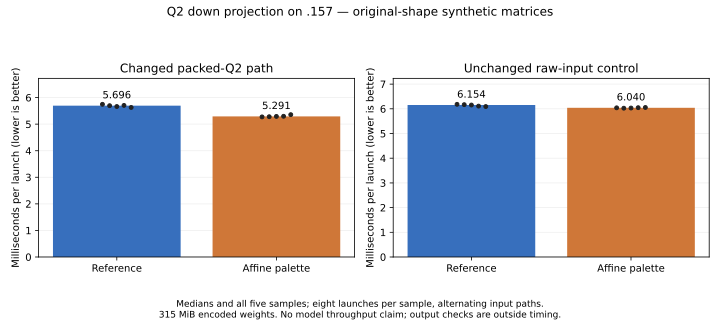
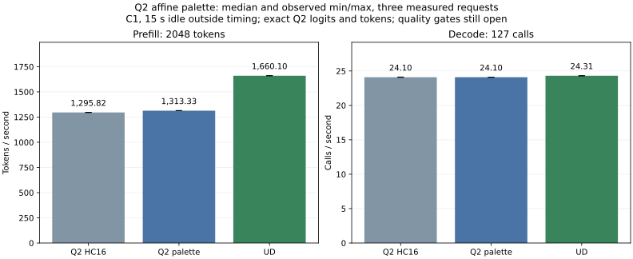

<!-- SPDX-License-Identifier: MIT -->
# Reuse the four values in each Q2 affine group

The candidate improves complete Q2 prefill by **1.35%**, from 1295.823 to
1313.327 tokens/s, with all twelve saved logit frontiers and nine token files
exact. Decode remains around 24.10 calls/s. It becomes the development candidate;
the qualified runtime is unchanged and UD parity remains unmet. Fresh UD
reaches 1660.101 PP / 24.309297 TG, leaving Q2 behind by 20.89% / 0.86%.

The shaped Q2 down component saves **7.10%** time, with identical outputs.
The unchanged raw-input control is also 1.84% faster, so the entire component
difference cannot be assigned to the kernel change. The complete-model gain
above is measured independently and is much smaller than the component gain.

The measured HC16 source preserves the latest decode improvement. Its prefill
path still spends about 288.9 ms in routed Q2 down in the retained MoE/HC trace;
the HC16 change affects scalar decode only. This experiment targets the affine
decode inside that routed kernel, not n-gram lookup or reactive scheduling.

## Mechanism and arithmetic contract

Sixteen weights share an F32 scale and bias, and each stored two-bit code can
select only four results. The candidate evaluates those four F32 fused
multiply-adds, narrows each result to F16, and selects the original half bits
with register byte permutes. The previous kernel repeats that affine and
conversion for every weight. The palette remains in registers; there is no
persistent decoded-weight cache or transformed model file.

Only the packed-input Q2 specialization changes. The raw F32-input entry point
is a control. Original encoded weights, LDS layout, activation high/residual
planes, WMMA accumulation order, final residual correction and HC16 decode
remain intact. Exact output replay is required: constant folding is not
assumed to preserve rounding merely because the formulas are equivalent.

The generator derives `.deps/gufo-q2-bench-affine-palette` from the measured
`.deps/gufo-q2-bench-hc-decode16`. The independent official Gufo pin is
`f783fedb9bea2ec7de941f6da4e02f4a4596b29e`. Source identities and the single-file
MIT delta are recorded in [source](../config/q2-affine-palette-source.json)
and `experiments/q2-affine-palette.patch`. Existing upstream notices remain.

## Static evidence

| Token tile | Reference / candidate VGPRs | Reference / candidate SGPRs | LDS bytes, both | Private bytes, both |
| --- | ---: | ---: | ---: | ---: |
| 16 | 112 / 113 | 24 / 26 | 16640 | 0 |
| 48 | 144 / 144 | 30 / 32 | 24832 | 0 |
| 64 | 169 / 169 | 31 / 34 | 28928 | 0 |

Static mixed-FMA-to-half instructions fall from 64 to 12; 64 register-permute
instructions are added. WMMA counts stay unchanged. These counts describe
generated code, not executed instruction totals or measured occupancy.
Device-only gfx1151 compilation and changed-file formatting pass, and the
patch reconstructs all 1019 source files exactly. Shared formatting retains
exit 1 for two unchanged upstream test files. Existing switch warnings remain.

The first local resource-report attempt retains exit 1 because it expects the
compiler command at the older JSON location. Reading the existing compiler
check repairs the report without recompilation or any GPU rerun. The
[static record](../config/q2-affine-palette-static.json) preserves this failure.

## Component and numerical evidence

The `.157` host arm passes 12/12 Debug and 12/12 ASan/UBSan. All thirty
independent FP64 operator cases pass the original 0.002 limits, alongside
eighteen packing checks, twelve exact down checks and two exact IQ2/Q2 chains.
All 62 saved buffers reproduce the retained packed reference exactly.

The unchanged shaped benchmark uses 512 experts, ten selected per token,
2048 tokens, M2560, logical/stored K640/768 and token tile48. Synthetic encoded
weights occupy 315 MiB. Each path receives three warmup launches and five
samples of eight launches; raw/packed order alternates within each arm.
GPU events exclude upload, routing, validation and output hashing. The two
arms are sequential and use HIP allocations, not model mappings.

| Path | Reference min / median / max, us | Palette min / median / max, us | Median time change |
| --- | ---: | ---: | ---: |
| Packed Q2 | 5628.504 / 5695.709 / 5746.852 | 5273.676 / 5291.324 / 5357.686 | -7.10% |
| Raw F32 control | 6091.843 / 6153.611 / 6182.018 | 6024.849 / 6040.452 / 6054.018 | -1.84% |



All 52,428,800 shaped output values match exactly. Independently recomputed
1024 FP64 dot products give relative RMS 0.000192816 and error over peak
0.000224105, under unchanged limits. Candidate/reference input, output hashes
and oracle metrics agree. The [component JSON](../config/q2-affine-palette-results.json)
and [sample CSV](figures/q2-affine-palette.csv) retain all samples.

## Complete-model protocol

The [fixed protocol](../config/q2-affine-palette-protocol.json) compares fresh
HC16, palette and pristine UD, in that order. Each rebuilds all MMQ sources
and runs one warmup plus three measured fresh sessions at pp2048/tg128.
There are 127 timed decode calls; the first token comes from prefill.
Fifteen seconds idle precede each request, warmup included, outside PP/TG.
MTP and prefix reuse are disabled, capacity is 9216 and chunk size is 2048.
Model loading and file output are outside request timers. The repeated-padding
input and generated token history are checked across arms. Each original
model's stat identity is checked before and after its run.

This short sequential screen is not interleaved statistical acceptance,
continuous serving, long-context coverage, independent model quality or HTTP
qualification. Earlier numerical drift from qualified Q2 remains a separate
open issue even if every new candidate frontier exactly matches HC16.

| Arm | PP tok/s min / median / max | TG calls/s min / median / max | Median PP s | Median TG s |
| --- | ---: | ---: | ---: | ---: |
| Q2 HC16 reference | 1295.744 / 1295.823 / 1296.283 | 24.084978 / 24.099751 / 24.127254 | 1.580462 | 5.269764 |
| Q2 affine palette | 1313.101 / 1313.327 / 1314.841 | 24.089346 / 24.099602 / 24.112188 | 1.559399 | 5.269797 |
| Fresh pristine UD | 1660.008 / 1660.101 / 1661.446 | 24.295755 / 24.309297 / 24.318792 | 1.233660 | 5.224339 |



The [complete model report](../config/q2-affine-palette-model-results.json) and
[CSV with all samples and durations](figures/q2-affine-palette-model.csv)
retain every measured request. Q2 prefill saves 21.064 ms per request at the
median; its rate rises 1.3508%. Decode changes -0.00062%, with overlapping
sample ranges. This does not establish a statistical zero-margin guarantee.

All 21 candidate logit/token files are byte-exact against fresh HC16. The fresh
HC16 reference also matches all 21 retained HC16 files. All nine token files
match across both Q2 arms and UD. Repeated prefill/final logits and output
tokens within each arm reproduce exactly on 27/27 comparisons. These are
same-Q2 implementation checks, not an independent full-model teacher.

The new UD prefill median is below the earlier 1682.761 control, while its
decode is close to the earlier 24.326. Historical results remain recorded;
neither this variability nor a component speedup establishes Q2/UD parity.
The selected development tree is `.deps/gufo-q2-bench-affine-palette`, retaining
the previous HC16 decode gain. Remaining work targets the other prefill costs,
then broader contexts/concurrency and independent quality qualification.

## Validation and closure

All seven runners and 27 remote commands exit 0; all 161 artifacts, source
capsules and result archives hash-verify. Source admission passes 12/12 Debug
and 12/12 ASan/UBSan. The existing upstream formatting failure and corrected
local report failure remain explicit. Original model stat witnesses and each
binary's before/after hashes are unchanged.

Campaign sampled maxima are GPU 83 C and CPU 91.875 C, including compilation.
Model-command-only maxima for HC16/palette/UD are GPU 79/79/83 C and CPU
82.500/82.875/83.125 C. Samples do not bound brief unseen peaks.

[Verified closure](../config/q2-affine-palette-validation.json) at
22:34:30 UTC verifies seven runners and 27 command identities/groups/sessions
absent, empty KFD, all four original leases unchanged/free and all five original
model stat witnesses unchanged. Independent observer retirement at 22:34:58
also observes empty KFD. Both observers exit 0. No Q2 remote job, waiter or
automatic retry remains; the shared ledger records the release.

## Reproduction

Preparation is local and refuses an existing candidate directory:

```sh
python3 tools/prepare-q2-affine-palette.py
```

GPU work requires coordinated ownership and fresh four-lease admission for
each build/run arm. Use new immutable lowercase labels for every run:

```sh
python3 tools/q2-remote.py packed-operators q2-affine-palette-operators-new --source-variant affine-palette
python3 tools/q2-remote.py packed-bench q2-affine-palette-micro-ref-new --source-variant hc-decode16
python3 tools/q2-remote.py packed-bench q2-affine-palette-micro-new --source-variant affine-palette
```

Reproduce analysis and graphics locally from the collected campaign:

```sh
python3 tools/analyze-q2-staged-weights.py \
  --operators evidence/q2-affine-palette-operators-r1 \
  --retained-operators evidence/q2-packed-operators-r1 \
  --reference evidence/q2-affine-palette-micro-ref-r1 \
  --candidate evidence/q2-affine-palette-micro-r1 \
  --output config/q2-affine-palette-results.json
python3 tools/plot-q2-staged-weights.py config/q2-affine-palette-results.json \
  docs/figures/q2-affine-palette --candidate-label 'Affine palette'
python3 tools/analyze-q2-stack.py \
  --arm hc16=evidence/q2-affine-palette-model-ref-r1 \
  --arm palette=evidence/q2-affine-palette-model-r1 \
  --arm ud=evidence/q2-affine-palette-ud-r1 \
  --numerical-reference evidence/q2-affine-palette-model-ref-r1 \
  --scope 'Fresh sequential C1 pp2048/tg128; no statistical parity or long-context verdict' \
  --output config/q2-affine-palette-model-results.json
python3 tools/plot-q2-stack.py --report config/q2-affine-palette-model-results.json \
  --output docs/figures/q2-affine-palette-model \
  --arm 'hc16=Q2 HC16' --arm 'palette=Q2 palette' --arm 'ud=UD' \
  --title 'Q2 affine palette' \
  --note 'exact Q2 logits and tokens; quality gates still open'
```
