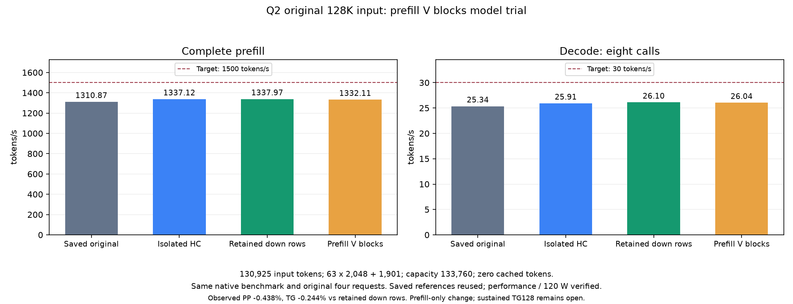

<!-- SPDX-License-Identifier: MIT -->
# Transient value tiles for prefill attention

The retained original-128K trace attributes 11.668 seconds to attention.
Its mean chunk cost rises from 137.166 ms in the first quarter to 211.019 ms
in the last. The sparse WMMA kernel reads one value key per lane so that its
LDS transpose remains conflict-free; those global reads are strided.

This component keeps the exact encoded half bits but packs values into
`[KV head][16-dimension slice][context token][16]` temporary storage. Four
adjacent selected keys then occupy one 128-byte segment. It changes only
the value-load addresses; sorted selections, query/key computation, softmax,
PV accumulation, gating, early/late prefetch and thread geometry remain.
It does not change precision, the persistent KV layout or the decode path.

The full existing context is copied on every candidate call. Both this copy
and attention are inside the complete timer; consumer-only time is secondary.
Temporary storage is one value-cache payload for the current layer, about
126 MiB at the timed 128K shape. Any future engine integration must account
for its allocation, reuse and lifetime. No persistent second KV cache or
incremental-update shortcut is assumed in this trial.

The earlier V-staging trial only changed early/late prefetch and was negative.
This candidate changes global layout while keeping the retained early/late
dispatch. It is also distinct from the rejected selector-key tiling experiment.
Neither older trial is rerun or promoted.

The synthetic fixture uses full 2048-row shapes at start positions 28672 and
126976, plus untimed real 1901-row and small allocation-boundary tails.
Six measured pairs have balanced order after two warmups. Both timing scopes,
every complete output comparison, guards, all input/packed bytes and sampled
independent FP64 errors are retained. Finite differences preserve timings
and return exit 1; unsafe outputs stop with exit 2. The previous 0.01 absolute
operator limit is unchanged. Passing this fixture is not model-quality proof.
Synthetic masks are not claimed to reproduce the original model's selections.

Local compilation succeeds. Both original control functions are byte-exact
to retained R3; early/late kernels use the same 231/223 VGPRs and zero private
scratch in both arms. Their function sizes are unchanged. The packing kernel
uses 9 VGPRs and zero scratch. This establishes no performance improvement.

All 1032 parent provider files verify against the retained manifest. The
control and derived candidate preserve Gufo's MIT notice and independent
upstream pin f783fedb9bea2ec7de941f6da4e02f4a4596b29e. No DS4 source is used.

At preparation, GPU execution is pending fresh .157 coordination and CPU
window checks. No production dispatch or model reference changes. New work
prioritizes prefill; beneficial decode-only changes remain retained separately.

[Source binding](../config/q2-attention-v-tiles-source.json),
[device audit](../config/q2-attention-v-tiles-static.json),
[candidate](../experiments/q2-attention-v-tiles.inc),
[fixture](../tests/q2_attention_v_tiles.hip).

## Measured full-context layout: rejected

The .157 component exits 0, with all 18 full-output pairs exact and all eight
independent FP64 checks passing (maximum absolute error 4.101635e-6).
Every packed/input byte and guard check passes. Six measured pairs per depth
all regress, in both run orders. HIP event intervals are positive.

| Shape | Original complete, ms | Packed complete, ms | Packing, ms | Candidate attention alone, ms | Complete latency change |
|---|---:|---:|---:|---:|---:|
| full32 | 23.878620 | 29.545492 | 0.505534 | 29.039958 | +23.731992% |
| full128 | 42.893054 | 57.380795 | 1.546260 | 55.834536 | +33.776427% |

These are component arithmetic means, not new model throughput references.
The packing-free consumer is also slower, so copy overhead alone does not
explain the result. No model integration or full-model trial follows.
[All warmup/measured pairs](../config/q2-attention-v-tiles-results.json).

Source e1f58fb9 and plan 32c7fbed; CPU fixture/verify/admit/run/release all 0.
All 36 artifacts (891525 bytes) verify at 20:51:09 UTC before release at
20:51:33, SHA 2a4264681b27fa1fd4277d00393e1239c1631ea9e85a4132ef61eeb0605e5e34.
Independent 20:52:41 closure checks registry, 19 identities including the
supervisor/groups, KFD, five leases and seven model stats. Core/GLM receive
closure; no Q2 reservation remains.

## Bounded four-key refinement

A distinct follow-up keeps the four keys of each sparse selection block
together: `[four-key block][KV head][slice16][key in block][16]`. It preserves
128-byte slice segments without placing each dimension slice an entire
context apart. Improved cache/page locality is a hypothesis, not a measured
cause of the earlier regression.

The full-context copy remains inside the timer; this is not an incremental
cache shortcut. The last block is padded to four rows in temporary storage
only, with checked zero padding and no invented prompt tokens or arithmetic
changes. Original KV operands still end at their actual allocation boundary.
Its GPU result and model qualification are pending separate admission.

## Measured four-key refinement: retain for model qualification

The follow-up .157 component exits 0. All 18 full-output comparisons are
exact and all eight independent FP64 checks pass, with the same maximum
absolute error 4.101635e-6. Original inputs, packed values and final zero
padding pass byte checks; outputs are finite and guards unchanged.

| Shape | Original complete, ms | Four-key complete, ms | Packing, ms | Complete latency change | Improving pairs |
|---|---:|---:|---:|---:|---:|
| full32 | 24.050591 | 23.423894 | 0.372130 | -2.605743% | 6/6 |
| full128 | 43.783344 | 42.462430 | 1.279226 | -3.016933% | 5/6 |

The 32K kernel uses 215 VGPRs versus 231 for the control; at 128K both use
223, with zero private scratch throughout. Two original functions remain
byte-exact to retained R3. Static resource changes do not establish the cause
of the observed speedup. Six equally ordered measured pairs and both warmups
are preserved in the [complete result](../config/q2-attention-v-blocks-results.json).
One 128K pair is slower and must remain visible.

Retain this candidate for prefill-only model integration. These percentages
apply to packing plus attention, not all prefill: the original model's
1337.972303 PP / 26.101627 TG reference is unchanged. There is no decode
optimization or new quantization in this experiment.

CPU fixture/verify/admit/run/release all exit 0. All 36 artifacts (896298
bytes) verify at 20:58:10 UTC before release at 20:58:42, SHA
da5b6845eedadf900f6c66f6f147d2f99f8120c403e52c7d9d9fe101202b505d.
Independent closure at 20:59:29 checks registry, 20 identities including the
supervisor/groups, empty KFD, five original free leases and seven unchanged
model stats. Core/GLM receive closure. No Q2 workload or reservation remains.

Integration inspection finds an existing candidate for temporary storage:
`Scratch::down_e` is allocated as max_batch * num_experts_used * hidden
F32 values (200 MiB at 2048/10/2560), even when an expert path writes halves.
Attention's packed values require about 126 MiB at the tested 128K depth.
Reuse is only a design hypothesis: it needs an explicit prefill/geometry/byte
capacity guard, proof that the previous combine finished reading it, ordering
on the same stream, and rejection of speculative/last-only or narrowed-row
scratch. No extra persistent KV or weight copy is necessary if those gates
are established. No alias or model dispatch has been changed yet.

## Original-model integration prepared

The isolated model candidate now reuses the existing 200 MiB base expert
output allocation. Its C17 contract requires prefill, exactly 2048 rows and
max batch, the measured 24/2/256/4 attention geometry, a complete sparse mask,
positions 28672 through 129024, and no pending expert or last-only work.
An allocation-base identity check rejects RowScratch offsets; a byte-capacity
check rejects insufficient storage. Decode, short prompts and the actual
1901-token final chunk retain their original paths. No model/KV/weight bytes,
public ABI, allocation reservation or numerical precision boundary changes.

Forward calls Combine after each MoE. Combine queues its final down_e read and
clears all three deferred-MoE flags; subsequent HC normalization reads residuals
and scales instead. Packing, attention and the next expert producer use the
same existing stream, so the shared buffer cannot be overwritten before its
last reader completes. Clearing a host flag alone is not a GPU completion
claim. All scratch producer/consumer source identities are bound in the
[model manifest](../config/q2-attention-v-blocks-model-source.json).

The new server d49ad1f8 preserves all 923 existing device functions exactly;
its three added functions are byte-exact to the positive component. The
333-file C17 runtime and saved MMQ archive verify unchanged. On .157, one
focused CTest passes all 232 contract checks in Debug and again with ASan/UBSan.
Original-input/power rejection and success/failure child-retirement fixtures
also pass. Seven host commands exit 0, without accessing a GPU or model.
These checks establish the guarded host contract, not model inference.

The first build exits 2 because formatting sorts the dependent includes in
the wrong order. The wrapper now explicitly preserves that order; initial
source/patch/manifest/logs survive and the next configure/build both exit 0.
The required shared formatting check remains exit 1 with 99 diagnostics in
unchanged files; no changed file has a remaining diagnostic. Unrelated source
is left intact. The model patch passes apply-check against the retained parent.

Only the new candidate will run the frozen four-request native bench workload:
130925-token complete prefill, 63 full chunks plus the real 1901-token tail,
eight AR calls, capacity 133760, original requests/client and port 8000.
No saved control is rebuilt or rerun. GPU admission and model performance
remain pending at this preparation checkpoint.

## Original-model result: no verified gain

The new candidate runs once on .157 with the frozen original client and all
four requests. No reference executable is rebuilt or rerun. The complete
prefill still contains 63 full 2048-token chunks and the actual 1901-token
tail; capacity 133760, zero cached tokens and eight autoregressive output calls.

| Saved or new observation | Complete prefill, token/s | Prefill, ms | Decode, token/s | Eight-call decode, ms |
|---|---:|---:|---:|---:|
| Original saved Q2 | 1310.874605 | 99876.067130 | 25.344213 | 315.653915 |
| Retained isolated HC | 1337.119965 | 97915.672036 | 25.914406 | 308.708599 |
| Retained four-row Q2 down R3 | 1337.972303 | 97853.296131 | 26.101627 | 306.494308 |
| New prefill V blocks | 1332.109243 | 98283.981327 | 26.037992 | 307.243356 |

The new prefill observation is 0.438205% below R3 and takes 430.685196 ms
longer. The component's 2.6–3.0% saving does not establish a complete-model
benefit. Preserve the component and integrated executable, but do not promote
the candidate or replace R3. The unchanged decode device code does not justify
attributing its -0.243796% variation to a decode optimization.

All four complete responses/token pieces/usage match original and R3.
This limited exact replay is not independent parent-quality qualification,
and eight calls do not qualify sustained TG128. Performance/120 W and fan
curves verify before and after. New telemetry records 52 samples, CPU peak
90.375 C, GPU peak 92 C and mean active clock 2664.412 MHz; saved R3 records
91.25 C, 94 C and 2658.902 MHz. These samples alone do not explain the timing
difference. No new precision reduction or additional allocation is introduced.
Expected guarded dispatch is derived from source; this unprofiled trial does
not observe the number of new device launches directly.

CPU checks, verify/admit/run/release and server/client all exit 0. All 49
artifacts (66931331 bytes) hash-verify at 21:24:00.500587 UTC before release
21:28:43.621659, SHA 0cda95c0ad52e19a094fe8c0ebca081e2ebe98980d41208e1e9fa91623326583.
Independent closure at 21:28:56.251514 verifies registry, 22 identities
including supervisor/groups retired, KFD empty, five original free leases
and seven unchanged model stats. Core/GLM receive closure; no Q2 GPU
reservation remains. No full-curve or repeated-control run follows.

[Audited values](../config/q2-attention-v-blocks-native128-results.json),
[frozen plan](../config/q2-attention-v-blocks-native128-plan.json),
[CSV](figures/q2-attention-v-blocks-native128.csv),
[reproducible analysis](../tools/analyze-q2-attention-v-blocks-native128.py).

