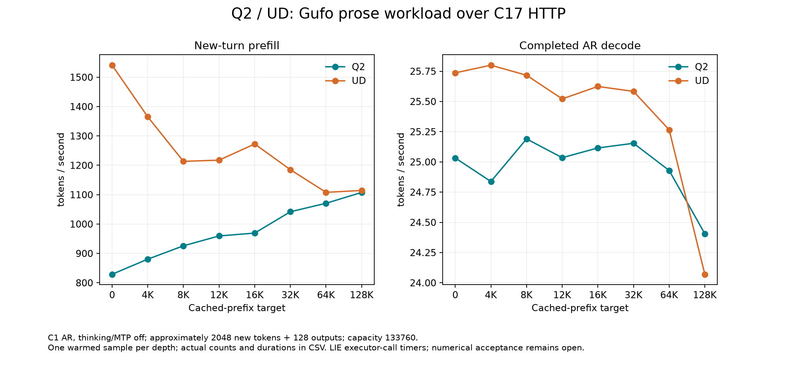

<!-- SPDX-License-Identifier: MIT -->
# Q2/UD on the pinned Gufo HTTP prose depth workload

This is the first pair. The [reversed repetition](Q2-CANONICAL-REPEATS.md)
does not confirm its near-parity observation at128K; both complete series
remain available and no best-sample substitution is made.

Both original models complete the requested eight-point workload on `.157`.
Q2 does **not** establish whole-curve parity. These are one warmed observation
per point, following the published method; they do not establish uncertainty
bounds or numerical/task quality. Historical 1411–1439 token/s counting-prompt
results remain separate diagnostics.

The workload is imported directly from official Gufo at
`f783fedb9bea2ec7de941f6da4e02f4a4596b29e`: deterministic prose, summary/story
instruction, initial calibration, one warmup, original depth retry rules and
ordered prefixes. Every accepted request is independently reconstructed by the
analyzer. All 16 measured continuations emit 128 tokens in 128 completed AR
calls, with thinking and MTP off. Prefix preparation occurs before the measured
continuation; these rates are not fresh ingestion of the entire context.

## Complete measured curve

Rates use actual new/output tokens divided by completed C17 executor-call time.
Q2 and UD use the same timer. This matches the Gufo **workload**, but does not
claim Gufo's published scheduler timer is identical. Cache capture/restore,
tokenization, queueing and HTTP time are outside PP/TG; the CSV retains cache
costs and request wall time separately.

| Prefix target | Q2 PP tok/s | UD PP tok/s | Q2 vs UD | Q2 TG tok/s | UD TG tok/s | Q2 vs UD |
|---:|---:|---:|---:|---:|---:|---:|
| 0 | 829.074 | 1540.945 | -46.197% | 25.033 | 25.737 | -2.737% |
| 4096 | 880.427 | 1365.207 | -35.510% | 24.838 | 25.800 | -3.729% |
| 8192 | 925.823 | 1213.533 | -23.708% | 25.190 | 25.717 | -2.047% |
| 12288 | 959.534 | 1217.587 | -21.194% | 25.035 | 25.521 | -1.906% |
| 16384 | 969.226 | 1272.659 | -23.842% | 25.116 | 25.624 | -1.986% |
| 32768 | 1041.879 | 1185.183 | -12.091% | 25.154 | 25.583 | -1.678% |
| 65536 | 1070.771 | 1107.967 | -3.357% | 24.929 | 25.265 | -1.330% |
| 131072 | 1107.664 | 1114.494 | -0.613% | 24.406 | 24.071 | +1.392% |



[SVG](figures/q2-canonical-http-r1/curve.svg),
[all physical counts, durations and output hashes](figures/q2-canonical-http-r1/samples.csv),
[machine-readable verified comparison](../config/q2-canonical-http-results.json).

## Actual counts and durations

The configured capacity is 133760; each continuation adds approximately 2048
new tokens. Actual cached and new counts satisfy upstream's unchanged
`max(32, floor(target*0.005))` tolerance. Generated prefix replies are retained
independently for each quantization; identical histories are not assumed.

| Model | Prefix target | Cached | New | PP seconds | TG seconds | Prefill calls | Capture ms | Restore ms | HTTP wall seconds |
|---|---:|---:|---:|---:|---:|---:|---:|---:|---:|
| Q2 | 0 | 0 | 2040 | 2.460576 | 5.113329 | 1 | 19.172 | 0.003 | 7.657445 |
| Q2 | 4096 | 4096 | 2042 | 2.319329 | 5.153389 | 1 | 27.163 | 4.244 | 7.568551 |
| Q2 | 8192 | 8185 | 2047 | 2.211005 | 5.081298 | 1 | 34.841 | 5.870 | 7.399446 |
| Q2 | 12288 | 12250 | 2046 | 2.132284 | 5.112858 | 1 | 41.692 | 7.219 | 7.361709 |
| Q2 | 16384 | 16325 | 2046 | 2.110963 | 5.096428 | 1 | 54.034 | 8.386 | 7.338740 |
| Q2 | 32768 | 32719 | 2028 | 1.946482 | 5.088634 | 1 | 81.732 | 12.877 | 7.203432 |
| Q2 | 65536 | 65448 | 2057 | 1.921045 | 5.134516 | 2 | 187.522 | 22.519 | 7.346733 |
| Q2 | 131072 | 130933 | 2046 | 1.847131 | 5.244644 | 1 | 333.081 | 42.380 | 7.566156 |
| UD | 0 | 0 | 2040 | 1.323863 | 4.973398 | 1 | 42.317 | 0.003 | 6.459852 |
| UD | 4096 | 4096 | 2042 | 1.495744 | 4.961217 | 1 | 66.697 | 4.250 | 6.628806 |
| UD | 8192 | 8185 | 2047 | 1.686810 | 4.977272 | 1 | 93.151 | 5.768 | 6.852086 |
| UD | 12288 | 12250 | 2046 | 1.680373 | 5.015396 | 1 | 110.985 | 7.190 | 6.919854 |
| UD | 16384 | 16325 | 2046 | 1.607658 | 4.995226 | 1 | 160.116 | 8.414 | 6.881250 |
| UD | 32768 | 32719 | 2028 | 1.711128 | 5.003234 | 1 | 129.975 | 12.769 | 6.957057 |
| UD | 65536 | 65448 | 2057 | 1.856554 | 5.066216 | 2 | 519.392 | 22.733 | 7.664404 |
| UD | 131072 | 130933 | 2046 | 1.835811 | 5.317667 | 1 | 1037.390 | 73.854 | 8.374172 |

## Interpretation and next attribution

The much larger short-context prefill deficit was hidden by optimizing the
repetitive counting fixture. These are different workloads, so the lower prose
rate is not by itself a code regression. Q2's PP rate increases with depth in
this ordered run while UD's generally decreases. This curve alone cannot
separate cached PLE rows, file-cache state, attention costs and generated-prefix
differences. Do not call it a measured reactive speedup.

Earlier [PLE first-access evidence](Q2-PLE-FIRST-ACCESS.md) makes row gathering
and storage amplification a concrete hypothesis for the prose deficit. The
original Q2 PLE table has BF16 rows while UD uses IQ4_NL; this is separate from
Q2 expert quantization. That evidence used a different fixture. The next
profile must retain this HTTP workload and correlate PLE gather/wait time,
cache hits and physical reads with the completed prefill calls before choosing
an optimization. The scalar HC decode attribution is likewise a hypothesis
to validate on the curve, not savings that can be added to it.

The first same-recipe follow-up should reverse model order and repeat the
whole ordered curve to assess order/cache sensitivity. No global cache drop,
model conversion or file-layout change is implied. Every candidate must then
retain both PP and TG coverage at all eight points; a gain at 128K cannot
compensate for a short-context loss.

## Composition, reproducibility and qualification

The common C17 HTTP/worker/state core is frozen at
`15c6082152c3df0cb1f40d89ba5329692f307d7b` (333 files). Q2 uses the cumulative
ragged HC library candidate; UD uses the independently fetched pristine
numerical provider. Both receive the same four-file state-access and optional
sampling/reporting edits, with all other 1016 Q2 / 1015 UD files unchanged from
their respective parents. Empty-bias upstream greedy sampling is used. The
source-only manifest is [q2-curve-source.json](../config/q2-curve-source.json).
No kernel was newly optimized during this comparison; the common ABI, state
format and request timing contract are those of the frozen core.

Each provider is rebuilt completely, including HIP/MMQ, on `.157`. The
transient server binds HTTP `127.0.0.1:8000`, uses one active request, chunk2048,
16GiB bounded RAM prefix storage, exact finish checkpoints, and no SSD, KVC,
MTP or vision path. The policy named `ds4` is LIE-owned C17 policy code, not an
import of DS4 source. The wrapper starts and reaps only its own server/client
children under the coordinated runner's process group.

After a fresh ownership admission, reproduction uses unique labels:

```sh
python3 tools/q2-remote.py cpu q2-curve-host-r2
python3 tools/q2-remote.py collect q2-curve-host-r2
python3 tools/q2-remote.py q2-curve q2-canonical-http-q2-r1 --source-variant curve-q2 --rebuild-mmq
python3 tools/q2-remote.py collect q2-canonical-http-q2-r1
python3 tools/q2-remote.py ud-curve q2-canonical-http-ud-r1 --source-variant curve-ud --rebuild-mmq
python3 tools/q2-remote.py collect q2-canonical-http-ud-r1
python3 tools/analyze-q2-curve.py --q2 evidence/q2-canonical-http-q2-r1 --ud evidence/q2-canonical-http-ud-r1 --host evidence/q2-curve-host-r2 --output config/q2-canonical-http-results.json
python3 tools/plot-q2-curve.py config/q2-canonical-http-results.json --output docs/figures/q2-canonical-http-r1
```

Existing labels/results deliberately refuse overwrite. The optional source
preparation tool also refuses overwrite and requires the recorded parents.
The measured request payloads, streamed responses, source capsules, command
exit codes, binary identities and thermal observations remain under local
`evidence/`. No dependency installation, hardware tuning, model mutation or
persistent service deployment occurred.

Both host cohorts pass 18/18 Debug and 18/18 ASan/UBSan tests on `.157`. The
second includes the corrected distinction between an optional preparatory EOS
check and 128 completed output calls. Initial static compilation failed for
missing feature macros (exit1); that failure is retained, then the definitions
were corrected and Q2/UD strict syntax checks passed. Both model runners and
all their server/client children finish with exit0. Existing operator,
row-position and KL rejection remains; successful serving is not numerical
promotion.

Verified closure at **2026-10-03T22:06:58.501157+00:00** checks 30 recorded process identities and their owned groups absent, KFD empty, and all four original lease inodes free. No Q2 job, waiter or automatic restart remains. [Release receipt](../config/q2-canonical-curve-window-release.json).
