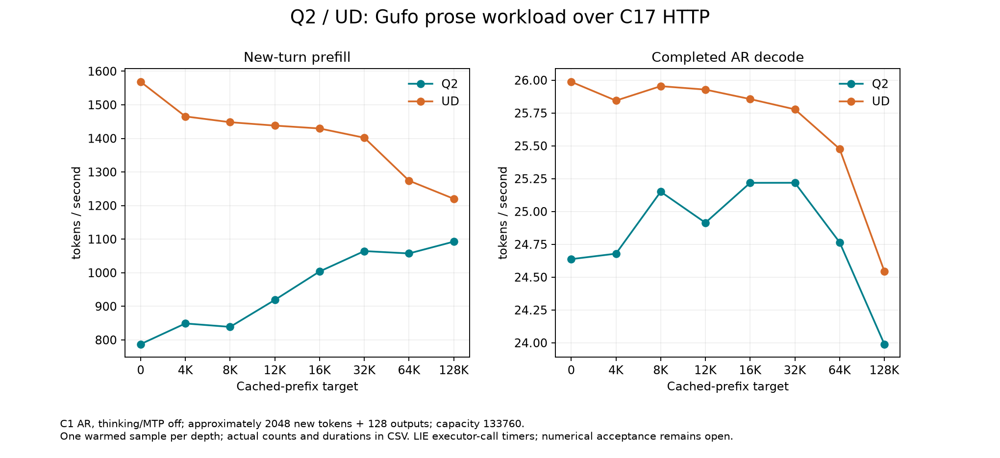

<!-- SPDX-License-Identifier: MIT -->
# Repeated Q2/UD canonical HTTP context curves

The reversed **UD→Q2** pair confirms that whole-curve parity is not met.
The original **Q2→UD** pair and this repetition use unchanged provider/core
sources, the same complete Gufo prose workload, and the same server timer.
All **40 same-model request payloads and 40 completion hashes** replay exactly,
including calibration, warmup, prefix preparation and measured continuations.
All actual cached/new/output counts match across repetitions.

Despite those exact histories, UD prefill increases by 1.8–19.3% between
sweeps. Q2 does not reproduce the near-parity observation at128K: in the
second pair it is 10.455% below UD in prefill and 2.263% below in decode.
There is no implementation speedup in this repetition. Cache/order, placement
and execution-state sensitivity need attribution. Whole-request telemetry
alone does not establish a thermal or clock cause.

## Second pair: every point

Rates are token/s. PP times only the approximately2048 **new** tokens after
prefix restoration; TG emits128 tokens. Published Gufo scheduler rates and
instrumented PLE profiles are excluded.

| Prefix target | Q2 PP | UD PP | Q2 PP difference | Q2 TG | UD TG | Q2 TG difference |
|---:|---:|---:|---:|---:|---:|---:|
| 0 | 787.469 | 1568.491 | -49.795% | 24.637 | 25.988 | -5.196% |
| 4096 | 849.017 | 1465.440 | -42.064% | 24.679 | 25.845 | -4.510% |
| 8192 | 838.807 | 1448.232 | -42.081% | 25.151 | 25.954 | -3.097% |
| 12288 | 919.120 | 1438.157 | -36.090% | 24.914 | 25.928 | -3.911% |
| 16384 | 1003.752 | 1429.610 | -29.788% | 25.218 | 25.856 | -2.467% |
| 32768 | 1064.526 | 1401.974 | -24.069% | 25.219 | 25.778 | -2.170% |
| 65536 | 1057.507 | 1274.059 | -16.997% | 24.766 | 25.477 | -2.792% |
| 131072 | 1092.674 | 1220.249 | -10.455% | 23.990 | 24.546 | -2.263% |

[SVG](figures/q2-canonical-http-r2/curve.svg),
[all actual counts and durations](figures/q2-canonical-http-r2/samples.csv),
[verified second pair](../config/q2-canonical-http-r2-results.json),
[first pair and its full CSV](Q2-CANONICAL-HTTP.md).

## Both observations retained

Each cell below shows **mean ± sample standard deviation**, token/s, n=2.
These are descriptive statistics, not a confidence interval. The
[machine-readable repeat report](../config/q2-canonical-http-repeats.json)
retains both individual values and their minimum/maximum. No point or metric
is replaced by the best observed sample.

| Prefix target | Q2 PP | UD PP | Q2 TG | UD TG |
|---:|---:|---:|---:|---:|
| 0 | 808.271 ± 29.420 | 1554.718 ± 19.478 | 24.835 ± 0.280 | 25.862 ± 0.177 |
| 4096 | 864.722 ± 22.210 | 1415.324 ± 70.876 | 24.758 ± 0.113 | 25.822 ± 0.031 |
| 8192 | 882.315 ± 61.530 | 1330.883 ± 165.957 | 25.171 ± 0.028 | 25.836 ± 0.168 |
| 12288 | 939.327 ± 28.577 | 1327.872 ± 155.966 | 24.975 ± 0.085 | 25.725 ± 0.288 |
| 16384 | 986.489 ± 24.413 | 1351.134 ± 110.981 | 25.167 ± 0.073 | 25.740 ± 0.164 |
| 32768 | 1053.203 ± 16.014 | 1293.578 ± 153.294 | 25.186 ± 0.046 | 25.681 ± 0.138 |
| 65536 | 1064.139 ± 9.379 | 1191.013 ± 117.445 | 24.847 ± 0.116 | 25.371 ± 0.149 |
| 131072 | 1100.169 ± 10.599 | 1167.371 ± 74.780 | 24.198 ± 0.294 | 24.308 ± 0.336 |

The mean Q2/UD ratio remains below one in **both metrics at all eight points**.
The existing operator/position/KL rejection remains separate and unchanged.
No numerical or production promotion follows from these performance samples.

Both providers rebuild fully, including HIP/MMQ. The unchanged frozen C17 core
and provider manifests verify, with 30 artifacts per model and all command
exits0. Host checks pass19/19 Debug and19/19 ASan/UBSan on `.157`. The enclosing
window also completed the [separate PLE profiles](Q2-CURVE-PROFILE.md), then
released the GPU at 23:03:30 UTC with 39 processes/groups retired and four
leases free. Those instrumented runs remain outside performance observations.

[Complete same-model request-history replay](../config/q2-canonical-http-history-replay.json).
