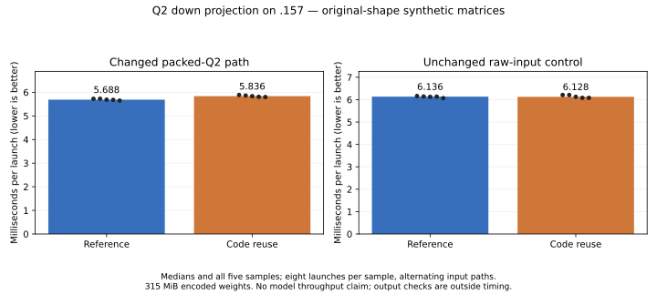

<!-- SPDX-License-Identifier: MIT -->
# Reuse original Q2 code bytes across stages

The candidate is rejected: the shaped packed-Q2 component takes **2.59% longer**
on `.157`, while the unchanged raw-input control changes -0.13%. Every output
check passes. Fewer source fetches do not produce a runtime benefit here; no
complete-model trial or runtime promotion follows.

The retained packed-Q2 down projection occupies 288.934 ms of the measured
2K prefill GPU trace. Earlier weight-decode staging and half-wave exchange
preserve outputs but do not improve the shaped component. This separate
hypothesis targets repeated source fetches instead of sharing decoded values.

## Mechanism

Each original Q2_K superblock stores 256 two-bit codes in 64 bytes. A 32-byte
half contains four K32 groups in different bit planes. The existing producer
thread reads that same half for two successive K64 stages, extracting its
assigned group each time. The candidate loads those original 32 bytes once,
retains them in two `uint4` register values and uses the next bit plane on the
following stage. It refreshes when `kb0 % 4 == 0`, including initial entry and
the logical K640 tail inside the padded K768 storage.

Only the packed-input Q2 specialization selects this path. Affine metadata
fetches and F32 rounding, LDS layout, primary/residual activation planes,
ordered WMMA accumulation and final correction are unchanged. The ordinary
F32-input Q2 path is the control. No model conversion, persistent decoded-weight
cache, new engine switch or CPU model forward is introduced.

The change halves source code-byte fetches in that producer sequence. This
does not imply half the physical memory traffic: the original repeated reads
may already hit a device cache. Additional register lifetimes may offset any
benefit, so runtime measurements determine disposition.

## Static checks

| Token tile | Reference / candidate VGPRs | LDS bytes, both | Private bytes, both |
| --- | ---: | ---: | ---: |
| 16 | 112 / 120 | 16640 | 0 |
| 48 | 144 / 152 | 24832 | 0 |
| 64 | 169 / 169 | 28928 | 0 |

Static WMMA and mixed-FMA-to-half instruction counts are unchanged. Device-only
gfx1151 compilation and changed-file formatting pass. The patch reconstructs
all 1019 files exactly. Full-tree formatting retains exit 1 on the same two
unchanged upstream test files; inherited compiler switch warnings are retained.
[Source](../config/q2-code-reuse-source.json) and
[static records](../config/q2-code-reuse-static.json) preserve commands/hashes.

## Runtime results

Updated source-admission fixtures pass 12/12 Debug and 12/12 ASan/UBSan on
`.157`. Thirty independent GPU operator cases and 32 packing/down/chain checks
pass. All 62 saved F32/U32 buffers match the retained packed baseline exactly.
The shaped benchmark also compares all 52,428,800 output values byte-for-byte
and recomputes 1024 independent FP64 dot products: relative RMS error is
0.000192816 and error over reference peak is 0.000224105, below the unchanged
0.002 limits. Both arms produce the same full-output hashes and error metrics.

| Path | Reference median us | Code reuse median us | Time change |
| --- | ---: | ---: | ---: |
| Packed Q2, changed | 5688.152 | 5835.681 | +2.59% |
| Raw F32 input, unchanged control | 6135.858 | 6128.147 | -0.13% |



The matched component uses synthetic matrices with 512 experts, ten selected,
2048 tokens, M2560 and logical/stored K640/768 at tile48. The encoded weight
buffer occupies 315 MiB. Each path has three warmup launches and five measured
samples of eight launches; raw/packed order alternates within an arm. GPU events
exclude input transfer, routing, validation and output hashing. The reference
and candidate arms are sequential, not an interleaved full-model comparison.
Every sample is retained in the [JSON](../config/q2-code-reuse-results.json)
and [CSV](figures/q2-code-reuse.csv).

The component regression rejects this register-cache hypothesis. Extra register
lifetime is a possible cost, but its causal contribution is not isolated by
this comparison. No original model is opened, and no result establishes complete
prefill/decode throughput, full-model numerical qualification or Q2/UD parity.

All four runners and 15 commands finish with exit 0; 83 artifacts hash-verify.
Each GPU build/run arm takes four fresh leases. CPU fixtures do not acquire
GPU leases. Observed campaign maxima are GPU 51 C and CPU 80.625 C. The
[closure record](../config/q2-code-reuse-validation.json) verifies all processes
retired, empty KFD and unchanged/free leases at 21:09:00 UTC, with independent
observer retirement at 21:09:36. No remote job, waiter or retry remains.

Reproduce the local analysis and graph from collected artifacts:

```sh
python3 tools/analyze-q2-staged-weights.py \
  --operators evidence/q2-code-reuse-operators-r1 \
  --retained-operators evidence/q2-packed-operators-r1 \
  --reference evidence/q2-code-reuse-micro-ref-r1 \
  --candidate evidence/q2-code-reuse-micro-r1 \
  --output config/q2-code-reuse-results.json
python3 tools/plot-q2-staged-weights.py config/q2-code-reuse-results.json \
  docs/figures/q2-code-reuse --candidate-label 'Code reuse'
```

Reconstruction uses `tools/prepare-q2-code-reuse.py`, deriving the isolated
`.deps/gufo-q2-bench-code-reuse` from the measured MoE/HC checkpoint and official
Gufo pin `f783fedb9bea2ec7de941f6da4e02f4a4596b29e`. The first-party MIT delta
is `experiments/q2-code-reuse.patch`; upstream notices remain intact.
