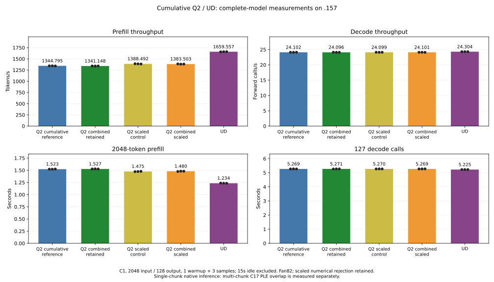
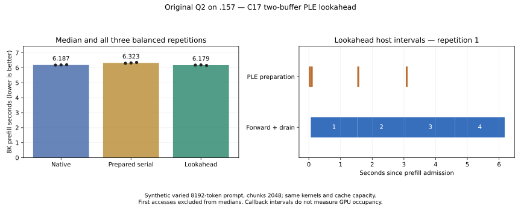

<!-- SPDX-License-Identifier: MIT -->
# Cumulative Q2 performance experiment

The measured 1378.319 prefill token/s scaled-input result already includes
previous Q2/IQ2 expert work, packed activations, HC up/mixing and MoE-combine
fusion, scalar HC16, affine Q2 palette and paired HC-up waves. It is derived
from the cumulative 1336.121 token/s HC-up-chains source, not from the initial
Q2 implementation. The final +3.15825% is incremental over that cumulative base.
Their original 2K/128 results precede the owner's fan82 policy; fresh comparisons
are necessary. The scaled route's independent operator/KL rejection remains.

The composition includes compatible retained changes. It does not stack
alternative HC-down tilings or the two mutually exclusive Q2-down activation
representations. Rejected HC160 scheduling, global tile128 and shared-stream
fork/join experiments remain excluded. The separate numerically rejected
HC-library route is not part of this comparison; it would require its own
composition and numerical controls.

Two additions had stayed isolated: exact vector F32-to-F16 memory access and
C17 PLE lookahead. Their benefits affect different costs. Conversion-only time
fell 3.6–3.9%, but complete consumers changed only 0.8–1.4% with overlapping
samples. PLE first-position 8K throughput improved 40.96% in the earlier balanced
new-input experiment; warm replay changed only 0.57%. These percentages cannot
be added to one another or to whole-model throughput.

This experiment composes them in two immutable source trees:

| Source | Cumulative base | New additions | Existing numeric status |
| --- | --- | --- | --- |
| combined-retained | hc-up-chains | Exact vector conversion and prepared PLE hook | Require exact replay versus retained |
| combined-scaled | scaled-input | Same conversion and prepared PLE hook | Preserve inherited operator/KL rejection |

The five executor conversion call sites select the proven vector kernel only
inside prefill, for aligned F16 buffers with at least 1024 elements. Scalar
decode, BF16, small and unaligned inputs retain the original path. Launch errors
retain the original asynchronous contract; the wrapper does not consume them.
No new device buffer is introduced. The separate original scalar entry remains
available to the unchanged 192-case independent conversion fixture.

The previous ForwardPrepared hook applies with zero fuzz (one scaled-source
hunk moves by five lines). The unchanged C17 two-slot flow owns pinned buffers,
backpressure and cancellation in the 8K fixture. Rechecking row IDs, stream drain
and poisoned-input ownership remains mandatory. A single 2K chunk has no next
chunk to overlap: native bench2k measures cumulative kernels and conversion;
the separate 8K comparison actually invokes native/serial/C17-lookahead paths.
No HTTP, long-context or task-quality result is implied by these executables.

Local static checks preserve all 146 retained / 150 scaled original kernel bodies.
The one added conversion body exactly matches the earlier qualified device
assembly. Executor and unchanged 8K harness syntax checks pass; patches reconstruct
all 1020/1021 files exactly. These static checks are not GPU performance evidence.
[Generator](../tools/prepare-q2-combined.py),
[retained identities](../config/q2-combined-retained-source.json),
[scaled identities](../config/q2-combined-scaled-source.json),
[retained static checks](../config/q2-combined-retained-static.json),
[scaled static checks](../config/q2-combined-scaled-static.json) and the
[comparison plan](../config/q2-combined-plan.json) record the composition.

The campaign runs only on `.157`, with original four nonblocking leases for
each GPU build/run, full MMQ rebuilds, CPU 98 C inclusive/exposed GPU thresholds
and the persistent fan82 curve. No model conversion, page eviction or dependency
installation is used. The updated launcher rejects other model routes and all
Terminal-Bench dispatch for these new sources; the frozen quality arms remain
separate. Every actual failure and artifact is retained.

The fresh model cohort includes a fifth arm: scaled-input without the new
conversion/hook additions, using the same fan82 policy. This control isolates
their incremental effect on scaled kernels. Historical scaled replay remains
a numerical comparison only; cross-policy rates do not establish a conversion
or cooling speedup. Each arm rebuilds MMQ and uses one warmup plus three timed
2048-input/128-output sessions, with the same 15-second idle outside timing.

The earlier scaled profile puts conversion at 61.239 ms out of a 1511.193 ms
sum of kernel durations. Applying the isolated 3.6–3.9% conversion-time saving
to that fraction suggests only about 2.2–2.4 ms, or 0.15–0.16% of that kernel
sum, before interactions. This is a scale estimate across different timing
scopes, not a wall-time prediction. It explains why the microbenchmark
percentage cannot be added directly to full-model prefill throughput.

## Complete-model results

All five full MMQ builds and model commands exit 0 on `.157`. No original
model file changes. Medians exclude the single warmup and retain all three
measured sessions; the first output token comes from prefill, followed by
127 measured decode calls. Context capacity is 9216, prefill chunk 2048, MTP
and prefix reuse are off. These are sequential C1 measurements, not HTTP
throughput, a long-context sweep or formal zero-margin parity.

| Source | Prefill token/s | Decode calls/s | Prefill s | Decode s |
|---|---:|---:|---:|---:|
| Retained cumulative Q2 | 1344.795255000 | 24.102382720 | 1.522908407 | 5.269188590 |
| Combined retained Q2 | 1341.147918000 | 24.095705660 | 1.527050053 | 5.270648713 |
| Scaled-input control | 1388.492041000 | 24.099345840 | 1.474981447 | 5.269852587 |
| Combined scaled Q2 | 1383.502810000 | 24.101378540 | 1.480300571 | 5.269408129 |
| Fresh UD | 1659.557210000 | 24.304101210 | 1.234064115 | 5.225455527 |

Adding vector narrowing and the prepared hook changes retained PP by -0.2712%
and scaled PP by -0.3593%. The scaled ranges overlap; retained ranges do not,
but only three sequential samples are available. Neither addition demonstrates
a 2K throughput benefit. Decode changes -0.0277% / +0.0084%, with overlapping
ranges. A single chunk cannot exploit cross-chunk PLE lookahead.

Scaled alone improves 3.2493% over the fresh retained reference. The combined
scaled route improves 2.8783% and still trails fresh UD by 16.6342% in prefill
and 0.8341% in decode. Reaching UD from that rate needs about 19.95% more PP.
The lower observed gap than the earlier 18.10% must not be attributed to these
additions: the matched scaled control is faster, and UD itself measures a
different rate in this cohort. No cooling performance cause is established.

All 21 complete files match for each addition versus its own fresh base, and
the combined scaled source also reproduces all 21 historical scaled files.
All 45 within-arm replay checks pass. Scaled versus retained still changes
12 logit buffers while all nine token files match. This preserves the earlier
18 independent operator failures and qualified-reference KL rejection; exact
replay of an already rejected arithmetic path does not resolve them. Neither
new cumulative source is promoted.

[Machine-readable results](../config/q2-combined-results.json),
[all values in CSV](figures/q2-combined.csv) and
[PNG](figures/q2-combined.png) retain the complete data.

| Source / measured sample | Prefill token/s | Decode calls/s | Prefill s | Decode s |
|---|---:|---:|---:|---:|
| Retained cumulative Q2 1 | 1344.795255000 | 24.102382720 | 1.522908407 | 5.269188590 |
| Retained cumulative Q2 2 | 1345.772355000 | 24.086347230 | 1.521802697 | 5.272696553 |
| Retained cumulative Q2 3 | 1342.159797000 | 24.115465270 | 1.525898782 | 5.266330075 |
| Combined retained Q2 1 | 1341.147918000 | 24.124395220 | 1.527050053 | 5.264380675 |
| Combined retained Q2 2 | 1339.605924000 | 24.095705660 | 1.528807811 | 5.270648713 |
| Combined retained Q2 3 | 1341.792330000 | 24.090530000 | 1.526316669 | 5.271781070 |
| Scaled-input control 1 | 1391.269189000 | 24.108362010 | 1.472037199 | 5.267881739 |
| Scaled-input control 2 | 1388.492041000 | 24.090704640 | 1.474981447 | 5.271742853 |
| Scaled-input control 3 | 1385.295764000 | 24.099345840 | 1.478384655 | 5.269852587 |
| Combined scaled Q2 1 | 1387.699944000 | 24.102921250 | 1.475823364 | 5.269070859 |
| Combined scaled Q2 2 | 1382.185430000 | 24.101378540 | 1.481711466 | 5.269408129 |
| Combined scaled Q2 3 | 1383.502810000 | 24.081549060 | 1.480300571 | 5.273747119 |
| Fresh UD 1 | 1655.617348000 | 24.304101210 | 1.237000810 | 5.225455527 |
| Fresh UD 2 | 1659.557210000 | 24.302458810 | 1.234064115 | 5.225808671 |
| Fresh UD 3 | 1660.511693000 | 24.306810080 | 1.233354760 | 5.224873176 |

## Multi-chunk reactive results

The combined-scaled source runs the unchanged original-weight 8192-token,
2048-token-chunk, 32-forced-decode fixture. Its C17 flow owns two pinned slots
of 21,102,592 bytes each; total reserved accounting is 42,205,424 bytes.
The first ordered observations are separate from three balanced repetitions,
with each mode occupying every measured order position. No page eviction,
model conversion or cache-capacity change occurs.

| Mode | Median prefill s | Prefill token/s | Forced decode s | Forced decode calls/s |
|---|---:|---:|---:|---:|
| native | 6.186755476 | 1324.118923364 | 1.255506292 | 25.487725712 |
| prepared_serial | 6.322731681 | 1295.642518663 | 1.254883647 | 25.500372147 |
| lookahead | 6.179219524 | 1325.733770775 | 1.254719066 | 25.503717021 |

C17 lookahead overlaps 170.863–178.520 ms of measured preparation callbacks
with the preceding forward/drain callback in warm repetitions. All serial
controls have zero overlap. It improves throughput 2.3225% versus explicit
prepared-serial, but only **0.1220% versus native**, with overlapping native/
lookahead sample ranges. The flow is exercised and bounded; it does not show
a useful warm throughput advantage over the existing native path in this cohort.
These host intervals do not measure hardware GPU occupancy.

The first ordered native observation takes 11.063921 s, followed by serial
6.309856 s and lookahead 6.178434 s. Native subsequently takes about 6.18 s
too. These ordered observations have different cache histories and do not
establish a cold-cache reactive speedup. The earlier balanced first-access
experiment's 40.96% result is not added to this warm or 2K measurement.

All 432 complete-vocabulary frontier hashes match across the twelve sessions;
full-array comparisons in RAM and complete-output hashes also agree. All
producer/consumer counts, slot-reuse ordering and finite-output checks pass.
Real cancellation after three layer checks drains GPU work and releases the
borrowed input. This demonstrates the cumulative hook/flow's tested lifecycle,
not hardware-fault recovery, independent task quality or numerical acceptance
of the scaled arithmetic inherited from its base.

| Mode / measured repetition | Prefill s | Prefill token/s | Forced decode s |
|---|---:|---:|---:|
| native 1 | 6.178840351 | 1325.815126240 | 1.256349041 |
| lookahead 1 | 6.179219524 | 1325.733770780 | 1.254649468 |
| prepared_serial 1 | 6.300106077 | 1300.295566440 | 1.255407280 |
| prepared_serial 2 | 6.322731681 | 1295.642518660 | 1.254883647 |
| native 2 | 6.186755476 | 1324.118923360 | 1.255497473 |
| lookahead 2 | 6.188770215 | 1323.687859690 | 1.254719066 |
| lookahead 3 | 6.151201485 | 1331.772340730 | 1.254942542 |
| prepared_serial 3 | 6.355993012 | 1288.862335840 | 1.254490907 |
| native 3 | 6.202078734 | 1320.847469270 | 1.255506292 |

[Complete PLE report](../config/q2-combined-ple-results.json),
[all samples in CSV](figures/q2-combined-ple.csv) and
[PNG](figures/q2-combined-ple.png) preserve first observations, warm samples,
frontiers and callback intervals.

## Validation, source status and closure

Debug and ASan/UBSan each pass 16/16 on `.157`. Both combined-source GPU
conversion fixtures pass all 192 cases and two complete consumer checks.
All nine campaign runners finish with real command/transport exits 0;
176 artifacts, nine source/results archive pairs, 9181 source files and the
frozen runner/fixture/C17 sources verify. Maximum observed CPU/GPU temperatures
are 88.125/84 C, with no thermal stop. See the
[campaign integrity report](../config/q2-combined-validation.json).

The public C ABI and original C17 flow implementation are unchanged. Two
isolated upstream-derived patch sets are applied and fully rebuilt for the
experiments; neither is installed in the running HTTP service or promoted.
No benchmark result establishes 128K/256K/1M coverage or Q2/UD parity.

Fresh closure at 2026-10-03 15:12:14.894 UTC verifies all 45 recorded processes
and their groups absent, readable KFD empty and the original four leases
acquired EX|NB then released. CPU/GPU read 44.375/42 C. The remote receipt,
shared registry and main-repository local run fallback all record release;
no Q2 job, waiter or automatic restart remains. The direct outgoing core-thread
message again fails at MCP transport; no delivery is claimed. See the
[durable closure](../config/q2-combined-window-release.json).
