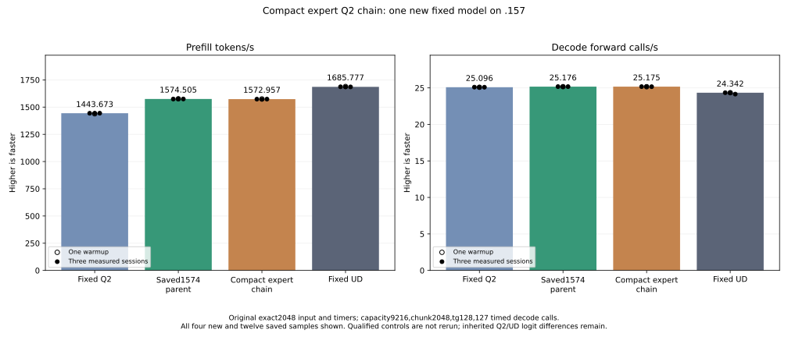
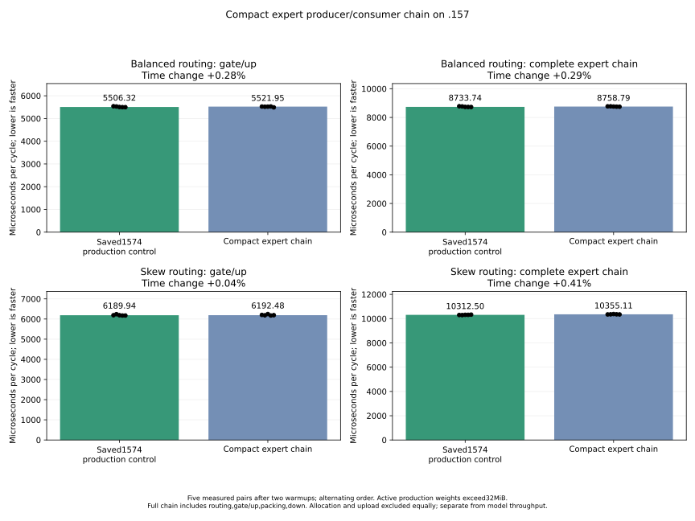

<!-- SPDX-License-Identifier: MIT -->
# Compact expert producer and consumer chain

The completed .157 experiment measures **1572.956730 PP / 25.17514880 TG**,
nominally **-0.098361% PP** against retained scaled-wave-pack 1574.505432 /
25.17589001. All three measured PP samples are below the saved parent range;
these historical cohorts do not establish a stable causal regression, but they
supply no reason to replace the parent. Keep scaled-wave-pack as the next
composition base and preserve this complete experiment.

All 21 complete parent model files, all 128 generated tokens and nine within-arm
comparisons match exactly. Independent routing and packing checks pass, with
96 exact numerical component pairs. Scalar decode arithmetic is unchanged;
its -0.002944% observed rate change is not assigned to this prefill layout.
Inherited F16 task quality and full context/concurrency parity remain open.
Fixed Q2/UD PP stays 1443.672867 / 1685.777092. The retained best still needs
another 7.067086% PP to reach that UD point. No comparator is rebuilt or rerun.

| Sample | Prefill seconds | Prefill tokens/s | Decode seconds | Decode calls/s |
| --- | ---: | ---: | ---: | ---: |
| Warmup | 1.300191221 | 1575.152921 | 5.047944643 | 25.15875450 |
| Measured 1 | 1.302006572 | 1572.956730 | 5.044657372 | 25.17514880 |
| Measured 2 | 1.303567949 | 1571.072687 | 5.041305511 | 25.19188724 |
| Measured 3 | 1.301707225 | 1573.318455 | 5.046715207 | 25.16488345 |

[Model result](../config/q2-compact-expert-chain-model-results.json),
[disposition](../config/q2-compact-expert-chain-disposition.json),
[final audit](../config/q2-compact-expert-chain-final-audit.json),
[all model samples](figures/q2-compact-expert-chain-model-wrapped.csv).

Host, component and model finish and collect before release at
2026-10-05T17:50:10.710664 UTC, SHA256
`88dcb8d8d4ef79e78ec412f4e346a63ae125b179d6c5e7cc2a538a0faddf9e5a`.
All 13 runtime commands exit zero; 469 artifacts include 432 full arrays.
The 80 fixtures, four manifests and 1028 provider files verify. Closure checks
1067 retired identities / 850 groups, empty KFD, four original free leases and
seven unchanged model stat tuples. Main/remote release-active-ready mirrors
match and core is notified. Model CPU/GPU peaks are 79.75/70 C including build;
no thermal stop. No Q2 job, reservation, waiter, restart or cleanup remains.
Further GPU work needs fresh coordinated admission.

The following describes the retained implementation and verification scope.

The previous layout gathered slot-major rows while packing and wrote padded
rows. The new gate/up producer instead writes compact logical expert-major
F32 rows. The original wave-owned packing kernel reads those rows contiguously,
and adapted Q2 down reads the same compact layout. Down still writes original
slot order, so weighted combination is unchanged. Actual GPU scatter order
within an expert may vary; equality must be checked after reconstructing the
permutation from each arm's saved device maps.

The existing routing prefix dispatch computes both padded map offsets and
logical activation offsets. Gate/up keeps the existing input token map and
16/48/64/128 tile arithmetic. Packing preserves the complete 640-value maximum,
dyadic scale and rounded half conversion. Down keeps logical 640/stored 768 tails
and 16/48/64 specializations. No new allocation, GPU dispatch or stream is added.
At 2048/top10, scaled half rows, inverse scales and 513 logical offsets occupy
26,298,372 bytes inside the existing 52,428,800-byte up scratch. The original
F32 gate allocation is unchanged. Same-stream last-reader ownership is retained;
public C ABI, persistent state and metrics are unchanged.

Same-flag production assembly preserves 162 prior instruction/operand/
resource bodies and adds eight kernels with zero private scratch. These are
one routing prefix, four gate/up and three down bodies. Successful compilation
does not prove output correctness or performance. The separate fixture compiles
for host and gfx1151; 136 launcher guards pass. Shared formatting retains inherited
failures rather than rewriting qualified source. The initial source-generator
anchor failure is preserved before its correction.

The completed component passes all 24 chain checks, 96 byte-exact numerical
comparisons and complete routing replays. Both device and offline independent
packing oracles pass. All three component commands exit 0; 436 artifacts include
432 full arrays. This establishes routing/layout correctness for the fixture,
not independent original-model task quality.

| Distribution | Scope | Parent us | Candidate us | Time change |
| --- | --- | ---: | ---: | ---: |
| Balanced | Gate/up | 5506.320318 | 5521.946589 | +0.283788% |
| Balanced | Complete expert chain | 8733.741124 | 8758.794149 | +0.286853% |
| Skew | Gate/up | 6189.942678 | 6192.475637 | +0.040921% |
| Skew | Complete expert chain | 10312.498728 | 10355.111440 | +0.413214% |

The full-chain component does not show a gain. Balanced sample ranges overlap;
all five skew candidate cycles exceed all five parent cycles. The original model
arm also completes, preserving the owner-requested performance check. This result
cannot be subtracted from the earlier packing/down fixture, which omits routing
and gate/up and has a different surrounding memory workload.

[Complete component replay](../config/q2-compact-expert-chain-component-results.json),
[every timing sample](figures/q2-compact-expert-chain-component.csv).

The GPU fixture covers twenty partial-token/gate-tile combinations plus before/
after replays of balanced and skew production routing. It saves 432 full arrays:
both five-map routing sets and four numerical outputs for all 24 cases. CPU
counts/prefixes and complete permutation identities independently check routing.
Every F32 gate, F16 activation, inverse scale and F16 down output is compared
after canonicalizing expert order. Scalar conversion checks every packing cell.
The offline analyzer separately reconstructs routing and conversion from saved
arrays, preserving signed-zero failures and actual command exits.

Gate/up and the complete routing/gate/up/packing/down cycle each receive two
warmups and five alternating measured pairs, three iterations per sample, for
56 timing records across the two production distributions. Active weights exceed
32 MiB MALL; allocations, upload and checking are excluded. A safe numerical or
timing rejection still permits the original model performance test. Guard,
nonfinite, unwritten-output or device failures stop further GPU work.

The completed model arm uses the unchanged original input/timers: 2048 prompt tokens,
128 outputs/127 timed decode calls, capacity 9216, chunk 2048, MTP off, greedy C1,
one warmup and three measured requests with 15-second cooldowns outside timing.
Only the new candidate is built/run; saved parent/Q2/UD evidence is reused.
Q4, context sweeps, cleanup, dependencies, tuning and deployment are excluded.

[Source](../config/q2-compact-expert-chain-source.json),
[static comparison](../config/q2-compact-expert-chain-static.json),
[frozen plan](../config/q2-compact-expert-chain-plan.json),
[fixture](../tests/q2_compact_expert_chain.hip),
[offline replay](../tools/analyze-q2-compact-expert-chain-component.py).
