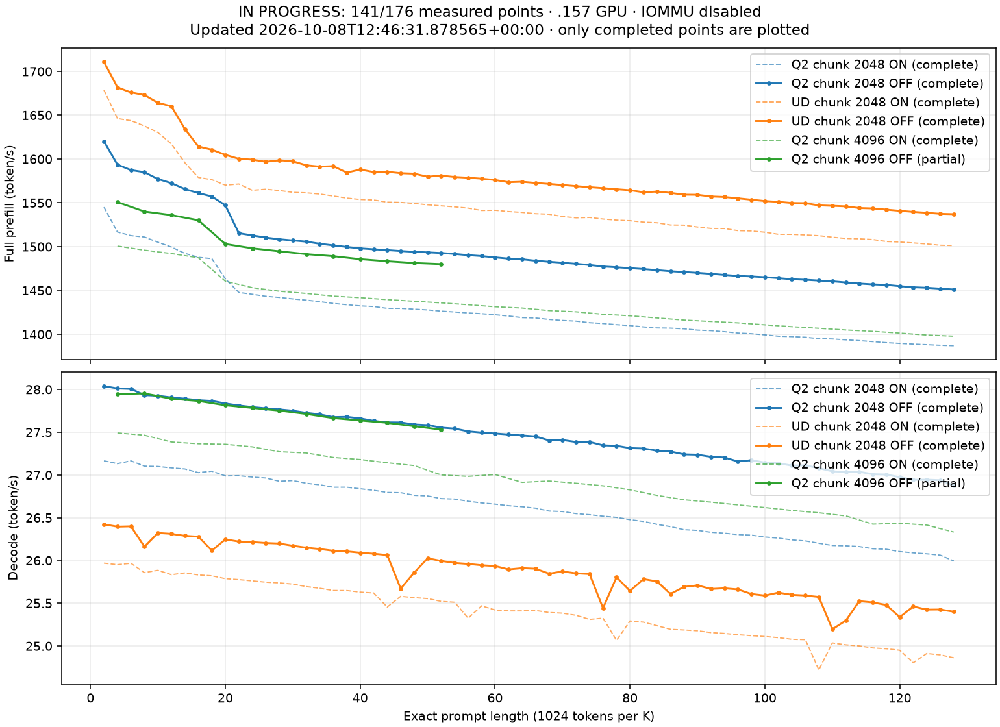

<!-- SPDX-License-Identifier: MIT -->

**Stopped by the owner on2026-10-08 at12:45:44 UTC.** These141 completed points
are retained; Q2 chunk4K is partial and chunk8K was not run. Collection, release
and independent closure pass. [Stop audit](../config/q2-counting-curve128-off-stop-audit.json).

# Q2 and UD curves: live partial results

IN PROGRESS. This file contains completed measured points only; it is not the final curve.
Updated: 2026-10-08T12:46:31.878565+00:00.
Completed measured points: 141/176. One warmup and one measured sample per point.
Exact counting prompt, full prefill from empty state, capacity133760, TG limit128, IOMMU disabled.
All rates are token/s. Every current row and phase duration is preserved in the local progress CSV.

| Arm | Prompt tokens | PP ON | PP OFF | PP delta % | TG ON | TG OFF | TG delta % | Full OFF prefill (s) | Generated tokens |
| --- | ---: | ---: | ---: | ---: | ---: | ---: | ---: | ---: | ---: |
| 00-q2-c2048 | 2048 | 1545.070140 | 1620.151390 | +4.859407 | 27.164658 | 28.038155 | +3.215564 | 1.264079402 | 128 |
| 00-q2-c2048 | 4096 | 1516.722975 | 1593.591204 | +5.068047 | 27.131600 | 28.010770 | +3.240392 | 2.570295311 | 128 |
| 00-q2-c2048 | 6144 | 1512.585016 | 1587.333908 | +4.941798 | 27.164504 | 28.004935 | +3.093856 | 3.870641186 | 128 |
| 00-q2-c2048 | 8192 | 1510.995209 | 1584.985168 | +4.896770 | 27.102334 | 27.932630 | +3.063558 | 5.168502624 | 128 |
| 00-q2-c2048 | 10240 | 1505.087942 | 1577.200488 | +4.791251 | 27.098677 | 27.925413 | +3.050835 | 6.492516377 | 128 |
| 00-q2-c2048 | 12288 | 1499.524232 | 1572.454344 | +4.863550 | 27.082360 | 27.904980 | +3.037474 | 7.814535313 | 128 |
| 00-q2-c2048 | 14336 | 1492.326129 | 1565.746257 | +4.919845 | 27.069313 | 27.890905 | +3.035143 | 9.156017420 | 128 |
| 00-q2-c2048 | 16384 | 1487.843307 | 1561.113284 | +4.924576 | 27.026295 | 27.873346 | +3.134174 | 10.495074360 | 128 |
| 00-q2-c2048 | 18432 | 1486.332917 | 1557.301484 | +4.774742 | 27.043600 | 27.864683 | +3.036143 | 11.835858499 | 128 |
| 00-q2-c2048 | 20480 | 1463.263950 | 1547.139702 | +5.732100 | 26.988087 | 27.834660 | +3.136840 | 13.237330778 | 128 |
| 00-q2-c2048 | 22528 | 1447.713033 | 1515.316126 | +4.669647 | 26.990458 | 27.811092 | +3.040458 | 14.866864815 | 128 |
| 00-q2-c2048 | 24576 | 1445.649277 | 1512.887355 | +4.651064 | 26.974822 | 27.792787 | +3.032328 | 16.244434801 | 128 |
| 00-q2-c2048 | 26624 | 1443.326227 | 1510.346320 | +4.643447 | 26.963781 | 27.777976 | +3.019588 | 17.627745142 | 128 |
| 00-q2-c2048 | 28672 | 1442.047427 | 1508.466618 | +4.605895 | 26.925513 | 27.765481 | +3.119598 | 19.007381179 | 128 |
| 00-q2-c2048 | 30720 | 1440.363555 | 1507.105570 | +4.633692 | 26.933538 | 27.750424 | +3.032968 | 20.383442677 | 128 |
| 00-q2-c2048 | 32768 | 1438.955211 | 1505.724418 | +4.640117 | 26.902196 | 27.725635 | +3.060864 | 21.762282401 | 128 |
| 00-q2-c2048 | 34816 | 1437.212819 | 1503.296505 | +4.598045 | 26.884098 | 27.706811 | +3.060222 | 23.159769136 | 128 |
| 00-q2-c2048 | 36864 | 1435.201735 | 1501.466850 | +4.617129 | 26.855837 | 27.675387 | +3.051662 | 24.551990608 | 128 |
| 00-q2-c2048 | 38912 | 1433.763851 | 1499.639526 | +4.594597 | 26.856394 | 27.678299 | +3.060370 | 25.947568957 | 128 |
| 00-q2-c2048 | 40960 | 1432.413928 | 1498.053614 | +4.582452 | 26.837839 | 27.660524 | +3.065395 | 27.342145588 | 128 |
| 00-q2-c2048 | 43008 | 1431.714096 | 1497.028420 | +4.561967 | 26.820217 | 27.630923 | +3.022740 | 28.728913513 | 128 |
| 00-q2-c2048 | 45056 | 1429.600383 | 1496.060926 | +4.648890 | 26.794944 | 27.614102 | +3.057135 | 30.116420546 | 128 |
| 00-q2-c2048 | 47104 | 1429.593275 | 1495.025397 | +4.576975 | 26.792382 | 27.612965 | +3.062746 | 31.507157059 | 128 |
| 00-q2-c2048 | 49152 | 1428.654488 | 1494.147388 | +4.584236 | 26.761554 | 27.589466 | +3.093661 | 32.896353070 | 128 |
| 00-q2-c2048 | 51200 | 1427.782689 | 1493.488705 | +4.601962 | 26.753760 | 27.581916 | +3.095476 | 34.282147452 | 128 |
| 00-q2-c2048 | 53248 | 1426.400964 | 1492.736980 | +4.650587 | 26.723187 | 27.552713 | +3.104144 | 35.671388007 | 128 |
| 00-q2-c2048 | 55296 | 1425.428229 | 1491.701054 | +4.649327 | 26.717667 | 27.541370 | +3.082988 | 37.069089583 | 128 |
| 00-q2-c2048 | 57344 | 1424.348309 | 1490.296261 | +4.630044 | 26.692141 | 27.509115 | +3.060726 | 38.478255292 | 128 |
| 00-q2-c2048 | 59392 | 1423.464456 | 1489.263319 | +4.622445 | 26.672306 | 27.494289 | +3.081783 | 39.880120092 | 128 |
| 00-q2-c2048 | 61440 | 1422.256455 | 1487.762121 | +4.605756 | 26.658173 | 27.484036 | +3.097973 | 41.296924510 | 128 |
| 00-q2-c2048 | 63488 | 1420.856714 | 1486.356810 | +4.609902 | 26.640142 | 27.471724 | +3.121536 | 42.713835307 | 128 |
| 00-q2-c2048 | 65536 | 1419.044686 | 1485.568199 | +4.687908 | 26.627924 | 27.460923 | +3.128292 | 44.115106963 | 128 |
| 00-q2-c2048 | 67584 | 1418.619847 | 1483.943948 | +4.604764 | 26.611250 | 27.449331 | +3.149349 | 45.543499194 | 128 |
| 00-q2-c2048 | 69632 | 1416.937923 | 1482.748295 | +4.644549 | 26.577248 | 27.402525 | +3.105201 | 46.961443319 | 128 |
| 00-q2-c2048 | 71680 | 1415.774020 | 1481.660620 | +4.653751 | 26.571631 | 27.407574 | +3.145996 | 48.378150199 | 128 |
| 00-q2-c2048 | 73728 | 1415.003228 | 1480.388068 | +4.620826 | 26.547308 | 27.384519 | +3.153658 | 49.803157425 | 128 |
| 00-q2-c2048 | 75776 | 1413.195625 | 1479.106627 | +4.663969 | 26.534930 | 27.385344 | +3.204884 | 51.230924539 | 128 |
| 00-q2-c2048 | 77824 | 1412.273612 | 1477.364466 | +4.608941 | 26.517443 | 27.345591 | +3.123030 | 52.677590268 | 128 |
| 00-q2-c2048 | 79872 | 1410.958935 | 1476.511366 | +4.645949 | 26.503622 | 27.340198 | +3.156460 | 54.095079695 | 128 |
| 00-q2-c2048 | 81920 | 1409.947925 | 1475.467547 | +4.646953 | 26.476622 | 27.312981 | +3.158856 | 55.521383825 | 128 |
| 00-q2-c2048 | 83968 | 1408.411527 | 1474.474416 | +4.690596 | 26.455849 | 27.308580 | +3.223223 | 56.947749704 | 128 |
| 00-q2-c2048 | 86016 | 1407.266377 | 1473.220746 | +4.686701 | 26.421703 | 27.282533 | +3.258041 | 58.386362131 | 128 |
| 00-q2-c2048 | 88064 | 1407.026396 | 1471.959028 | +4.614884 | 26.395680 | 27.273518 | +3.325689 | 59.827752222 | 128 |
| 00-q2-c2048 | 90112 | 1406.268082 | 1471.081509 | +4.608896 | 26.359497 | 27.240237 | +3.341265 | 61.255613272 | 128 |
| 00-q2-c2048 | 92160 | 1404.729763 | 1470.112739 | +4.654488 | 26.351408 | 27.236098 | +3.357278 | 62.689069732 | 128 |
| 00-q2-c2048 | 94208 | 1404.173563 | 1469.000462 | +4.616730 | 26.329260 | 27.211857 | +3.352154 | 64.130680971 | 128 |
| 00-q2-c2048 | 96256 | 1402.951371 | 1467.770826 | +4.620221 | 26.318520 | 27.203558 | +3.362798 | 65.579720144 | 128 |
| 00-q2-c2048 | 98304 | 1401.387932 | 1466.601278 | +4.653483 | 26.302261 | 27.157275 | +3.250722 | 67.028442886 | 128 |
| 00-q2-c2048 | 100352 | 1400.646453 | 1466.016195 | +4.667112 | 26.295553 | 27.172192 | +3.333790 | 68.452176972 | 128 |
| 00-q2-c2048 | 102400 | 1399.319067 | 1465.152552 | +4.704680 | 26.273981 | 27.144357 | +3.312688 | 69.890333189 | 128 |
| 00-q2-c2048 | 104448 | 1397.813895 | 1464.093313 | +4.741648 | 26.261709 | 27.136310 | +3.330331 | 71.339715202 | 128 |
| 00-q2-c2048 | 106496 | 1397.330383 | 1462.786814 | +4.684392 | 26.240632 | 27.108616 | +3.307788 | 72.803500133 | 128 |
| 00-q2-c2048 | 108544 | 1396.616207 | 1462.220650 | +4.697385 | 26.228488 | 27.111704 | +3.367393 | 74.232298656 | 128 |
| 00-q2-c2048 | 110592 | 1395.017596 | 1461.316978 | +4.752584 | 26.201173 | 27.078705 | +3.349207 | 75.679679146 | 128 |
| 00-q2-c2048 | 112640 | 1394.678034 | 1460.461503 | +4.716749 | 26.174863 | 27.041799 | +3.312094 | 77.126305479 | 128 |
| 00-q2-c2048 | 114688 | 1393.668602 | 1459.139581 | +4.697744 | 26.170870 | 27.033923 | +3.297763 | 78.599745711 | 128 |
| 00-q2-c2048 | 116736 | 1392.759693 | 1457.911036 | +4.677860 | 26.162343 | 27.036065 | +3.339617 | 80.070729390 | 128 |
| 00-q2-c2048 | 118784 | 1391.652812 | 1456.972785 | +4.693697 | 26.136986 | 27.008282 | +3.333574 | 81.527947028 | 128 |
| 00-q2-c2048 | 120832 | 1390.439359 | 1456.378199 | +4.742302 | 26.130753 | 27.004328 | +3.343090 | 82.967460029 | 128 |
| 00-q2-c2048 | 122880 | 1389.566949 | 1454.928737 | +4.703752 | 26.103410 | 26.972995 | +3.331311 | 84.457744836 | 128 |
| 00-q2-c2048 | 124928 | 1388.785278 | 1453.682574 | +4.672954 | 26.088752 | 26.942270 | +3.271596 | 85.938981626 | 128 |
| 00-q2-c2048 | 126976 | 1388.117418 | 1453.098399 | +4.681231 | 26.077348 | 26.944131 | +3.323892 | 87.382932990 | 128 |
| 00-q2-c2048 | 129024 | 1387.439925 | 1452.131575 | +4.662663 | 26.061754 | 26.938053 | +3.362397 | 88.851452734 | 128 |
| 00-q2-c2048 | 131072 | 1386.957281 | 1451.148874 | +4.628231 | 25.994528 | 26.876950 | +3.394643 | 90.322917486 | 128 |
| 01-ud-c2048 | 2048 | 1678.671022 | 1710.815535 | +1.914879 | 25.968508 | 26.421740 | +1.745314 | 1.197089901 | 128 |
| 01-ud-c2048 | 4096 | 1646.203158 | 1681.781934 | +2.161263 | 25.950960 | 26.394851 | +1.710500 | 2.435511952 | 128 |
| 01-ud-c2048 | 6144 | 1643.820950 | 1676.004882 | +1.957873 | 25.967222 | 26.398835 | +1.662147 | 3.665860444 | 128 |
| 01-ud-c2048 | 8192 | 1637.772370 | 1673.002120 | +2.151077 | 25.857949 | 26.160671 | +1.170711 | 4.896586742 | 128 |
| 01-ud-c2048 | 10240 | 1630.256632 | 1664.215943 | +2.083065 | 25.885085 | 26.321272 | +1.685091 | 6.153047653 | 128 |
| 01-ud-c2048 | 12288 | 1617.288500 | 1660.146871 | +2.650014 | 25.833435 | 26.310919 | +1.848319 | 7.401754755 | 128 |
| 01-ud-c2048 | 14336 | 1595.690646 | 1634.204166 | +2.413596 | 25.854591 | 26.287865 | +1.675811 | 8.772465705 | 128 |
| 01-ud-c2048 | 16384 | 1578.970001 | 1614.267875 | +2.235500 | 25.830839 | 26.277838 | +1.730483 | 10.149492692 | 128 |
| 01-ud-c2048 | 18432 | 1576.433247 | 1610.674386 | +2.172064 | 25.820739 | 26.116319 | +1.144739 | 11.443653766 | 128 |
| 01-ud-c2048 | 20480 | 1570.204256 | 1604.734490 | +2.199092 | 25.787276 | 26.246034 | +1.779011 | 12.762235823 | 128 |
| 01-ud-c2048 | 22528 | 1571.492231 | 1600.246294 | +1.829730 | 25.776103 | 26.220887 | +1.725567 | 14.077832945 | 128 |
| 01-ud-c2048 | 24576 | 1564.327477 | 1599.285154 | +2.234678 | 25.761263 | 26.215114 | +1.761757 | 15.366865590 | 128 |
| 01-ud-c2048 | 26624 | 1565.550030 | 1596.800952 | +1.996162 | 25.745935 | 26.203668 | +1.777881 | 16.673336756 | 128 |
| 01-ud-c2048 | 28672 | 1564.077102 | 1598.563833 | +2.204925 | 25.737427 | 26.197753 | +1.788546 | 17.936099520 | 128 |
| 01-ud-c2048 | 30720 | 1561.954503 | 1597.431609 | +2.271328 | 25.723867 | 26.171601 | +1.740540 | 19.230870247 | 128 |
| 01-ud-c2048 | 32768 | 1561.413732 | 1592.861259 | +2.014042 | 25.694461 | 26.149564 | +1.771210 | 20.571785399 | 128 |
| 01-ud-c2048 | 34816 | 1560.022712 | 1591.260356 | +2.002384 | 25.675124 | 26.133761 | +1.786308 | 21.879511961 | 128 |
| 01-ud-c2048 | 36864 | 1557.785086 | 1591.852481 | +2.186912 | 25.648989 | 26.113203 | +1.809873 | 23.157924775 | 128 |
| 01-ud-c2048 | 38912 | 1555.439522 | 1584.508936 | +1.868887 | 25.648541 | 26.106128 | +1.784065 | 24.557766202 | 128 |
| 01-ud-c2048 | 40960 | 1553.798064 | 1588.003284 | +2.201394 | 25.630104 | 26.090352 | +1.795732 | 25.793397534 | 128 |
| 01-ud-c2048 | 43008 | 1553.227349 | 1585.103696 | +2.052265 | 25.619686 | 26.078469 | +1.790744 | 27.132609757 | 128 |
| 01-ud-c2048 | 45056 | 1550.770153 | 1585.434323 | +2.235287 | 25.455752 | 26.063167 | +2.386161 | 28.418711096 | 128 |
| 01-ud-c2048 | 47104 | 1550.487848 | 1583.843834 | +2.151322 | 25.580923 | 25.670811 | +0.351385 | 29.740305819 | 128 |
| 01-ud-c2048 | 49152 | 1549.294007 | 1583.297777 | +2.194791 | 25.565489 | 25.858095 | +1.144535 | 31.044065574 | 128 |
| 01-ud-c2048 | 51200 | 1547.767224 | 1579.850593 | +2.072881 | 25.554620 | 26.025437 | +1.842396 | 32.408127847 | 128 |
| 01-ud-c2048 | 53248 | 1546.573629 | 1581.096477 | +2.232215 | 25.522048 | 25.994790 | +1.852290 | 33.677894285 | 128 |
| 01-ud-c2048 | 55296 | 1545.408200 | 1579.507230 | +2.206474 | 25.511886 | 25.971084 | +1.799936 | 35.008386752 | 128 |
| 01-ud-c2048 | 57344 | 1543.982126 | 1578.702671 | +2.248766 | 25.325133 | 25.959638 | +2.505436 | 36.323495891 | 128 |
| 01-ud-c2048 | 59392 | 1541.278557 | 1577.576040 | +2.355024 | 25.469567 | 25.944166 | +1.863396 | 37.647630593 | 128 |
| 01-ud-c2048 | 61440 | 1541.526906 | 1576.101933 | +2.242908 | 25.420684 | 25.935122 | +2.023696 | 38.982250276 | 128 |
| 01-ud-c2048 | 63488 | 1540.051195 | 1573.551462 | +2.175270 | 25.410644 | 25.895533 | +1.908213 | 40.346948635 | 128 |
| 01-ud-c2048 | 65536 | 1539.065788 | 1574.062529 | +2.273895 | 25.410857 | 25.910133 | +1.964812 | 41.634940664 | 128 |
| 01-ud-c2048 | 67584 | 1537.586417 | 1572.716776 | +2.284773 | 25.415416 | 25.903582 | +1.920749 | 42.972772357 | 128 |
| 01-ud-c2048 | 69632 | 1537.002583 | 1571.589401 | +2.250277 | 25.391966 | 25.846060 | +1.788338 | 44.306738106 | 128 |
| 01-ud-c2048 | 71680 | 1534.365648 | 1570.347583 | +2.345069 | 25.384142 | 25.871518 | +1.920003 | 45.645945375 | 128 |
| 01-ud-c2048 | 73728 | 1532.903546 | 1569.103970 | +2.361559 | 25.359054 | 25.849496 | +1.933990 | 46.987326156 | 128 |
| 01-ud-c2048 | 75776 | 1533.336410 | 1567.866726 | +2.251973 | 25.311338 | 25.841073 | +2.092878 | 48.330638540 | 128 |
| 01-ud-c2048 | 77824 | 1531.500789 | 1566.796675 | +2.304660 | 25.325675 | 25.443115 | +0.463717 | 49.670771749 | 128 |
| 01-ud-c2048 | 79872 | 1530.269992 | 1565.530635 | +2.304211 | 25.066026 | 25.804100 | +2.944521 | 51.019122967 | 128 |
| 01-ud-c2048 | 81920 | 1529.579897 | 1564.404579 | +2.276748 | 25.292619 | 25.643983 | +1.389197 | 52.364970750 | 128 |
| 01-ud-c2048 | 83968 | 1527.962864 | 1562.096381 | +2.233923 | 25.278799 | 25.782031 | +1.990728 | 53.753405357 | 128 |
| 01-ud-c2048 | 86016 | 1527.234351 | 1562.870512 | +2.333379 | 25.237595 | 25.755213 | +2.050979 | 55.037189163 | 128 |
| 01-ud-c2048 | 88064 | 1524.711928 | 1561.382034 | +2.405051 | 25.195594 | 25.608754 | +1.639809 | 56.401315045 | 128 |
| 01-ud-c2048 | 90112 | 1524.527215 | 1559.308508 | +2.281448 | 25.187598 | 25.691328 | +1.999915 | 57.789718671 | 128 |
| 01-ud-c2048 | 92160 | 1522.446724 | 1559.169268 | +2.412074 | 25.178294 | 25.708946 | +2.107577 | 59.108399514 | 128 |
| 01-ud-c2048 | 94208 | 1520.805352 | 1557.252609 | +2.396576 | 25.157135 | 25.667271 | +2.027800 | 60.496286519 | 128 |
| 01-ud-c2048 | 96256 | 1520.683797 | 1556.679589 | +2.367079 | 25.147011 | 25.674533 | +2.097752 | 61.834176213 | 128 |
| 01-ud-c2048 | 98304 | 1518.261949 | 1555.169216 | +2.430889 | 25.131757 | 25.661732 | +2.108787 | 63.211127742 | 128 |
| 01-ud-c2048 | 100352 | 1517.908147 | 1553.580018 | +2.350068 | 25.121115 | 25.608104 | +1.938567 | 64.594033681 | 128 |
| 01-ud-c2048 | 102400 | 1516.459212 | 1552.055715 | +2.347343 | 25.111286 | 25.589843 | +1.905744 | 65.977012955 | 128 |
| 01-ud-c2048 | 104448 | 1514.085622 | 1551.145087 | +2.447647 | 25.098020 | 25.624419 | +2.097371 | 67.336060865 | 128 |
| 01-ud-c2048 | 106496 | 1514.027436 | 1549.813994 | +2.363666 | 25.078633 | 25.598582 | +2.073273 | 68.715342875 | 128 |
| 01-ud-c2048 | 108544 | 1513.354023 | 1549.584788 | +2.394071 | 25.074337 | 25.590718 | +2.059400 | 70.047151239 | 128 |
| 01-ud-c2048 | 110592 | 1512.507122 | 1547.123636 | +2.288684 | 24.720845 | 25.573077 | +3.447421 | 71.482328509 | 128 |
| 01-ud-c2048 | 112640 | 1510.769990 | 1546.600555 | +2.371676 | 25.035779 | 25.195693 | +0.638742 | 72.830699316 | 128 |
| 01-ud-c2048 | 114688 | 1509.337188 | 1545.996217 | +2.428816 | 25.014024 | 25.297434 | +1.133004 | 74.183881400 | 128 |
| 01-ud-c2048 | 116736 | 1508.968464 | 1544.063411 | +2.325757 | 25.001487 | 25.524669 | +2.092600 | 75.603112646 | 128 |
| 01-ud-c2048 | 118784 | 1508.117838 | 1543.647738 | +2.355910 | 24.977615 | 25.509493 | +2.129419 | 76.950198606 | 128 |
| 01-ud-c2048 | 120832 | 1505.892560 | 1542.247565 | +2.414183 | 24.968342 | 25.479379 | +2.046738 | 78.347992082 | 128 |
| 01-ud-c2048 | 122880 | 1505.300663 | 1540.884923 | +2.363930 | 24.950463 | 25.337519 | +1.551297 | 79.746383484 | 128 |
| 01-ud-c2048 | 124928 | 1504.249828 | 1539.663700 | +2.354255 | 24.803923 | 25.462911 | +2.656790 | 81.139796968 | 128 |
| 01-ud-c2048 | 126976 | 1503.093059 | 1538.657850 | +2.366107 | 24.912431 | 25.425229 | +2.058405 | 82.523869760 | 128 |
| 01-ud-c2048 | 129024 | 1501.623441 | 1537.472788 | +2.387373 | 24.896017 | 25.426747 | +2.131787 | 83.919534076 | 128 |
| 01-ud-c2048 | 131072 | 1501.256197 | 1537.084160 | +2.386532 | 24.862537 | 25.401211 | +2.166610 | 85.273144730 | 128 |
| 02-q2-c4096 | 4096 | 1500.650195 | 1550.801240 | +3.341954 | 27.490489 | 27.943896 | +1.649323 | 2.641215325 | 128 |
| 02-q2-c4096 | 8192 | 1495.965087 | 1540.091012 | +2.949663 | 27.463696 | 27.952238 | +1.778864 | 5.319166163 | 128 |
| 02-q2-c4096 | 12288 | 1492.151185 | 1536.038330 | +2.941200 | 27.384726 | 27.889917 | +1.844791 | 7.999800369 | 128 |
| 02-q2-c4096 | 16384 | 1487.329852 | 1530.084939 | +2.874620 | 27.363976 | 27.863924 | +1.827030 | 10.707902274 | 128 |
| 02-q2-c4096 | 20480 | 1460.593608 | 1502.991030 | +2.902753 | 27.358001 | 27.813419 | +1.664660 | 13.626162489 | 128 |
| 02-q2-c4096 | 24576 | 1453.178095 | 1498.098678 | +3.091196 | 27.327596 | 27.782762 | +1.665590 | 16.404793863 | 128 |
| 02-q2-c4096 | 28672 | 1449.123494 | 1494.730783 | +3.147233 | 27.270954 | 27.751871 | +1.763476 | 19.182049592 | 128 |
| 02-q2-c4096 | 32768 | 1446.613228 | 1491.459112 | +3.100060 | 27.256272 | 27.711975 | +1.671920 | 21.970431331 | 128 |
| 02-q2-c4096 | 36864 | 1443.522294 | 1489.149800 | +3.160845 | 27.203943 | 27.663604 | +1.689682 | 24.755064942 | 128 |
| 02-q2-c4096 | 40960 | 1441.754301 | 1485.733691 | +3.050408 | 27.179655 | 27.635988 | +1.678949 | 27.568870690 | 128 |
| 02-q2-c4096 | 45056 | 1439.537620 | 1483.381054 | +3.045661 | 27.141796 | 27.608790 | +1.720572 | 30.373854289 | 128 |
| 02-q2-c4096 | 49152 | 1437.708917 | 1481.345075 | +3.035118 | 27.109241 | 27.569159 | +1.696537 | 33.180655090 | 128 |
| 02-q2-c4096 | 53248 | 1435.850857 | 1480.095774 | +3.081442 | 26.999551 | 27.529671 | +1.963437 | 35.976050302 | 128 |

