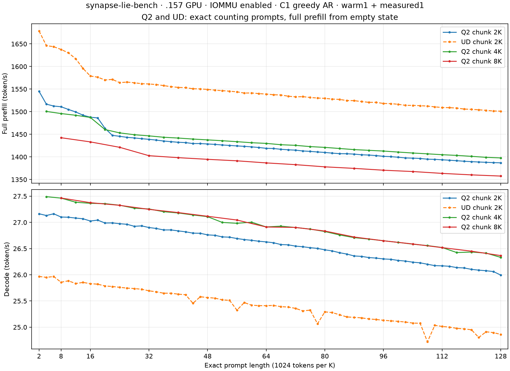

<!-- SPDX-License-Identifier: MIT -->

# Completed live view: Q2 and UD curves through 128K

All 176 requested points complete on the .157 GPU with IOMMU enabled: 112 Q2 and 64 UD.
Retained numerical executable; exact repeated counting chat; capacity 133760;
C1 reactive greedy AR, MTP off, no prefix-cache restore, TG limit 128.
One warmup and one measured repetition per point, with no inserted pause.
Each point starts empty and times all its chunks between initial/final monotonic timestamps.
Each model stays loaded through its curve. Q2 chunks: 2048/4096/8192; UD chunk: 2048.
A dash means that prompt length is not a multiple of the corresponding chunk size.

| Exact prompt tokens | Q2 PP2K | Q2 TG2K | UD PP2K | UD TG2K | Q2 PP4K | Q2 TG4K | Q2 PP8K | Q2 TG8K |
| ---: | ---: | ---: | ---: | ---: | ---: | ---: | ---: | ---: |
| 2048 | 1545.070140 | 27.164658 | 1678.671022 | 25.968508 | — | — | — | — |
| 4096 | 1516.722975 | 27.131600 | 1646.203158 | 25.950960 | 1500.650195 | 27.490489 | — | — |
| 6144 | 1512.585016 | 27.164504 | 1643.820950 | 25.967222 | — | — | — | — |
| 8192 | 1510.995209 | 27.102334 | 1637.772370 | 25.857949 | 1495.965087 | 27.463696 | 1442.484823 | 27.465426 |
| 10240 | 1505.087942 | 27.098677 | 1630.256632 | 25.885085 | — | — | — | — |
| 12288 | 1499.524232 | 27.082360 | 1617.288500 | 25.833435 | 1492.151185 | 27.384726 | — | — |
| 14336 | 1492.326129 | 27.069313 | 1595.690646 | 25.854591 | — | — | — | — |
| 16384 | 1487.843307 | 27.026295 | 1578.970001 | 25.830839 | 1487.329852 | 27.363976 | 1433.266101 | 27.376277 |
| 18432 | 1486.332917 | 27.043600 | 1576.433247 | 25.820739 | — | — | — | — |
| 20480 | 1463.263950 | 26.988087 | 1570.204256 | 25.787276 | 1460.593608 | 27.358001 | — | — |
| 22528 | 1447.713033 | 26.990458 | 1571.492231 | 25.776103 | — | — | — | — |
| 24576 | 1445.649277 | 26.974822 | 1564.327477 | 25.761263 | 1453.178095 | 27.327596 | 1421.279360 | 27.325585 |
| 26624 | 1443.326227 | 26.963781 | 1565.550030 | 25.745935 | — | — | — | — |
| 28672 | 1442.047427 | 26.925513 | 1564.077102 | 25.737427 | 1449.123494 | 27.270954 | — | — |
| 30720 | 1440.363555 | 26.933538 | 1561.954503 | 25.723867 | — | — | — | — |
| 32768 | 1438.955211 | 26.902196 | 1561.413732 | 25.694461 | 1446.613228 | 27.256272 | 1402.729516 | 27.248724 |
| 34816 | 1437.212819 | 26.884098 | 1560.022712 | 25.675124 | — | — | — | — |
| 36864 | 1435.201735 | 26.855837 | 1557.785086 | 25.648989 | 1443.522294 | 27.203943 | — | — |
| 38912 | 1433.763851 | 26.856394 | 1555.439522 | 25.648541 | — | — | — | — |
| 40960 | 1432.413928 | 26.837839 | 1553.798064 | 25.630104 | 1441.754301 | 27.179655 | 1398.366022 | 27.187265 |
| 43008 | 1431.714096 | 26.820217 | 1553.227349 | 25.619686 | — | — | — | — |
| 45056 | 1429.600383 | 26.794944 | 1550.770153 | 25.455752 | 1439.537620 | 27.141796 | — | — |
| 47104 | 1429.593275 | 26.792382 | 1550.487848 | 25.580923 | — | — | — | — |
| 49152 | 1428.654488 | 26.761554 | 1549.294007 | 25.565489 | 1437.708917 | 27.109241 | 1394.715396 | 27.116636 |
| 51200 | 1427.782689 | 26.753760 | 1547.767224 | 25.554620 | — | — | — | — |
| 53248 | 1426.400964 | 26.723187 | 1546.573629 | 25.522048 | 1435.850857 | 26.999551 | — | — |
| 55296 | 1425.428229 | 26.717667 | 1545.408200 | 25.511886 | — | — | — | — |
| 57344 | 1424.348309 | 26.692141 | 1543.982126 | 25.325133 | 1433.740404 | 26.982825 | 1391.408322 | 27.045005 |
| 59392 | 1423.464456 | 26.672306 | 1541.278557 | 25.469567 | — | — | — | — |
| 61440 | 1422.256455 | 26.658173 | 1541.526906 | 25.420684 | 1431.442184 | 27.004117 | — | — |
| 63488 | 1420.856714 | 26.640142 | 1540.051195 | 25.410644 | — | — | — | — |
| 65536 | 1419.044686 | 26.627924 | 1539.065788 | 25.410857 | 1429.961499 | 26.913017 | 1386.792104 | 26.912048 |
| 67584 | 1418.619847 | 26.611250 | 1537.586417 | 25.415416 | — | — | — | — |
| 69632 | 1416.937923 | 26.577248 | 1537.002583 | 25.391966 | 1427.023486 | 26.928382 | — | — |
| 71680 | 1415.774020 | 26.571631 | 1534.365648 | 25.384142 | — | — | — | — |
| 73728 | 1415.003228 | 26.547308 | 1532.903546 | 25.359054 | 1425.621471 | 26.902217 | 1382.910458 | 26.904245 |
| 75776 | 1413.195625 | 26.534930 | 1533.336410 | 25.311338 | — | — | — | — |
| 77824 | 1412.273612 | 26.517443 | 1531.500789 | 25.325675 | 1422.840530 | 26.872288 | — | — |
| 79872 | 1410.958935 | 26.503622 | 1530.269992 | 25.066026 | — | — | — | — |
| 81920 | 1409.947925 | 26.476622 | 1529.579897 | 25.292619 | 1421.115890 | 26.825406 | 1378.087947 | 26.835147 |
| 83968 | 1408.411527 | 26.455849 | 1527.962864 | 25.278799 | — | — | — | — |
| 86016 | 1407.266377 | 26.421703 | 1527.234351 | 25.237595 | 1418.659356 | 26.760626 | — | — |
| 88064 | 1407.026396 | 26.395680 | 1524.711928 | 25.195594 | — | — | — | — |
| 90112 | 1406.268082 | 26.359497 | 1524.527215 | 25.187598 | 1416.212663 | 26.708888 | 1374.680000 | 26.720782 |
| 92160 | 1404.729763 | 26.351408 | 1522.446724 | 25.178294 | — | — | — | — |
| 94208 | 1404.173563 | 26.329260 | 1520.805352 | 25.157135 | 1414.605253 | 26.681709 | — | — |
| 96256 | 1402.951371 | 26.318520 | 1520.683797 | 25.147011 | — | — | — | — |
| 98304 | 1401.387932 | 26.302261 | 1518.261949 | 25.131757 | 1413.000919 | 26.649719 | 1370.619078 | 26.649141 |
| 100352 | 1400.646453 | 26.295553 | 1517.908147 | 25.121115 | — | — | — | — |
| 102400 | 1399.319067 | 26.273981 | 1516.459212 | 25.111286 | 1410.779639 | 26.618413 | — | — |
| 104448 | 1397.813895 | 26.261709 | 1514.085622 | 25.098020 | — | — | — | — |
| 106496 | 1397.330383 | 26.240632 | 1514.027436 | 25.078633 | 1408.651882 | 26.584797 | 1367.701619 | 26.588171 |
| 108544 | 1396.616207 | 26.228488 | 1513.354023 | 25.074337 | — | — | — | — |
| 110592 | 1395.017596 | 26.201173 | 1512.507122 | 24.720845 | 1406.856461 | 26.557181 | — | — |
| 112640 | 1394.678034 | 26.174863 | 1510.769990 | 25.035779 | — | — | — | — |
| 114688 | 1393.668602 | 26.170870 | 1509.337188 | 25.014024 | 1404.908683 | 26.520830 | 1363.600575 | 26.518392 |
| 116736 | 1392.759693 | 26.162343 | 1508.968464 | 25.001487 | — | — | — | — |
| 118784 | 1391.652812 | 26.136986 | 1508.117838 | 24.977615 | 1403.378536 | 26.424323 | — | — |
| 120832 | 1390.439359 | 26.130753 | 1505.892560 | 24.968342 | — | — | — | — |
| 122880 | 1389.566949 | 26.103410 | 1505.300663 | 24.950463 | 1401.328808 | 26.434302 | 1360.307505 | 26.450628 |
| 124928 | 1388.785278 | 26.088752 | 1504.249828 | 24.803923 | — | — | — | — |
| 126976 | 1388.117418 | 26.077348 | 1503.093059 | 24.912431 | 1399.124813 | 26.413910 | — | — |
| 129024 | 1387.439925 | 26.061754 | 1501.623441 | 24.896017 | — | — | — | — |
| 131072 | 1386.957281 | 25.994528 | 1501.256197 | 24.862537 | 1397.800735 | 26.332016 | 1357.680500 | 26.366539 |

All rates are token/s. [Exact CSV with complete phase durations and warmups](figures/q2-counting-curve128.csv).
Full TG128 measured points: 176/176.
UD or larger-chunk measured continuations differing from Q2 chunk2K at the same input: 0.
Identical physical inputs are verified at every common prompt length.
Counting continuations alone do not establish broad model quality or numerical equivalence.
Historical fixed-2K and incremental/cached-depth results remain separate, unchanged records.

[PNG](figures/q2-counting-curve128.png), [SVG](figures/q2-counting-curve128.svg).
