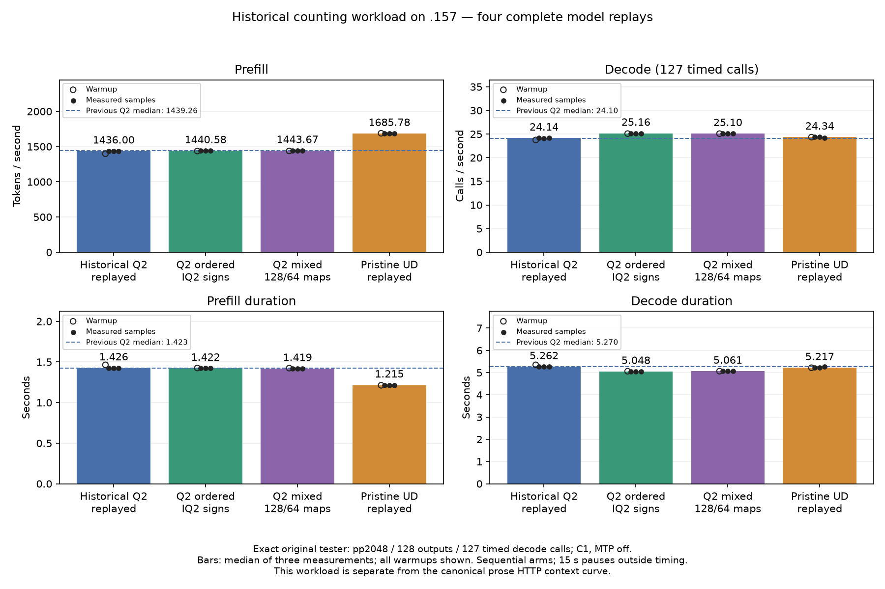

<!-- SPDX-License-Identifier: MIT -->
# Historical counting regression control

The owner-confirmed short-prefill comparison remains **1443.672867 Q2 /
1685.777092 UD** from the completed replay below. Its immutable identities and
all three measured samples are retained in the
[fixed reference](../config/q2-fixed-prefill-reference.json). Subsequent prose
diagnostics do not replace these values or establish improvement against them.

The retained 1439.264 Q2 and 1666.902 UD prefill rates use the exact-2048
counting workload and its direct-executor timer. The lower rates on the
canonical prose curve do not establish a regression on that older workload.
This bounded replay checks preservation of the historical result while keeping
the full canonical 0–128K curve as the optimization priority.

The old prompt pads a counting instruction with `x `: the retained physical
input contains 2048 tokens, only 32 distinct token IDs, and 2009 occurrences of
one token ([retained input audit](../config/q2-counting-input-audit.json)). It is not interchangeable with the canonical prose workload.
Different expert routing and n-gram reuse are plausible contributors, not a
measured decomposition of the cross-workload rate difference. Canonical server
PP timing excludes HTTP transport, queueing, tokenization and cache restoration;
HTTP overhead alone therefore cannot explain its lower PP rate.

The existing `synapse-lie-bench --suite single` already measures direct
executor PP/TG through 128K. Its project-notes generator and physical prefix
construction differ from Gufo's canonical conversation/calibration recipe.
The Q2 HTTP script imports that pinned recipe to preserve the requested
comparison. An integrated canonical preset in `synapse-lie-bench` remains the
appropriate common entry point; changing executables alone does not make
different prompts or timer boundaries comparable. This temporary historical
tester exists solely to replay the exact retained 1439 result.

The tester is recovered byte-for-byte from the retained historical source
capsule: [harness identity](../config/q2-counting-harness.json),
[source](../experiments/counting-baseline/q2_model.cpp). Its marker translation
unit is also unchanged. All 1020 historical Q2 provider files and 1019 pristine
UD files match their retained source archives. The two additional arms use the
already measured ordered-IQ2 and mixed-map canonical providers through that
same frozen tester. No numerical kernel is edited for this replay.

All four arms use context 9216, chunk 2048, greedy generation, MTP off,
2048 physical prompt tokens and 128 outputs with 127 timed decode calls.
One warmup precedes three measured sessions; each 15-second pause stays outside
PP/TG timing. Every arm rebuilds MMQ. Rates, complete saved logits and token
sequences, replay differences, command exits and thermal telemetry are retained.
They cannot be combined with HTTP-curve rates or substitute for the broader
[acceptance contract](Q2-VALIDATION.md).

The new source-selection and frozen-tester guards pass 22/22 Debug and 22/22
ASan/UBSan on .157. The first GPU configuration attempt fails with exit 1 before
model access: `PROJECT_SOURCE_DIR` had been set to the upstream source, so new
fixture paths resolved under the wrong directory. The correction resolves the
qualification root relative to its CMake file, without changing the tester or
numerical providers. The second host cohort again passes 22/22 Debug and 22/22
ASan/UBSan with six zero command exits and seven verified artifacts. The failed
attempt is preserved; the amended plan uses `legacy-r2`, retaining the same
four-model scope and the original coordinated window.

[Four-arm plan](../config/q2-counting-regression-plan.json),
[host qualification after correction](../config/q2-counting-regression-host-r2-results.json),
[admission](../config/q2-counting-regression-window-admission.json).
No historical evidence is overwritten and no cleanup occurs on .157.

## Completed replay — 2026-10-04

All four original-model runs complete on .157: 16 model command exits are zero
and 104 collected model artifacts verify. Both host cohorts each retain six
zero exits and seven artifacts. The initial configure failure remains exit 1
with no model access. Every within-arm replay passes 9/9; all 21 complete saved
files are byte-identical in each of historical-to-legacy, legacy-to-ordered and
ordered-to-mixed comparisons. This includes logits as well as token histories.

| Provider | PP token/s | PP seconds | TG calls/s | TG seconds |
| --- | ---: | ---: | ---: | ---: |
| Historical Q2 replay | 1435.998789 | 1.426185047 | 24.13594099 | 5.261862384 |
| Ordered IQ2 Q2 | 1440.578846 | 1.421650752 | 25.15868257 | 5.047959076 |
| Mixed-map Q2 | 1443.672867 | 1.418603928 | 25.09595499 | 5.060576497 |
| Pristine UD replay | 1685.777092 | 1.214869991 | 24.34174251 | 5.217375049 |

These are medians of three samples after one warmup. The fresh old Q2 is
0.227% below its historical 1439.264 PP result. Ordered Q2 is 0.319% above the
fresh old provider in PP and 4.237% above it in TG. Mixed-map PP is 0.215% above
ordered Q2, a small sequential-run difference that does not establish a new
robust prefill gain. Mixed-map PP remains 14.362% below fresh UD; TG is 3.098%
above it. Whole-curve parity is still unmet.

This replay does not reproduce a prefill collapse on the old workload. It does
not quantify how much prompt distribution, n-gram I/O, cache state, serving
configuration or timer details individually explain the difference from the
canonical prose curve. It also does not repair the inherited independent model
numerical-quality rejection. The two different workloads must remain separate.

[All 16 samples, including warmups](figures/q2-counting-regression/comparison.csv),
[vector figure](figures/q2-counting-regression/comparison.svg),
[complete audited results](../config/q2-counting-regression-results.json).
The CSV's 64 timing/rate values match the retained raw samples exactly.
CPU maxima are 79.000/86.750/80.750/76.375 C; GPU maxima are 77 C in all four
arms. No thermal or runtime stop occurs during a completed model arm.

Verified release at 10:59:08.481566 UTC retires 106 recorded identities and 79
groups, verifies empty KFD, four unchanged original leases free and six original
model stat tuples unchanged. Main/remote receipts and the registry record
closure; core is notified. No GPU job, reservation, waiter, restart or cleanup
remains. [Release receipt](../config/q2-counting-regression-window-release.json).
