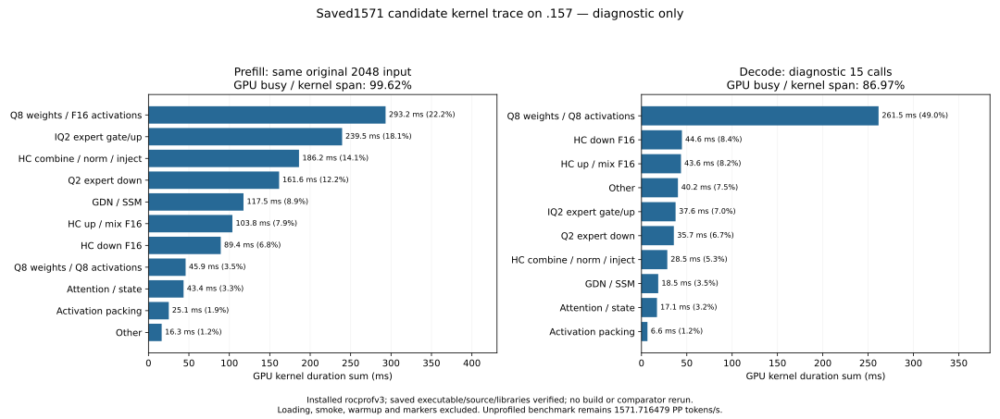

<!-- SPDX-License-Identifier: MIT -->
# Current kernel costs on the retained1571 executable

One installed-rocprofv3 trace on .157 now profiles the retained
`half-consumer-eight` executable, whose original unprofiled exact2048/tg128
result remains1571.716479 PP /25.20732109 TG. The fixed Q2/UD PP references
remain1443.672867 /1685.777092; they were neither rebuilt nor rerun. Reaching
UD still needs7.257073% more PP. This trace supplies attribution, not a new
throughput result or full-curve/independent-quality acceptance.

## Scope and identity

The existing builtin profile uses the original exact2048 input SHA256
`75343e606f5b815fe01f69ddc6ce50a997e2de96d8a20304a82a7f24f1180b35`,
capacity9216/chunk2048/MTP off, one16-output warmup and one marked16-output
request (15 decode calls). Loading, smoke, warmup and markers are excluded
from the kernel intervals below. The original2048/tg128 benchmark is unchanged.

The saved binary SHA256 is
`05d3c316539eff6442bcb91bf5cc3dd18f25def42d39410f8cbd4b21d7044385`.
Its qualified receipt,1026 provider files, original counting fixture/markers
and all51 original runtime library hashes match before/after replay. Both
warm/marked prefill logits and first16 output tokens match the saved model;
last logits match between warm/marked requests. This is exact replay of the
retained candidate, which still inherits the F16 task-quality gap.

## Complete stage attribution

| Stage | Prefill ms | Prefill share | Decode ms, 15 calls |
| --- | ---: | ---: | ---: |
| Q8 weights / F16 activations | 293.227373 | 22.183% | 0.000000 |
| Routed IQ2 gate/up | 239.499759 | 18.119% | 37.626242 |
| HC combine / norm / inject | 186.168095 | 14.084% | 28.489979 |
| Routed Q2 down | 161.558060 | 12.222% | 35.702009 |
| GDN / SSM | 117.515250 | 8.890% | 18.458623 |
| HC up / mix F16 | 103.776107 | 7.851% | 43.580026 |
| HC down F16 | 89.376337 | 6.762% | 44.609328 |
| Q8 weights / Q8 activations | 45.925836 | 3.474% | 261.537326 |
| Attention / state | 43.391424 | 3.283% | 17.081024 |
| Activation packing | 25.107216 | 1.899% | 6.581585 |
| Other | 16.288041 | 1.232% | 40.215246 |

Prefill contains1910 dispatches:1321.833498ms kernel sum in a1326.923958ms
span, with5.090460ms between kernels (99.616371% GPU-busy union/span).
Decode contains23594 dispatches over15 calls:533.881388ms kernel sum in a
613.861203ms span, with79.979815ms between kernels (86.971026% busy).
These gaps are trace intervals, not isolated CPU scheduling cost. Busy time
does not establish matrix saturation, bandwidth utilization or wave occupancy.

Q8/F16 dense totals293.227373ms. Its fused SSM projection alone takes
160.217893ms over36 calls; ordinary wide output takes69.729180ms and fused
attention projection48.445659ms. Existing source/retained ISA already shows
128-bit payload loads. Hardware transactions/cache misses remain unmeasured.

The half-output down is explicitly classified:48 dispatches total161.558060ms.
IQ2 uses48 wide128 and48 tail64 calls; routing capacity has median139.5 wide,
294.5 tail and669.5 down48 tiles/layer. Actual20480 routes/layer occupy58.228136%
of reserved gate slots and65.809769% of reserved down slots. These are map
capacity ratios, not measured inactive GPU waves or savings available to recover.

The current prefill gaps are small enough that further host launch callbacks
alone cannot explain the remaining point deficit. Ready/resource-aware overlap
is still a separate hypothesis; the earlier naive two-stream regression remains
valid. The most expensive stage families still justify expert-chain/consumer
fusion, Q8 data movement and HC materialization work.

## New compact-Q8 fetch hypothesis

The subsequently completed [aligned-pair trial](Q2-Q8-ALIGNED-PAIR.md) is
exact to the saved parent but regresses model PP4.806197%. Keep1571 as the
base. The following source-audit description is retained as proposal history;
implementation, component and original-model tests are no longer pending.

The [aligned-pair audit](../config/q2-q8-aligned-pair-opportunity.json) identifies
a distinct candidate in the active wide Q8 loader. BK2 assigns adjacent lanes
to the two K32 blocks of one row. Jointly reading the original68-byte encoded
pair permits four16-byte payload loads plus one4-byte load, with4-byte-aligned
addresses when the tensor base and even row width satisfy the contract.
Reassemble the first payload from adjacent words and transfer the second scale
between lanes; preserve original code/scale bits, half arithmetic and K16 WMMA.

This changes the fetch, whereas prior grouped stores, half-pair lookup and K16
phase trials changed later stages. It adds funnel shifts/lane exchange and may
increase VGPR pressure. No fewer hardware transactions or speedup is claimed.
Use the original fetch for unaligned tensor bases, odd K32 counts and unrelated
shapes. The symbolic68-byte address audit covers both scales and all64 codes;
it is not compiled device or numerical evidence. Implementation, guarded
ragged/even/odd-K component and one new original model remain to be prepared.
The saved parent assembly/binary and Q2/UD results must be reused.

## Validation and closure

All126 launcher and eight replay guards pass locally. Separate .157 host
Debug27/27 and ASan/UBSan27/27 pass. The diagnostic performs zero GPU build
commands and five successful runtime commands. Across host+trace,11 commands
exit0 and31 artifacts verify, including the original SQLite profile.72 runtime
fixtures and four manifests match local and archived identities. Stage/resource
reports recompute exactly. Peak CPU86.125C/GPU71C; no thermal stop.

Fresh admission from checkpoint5cd9680 at14:32:11.165838UTC anchors the prior
releasea8e0d9f6 and checks981 identities/780groups. Profile finishes14:33:12.165959UTC
and is collected before release14:33:58.538462UTC. Closure checks987 identities/
785groups retired,KFD empty,four original leases free and seven unchanged model
stat tuples. Canonical/main/remote release-active-ready mirrors match SHA256
`c8a42fec09697e22beb28f8f209c6ea328c2f19e99133e9db10d705015afc49e`;
core is notified. No Q2 job/build/client/lease/waiter/reservation/restart/cleanup
remains. Source code, model files, services and thermal settings on .157 were
not cleaned or tuned. A later GPU campaign requires fresh admission.

[Plan](../config/q2-current-best-profile-plan.json),
[complete result](../config/q2-current-best-profile-results.json),
[final audit](../config/q2-current-best-profile-final-audit.json),
[stage CSV](figures/q2-current-best-profile-stages.csv),
[kernel CSV](figures/q2-current-best-profile-stages-kernels.csv),
[routing CSV](figures/q2-current-best-profile-stages-routing.csv).

