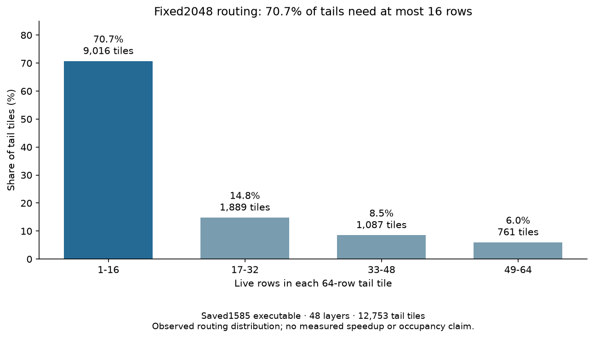

<!-- SPDX-License-Identifier: MIT -->
# Fixed-input expert routing on the retained1585 executable

The .157 diagnosis recovers all512 expert counts for48 layers twice, using
the saved `ssm-fixed-bounds` executable without rebuilding it. Both forwards
use the original fixed2048 input, SHA256
`75343e606f5b815fe01f69ddc6ce50a997e2de96d8a20304a82a7f24f1180b35`.
Warm/profile counts match exactly. Full prefill logits, both original smoke
outputs and the first16 generated tokens match the retained1585 evidence.
This is diagnostic execution under GDB; its times are excluded from throughput
comparisons. The measured best remains1585.308983 PP /25.16079073 TG against
fixed UD1685.777092 PP /24.34174251 TG. The prefill gap is76.991736ms.

The retained binary exposes `lie_iq2_mixed_tiles`. A host entry breakpoint
reads its existing counts after the original count-download event has already
completed. The target is x86-64 SysV; register arguments, shape512/2048/10,
count bounds, sum20480, capture order and96 total rows are checked. No new
model transfer, numerical kernel, device profiler or dependency is introduced.
GDB changes the live process while tracing; the on-disk binary and51 loaded
library identities remain exact. Binary SHA256 is
`db356a95046fd6951ba279627868f4a7bdeb49efdcc17225a6aafea3d85b4787`.

| Route family | Tiles across48 layers | Live rows / reserved rows | Row utilization |
| --- | ---: | ---: | ---: |
| IQ2 wide128 | 6813 | 809047 /872064 | 92.774% |
| IQ2 tail64 | 12753 | 173993 /816192 | 21.318% |
| Q2 down48 | 31120 | 983040 /1493760 | 65.810% |

All48 dispatch geometries match the saved1571 trace. Its kernel costs remain
historical attribution:135.808ms wide IQ2,103.692ms tail IQ2 and161.558ms Q2
down. Identical geometry does not establish identical timing on1585.

The new useful detail is the tail histogram:9016 tiles contain1..16 live rows,
1889 contain17..32,1087 contain33..48 and761 contain49..64. Thus70.697% of
tails have at most one live16-row fragment. Only35 of12753 tails are full64.

[CSV](figures/q2-current-routing.csv), [SVG](figures/q2-current-routing.svg).

The next candidate should select the existing BN16 kernel for those small
tails, retaining128/64 elsewhere. The saved device assembly gives:

| Existing IQ2 specialization | VGPR | LDS bytes | Static barrier sites | Private bytes |
| --- | ---: | ---: | ---: | ---: |
| BN16 | 86 | 11392 | 4 | 0 |
| BN64 | 104 | 17536 | 10 | 0 |
| BN128 | 150 | 25728 | 18 | 0 |

These are compiler resources, not measured occupancy or throughput. The
original64-row kernel already omits empty WMMA fragments and activation stores.
The proposal therefore targets resource reservation and remaining final-stage
work; it does not remove70.7% of matrix arithmetic. One extra span/launch can
offset the saving. Full component outputs and the unchanged original model
benchmark remain required, including timing after any safe numerical rejection.

Of the9016 eligible tails,8732 start at zero and284 follow wider tiles. For
the latter, convert the descriptor index from64-row units to16-row units;
keeping the old index would read the wrong rows. An independent enumeration
covers all983040 routed rows across48 layers with exactly one owner, preserves
every wide descriptor and leaves the descriptor count unchanged. Logical tail
capacity would fall816192→383424; this is not a measured memory-traffic saving.
The former short48 experiment selected whole1..48-row buckets and regressed;
its rejection remains recorded. The new candidate has not yet run.

[Three representative fixtures](../config/q2-fixed-input-route-fixtures.json)
retain layer0 and the layers with fewest/most eligible tails:3 and22. Counts
come from the fixed prompt; future component operands remain synthetic.
This avoids treating uniform512-expert routing as representative of the model.

After this narrow candidate, prioritize bounded activation reuse in the highly
occupied BN128 path, then ordered down/consumer fusion or a real HC buffer-pass
removal. The latter has greater implementation cost and must preserve the ten
experts' reduction order. Four-wave selection only for49..64-row tails reaches
just5.967% of tails; it is lower priority after the negative whole-model result.
No success probability or new performance gain is established by this audit.

The first attempt is preserved as an orchestration failure: the supervisor
required the child's process group to equal GDB's, although GDB creates a new
group within the owned private session. It stopped before any count capture;
transport exit1/stateFAILED is retained even though child exits were zero.
The correction is opt-in only for this diagnostic. It validates the private
session and pins task identities with pidfd before shutdown; external sessions
remain rejected. Fresh .157 host32+32 covers real GDB under supervision,
signals, invalid counts, incomplete/excess captures, abnormal exits, separate
child groups, timeout cleanup and foreign-session rejection. Only the ptraced
ASan fixture disables LeakSanitizer, which cannot operate under ptrace; ASan
and UBSan remain active and all other fixture leak checks remain enabled.

The successful model diagnosis completes at2026-10-06T02:28:53UTC and collects
20 verified artifacts before release02:29:27UTC, SHA256
`5f4d8c1374b0b462c353afa708e27cbc0176083536920047b376b2df52574f3c`.
All1296 recorded identities/1036 groups are retired, KFD is empty, four original
leases are unchanged/free, and seven model stat tuples are unchanged. No job,
waiter, reservation or cleanup remains. No public model/state/metrics ABI changed.

[Results](../config/q2-current-routing-v2-results.json),
[opportunity audit](../config/q2-route-opportunities.json),
[final audit](../config/q2-current-routing-final-audit.json),
[plan](../config/q2-current-routing-v2-plan.json).
