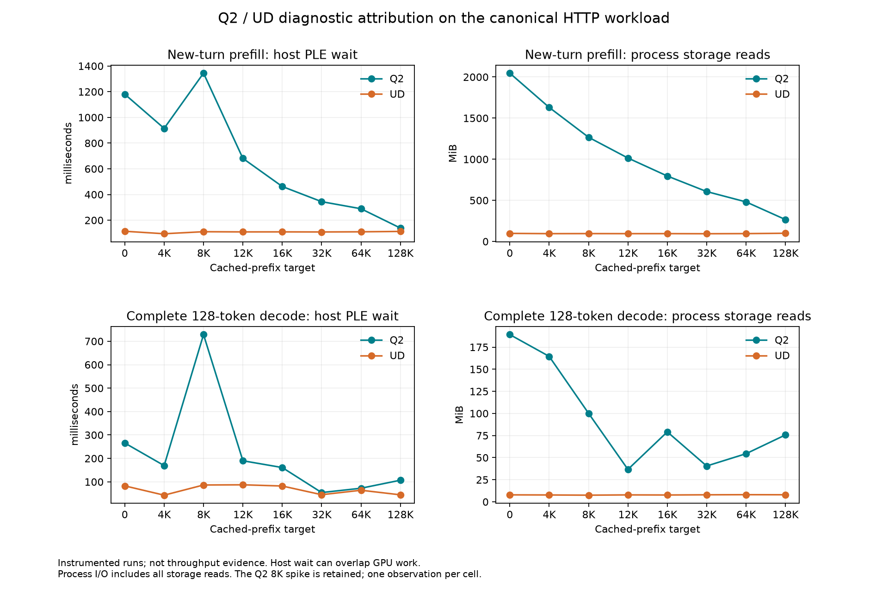

<!-- SPDX-License-Identifier: MIT -->
# Attributing the Q2/UD gap on the HTTP context curve

The first [complete curve](Q2-CANONICAL-HTTP.md) puts the largest prefill
deficit at depth zero: Q2 takes 2.460576 seconds versus UD 1.323863 for the
same 2040 new tokens. The gap is 1.136713 seconds. At 128K the gap shrinks to
0.011320 seconds. Optimizing the old repeated counting fixture cannot explain
this behavior. The acceptance target remains both PP and TG at every point.

## Controlled follow-up

First repeat the complete uninstrumented curve in reverse model order,
UD then Q2, with unchanged numerical providers and identical HTTP workload,
settings, calibration and depth order. Do not drop system caches or mutate
the original model files. Preserve the previous Q2-then-UD pair separately.
This investigates process/order/cache sensitivity; two observations do not
provide a robust confidence interval for a sub-percent difference.

Then run both models on the same complete workload with diagnostic host
instrumentation. `tools/prepare-q2-curve-profile.py` starts from the measured
providers and changes only `ngram.cpp` and the host `Executor::Forward`
entry/exit. It adds two first-party diagnostic headers; all other 1018 Q2 /
1017 UD files remain exact. No numerical kernel or arithmetic is edited.

Each Forward observation records monotonic start/end, prefill/decode mode,
initial position, token count, successful completion, and PLE counter deltas:
hashing, preparation, waiting, duplicate copying, row decoding, cache hits,
misses, `pread` calls and requested/returned bytes. `/proc/self/io` read-byte
deltas cover all storage I/O by the process during that span, not exclusively
PLE. Process row-cache capacity, worker count and direct-I/O mode are retained.

The analyzer aligns these spans with the retained HTTP request intervals and
checks every cached/new/decode frontier. It rejects missing calls, incomplete
work, crossing request boundaries, reordered phases, incoherent counters and
incorrect source/build identities. Every measured request is independently
reconstructed from the pinned Gufo recipe and its actual prefix reply.

## Timing boundaries

The diagnostic server has a distinct build identity and requires an explicit
profile flag. Its result is marked ineligible for headline performance; the
ordinary curve analyzer rejects it. The uninstrumented control and profile
must never be averaged together.

`blocked_ns` is host time inside the PLE condition-variable wait. Previously
queued GPU work can overlap it; this is not a direct measure of GPU idle time
or recoverable critical-path time. `pread_ns` and row-decode time are sums
across concurrent I/O workers and can exceed wall time. They must not be
added to the Forward duration. Counter atomics, clock reads, process-I/O reads
and JSON output add instrumentation overhead; no speedup claim uses this run.

If PLE wait and storage amplification explain a substantial portion of the
short-context deficit, the next candidate should address that mechanism on
the same curve. If they do not, profile the GPU/CPU remainder. The existing
reactive lookahead and HC stage experiments remain hypotheses to test, not
percentages to add to these measurements.

The earlier two-buffer lookahead prepares the next prefill chunk while the
current chunk runs. In the measured canonical curve, seven of eight new turns
fit into one executor prefill call; only the 2057-token turn at64K uses two.
This limits that particular lookahead's applicability to continuation PP,
even though it can help ingest the long preparation prefix. Starting reads
before a cache restore could hide some restore latency, but depth zero has
almost no such interval. This is a source/geometry deduction, not a measured
speedup or proof that all reactive scheduling is ineffective. A persistent
bounded row cache or improved first-read path is a more relevant hypothesis
if the profile confirms the depth-zero PLE deficit.

## Validation and ownership

Five local syntax checks pass for both instrumented providers and the host
fixture. The prior comparison replays with exactly the same JSON data after
the analyzer refactor. On `.157`, the new writer/counter and request-attribution
checks pass with the full **19/19 Debug and 19/19 ASan/UBSan** cohorts.
Fixtures cover parallel counter updates and incomplete Forward rejection;
they are not model inference or performance evidence.

Fresh admission at 2026-10-03T22:26:44.209344+00:00 rechecks the prior 30
processes retired, KFD empty and all four unchanged original leases free.
The shared registry contains no intervening core admission. The bounded
window covers the host cohort, reversed uninstrumented pair and separate
Q2/UD PLE profiles. No dependency installation, tuning, foreign termination,
model mutation or persistent service deployment is included. Final results and verified closure are recorded below.

## Completed canonical attribution — 2026-10-04

Both diagnostic sweeps finish successfully on `.157`, with 1385 valid Forward
observations per model and all eight accepted requests independently attributed.
All 40 request payloads and completion hashes match the same-model uninstrumented
second sweep, including calibration, warmup and prefix preparation. Numerical
kernels remain unchanged; this does not remove earlier numerical rejection.

**Durations below are milliseconds, not tokens/s.** For example, the depth 0
Q2 prefill Forward takes 2618.771 ms for 2040 new tokens. The uninstrumented
second sweep takes 2590.580 ms, or 787.469 tokens/s. There is no 2600 tokens/s result.
The diagnostic 8K spike is retained; it is not replaced by a faster sample.

| Prefix target | Q2 PP Forward ms | UD PP Forward ms | Q2 PLE host wait ms | UD PLE host wait ms | Q2 process reads MiB | UD process reads MiB | Q2 row-cache hit % | UD row-cache hit % |
| ---: | ---: | ---: | ---: | ---: | ---: | ---: | ---: | ---: |
| 0 | 2618.771 | 1330.555 | 1180.492 | 113.939 | 2046.773 | 98.359 | 2.991 | 13.993 |
| 4096 | 2430.322 | 1419.168 | 914.686 | 94.693 | 1630.172 | 94.953 | 2.747 | 16.142 |
| 8192 | 2880.592 | 1438.792 | 1344.397 | 110.429 | 1267.188 | 95.684 | 2.792 | 16.360 |
| 12288 | 2223.660 | 1451.316 | 680.950 | 108.982 | 1014.531 | 94.930 | 2.790 | 16.444 |
| 16384 | 2018.429 | 1460.129 | 462.293 | 109.211 | 795.875 | 95.125 | 2.907 | 16.072 |
| 32768 | 1918.214 | 1467.239 | 344.291 | 108.481 | 606.805 | 93.930 | 3.015 | 16.736 |
| 65536 | 1987.174 | 1632.510 | 289.097 | 109.783 | 480.941 | 95.512 | 2.816 | 16.595 |
| 131072 | 1878.351 | 1618.455 | 138.881 | 112.701 | 266.328 | 99.793 | 2.624 | 16.150 |

| Prefix target | Q2 TG Forward ms | UD TG Forward ms | Q2 PLE host wait ms | UD PLE host wait ms | Q2 process reads MiB | UD process reads MiB |
| ---: | ---: | ---: | ---: | ---: | ---: | ---: |
| 0 | 5190.726 | 5149.187 | 265.646 | 82.712 | 189.195 | 7.883 |
| 4096 | 5097.378 | 4949.508 | 169.315 | 43.066 | 164.531 | 7.762 |
| 8192 | 5780.764 | 5000.369 | 728.462 | 86.499 | 100.145 | 7.523 |
| 12288 | 5202.025 | 5007.679 | 189.921 | 87.331 | 36.664 | 7.844 |
| 16384 | 5140.419 | 5007.348 | 160.948 | 82.164 | 79.141 | 7.730 |
| 32768 | 5070.319 | 4993.498 | 54.209 | 45.033 | 40.527 | 7.949 |
| 65536 | 5134.588 | 5075.429 | 72.699 | 64.142 | 54.438 | 8.074 |
| 131072 | 5254.838 | 5171.563 | 106.933 | 44.518 | 75.664 | 7.992 |

TG durations sum all 128 completed decode calls. Neither table is a throughput
comparison; the uninstrumented [repeated curves](Q2-CANONICAL-REPEATS.md) supply
performance results. [Complete counters and durations](figures/q2-canonical-ple-profile/samples.csv)
and [machine-readable attribution](../config/q2-canonical-ple-profile-results.json)
retain every counter, including parallel worker sums.

At depth 0, Q2 performs 27759 PLE preads requesting 115.496 MiB of aligned data,
while process read accounting records 2046.773 MiB. The latter is 20.809 times UD
and 17.722 times Q2's own requested bytes. Process accounting is broader than
PLE; this is evidence consistent with the earlier compressed-extent read
amplification diagnosis, not an isolated filesystem-causality experiment.
Original files, caches and hardware policy were not changed.

Q2 has 16384 BF16 row slots (5 MiB), versus UD 65536 IQ4_NL slots (5.625 MiB);
both use 32 I/O workers and direct I/O. Q2's prefill row-cache hit fraction stays
2.6–3.1% throughout the sweep, while physical reads and waits fall substantially.
The progressive improvement therefore is not explained by an increasing hit
rate in that small row cache. Lower-level storage warming is a supported
hypothesis; thermal/frequency variance and GPU cost remain separate questions.

At 128K, only 26.180 ms of the 259.896 ms diagnostic Forward-duration difference
appears as additional host PLE blocking. At depth 0 the corresponding differences
are 1066.553 ms and 1288.216 ms. These are observations on separate instrumented
runs: subtracting waits cannot recover GPU time or predict a speedup, because
GPU work may overlap host waiting. The remaining GPU/HC work still matters,
especially at long depth.

The next PLE experiment should target repeated/aligned reads and the bounded
row/block cache, retaining original BF16 values. The existing next-chunk
reactive lookahead cannot hide the sole continuation chunk in seven of eight
cells. The separate [DeepSeek audit](Q2-DEEPSEEK-AUDIT.md) identifies integer
decode and mixed expert-tile opportunities, without confusing them with PLE.

The five-cohort window completes 26 commands with exit0 and 127 hash-verified
artifacts. Fresh release at 2026-10-03T23:03:30.243030+00:00 verifies 39 recorded
processes/groups absent, KFD empty and all four original lease identities free.
The [release receipt](../config/q2-curve-profile-window-release.json) is retained
locally, in the main repository, remotely and in the shared registry. Core
explicitly acknowledges the release and takes its next window. No Q2 GPU job,
reservation, waiter or restart remains. Direct outgoing MCP delivery failed;
coordination succeeded through the agreed receipts and the incoming acknowledgment.
