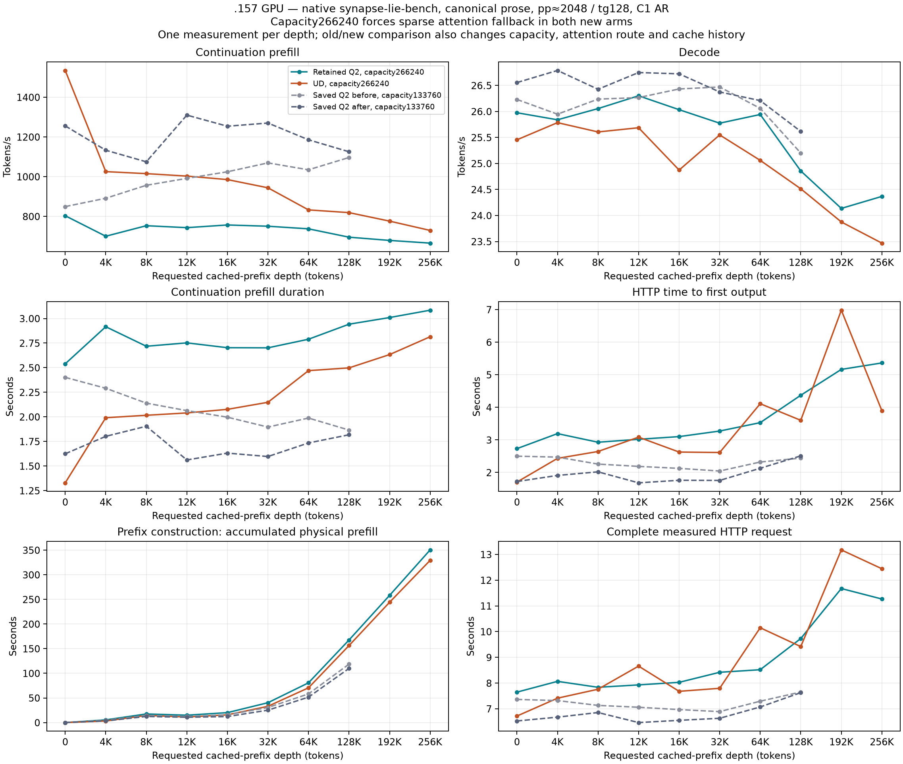

<!-- SPDX-License-Identifier: MIT -->
# Q2 and UD through 256K: completed capacity experiment

Both native `synapse-lie-bench` curves completed on `.157`: ten depths per model, 20 accepted measurements and 48 total requests. The measured prefill rates are below both historical Q2 controls. **This does not isolate the effect of the Q2 optimizations:** the larger server capacity disables the sparse WMMA attention route in both new arms. The fixed exact2048 reference remains **1587.893545 Q2 versus1685.777092 UD token/s**; it was not rebuilt or rerun.

[PNG graph](figures/q2-curve256/curve.png) · [SVG](figures/q2-curve256/curve.svg) · [all accepted values](figures/q2-curve256/points.csv) · [every request and phase](figures/q2-curve256/all-requests.csv) · [historical comparison CSV](figures/q2-curve256/comparison.csv) · [audited report](../config/q2-curve256-results.json)

## Measured continuation rates

Rates are physical tokens per second. Each depth has one warmup and one accepted measurement, with 128 generated tokens and 128 completed decode calls. There is no new median or replacement of the fixed benchmark. Both new arms have the same accepted physical counts at every depth.

| Requested prefix | Cached tokens | New tokens | Q2 PP | UD PP | Q2 TG | UD TG | Saved Q2 PP before | Saved Q2 PP after |
| --- | ---: | ---: | ---: | ---: | ---: | ---: | ---: | ---: |
| 0 | 0 | 2040 | 803.402 | 1534.756 | 25.975 | 25.455 | 849.444 | 1255.841 |
| 4K | 4096 | 2042 | 700.178 | 1025.498 | 25.840 | 25.785 | 891.415 | 1133.235 |
| 8K | 8185 | 2047 | 753.185 | 1015.350 | 26.055 | 25.606 | 956.672 | 1074.834 |
| 12K | 12250 | 2046 | 743.393 | 1002.978 | 26.301 | 25.687 | 991.545 | 1309.958 |
| 16K | 16325 | 2046 | 756.909 | 985.395 | 26.034 | 24.873 | 1024.693 | 1254.007 |
| 32K | 32719 | 2028 | 750.620 | 944.087 | 25.774 | 25.549 | 1069.473 | 1270.145 |
| 64K | 65448 | 2057 | 737.484 | 832.811 | 25.942 | 25.060 | 1034.701 | 1185.810 |
| 128K | 130933 | 2046 | 695.423 | 819.081 | 24.857 | 24.514 | 1096.610 | 1125.468 |
| 192K | 196196 | 2044 | 679.147 | 776.280 | 24.136 | 23.876 | — | — |
| 256K | 261629 | 2053 | 665.593 | 729.470 | 24.367 | 23.469 | — | — |

At128K Q2 prefill is15.097% below UD; at256K it is8.757% below. Q2 decode is respectively1.399% and3.825% above UD in these observations. Historical Q2 curves stop at128K; no old192K/256K values are invented. The old controls used capacity133760, different sparse attention dispatch and separate cache history. Their substantial before/after variation is retained. These single measurements establish neither a stable gain nor a causal regression from the numerical patches.

The canonical recipe includes the actual eight-token assistant reply produced while preparing a prefix. These replies can differ between Q2 and UD: six of ten measured request hashes differ despite identical accepted token counts. Full request/completion identities remain in the evidence; this is a shared workload recipe, not matched-history quality validation.

## Prefill durations, prefix construction and first output

All values below are seconds. Continuation prefill uses synchronous executor-call timings. Prefix construction sums actual prefill work across every prefix attempt at that depth; at8K calibration needed two prefix requests and processed16315 tokens. Other nonzero depths needed one. Prefix time excludes token generation, cache capture/restore and HTTP overhead, so it is not total setup wall time. All phase counts and durations are exported separately.

| Prefix | Q2 continuation PP | UD continuation PP | Q2 prefix PP total | UD prefix PP total | Q2 TTFT | UD TTFT |
| --- | ---: | ---: | ---: | ---: | ---: | ---: |
| 0 | 2.539202 | 1.329202 | 0.000000 | 0.000000 | 2.732093 | 1.705523 |
| 4K | 2.916403 | 1.991228 | 5.436081 | 3.268359 | 3.193303 | 2.433174 |
| 8K | 2.717790 | 2.016053 | 17.467488 | 14.529747 | 2.928621 | 2.644646 |
| 12K | 2.752244 | 2.039924 | 14.978430 | 11.370205 | 3.018898 | 3.084483 |
| 16K | 2.703097 | 2.076326 | 20.137449 | 15.670234 | 3.101395 | 2.627269 |
| 32K | 2.701766 | 2.148107 | 40.313751 | 33.010880 | 3.272169 | 2.613722 |
| 64K | 2.789214 | 2.469947 | 80.663258 | 70.550609 | 3.530019 | 4.110791 |
| 128K | 2.942094 | 2.497923 | 167.647797 | 156.371436 | 4.370287 | 3.601384 |
| 192K | 3.009659 | 2.633072 | 258.170705 | 244.185792 | 5.163996 | 6.981397 |
| 256K | 3.084466 | 2.814371 | 350.436300 | 329.256181 | 5.362554 | 3.898570 |

For contiguous prefill, intermediate chunks have2048 tokens and only the last can be shorter:5000 becomes2048+2048+904. Here,128K has a single2046-token continuation;64K has2048+9 and256K has2048+5. A longer cached prefix does not make each new continuation a multiple of2048. The proposed partial-row normalization/storage extension remains unimplemented and cannot improve the already eligible exact2048 reference.

## Capacity-induced attention fallback

The GGUF declares262144 total tokens. To accept the requested262144-prefix point plus continuation/output and calibration tolerance, both private host engines admit only AR requested266240 with declared262144. The effective capacity is set before device upload, preserving original model files, RoPE parameters and numerical device bodies. This1.5625% capacity extrapolation has no independent quality qualification; MTP/vision retain their original guards.

The larger effective capacity also increases the sparse-mask pitch from2048 to2080 words. `WmmaCausalAttention` rejects any non-null mask with pitch greater than2048, so sparse prefill selects the existing `AttentionKernel` plus `SigmoidMul`, even before reaching256K. Both new arms share this route. This is a source-derived dispatch finding, not a runtime kernel trace, and does not explain every timing difference or the dense d0 point. The bound source locations/hashes are included in the result report.

Removing that guard alone is unsafe: the scan has eight local words per thread and2052 shared union entries. A future correction must distinguish mask pitch from visible extent and qualify the real capacity boundary; extending beyond262144 needs additional kernel coverage. The fixed9216-capacity benchmark is unaffected. Core confirms its separate1M experiment has no qualified numerical/dispatch port that resolves this limit.

## Recipe and qualification

Both models use the previously qualified native C17 `synapse-lie-bench --suite http-curve`, Gufo prose seed1, pp≈2048/tg128, C1 greedy AR, HTTP port8000, one warmup and one measured request per depth, common capacity266240 and RAM prefix budget16384MiB. MTP, vision and SSD prefix caching are disabled. Server timeout is1800000ms and client timeout3600s. Original numerical MMQ archives and the native client are reused unchanged; only private server/host glue is rebuilt. No fixed control rerun, model conversion, dependency installation, tuning or remote cleanup.

Host-r4 passes44 Debug and44 ASan/UBSan checks with seven collected artifacts, including actual no-model server startup, C17/C++ capacity boundaries and exact engine-only archive reuse. The two model arms have12 zero command exits and30 collected artifacts. Q2 ends14:44:11.729955 UTC; UD ends15:02:58.711962 UTC. Both complete before collection and release at **15:02:59.961437 UTC**, SHA `3e59f4175fec424ff6695121becf3c2f66228da89136ab5bd05ada39920cd664`. All1575 recorded identities/1260 groups are retired, KFD is empty, original leases are free and model stat tuples are unchanged. Core is informed before local analysis.

Observed peaks are Q2 CPU93.25°C/GPU96°C and UD CPU97.75°C/GPU101°C. No configured thermal gate trips; these are separate whole-run observations and do not establish matched per-request clocks. Independent task quality and Q2/UD parity remain open.

The shared upstream formatting check retains exit1:100 diagnostics in unchanged inherited files and one alignment diagnostic in the newly embedded host helper. Runtime sources were frozen through both arms. This is not a passed formatting check; its [log classification](../config/q2-curve256-format-diagnostic.json) is preserved.

## Preserved startup failures

| Attempt | Actual failure | Inference | Collected before release |
| --- | --- | --- | --- |
| Host-r1 | Launcher correctly rejected an invalid replay option; new test expected a different message, CTest8/transport1. | None | Four artifacts; corrected expectation passes later host cohorts. |
| Curve-r1 | Server rejected3600000ms timeout, exit2; session/transport1. | None | Nine artifacts; release13:59:35 UTC /30872b71. |
| Curve-r2 | Backend rejected requested266240 above declared262144; session/transport1. Only the exact owned failed server was gracefully stopped. | None | Nine artifacts; release14:13:29 UTC /d866e817. |

[Revision3 plan](../config/q2-curve256-v3-plan.json), [source composition](../config/q2-curve256-headroom-source.json), [admission](../config/q2-curve256-v3-window-admission.json) and [release](../config/q2-curve256-v3-window-release.json) retain the identities. Earlier closure fields describing model-inference scope do not prove inference occurred during failed startup. The [remaining-work analysis](Q2-REMAINING-WORK.md) preserves the fixed-point priority.
