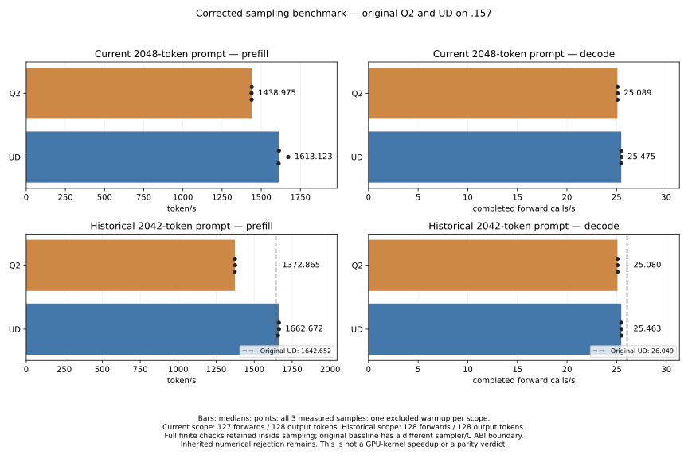

<!-- SPDX-License-Identifier: MIT -->
# Corrected decode measurement and the original UD baseline

The target remains the historical UD rate of **26.049385991 token/s** on `.157`.
The preceding diagnostic control at 24.318 token/s does not lower that target.
This experiment removes benchmark overhead and aligns a second measurement
with the historical physical input and completed-token accounting. It does
not optimize GPU decode kernels or qualify the inherited numerical changes.

## Observed results — 2026-10-03

Medians exclude one warmup per scope; all measured samples follow below.

| Scope | Model | PP token/s | PP seconds | TG completed calls/s | TG seconds |
|---|---|---:|---:|---:|---:|
| pp2048 | Q2 | 1438.974691 | 1.423235595 | 25.08944287 | 5.061890002 |
| pp2048 | UD | 1613.123062 | 1.269586957 | 25.47501740 | 4.985276281 |
| historical2042 | Q2 | 1372.864940 | 1.487400501 | 25.08011422 | 5.103645018 |
| historical2042 | UD | 1662.671982 | 1.228143628 | 25.46337169 | 5.026828401 |

The correction raises Q2's current-prompt measured decode rate **4.1204%** and
UD's **4.7572%** relative to their previous diagnostic cohorts. This is removed
benchmark cost, not a faster GPU kernel. Q2 prefill is unchanged within 0.021%.
The fresh historical-prompt decode gap is **−1.5051%**, or **0.600130 ms per
completed token**. Q2 remains below the historical 26.049385991 target, too;
neither difference establishes production parity.

Fresh UD current 2K prefill varies 1611.173–1672.432 token/s (median 1613.123),
compared with the preceding 1666.902 median. The raw Q2 deficit of 10.796% in
this cohort must not be presented as a new prefill gain: Q2 kernels/timing
are unchanged at this shape, and the UD control varies. On the historical
prompt Q2 is 17.430% below fresh UD prefill. The 2042 shape takes the native HC
consumer while 2048 takes the library consumer; the prompt/routing histories
also differ, so this campaign does not isolate their respective cost.

Every one of the **21 previously saved model files** matches for each model.
Both scopes pass 9/9 internal whole-file repeats per model (**36/36** total);
all 40 saved full-vocabulary frontiers are finite. Historical UD also exactly
reproduces all four original output-ID sequences, four prefill-frontier hashes
and four final-frontier hashes (**12/12**). Q2 produces the same historical
output IDs; its logits differ from UD, as expected for a different quantization.
Token agreement is not an independent task-quality qualification. Existing
operator failures and Q2 qualified-reference KL 0.002996 > 0.002 remain rejected.

Static investigation confirms the original production greedy sampler scans
once, testing finiteness when selecting a new maximum; it skips isolated
nonfinite logits. The corrected diagnostic still performs a strict full
finite scan followed by max_element. Thus the host work remains different;
no assertion is made that this alone explains the entire remaining baseline
difference. A strict single-pass sampler or a pinned production Session test
is the next way to resolve it, without discarding numerical checks. For GPU
decode, the preceding trace's HC down excess remains the first measured
candidate; the current matched gap requires about 0.60 ms/token of real saving.

[Full verified JSON](../config/q2-decode-baseline-results.json),
[static boundary analysis](../config/q2-decode-baseline-boundaries.json),
[all measured samples as CSV](figures/q2-decode-baseline.csv),
[SVG](figures/q2-decode-baseline.svg) and [PNG](figures/q2-decode-baseline.png).



### Every model sample

Rep 0 is excluded warmup. TG denominators are 127 for pp2048 and 128 for
historical2042; all samples emitted 128 tokens without EOS.

| Scope | Model | Rep | PP token/s | PP seconds | TG calls/s | TG seconds |
|---|---|---:|---:|---:|---:|---:|
| pp2048 | Q2 | 0 | 1424.409463 | 1.437788819 | 24.47092413 | 5.189832609 |
| pp2048 | Q2 | 1 | 1439.726450 | 1.422492446 | 25.09394392 | 5.060982060 |
| pp2048 | Q2 | 2 | 1438.205855 | 1.423996428 | 25.08817640 | 5.062145529 |
| pp2048 | Q2 | 3 | 1438.974691 | 1.423235595 | 25.08944287 | 5.061890002 |
| pp2048 | UD | 0 | 1666.237720 | 1.229116335 | 23.76569094 | 5.343837901 |
| pp2048 | UD | 1 | 1613.123062 | 1.269586957 | 25.47294584 | 4.985681703 |
| pp2048 | UD | 2 | 1672.431524 | 1.224564337 | 25.47728344 | 4.984832873 |
| pp2048 | UD | 3 | 1611.172527 | 1.271123958 | 25.47501740 | 4.985276281 |
| historical2042 | Q2 | 0 | 1202.114111 | 1.698674012 | 24.15320436 | 5.299503871 |
| historical2042 | Q2 | 1 | 1372.864940 | 1.487400501 | 25.08011422 | 5.103645018 |
| historical2042 | Q2 | 2 | 1374.105753 | 1.486057384 | 25.08411062 | 5.102831905 |
| historical2042 | Q2 | 3 | 1371.887637 | 1.488460093 | 25.07934655 | 5.103801239 |
| historical2042 | UD | 0 | 1655.236184 | 1.233660803 | 25.45982745 | 5.027528182 |
| historical2042 | UD | 1 | 1662.671982 | 1.228143628 | 25.45903367 | 5.027684933 |
| historical2042 | UD | 2 | 1662.825961 | 1.228029901 | 25.47305680 | 5.024917150 |
| historical2042 | UD | 3 | 1656.688703 | 1.232579178 | 25.46337169 | 5.026828401 |

### Validation and closure

All 17 host tests pass in both Debug and ASan/UBSan on `.157`. The full source and
fixture inventories match the frozen host/model capsules: 3059 source-file
instances and 85 artifacts verify. All 14 remote commands exit0. No thermal stop
occurs; maximum model-run CPU 82.5 C/GPU 74 C. Fan 82 and the existing CPU 98/exposed
GPU bounds are unchanged. The shared upstream formatter exits1 on the same
five untouched upstream-test violations as the parent source; changed
first-party C++ files pass. Python syntax and git whitespace checks pass.

Verified release at **2026-10-03T17:37:05.108908+00:00** finds all 17 recorded PIDs and owned
groups absent, KFD empty and all original four leases free. Remote/shared/local
receipts record release; no Q2 job, waiter or automatic restart remains. Direct
thread delivery is unavailable, so the agreed persistent receipts provide the
handover without claiming message delivery. The performance goal remains open.

## Measurement contract

Both original models use context 9216, max_batch 2048, greedy, no MTP, no prefix
reuse, fresh sessions, one warmup plus three measured repetitions per scope.
A 15-second cooldown precedes every request, outside PP/TG timers. Every model
binary and MMQ archive is rebuilt from source; no archive reuse or weight
conversion occurs. Source/models/fixtures, binary identities and complete
outputs are retained in the frozen capsules and runner receipts.

- `pp2048`: the existing exact 2048-token padding/counting prompt, 128 outputs,
  127 timed Forward calls and a final engine position of 2175. This preserves
  the prior diagnostic denominator, allowing the correction to be compared.
- `historical2042`: the exact 2042 physical IDs from first-party LIE
  `t0-c1-perf-r2`, 128 outputs and 128 completed Forward calls, final position 2170.
  One interval encloses sampling, stop checks and all 128 synchronous forwards.
  The final completed frontier is checked outside that interval.

The historical source measurement SHA256 is
`c60dba6a099ec97f9cbe98048601ab4850a805b49d6dbc7f97b9c57a563afc7a`.
Its immutable IDs and witness hashes are in the static manifest. The original
benchmark called LIE's C ABI and the upstream Session/SamplerState path. This
fixture calls Executor directly and retains full finite checks inside each
sampling call. Matching the prompt and completed work does not make those
host boundaries identical. Saved output/frontier hashes test replay explicitly.
No isolated CPU time is subtracted from a model measurement.

## Implementation and provenance

`tests/q2_argmax.hpp` performs the same full finite-logit scan and first-maximum
selection as before, constructing the exception only when a check fails.
The former Require call constructed 248320 temporary strings per generated
token. The earlier independent CPU probe found 248320 allocations becoming 0;
its 1.801 ms median difference is a host diagnostic, not a model speedup estimate.
All NaN/infinity rejection, tie behavior and error text remain covered by the
host fixture. Runtime samples also report `completed_output` and
`final_position` so emitted tokens cannot be confused with completed steps.
These fields belong to the experimental evidence schema; no public ABI or
persistent model-state format changes.

The isolated Q2 source is derived from the preceding paired-norm/library
candidate. Only one executor predicate changes: paired output is selected at
n = 2048, where the actual library consumer is selected. Other shapes use the
original norm producer, avoiding the known adverse interaction with the
native consumer. All GPU kernel files and 1019 other source files are
unchanged. The current2048 path and scalar decode arithmetic are unchanged.
`tools/prepare-q2-decode-baseline.py` records the complete source inventory,
checks the parent inventory and historical receipt, and refuses overwriting.
Official Gufo pin remains `f783fedb9bea2ec7de941f6da4e02f4a4596b29e`;
all upstream licenses/notices remain. No sibling project source is imported.

## Reproduction

Within a freshly admitted `.157` window:

```sh
python3 tools/q2-remote.py cpu q2-decode-baseline-host-r1
python3 tools/q2-remote.py collect q2-decode-baseline-host-r1
python3 tools/q2-remote.py q2-decode-baseline q2-decode-baseline-q2-r1 --source-variant library-norm-bound --rebuild-mmq
python3 tools/q2-remote.py collect q2-decode-baseline-q2-r1
python3 tools/q2-remote.py ud-decode-baseline q2-decode-baseline-ud-r1 --rebuild-mmq
python3 tools/q2-remote.py collect q2-decode-baseline-ud-r1
python3 tools/analyze-q2-decode-baseline.py
python3 tools/plot-q2-decode-baseline.py
```

Existing labels refuse reuse. Choose a new cohort and update the fixed report
inputs for a new experiment; preserve every historical receipt. All source
and result paths are persistent under the project, not temporary directories.
The original four leases and shared registry retain their existing locations.
