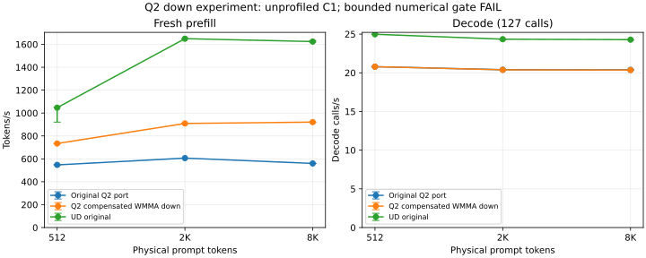

<!-- SPDX-License-Identifier: MIT -->
# Q2 down WMMA experiment — rejected

The compensated WMMA candidate increases Q2 prefill throughput but fails the
predeclared saved-frontier gate: maximum KL(p_baseline || p_candidate) is
**0.002809240075**, above **0.002**, at the 2048-token prefill frontier.
The kernel passes independent operators and produces the same greedy tokens;
neither result overrides the full-frontier failure. The active runtime patch
has been restored byte-for-byte to the previously qualified original Q2 port.

## Unprofiled C1 results

| Arm | Prompt | PP tok/s min / median / max | TG calls/s min / median / max |
|---|---:|---:|---:|
| Original Q2 port | 512 | 546.96 / 547.20 / 548.72 | 20.75 / 20.79 / 20.80 |
| Original Q2 port | 2048 | 606.04 / 606.29 / 607.02 | 20.38 / 20.40 / 20.40 |
| Original Q2 port | 8192 | 559.59 / 559.89 / 560.05 | 20.36 / 20.38 / 20.39 |
| Rejected WMMA candidate | 512 | 732.60 / 733.94 / 734.55 | 20.77 / 20.79 / 20.80 |
| Rejected WMMA candidate | 2048 | 908.39 / 908.99 / 910.88 | 20.38 / 20.38 / 20.40 |
| Rejected WMMA candidate | 8192 | 918.32 / 920.77 / 922.30 | 20.33 / 20.36 / 20.38 |
| UD original | 512 | 920.95 / 1046.71 / 1050.76 | 24.98 / 24.98 / 24.99 |
| UD original | 2048 | 1646.75 / 1649.36 / 1649.41 | 24.33 / 24.34 / 24.36 |
| UD original | 8192 | 1620.44 / 1624.14 / 1631.98 | 24.24 / 24.28 / 24.28 |

Candidate PP increases by 34.13%, 49.93% and 64.45% versus the original Q2 port.
Decode median changes by -0.003%, -0.087% and -0.114%; three samples do not
establish a zero-margin non-regression bound. Candidate PP is still 29.88%,
44.89% and 43.31% below UD; decode remains about 16–17% below UD.

One warmup plus three measured fresh sessions per length, original read-only
Q2 GGUF, C1, greedy, MTP off, chunk 2048, capacity 9216, 128 emitted tokens and
127 timed decode calls. The unprofiled timer and prompt construction are the
same as the retained baseline. Session allocation remains 376,777,748 bytes;
resident weights remain 43,156,012,544 bytes. The candidate loaded in 13.253 s.
No HTTP, concurrency, long-context or independent teacher parity is implied.

## Numerical result

All 19 input/output token files match the original Q2 port. All 28 saved
vocabulary frontiers (248320 logits each) are finite but differ. The maximum
raw relative L2 is 0.267681 and maximum absolute logit difference is 3.77409.
KL uses stable float64 softmax at temperature 1 over the complete saved
vocabulary. The 2K prefill KL exceeds the limit in all four repetitions.
The declared threshold was not changed. No independent full-model Q2 teacher
is available to decide whether the changed distribution is better or worse.

The [operator history and phase profiles](Q2-PROFILING.md) identify why the
first single-F16 variants failed and how compensated activations passed the
operator limit. The surviving model drift shows that replacing the baseline
Q8-activation MMQ arithmetic still requires qualification beyond local accuracy.

## Preserved experiment and next direction

`experiments/q2-down-wmma.patch` preserves the exact source/harness change as
a patch against the restored worktree. It is absent from the active runtime;
no dormant switch or rejected dispatch is left in the default source.
Applying that historical experiment is source reconstruction, not acceptance.
`config/q2-down-wmma-protocol.json` retains the predeclared gates and
`config/q2-down-wmma-comparison.json` the complete frontier and timing values.
Recompute with `tools/compare-q2-candidate.py`; plot with
`tools/plot-q2-candidate.py`. No benchmark was invented for the restored code.

The next PP candidate should preserve the baseline activation quantization
and improve routing, packing or weight reuse before changing arithmetic.
The separately measured 320×10240 / 10240×320 F16 HC projections are a
distinct decode target; vector loading and activation reuse must preserve the
existing products and reduction order. The required UD control and long-context
sweeps follow only a passing numerical candidate. A new UD run was not spent
on this already rejected route.

## Evidence and retirement

`q2-down-wmma-bench-r1` finished at 2026-10-02 03:12:12.768 UTC, all four
child commands and SSH transport exit 0. This means sampling completed; the
acceptance verdict is FAIL. All 52 artifacts were collected and SHA-256 verified.
The full source capsule SHA is
`2bae1f6b41d3b55fdf9f4562aaab3ad28193f51d18a91a8e9967723e8d9bf4ec`.
The collected archive SHA is
`5ea5553712d686197fdcf3e44e21567c3c8908d36941141e76ce2823a7c27b1d`.

Fresh closure at 03:14:56.579 UTC verified all 34 command PID/start identities
and owned groups retired, KFD empty, all four expected lease identities
acquirable EX|NB and released. The core thread received the handover. No Q2
job or automatic retry remains. Models, services and foreign artifacts were
not modified. Sources, including rejected versions, remain on persistent storage.
