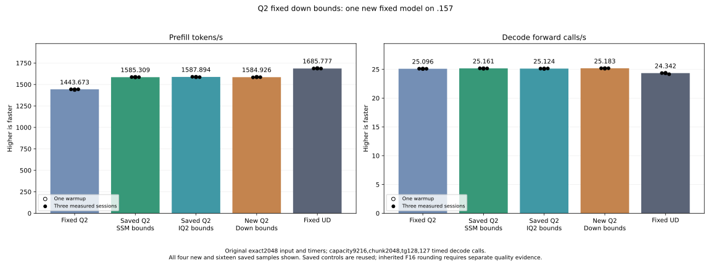

<!-- SPDX-License-Identifier: MIT -->
# Fixed bounds for the active Q2 expert down projection

The completed model measures **1584.926383 PP /25.18297866 TG**. Prefill is
nominally **−0.186862%** versus retained **1587.893545 /25.12414406**; keep the
parent. The measured ranges overlap slightly. Decode uses an unchanged route,
so its small rate variation is not evidence of a decode-kernel improvement.
Fixed UD remains **1685.777092 PP /24.34174251 TG**. The parent still needs
**6.164365%** more PP, or **74.889015 ms** less prefill time.

| Arm | PP tokens/s | Prefill seconds | TG calls/s | Decode seconds |
| --- | ---: | ---: | ---: | ---: |
| Fixed Q2 | 1443.672867 | 1.418603928 | 25.09595499 | 5.060576497 |
| Saved stable parent | 1585.308983 | 1.291861727 | 25.16079073 | 5.047536119 |
| Saved retained parent | 1587.893545 | 1.289759006 | 25.12414406 | 5.054898575 |
| New fixed down | 1584.926383 | 1.292173581 | 25.18297866 | 5.043088894 |
| Fixed UD | 1685.777092 | 1.214869991 | 24.34174251 | 5.217375049 |

| New sample | PP tokens/s | Prefill seconds | TG calls/s | Decode seconds |
| --- | ---: | ---: | ---: | ---: |
| Warmup | 1586.955773 | 1.290521157 | 25.14977259 | 5.049747450 |
| Measured 1 | 1582.876522 | 1.293846975 | 25.17820360 | 5.044045318 |
| Measured 2 | 1585.533119 | 1.291679105 | 25.18449001 | 5.042786253 |
| Measured 3 | 1584.926383 | 1.292173581 | 25.18297866 | 5.043088894 |

All **132 guarded operator pairs** and five complete post-timing buffers are
exact. All **21 model files match both saved parents**, including every full
logit array; nine internal replays are also exact. No new numerical drift is
observed. Inherited representation changes still require independent task-quality
qualification; parent equality does not establish that separate result.

[All 20 model samples](figures/q2-down-fixed-bounds-model.csv),
[all 70 component timing samples](figures/q2-down-fixed-bounds-component.csv).

The actual half-output route has m2560/k640. Its 20 blocks each own 128 complete
output rows, and ten K64 stages cover the input exactly. Specialize these bounds
and row strides, remove their row-tail checks, and select the aligned output
path only when the output address is divisible by 16. All other shapes or
alignment retain the original body. Ragged token/expert bounds, encoded weight
bytes, affine FMA/half palette, WMMA order, inverse-scale multiplication and
half-output rounding remain unchanged. No extra allocation or executor lifetime
change is introduced.

| Token tile | Parent / candidate instructions | Parent / candidate VGPR | LDS bytes |
| ---: | ---: | ---: | ---: |
|16|1254 /971|85 /85|14464|
|48|2641 /1729|96 /97|18560|
|64|3350 /2152|104 /105|20608|

All 164 parent bodies and the three standalone draft bodies match the integrated
candidate instruction-for-instruction and resource-for-resource, with zero
spills. Static instruction reduction is not a measured throughput increase.

The new component covers 44 cases/132 complete guarded output pairs, including
ragged rows, output widths 1/65/2560, token tiles 16/48/64, four-byte-aligned
outputs, uniform routing and saved real-layer 0/3/22 counts. Five complete
post-timing buffers must equal their own initial replay. Timings alternate the
literal parent and new selector over three weight rotations beyond 32 MiB MALL;
two warmups and five measurements use synchronized monotonic wall time. Raw HIP
event values and validity are retained separately. Numerical finite differences
retain their full arrays and do not suppress the original-model performance test.
Device/guard/unwritten/nonfinite failures prevent further GPU work.

Complete-cycle component wall time changes as follows; all 70 raw HIP event
values are zero and invalid, retained separately. Allocation, uploads and output
hashing remain outside these timers.

| Routing shape | Parent µs | Candidate µs | Time change |
| --- | ---: | ---: | ---: |
| uniform-e160-w48 | 2527.926667 | 2586.245000 | +2.306963% |
| control-e512-w64 | 3215.274333 | 3210.871000 | -0.136950% |
| real-layer0 | 3270.162667 | 3256.403000 | -0.420764% |
| real-layer3 | 2669.526333 | 2660.676333 | -0.331519% |
| real-layer22 | 3439.408000 | 3418.288667 | -0.614040% |

The three captured routing shapes save only 0.33–0.61% operator time despite
the much larger static instruction reduction. The generic body also contains
inactive output paths; removing their instructions does not save their runtime
work. The fixed-bound body still tests null output arguments and the active
aligned-store branch. No hardware-counter attribution is claimed.

Host 37 Debug and 37 ASan/UBSan tests pass on .157. All 13 primary commands
exit0, and 37 artifacts collect before release at **2026-10-06T13:01:06.984319+00:00**, SHA
`497f5d323407870c2f94d3ddb1e3b9fa1a002c057263c272996b1af3e26d2930`. Closure retires 1500 identities and1202 groups;
KFD is empty, original CPU/four GPU leases free and seven model stat tuples
unchanged. All mirrors agree and Core is informed before local analysis.
No Q2 job, lease, reservation, waiter or remote cleanup remains.

The fixed benchmark is exact2048/tg128, capacity9216/chunk2048, C1 greedy,
MTP off, one warmup/three measured sessions and127 timed decode calls, with
15-second pauses outside timers. Compilation/loading are excluded. Saved
Q2/UD/parents are reused; no Q4 or full curve. Historical references are not
contemporaneous bookends or proof of a stable causal timing difference.

The next local draft makes the down launcher's two null output arguments
compile-time constants and removes the proven active aligned-store row test.
Its BN16/48/64 bodies contain469/764/880 instructions and use84/95/103 VGPR,
with unchanged LDS and no spills. This is **only compiler evidence**: no new
provider, runtime selector, GPU admission or throughput claim exists yet.
It is the next separate candidate, not part of the model measured above.

A local registration-preparation script first exited1 on a stale text anchor
before any file mutation or remote action; that failure is preserved. The
corrected preparation passes syntax and actual .157 host checks. It is not a
numerical or GPU failure.

[Source](../config/q2-down-fixed-bounds-source.json),
[static comparison](../config/q2-down-fixed-bounds-static.json),
[plan](../config/q2-down-fixed-bounds-plan.json).

[Model results](../config/q2-down-fixed-bounds-model-results.json), [component results](../config/q2-down-fixed-bounds-component-results.json), [final audit](../config/q2-down-fixed-bounds-final-audit.json).
