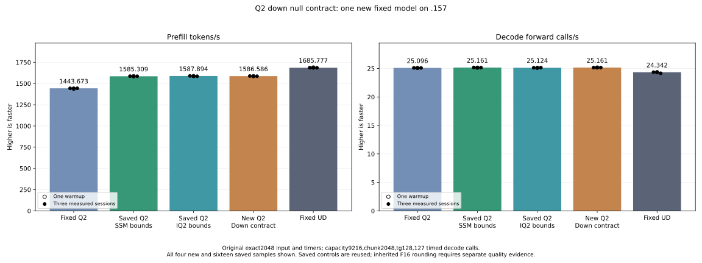

<!-- SPDX-License-Identifier: MIT -->
# Q2 down specialization for known null arguments

The completed model measures **1586.586480 PP / 25.16050717 TG**. Prefill is
nominally **−0.082314%** versus retained **1587.893545 / 25.12414406**; the ranges
overlap. Keep the retained parent as the headline and preserve this marginal
candidate: all five component shapes improve 0.69–1.98%, but a whole-model
speedup is not observed. Decode uses an unchanged path.

Fixed UD remains **1685.777092 PP / 24.34174251 TG**. The retained parent needs
**6.164365%** more PP, equivalent to **74.889015 ms** less prefill time.

| Arm | PP tokens/s | Prefill seconds | TG calls/s | Decode seconds |
| --- | ---: | ---: | ---: | ---: |
| Fixed Q2 | 1443.672867 | 1.418603928 | 25.09595499 | 5.060576497 |
| Saved stable parent | 1585.308983 | 1.291861727 | 25.16079073 | 5.047536119 |
| Saved retained parent | 1587.893545 | 1.289759006 | 25.12414406 | 5.054898575 |
| New down contract | 1586.586480 | 1.290821538 | 25.16050717 | 5.047593006 |
| Fixed UD | 1685.777092 | 1.214869991 | 24.34174251 | 5.217375049 |

| New sample | PP tokens/s | Prefill seconds | TG calls/s | Decode seconds |
| --- | ---: | ---: | ---: | ---: |
| Warmup | 1586.097242 | 1.291219697 | 25.16345784 | 5.047001123 |
| Measured 1 | 1588.212221 | 1.289500215 | 25.15372482 | 5.048954018 |
| Measured 2 | 1586.586480 | 1.290821538 | 25.17104760 | 5.045479315 |
| Measured 3 | 1585.608981 | 1.291617306 | 25.16050717 | 5.047593006 |

All **132 guarded operator pairs** and five complete post-timing buffers are
exact. All **21 model files match both saved parents**, including the full
logit arrays; nine internal replays are exact. No new numerical drift appears.
Inherited representation changes still require independent task-quality evidence.

[All 20 model samples](figures/q2-down-fixed-contract-model.csv),
[all 70 component timing samples](figures/q2-down-fixed-contract-component.csv).

The actual `LaunchRoutedQ2HalfStorage` call passes null `swiglu_gate` and
`out_half`. Making these two values compile-time constants removes unused
output routes and their live registers. The private route also omits the
active output alignment/row checks proven by its selector: `m=2560`, `k=640`,
16-byte-aligned output, 20 full blocks of 128 rows and token tiles 16/48/64.
Ragged expert/token checks remain. The original kernel handles other shapes
and alignments. The generator verifies the literal null call arguments.

| Token tile | Parent / candidate instructions | Parent / candidate VGPR | LDS bytes |
| ---: | ---: | ---: | ---: |
| 16 | 1254 / 469 | 85 / 84 | 14464 |
| 48 | 2641 / 764 | 96 / 95 | 18560 |
| 64 | 3350 / 880 | 104 / 103 | 20608 |

The integrated provider preserves all 164 original device bodies and exactly
matches the three separately compiled private draft bodies, with no spills.
Much of the instruction reduction removes inactive branches; this is not a
runtime speedup measurement. Unlike the previous bounds-only draft, all three
specializations use fewer VGPRs than the retained parent.

Encoded Q2 bytes, activation/scale layout, F32 affine FMA, half palettes,
K16 WMMA order, inverse-scale product, half-output rounding and register
transpose stay unchanged. There is no allocation, lifetime, stream, callback,
public ABI or scheduler change. This is a private transitional HIP experiment,
derived from independently fetched official Gufo at
`f783fedb9bea2ec7de941f6da4e02f4a4596b29e`, retaining MIT provenance.

The bounded experiment tests only this new candidate. The GPU component uses
44 cases / 132 guarded whole-output pairs, five whole-buffer checks after
timing, aligned and four-byte-aligned fallback output, and saved layer 0/3/22
routing. Timings alternate the literal parent and candidate over three weight
rotations beyond 32 MiB MALL. Synchronized monotonic wall time and raw HIP event
validity are retained separately. Finite numerical differences are preserved
and do not suppress the original-model performance measurement.

The model comparison remains exact2048 input / tg128 with 127 timed decode
calls, capacity9216 / chunk2048, C1 greedy, MTP off, one warmup and three
measurements, and 15-second pauses outside timers. Reuse saved Q2/UD/1587 parent
results without rebuilding or rerunning them. No Q4 or full curve is included.
Collect all artifacts, retire jobs and release the GPU window before analysis.

[Provider manifest](../config/q2-down-fixed-contract-source.json),
[static binding](../config/q2-down-fixed-contract-static.json),
[draft evidence](../config/q2-down-fixed-contract-draft-static.json).

New .157 host 37 Debug and 37 ASan/UBSan checks pass, ending
2026-10-06T13:14:38.530298+00:00. All seven artifacts collect; the
[plan](../config/q2-down-fixed-contract-plan.json) freezes 198 runtime fixtures
and six manifests. The component and model subsequently complete with all 13 primary commands exiting zero.

The complete down projection uses synchronized monotonic wall timing. All 70
raw HIP event values are zero/invalid and preserved separately. Uploads,
allocations and output hashing are outside these timers.

| Routing shape | Parent µs | Candidate µs | Time change |
| --- | ---: | ---: | ---: |
| uniform-e160-w48 | 2529.953000 | 2502.417333 | -1.088386% |
| control-e512-w64 | 3226.034000 | 3203.891333 | -0.686374% |
| real-layer0 | 3249.063333 | 3221.710667 | -0.841863% |
| real-layer3 | 2673.742667 | 2620.864000 | -1.977702% |
| real-layer22 | 3451.368000 | 3422.015333 | -0.850465% |

All 37 artifacts (7 host, 4 component, 26 model) collect before release at
**2026-10-06T13:23:10.728744+00:00**, SHA
`268296b23c5803b332dd20ff1dc15383a8ee299332ae1ec4571e2448d22b107a`.
Closure retires 1516 identities and 1215 groups, with empty KFD, original Core
CPU/four GPU leases free and seven model stat tuples unchanged. Canonical/main/
remote mirrors agree; Core is informed before numerical/performance analysis.
No Q2 job, lease, window, waiter, reservation or remote cleanup remains.

The historical references are unchanged saved runs, not contemporaneous
bookends. The component result is retained for later composition, without
replacing the faster saved whole-model result. The next independent source
investigation targets full-window GDN recurrence scheduling; it is separate
from this completed model and currently has no runtime plan or speedup claim.

[Model report](../config/q2-down-fixed-contract-model-results.json),
[component report](../config/q2-down-fixed-contract-component-results.json),
[final audit](../config/q2-down-fixed-contract-final-audit.json).
