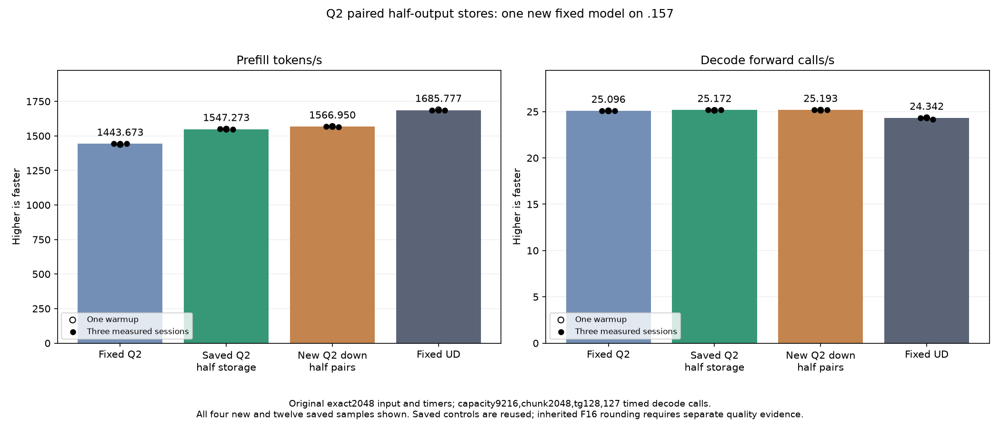

<!-- SPDX-License-Identifier: MIT -->
# Paired Q2 half-output stores

The completed original model measures **1566.950178 PP /25.19259094 TG**,
nominally **+1.271715% PP /+0.081855% TG** against the retained1547.273268 /
25.17198641 parent. PP improves19.676910 tokens/s, is8.539144% above fixed Q2,
and still needs7.583324% to reach fixed UD1685.777092. All21 saved parent
model files and nine within-arm replays are exact; no additional numerical
change is observed. The parent's independent-quality gap remains open.
[Disposition](../config/q2-down-half-pair-disposition.json).

All513 down-output and99 consumer comparisons pass exactly. The down-only
cycle saves6.181006–12.373910% time; down plus combine saves4.283152–8.009653%.
All six distributions have nonoverlapping observed timing ranges in both
scopes. This is component evidence, not that percentage of model throughput.
All13 runtime commands exit0/37 artifacts verify. The GPU window is released
at2026-10-05T12:59:27.317557+00:00, after collection, with926 retired identities,
735 groups, empty KFD, four free original leases and seven model stats unchanged.
The following preparation description is historical; completed results below
supersede its pending fields. No production default or curve parity is promoted.

The new candidate derives from the retained half-storage model at
1547.273268 PP /25.17198641 TG. It applies the same F32 inverse scale and
RN-even F16 conversion while each accumulator is still in registers, then
transposes halves in wave-private scratch and stores adjacent values together.
One slot-scale fetch feeds eight accumulator values. Four paired scatter
rounds replace eight scalar rounds; odd output widths retain scalar tails.
There are no new block barriers, allocations, streams or consumer changes.
Scratch used by the epilogue halves8192 to4096 bytes; LDS allocation stays fixed.
This is distinct from the older negative block-wide F32 scatter experiment.

The single changed provider file is `q2_down_half_storage.inc`; all1026 source
files are recorded in the [source manifest](../config/q2-down-half-pair-source.json).
The [static comparison](../config/q2-down-half-pair-static.json) proves158 of161
kernel bodies retain exact instructions, operands and resources. Only the
three half-down specializations change. BN16 instructions1040→1153 and
VGPR86→85; BN48 instructions2577→2321 and VGPR96 unchanged; BN64
instructions3259→2921 and VGPR104 unchanged. LDS stays14464/18560/20608
bytes, private scratch stays zero and block-barrier counts are unchanged.
These static counts are not timings; bank conflicts and extra scalar-tail
branches can offset the narrower traffic and fewer scatter rounds.

The fixture contains the literal measured1547 parent template, renamed only
for coexistence. It compares513 complete guarded down-output pairs, including
BN16/48/64, narrow/even/odd output rows and partial token tiles, plus99 ordered
consumer pairs. An independent integer RN-even conversion of the unchanged
F32 down output provides an additional format check. Guards and unwritten
required outputs stop device work; safe numerical differences retain arrays
and all timing samples. Half-parent and half-pair timing alternates inside
one process over six full distributions, two scopes and three rotated weight
sets exceeding cache capacity:168 samples including warmups. No old cohort
or qualified model binary is rerun or rebuilt.

The [frozen plan](../config/q2-down-half-pair-plan.json) contains66 fixture and
four manifest hashes. The original exact2048 input, context9216, chunk2048,
tg128/127 timed calls, MTP-off, one warmup and three measured samples remain
unchanged. The original-model candidate is measured even after safe component
numerical or timing rejection. Q4 and full curves remain deferred.

The half-storage parent introduces a real precision change versus its F32
parent: eight logit files differ despite matching benchmark token histories.
Exact agreement with1547 cannot close that inherited independent-quality gap.
No runtime default, model quality or Q2/UD parity is promoted by preparation.

Local assembly, host/device fixture syntax and119 launcher guards pass.
The .157 CPU-only gate passes27 Debug and27 ASan/UBSan checks, all six
commands exit0 and seven artifacts verify. Initial local SSH sandbox refusal
(exit255) and the exclusive-directory retry refusal (exit1, before SSH) are
preserved; neither started remote work. Their local capsule remains under
`evidence/q2-down-half-pair-host-r1-sandbox-denied`.
GPU and original-model results are pending. Remote GPU work requires a fresh
window after release `f2e1504f82efe4f118ab687272735ac761b2f9c27be590b88c308bedd12483bf`;
the preparation itself holds no reservation. Persistent source and evidence
remain in the owned worktree; no cleanup is scheduled.

## Completed GPU component and original model — 2026-10-05 UTC

All513 guarded down comparisons and99 consumer comparisons are retained;168 timings cover two scopes and six rotated-weight distributions. Both timed arms use the same F16 representation; the F32 path supplies an additional independent rounding check. Positive time changes mean slower.

| Scope / distribution | Reference median us | Candidate median us | Time change |
| --- | ---: | ---: | ---: |
| down / mixed-w48-e64 | 2808.301608 | 2562.187990 | -8.763789% |
| down / mixed-w48-e128 | 2881.856283 | 2586.703936 | -10.241744% |
| down / mixed-w48-e512 | 3496.324221 | 3280.216217 | -6.181006% |
| down / mixed-w64-e64 | 2629.039605 | 2303.724607 | -12.373910% |
| down / mixed-w64-e128 | 2870.506922 | 2628.176371 | -8.442082% |
| down / mixed-w64-e512 | 3521.303813 | 3284.299533 | -6.730583% |
| down-combine / mixed-w48-e64 | 4498.828252 | 4240.764936 | -5.736234% |
| down-combine / mixed-w48-e128 | 4533.554395 | 4240.561803 | -6.462757% |
| down-combine / mixed-w48-e512 | 5143.431981 | 4923.130989 | -4.283152% |
| down-combine / mixed-w64-e64 | 4331.372897 | 3984.444936 | -8.009653% |
| down-combine / mixed-w64-e128 | 4568.800290 | 4311.440150 | -5.632992% |
| down-combine / mixed-w64-e512 | 5165.841738 | 4914.488157 | -4.865685% |

The original model follows the completed guarded component; safe numerical or timing rejection would not suppress its performance measurement. All three comparator columns below are saved evidence, without rebuild or rerun.

| Session | Fixed Q2 PP / TG | Saved best PP / TG | New half pairs PP / TG | Fixed UD PP / TG |
| --- | ---: | ---: | ---: | ---: |
| Warmup | 1438.259006 / 25.08847266 | 1549.284195 / 25.13752662 | 1568.804018 / 25.16422103 | 1689.043527 / 24.34239962 |
| Measured 1 | 1443.398207 / 25.10565683 | 1550.357345 / 25.19031151 | 1567.287254 / 25.19259094 | 1686.364042 / 24.34621613 |
| Measured 2 | 1443.672867 / 25.08698337 | 1547.273268 / 25.16541178 | 1566.950178 / 25.16572880 | 1685.777092 / 24.34174251 |
| Measured 3 | 1443.841794 / 25.09595499 | 1547.003322 / 25.17198641 | 1564.061685 / 25.19837357 | 1685.400011 / 24.15102104 |
| Median measured | 1443.672867 / 25.09595499 | 1547.273268 / 25.17198641 | 1566.950178 / 25.19259094 | 1685.777092 / 24.34174251 |

There are0 changed parent model files. Within-arm replay is exact=True. PP change versus saved best=+1.271715%.

Resident model memory remains43,156,012,544 bytes. Compilation/loading stay outside PP/TG. Independent task quality and the context/concurrency curve remain open. The window releases at2026-10-05T12:59:27.317557+00:00 with926 retired identities/735 groups, empty KFD, four free original leases and unchanged seven model stat tuples. All37 artifacts verify across13 runtime commands; canonical/main/remote mirrors agree.

[All model samples](figures/q2-down-half-pair-model-wrapped.csv), [all component samples](figures/q2-down-half-pair-component.csv), [final audit](../config/q2-down-half-pair-final-audit.json).
