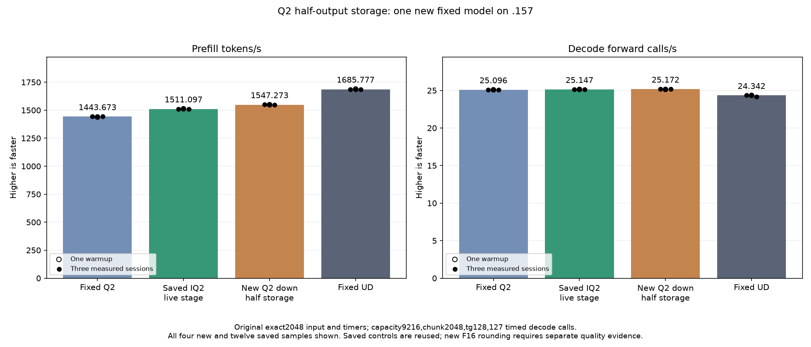

<!-- SPDX-License-Identifier: MIT -->
# Compact Q2 expert-output storage

The completed original model measures **1547.273268 PP /25.17198641 TG**,
nominally **+2.394022% PP /+0.099966% TG** against the saved1511.097261 /
25.14684805 parent. PP is7.176169% above fixed Q2 1443.672867, and needs
another8.951478% to reach fixed UD1685.777092. The three PP samples are
1550.357345,1547.273268,1547.003322; warmup1549.284195 remains separate.

All saved output-token histories match the parent, and all nine within-arm
replays are exact. **Eight pp2048 logit files change**, with maximum matched-history
KL0.002693241666 against the parent. The tiny arithmetic/counting probes use
unchanged paths and do not qualify the new wide representation. Retain this
faster experiment and the1511 parent; independent task quality and complete
PP/TG curve parity are still open. No production default is promoted.
[Disposition](../config/q2-down-half-storage-disposition.json).

This experiment starts from the retained1511.097261 PP /25.14684805 TG
provider. It stores the inverse-scaled Q2 down result as F16 and consumes it
directly in the ordered F32 MoE/deferred-normalization kernel. At the fixed
2048-token/top10/hidden2560 shape, the logical output shrinks from200MiB to100MiB.
The existing allocation keeps its full capacity. These logical byte counts do
not measure actual DRAM traffic or allocation-peak savings. The model result
above supplies separate performance evidence.

The F16 store introduces one real rounding boundary. Original encoded weights,
activation scaling, WMMA accumulation, inverse-scale multiplication and expert
sum order are retained. Guarded output checks distinguish exact implementation
of that rounding from agreement with the F32 parent and independent model
quality. The parent remains available alongside the faster, numerically different experiment.

The new dispatch is limited to the Q2 wide2048 chain with HC4/rank320 and the
immediate block-output consumer. The existing F16-pending lifetime owns the
buffer; a separate Q2 marker selects the new consumer and is cleared when
consumed or scratch is replaced. Other shapes and scalar decode retain their
original dispatch. There are no new allocations, streams, model conversions,
core ABI/state/metrics changes or production deployment.

The isolated [source](../config/q2-down-half-storage-source.json) derives from
independently fetched official Gufo pin
`f783fedb9bea2ec7de941f6da4e02f4a4596b29e`, retaining its notices. It has1026
files: five existing files change and one numerical include is added. The
generator derives the new bodies from the literal parent, rather than
reimplementing its arithmetic. All157 original production kernels retain exact
instructions, operands and resources after removing only comments and local
function-label numbering. Four specializations are added with zero private
bytes. [Static report](../config/q2-down-half-storage-static.json).

The component covers315 down-output comparisons across ragged token/output
tails, BN16/48/64 and three rotated weight sets. An independent integer
binary32-to-binary16 RN-even conversion checks every stored output. Another99
comparisons run the original consumer on expanded rounded values against the
new half consumer, checking residuals, normalization scales and half inputs.
Parent differences remain recorded separately. Guard corruption or unwritten
required outputs stop further device work; safe numerical rejection retains
timing and does not suppress the new original-model performance test.

All 168 timing observations complete: down alone and down plus combine,
BN48/64,64/128/512 experts, two arms, two warmups and five measured samples.
Each sample rotates three weight sets exceeding32MiB. Input preparation,
uploads and residual reset are outside component timers; the full model
includes all original inference work.

The [v2 plan](../config/q2-down-half-storage-plan-v2.json) freezes64 fixture
files and four manifests. Original exact2048/tg128/C1/greedy/MTP-off input,
capacity9216/chunk2048, one warmup and three measured sessions stay unchanged.
Fixed Q2 1443.672867, parent1511.097261 and UD1685.777092 use saved evidence;
none is rebuilt or rerun. Full context/concurrency curves and Q4 remain deferred.

The first local staging exits2 because an inherited launcher count expected
1025 source files instead of the new1026. It refuses before SSH; source bytes
and manifests are unchanged. The corrected capsule verifies all64 fixtures
and1026 provider files;117 launcher guards pass. The original plan/failure
are retained. Separate .157 host checks pass27 Debug and27 ASan/UBSan tests,
with six zero exits and seven verified artifacts.
[Host receipt](../config/q2-down-half-storage-host-results.json).

Fresh coordinated admission preceded the remote HIP build and run. The
completed results below supersede the preparation plan's runtime-pending fields.
Independent task quality remains open; no future lease or reservation is inherited.

## Component result

All315 complete down outputs match the independent integer RN-even conversion; all99 half consumers match the original consumer fed expanded rounded values. There are no nonfinite outputs or guard/unwritten failures. This does not establish equality with the F32 parent: all99 parent consumer comparisons differ. Maximum relative L2 on the2048-token distributions is0.000207501668 (0.0207502%). The worst relative edge case is0.129730166511 on one near-zero output, with absolute error2.73782916338e-8; the largest absolute error across all cases is0.001952171326. These representation changes remain visible and require model/task evidence.

Across six rotated-weight distributions, down alone saves8.2258–15.9848% elapsed time; down plus ordered combine saves14.5983–18.6491%. All three component commands exit0/four artifacts verify. These are synthetic operator times, not model tokens/s. [Rounding review](../config/q2-down-half-storage-rounding-review.json), [complete component report](../config/q2-down-half-storage-component-results.json).

## Completed GPU component and original model — 2026-10-05 UTC

All315 guarded down rounding checks and99 consumer comparisons are retained;168 timings cover two scopes and six rotated-weight distributions. The F16 storage boundary changes the parent representation. Positive time changes mean slower.

| Scope / distribution | Reference median us | Candidate median us | Time change |
| --- | ---: | ---: | ---: |
| down / mixed-w48-e64 | 3229.243596 | 2815.715472 | -12.805727% |
| down / mixed-w48-e128 | 3275.355657 | 2874.394099 | -12.241772% |
| down / mixed-w48-e512 | 3833.674113 | 3496.757825 | -8.788339% |
| down / mixed-w64-e64 | 3081.872622 | 2629.115264 | -14.690982% |
| down / mixed-w64-e128 | 3444.448471 | 2893.859545 | -15.984821% |
| down / mixed-w64-e512 | 3826.123238 | 3511.393229 | -8.225820% |
| down-combine / mixed-w48-e64 | 5454.551061 | 4494.793892 | -17.595530% |
| down-combine / mixed-w48-e128 | 5482.629776 | 4537.092845 | -17.246047% |
| down-combine / mixed-w48-e512 | 6034.845352 | 5133.053780 | -14.943077% |
| down-combine / mixed-w64-e64 | 5295.296669 | 4326.019923 | -18.304484% |
| down-combine / mixed-w64-e128 | 5648.829142 | 4595.370928 | -18.649143% |
| down-combine / mixed-w64-e512 | 6018.867493 | 5140.212377 | -14.598346% |

The original model follows the completed guarded component; safe numerical or timing rejection would not suppress its performance measurement. All three comparator columns below are saved evidence, without rebuild or rerun.

| Session | Fixed Q2 PP / TG | Saved best PP / TG | New half storage PP / TG | Fixed UD PP / TG |
| --- | ---: | ---: | ---: | ---: |
| Warmup | 1438.259006 / 25.08847266 | 1512.689655 / 25.13929840 | 1549.284195 / 25.13752662 | 1689.043527 / 24.34239962 |
| Measured 1 | 1443.398207 / 25.10565683 | 1508.605796 / 25.14044870 | 1550.357345 / 25.19031151 | 1686.364042 / 24.34621613 |
| Measured 2 | 1443.672867 / 25.08698337 | 1512.288237 / 25.14684805 | 1547.273268 / 25.16541178 | 1685.777092 / 24.34174251 |
| Measured 3 | 1443.841794 / 25.09595499 | 1511.097261 / 25.14869047 | 1547.003322 / 25.17198641 | 1685.400011 / 24.15102104 |
| Median measured | 1443.672867 / 25.09595499 | 1511.097261 / 25.14684805 | 1547.273268 / 25.17198641 | 1685.777092 / 24.34174251 |

Eight parent logit files change; token files remain exact. All nine within-arm
replays are exact. PP changes +2.394022% versus the saved parent.

Resident model memory remains43,156,012,544 bytes. Compilation/loading stay outside PP/TG. Independent task quality and the context/concurrency curve remain open. The window releases at2026-10-05T12:25:17.460508+00:00 with910 retired identities/722 groups, empty KFD, four free original leases and unchanged seven model stat tuples. All37 artifacts verify across13 runtime commands; canonical/main/remote mirrors agree.

[All model samples](figures/q2-down-half-storage-model-wrapped.csv), [all component samples](figures/q2-down-half-storage-component.csv), [final audit](../config/q2-down-half-storage-final-audit.json).

Observed peaks including build/load are CPU 69 C / GPU 48 C for the
component and CPU 82.75 C / GPU 73 C for the model cohort. No thermal stop
occurs. All runtime commands exit zero; the local staging refusal is recorded
separately.
