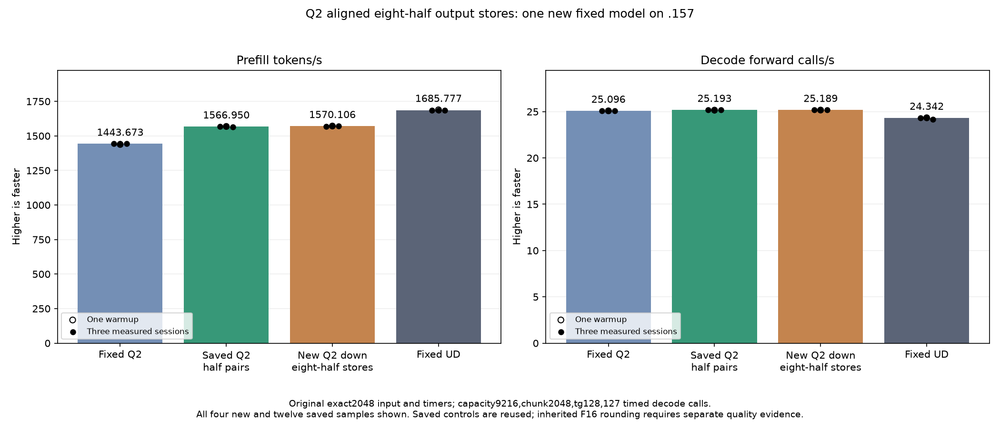

<!-- SPDX-License-Identifier: MIT -->
# Eight-half Q2 output stores

The completed original model measures **1570.106384 PP /25.18915597 TG**,
nominally **+0.201424% PP /−0.013635% TG** against retained1566.950178 /
25.19259094. The prefill increase is small:3.156206 tokens/s. All21 saved
parent model files and nine internal replays are exact. Retain both sources;
the inherited F16 quality gap remains open. PP is8.757768% above fixed Q2 and
still needs7.367062% to reach fixed UD1685.777092. No full-curve parity follows.
[Disposition](../config/q2-down-half-vector-disposition.json).

All720 guarded down comparisons and108 ordered-consumer comparisons pass.
The six down medians improve0.230856–7.029040%; five have nonoverlapping
observed ranges. Down+combine improves in five cases, while BN48/512 experts
changes+0.039167% time with overlapping ranges. All168 samples are retained.
The new model PP samples1569.317501/1572.043501/1570.106384 exceed the saved
parent's observed range; this historical comparison does not establish
contemporaneous causal repeatability. Scalar decode dispatch is unchanged.

All13 runtime commands exit0/37 artifacts verify. Collection completes at
13:22:03.476793UTC before release13:22:07.300470UTC. Release retires942
identities/748 groups, with empty KFD, four free original leases and seven
model stats unchanged. Canonical/main/remote mirrors match and root is notified.
No Q2 GPU job, lease, reservation, waiter, restart or cleanup remains. Completed
results below supersede preparation-pending fields; no runtime default is promoted.

This candidate starts from the measured half-pair model at 1566.950178 PP /
25.19259094 TG. When the output base is 16-byte aligned and the row width is
divisible by eight, each lane copies eight existing half values with one
128-bit LDS load and one 128-bit global store. Two lanes cover a token's
16-value wave-local tile row. The retained four-round paired store is the
fallback for all other bases and widths. Neither arithmetic nor rounding,
routing, consumer layout, allocations, streams or barriers change.

The output index and row width are multiples of eight on the vector branch,
so a live starting index implies all eight values are inside the output row.
The shared allocation is explicitly aligned to 16 bytes; wave offsets are
512 bytes and vector offsets are 16-byte multiples. Invalid token slots skip
both the producer and consumer. The fixture tests output base offset 68,
which satisfies the parent's half2 alignment but requires the new fallback.

Only `q2_down_half_storage.inc` changes among the 1026 provider files.
The [static report](../config/q2-down-half-vector-static.json) verifies 158
unchanged bodies and three changed half-down bodies. BN16/48/64 retain
85/96/104 VGPR, 14464/18560/20608 LDS bytes and zero private scratch.
The compiler emits one/three/four new 128-bit global stores for those widths.
Whole-body instruction counts grow 1153→1209, 2321→2482 and 2921→3131
because both the new aligned route and retained fallback are present.
Static body totals do not count executed work or establish a speedup.

The new component includes a literal measured1566 parent template. It checks
720 complete guarded down pairs and 108 ordered-consumer pairs, including
BN16/48/64, narrow/odd/aligned row widths, partial token tiles and unaligned
output bases. The unchanged F32 down path and independent integer RN-even
conversion remain additional format evidence. Both timed arms use the same
half representation and unchanged consumer. There are 168 timing samples
over six full distributions, two scopes and three rotated weight sets beyond
cache capacity. Guard or unwritten-output failure stops device work; safe
numerical differences preserve output arrays and timings.

The [plan](../config/q2-down-half-vector-plan.json) freezes 68 fixture files
and four manifests. Only the new candidate runs the original exact2048,
context9216/chunk2048, tg128/127 timed-decode-call, MTP-off model comparison,
with one warmup and three measured samples. Saved Q2, UD and1566 parent
evidence are reused. No Q4 or full-curve rerun is scheduled.

The original half-storage precision change remains independently unqualified.
Exact agreement with1566 would preserve its arithmetic, not establish task
quality or full-curve parity. No runtime default is promoted by preparation.

Local gfx1151 assembly, host/device syntax and121 launcher guards pass.
The .157 CPU-only gate passes27 Debug and27 ASan/UBSan checks, with all six
commands exiting0 and seven artifacts verified. Component and original-model
results are pending. A fresh window
must validate the previous release
`f2415f576f49438911a070b53fd43fb2b937e83a7837854a916fb4e1fe2092e9` and the
coordination protocol before remote GPU build or execution. No prior lease
is inherited and no cleanup is scheduled.

## Completed GPU component and original model — 2026-10-05 UTC

All720 guarded down comparisons and108 consumer comparisons are retained;168 timings cover two scopes and six rotated-weight distributions. Both timed arms use the same F16 representation; the F32 path supplies an additional independent rounding check. Positive time changes mean slower.

| Scope / distribution | Reference median us | Candidate median us | Time change |
| --- | ---: | ---: | ---: |
| down / mixed-w48-e64 | 2550.140381 | 2462.132295 | -3.451107% |
| down / mixed-w48-e128 | 2594.452381 | 2518.040975 | -2.945184% |
| down / mixed-w48-e512 | 3270.542463 | 3262.992223 | -0.230856% |
| down / mixed-w64-e64 | 2325.295607 | 2161.849658 | -7.029040% |
| down / mixed-w64-e128 | 2606.498718 | 2462.258975 | -5.533851% |
| down / mixed-w64-e512 | 3282.185237 | 3257.889430 | -0.740233% |
| down-combine / mixed-w48-e64 | 4238.824844 | 4140.090624 | -2.329283% |
| down-combine / mixed-w48-e128 | 4246.634801 | 4174.476624 | -1.699185% |
| down-combine / mixed-w48-e512 | 4902.215004 | 4904.135068 | +0.039167% |
| down-combine / mixed-w64-e64 | 4007.644018 | 3846.051216 | -4.032115% |
| down-combine / mixed-w64-e128 | 4297.580083 | 4157.306989 | -3.264002% |
| down-combine / mixed-w64-e512 | 4914.708455 | 4890.978813 | -0.482829% |

The original model follows the completed guarded component; safe numerical or timing rejection would not suppress its performance measurement. All three comparator columns below are saved evidence, without rebuild or rerun.

| Session | Fixed Q2 PP / TG | Saved best PP / TG | New vector stores PP / TG | Fixed UD PP / TG |
| --- | ---: | ---: | ---: | ---: |
| Warmup | 1438.259006 / 25.08847266 | 1568.804018 / 25.16422103 | 1571.703662 / 25.17153751 | 1689.043527 / 24.34239962 |
| Measured 1 | 1443.398207 / 25.10565683 | 1567.287254 / 25.19259094 | 1569.317501 / 25.18109739 | 1686.364042 / 24.34621613 |
| Measured 2 | 1443.672867 / 25.08698337 | 1566.950178 / 25.16572880 | 1572.043501 / 25.19560864 | 1685.777092 / 24.34174251 |
| Measured 3 | 1443.841794 / 25.09595499 | 1564.061685 / 25.19837357 | 1570.106384 / 25.18915597 | 1685.400011 / 24.15102104 |
| Median measured | 1443.672867 / 25.09595499 | 1566.950178 / 25.19259094 | 1570.106384 / 25.18915597 | 1685.777092 / 24.34174251 |

There are0 changed parent model files. Within-arm replay is exact=True. PP change versus saved best=+0.201424%.

Resident model memory remains43,156,012,544 bytes. Compilation/loading stay outside PP/TG. Independent task quality and the context/concurrency curve remain open. The window releases at2026-10-05T13:22:07.300470+00:00 with942 retired identities/748 groups, empty KFD, four free original leases and unchanged seven model stat tuples. All37 artifacts verify across13 runtime commands; canonical/main/remote mirrors agree.

[All model samples](figures/q2-down-half-vector-model-wrapped.csv), [all component samples](figures/q2-down-half-vector-component.csv), [final audit](../config/q2-down-half-vector-final-audit.json).
