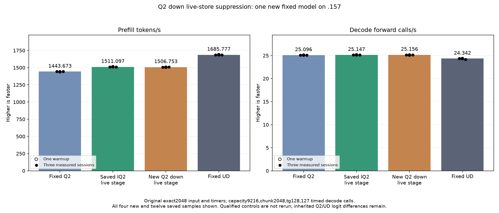

<!-- SPDX-License-Identifier: MIT -->
# Unread activation stores in scaled-Q2 down

The completed new model measures **1506.753016 PP /25.15614684 TG**,
nominally-0.287489% PP/+0.036978% TG versus saved1511.097261 /25.14684805.
All477 component pairs,21 parent model files and nine internal replays are
exact. Component medians change between-0.253682% and+0.033892%; this test
establishes no whole-model gain. Keep the1511 parent and preserve this negative
result. Historical sample overlap prevents a stable causal-regression claim.

This new candidate starts from the measured IQ2 live-stage composition,
1511.097261 PP /25.14684805 TG. The active scaled-Q2 down matrix loop already
skips whole16-row fragments beyond an expert bucket, but its activation loader
still stores zero tiles there in every K stage. The patch computes slot
eligibility once and omits those stores at BN48/64. BN16, padding inside the
final live fragment, original640/768 K-tail handling, affine weights, ordered
WMMA, inverse scaling and F32 scatter remain unchanged.

Source derives from independently fetched official Gufo at
`f783fedb9bea2ec7de941f6da4e02f4a4596b29e`, keeping its notices. The isolated
[source inventory](../config/q2-down-live-stage-source.json) has1025 files,
with one changed. A literal parent kernel remains inside the new component
fixture. This is a new down-consumer experiment; the old IQ2 component is not
used as its GPU qualification.

Local production compilation changes only the two scaled-Q2 down bodies;
all155 others remain exact. Both bodies retain their VGPR, SGPR and LDS
allocation, original arithmetic/barrier counts and zero private bytes.
[Static report](../config/q2-down-live-stage-static.json). Those static facts
do not prove a GPU speedup or race freedom.

The new component checks477 whole-output pairs over three rotated weight sets:
BN16/48/64, token counts around16/32/48/64/96 boundaries, partial output rows,
and the original2048x2560x640 top10 shape with64/128/512 experts at both wide
tile sizes. Guard bytes, every required output, finite values and original
input/weight immutability are checked. It retains changed arrays on numerical
failure; a damaged guard or unwritten output stops further device work.

The six timed distributions alternate literal-parent and candidate calls in
one new binary, with two warmups and five measurements, three rotated weights
per sample. Rotation sizes are123,863,040 /247,726,080 /990,904,320 bytes.
Preparation/uploads are outside that component timer. The full model includes
all original inference preparation and runs even after a safe numerical or
component-timing rejection.

The [plan](../config/q2-down-live-stage-plan.json) freezes63 fixture files,
five manifests and one new original-model comparison: exact2048 input,
chunk2048, capacity9216, tg128 with127 timed decode calls, C1, greedy, MTP off,
one warmup and three measurements. Fixed Q2 1443.672867 /25.09595499,
UD1685.777092 /24.34174251 and parent1511.097261 /25.14684805 are saved evidence;
none is rebuilt or rerun. New launcher115 guards and capsule checks pass.
The .157 host cohort passes27/27 Debug and27/27 ASan/UBSan; all six commands
exit zero and seven collected artifacts verify.
[Host receipt](../config/q2-down-live-stage-host-results.json).

At preparation, GPU numerics/performance remain unproven. Model outputs,
complete samples and a comparison graph are required. Full PP/TG curve parity
and independent task quality remain open. GPU work needs fresh coordinated
admission on .157; no Q4, full curve, cleanup, dependency installation, tuning
or deployment is part of this experiment. Core ABI, state and metrics are unchanged.

Model-cohort observed peaks, including build/load, are 85.375 C CPU and 77.0 C GPU; no thermal stop occurs. The premature read-only event lookup exits1 while the build is live because04.log does not yet exist. Its original observation is retained; availability handling is corrected without restarting the job. All13 actual host/component/model commands exit0. [Disposition and telemetry](../config/q2-down-live-stage-disposition.json).

## Completed GPU component and original model — 2026-10-05 UTC

All477 guarded output pairs are retained;84 timings cover six rotated-weight distributions. Positive time changes mean slower.

| Distribution | Reference median us | Candidate median us | Time change |
| --- | ---: | ---: | ---: |
| mixed-w48-e64 | 3236.728986 | 3232.635816 | -0.126460% |
| mixed-w48-e128 | 3264.408429 | 3262.488047 | -0.058828% |
| mixed-w48-e512 | 3776.210467 | 3777.490298 | +0.033892% |
| mixed-w64-e64 | 3123.291334 | 3123.211225 | -0.002565% |
| mixed-w64-e128 | 3453.070958 | 3444.311142 | -0.253682% |
| mixed-w64-e512 | 3787.130038 | 3786.930084 | -0.005280% |

The original model benchmark runs despite component timing rejection. All three comparator columns below are saved evidence, without rebuild or rerun.

| Session | Fixed Q2 PP / TG | Saved best PP / TG | New down live stage PP / TG | Fixed UD PP / TG |
| --- | ---: | ---: | ---: | ---: |
| Warmup | 1438.259006 / 25.08847266 | 1512.689655 / 25.13929840 | 1506.530076 / 25.08730500 | 1689.043527 / 24.34239962 |
| Measured 1 | 1443.398207 / 25.10565683 | 1508.605796 / 25.14044870 | 1506.381758 / 25.15402615 | 1686.364042 / 24.34621613 |
| Measured 2 | 1443.672867 / 25.08698337 | 1512.288237 / 25.14684805 | 1506.753016 / 25.18935303 | 1685.777092 / 24.34174251 |
| Measured 3 | 1443.841794 / 25.09595499 | 1511.097261 / 25.14869047 | 1509.414004 / 25.15614684 | 1685.400011 / 24.15102104 |
| Median measured | 1443.672867 / 25.09595499 | 1511.097261 / 25.14684805 | 1506.753016 / 25.15614684 | 1685.777092 / 24.34174251 |

There are0 changed parent model files. Within-arm replay is exact=True. PP change versus saved best=-0.287489%.

Resident model memory remains43,156,012,544 bytes. Compilation/loading stay outside PP/TG. Independent task quality and the context/concurrency curve remain open. The window releases at2026-10-05T11:47:01.122226+00:00 with894 retired identities/709 groups, empty KFD, four free original leases and unchanged seven model stat tuples. All37 artifacts verify across13 runtime commands; canonical/main/remote mirrors agree.

[All model samples](figures/q2-down-live-stage-model-wrapped.csv), [all component samples](figures/q2-down-live-stage-component.csv), [final audit](../config/q2-down-live-stage-final-audit.json).
