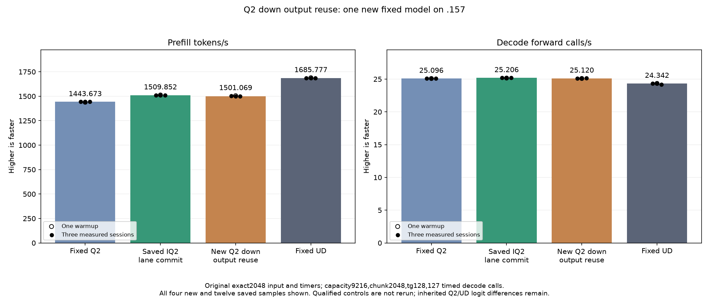

<!-- SPDX-License-Identifier: MIT -->
# Scaled Q2 down output-row reuse

The completed experiment measures1501.068984 PP /25.11985944 TG. Prefill
regresses0.581733% against the saved1509.852296 parent despite135 exact
component output pairs and21 exact parent model files. The parent remains
the next composition source; the wider down tile and all samples are retained
as negative evidence. These results supersede the preparation status below.

One new candidate starts from the retained nominal 1509.852296 PP parent.
It changes only the scaled Q2 down BN48 dispatch from BM128 to BM256. The
generic numerical template is unchanged; each wave now handles two output
fragments that share the same activation stage. At M2560 the output grid
shrinks from 20 to 10 blocks. Useful matrix operations and weight decoding
are not eliminated. Larger register and LDS demands may outweigh reuse.

Original encoded Q2_K weights, the scaled-half activation plane, inverse row
scale, ordered K16 WMMA updates, F32 scatter and logical640/stored768 tail are
unchanged. BN16/64 down, IQ2 gate/up, dense, attention and scalar decode retain
their original dispatches. Earlier scaled-tile experiments changed token width
BN while retaining BM128; this output-row change is a distinct mechanism.
The completed IQ2 wide-pair regression is a different kernel and is excluded
from this candidate's lineage.

Only `q2_scaled_input.inc` changes among 1025 provider files. Source derives
from independently fetched official Gufo at
f783fedb9bea2ec7de941f6da4e02f4a4596b29e and the recorded LIE patches. No
sibling DS4 source or artifact is imported. The literal measured parent
template is compiled into the new fixture as its same-process control; old
qualified model binaries and cohorts are not rebuilt or rerun.

## Static comparison

Production assembly replaces one specialization and preserves 156 bodies
exactly. The retained parent's assembly is reused without compilation.

| Resource | Parent BM128 | Candidate BM256 |
| --- | ---: | ---: |
| Output rows per block | 128 | 256 |
| Next-free VGPR | 96 | 169 |
| LDS bytes | 18560 | 30848 |
| Private bytes | 0 | 0 |
| Static block barriers | 8 | 8 |
| Static WMMA instructions per body | 12 | 24 |

The candidate performs twice the output work per block. Static instruction
counts do not measure executed traffic or active-wave occupancy. Production
assembly, fixture host/device compilation and all 111 launcher guards pass;
GPU numerical and performance results are still pending at preparation.

The fresh .157 host cohort passes27 Debug and27 ASan/UBSan checks. All six
commands exit zero and seven artifacts verify. Local staging binds61 frozen
fixture files and all1025 provider files. Root confirms fresh non-use after
release73a6cae4; a source checkpoint and own admission are still required
before any remote HIP build or GPU execution.

## Frozen experiment

The new fixture calls the production `RoutedQ2ScaledGemm` dispatcher, covering
135 complete guarded output pairs: n1/17/47/48/49/129 crossed with
m1/127/129/255/256/257/2560 at K640, plus the actual2048x2560x640 down shape
with top10 and64/128/512 experts, each across three weight rotations. The
rotations exceed32MiB for every timed shape. Two warmups and five alternating
measurements retain42 timing records. Guards and required-output coverage
must pass; safe numerical or timing rejection still permits the model test.

One original exact2048/tg128 model follows. Capacity9216, chunk2048, greedy
C1, MTP off, one warmup/three measured sessions and127 timed decode calls stay
fixed. Compilation, loading and15-second cooldowns remain outside PP/TG.
Fixed Q2 1443.672867, retained parent1509.852296 and fixed UD1685.777092
results are reused. No Q4, full curve, cleanup, tuning or dependency change.
Independent task quality and full PP/TG parity remain open.

[Source](../config/q2-down-output-reuse-source.json),
[patch](../experiments/q2-down-output-reuse.patch),
[static comparison](../config/q2-down-output-reuse-static.json),
[frozen plan](../config/q2-down-output-reuse-plan.json),
[host results](../config/q2-down-output-reuse-host-results.json),
[local staging](../config/q2-down-output-reuse-staging-results.json),
[original opportunity](../config/q2-down-output-reuse-opportunity.json).

## Completed GPU component and original model — 2026-10-05 UTC

All135 guarded output pairs are exact;42 timings cover three rotated-weight
distributions. Positive time changes mean slower.

| Distribution | Reference median us | Candidate median us | Time change |
| --- | ---: | ---: | ---: |
| mixed-e64 | 3236.572266 | 3151.814779 | -2.618742% |
| mixed-e128 | 3243.545532 | 3293.837229 | +1.550516% |
| mixed-e512 | 3808.462461 | 3953.605016 | +3.811054% |

The original model benchmark runs despite component timing rejection. All three comparator columns below are saved evidence, without rebuild or rerun.

| Session | Fixed Q2 PP / TG | Saved best PP / TG | New output reuse PP / TG | Fixed UD PP / TG |
| --- | ---: | ---: | ---: | ---: |
| Warmup | 1438.259006 / 25.08847266 | 1512.701776 / 25.15742671 | 1505.340493 / 25.09598536 | 1689.043527 / 24.34239962 |
| Measured 1 | 1443.398207 / 25.10565683 | 1510.259601 / 25.20649263 | 1503.446273 / 25.10876819 | 1686.364042 / 24.34621613 |
| Measured 2 | 1443.672867 / 25.08698337 | 1509.852296 / 25.17944517 | 1500.058918 / 25.11985944 | 1685.777092 / 24.34174251 |
| Measured 3 | 1443.841794 / 25.09595499 | 1508.620907 / 25.20625148 | 1501.068984 / 25.13518725 | 1685.400011 / 24.15102104 |
| Median measured | 1443.672867 / 25.09595499 | 1509.852296 / 25.20625148 | 1501.068984 / 25.11985944 | 1685.777092 / 24.34174251 |

All21 parent model files and nine within-arm replays are exact. PP changes
-0.581733% versus saved best; TG changes-0.342741%. Scalar decode kernels are
unchanged, so that small historical timing difference is not attributed to the
prefill tile. The component's improvement with64 experts is preserved, but the
unconditional BM256 dispatch has no complete-model advantage.

Resident model memory remains43,156,012,544 bytes and session memory376,777,748
bytes. Compilation/loading stay outside PP/TG. CPU/GPU telemetry maxima are
83.625/73C across the model cohort including compilation; no thermal stop
occurs. Independent task quality and the context/concurrency curve remain open.
Release at2026-10-05T11:03:17.478662 UTC verifies866 retired identities/686
groups, empty KFD, four free original leases and seven unchanged model stat
tuples. All37 artifacts verify across13 runtime commands; canonical/main/remote
mirrors agree. No Q4, full curve or qualified-comparator rerun occurs.

[All model samples](figures/q2-down-output-reuse-model-wrapped.csv), [all component samples](figures/q2-down-output-reuse-component.csv), [final audit](../config/q2-down-output-reuse-final-audit.json).
