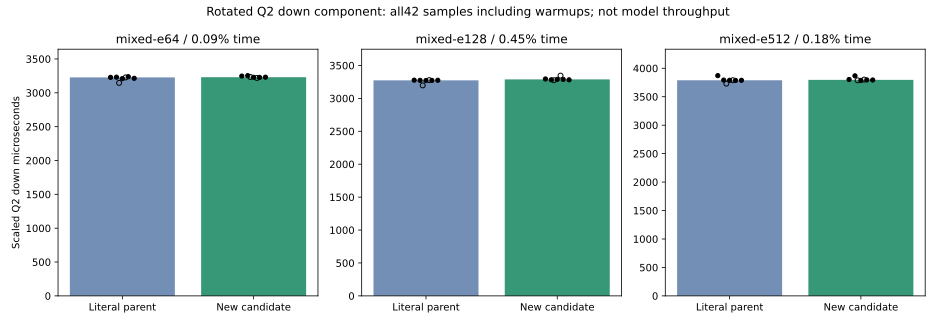
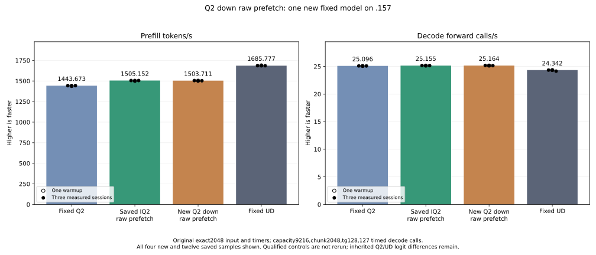

<!-- SPDX-License-Identifier: MIT -->
# Deferred extraction in scaled Q2 down prefill

One new candidate starts from the retained IQ2 raw-prefetch composition at
1505.152258 PP /25.15493858 TG. It changes the three scaled Q2_K down prefill
specializations only. The original 32 code bytes, affine scale bits and half
headers are fetched at the same frequency; bitplane shifts and masks move from
fetch into LDS commit. Affine arithmetic, half construction, K16 WMMA order,
inverse row scale and final outputs remain unchanged. No new cache, allocation,
table, stream, public ABI, state or metrics contract is introduced.

The saved profile places 188.348921 milliseconds in this projection across
48 calls on the fixed model point. That profile identifies a target; it is
neither a current candidate timing nor proof of a speedup.

Local matched assembly reuses the saved parent without a rebuild. It verifies
157 bodies: three scaled Q2 bodies change and the remaining 154 are exact,
including the retained IQ2 raw-prefetch bodies. Private scratch stays zero and
LDS is unchanged:

| Token tile | Parent / new instructions | Parent / new next-free VGPR | LDS bytes |
| ---: | ---: | ---: | ---: |
| 16 | 1058 /1028 |86 /85 |14464 |
| 48 | 2551 /2529 |96 /95 |18560 |
| 64 | 3225 /3201 |104 /103 |20608 |

Static reductions remove duplicated initial/loop extraction bodies; source
bytes and dynamic fetch frequency are unchanged. They establish no occupancy,
bandwidth or inference gain. The first static stdout summary incorrectly says
eight changed bodies, while all checks and the saved report correctly identify
three. Its original stdout is retained; the display-only correction does not
rerun compilation or rewrite the report.

The new fixture compares 117 complete guarded output pairs against a literal
copy of the retained parent. Cases cover BN16/48/64, token counts1/15/17/129,
output row tail129 and K128/256/640, then original-shape2048x2560x640/top10
with64/128/512 active experts. It checks original inputs unchanged after each
case, all required outputs finite/written, and output guard bytes. Upload,
poison, launch and readback share one nonblocking stream.

Three distinct original-Q2 weight rotations occupy123863040 /247726080 /
990904320 bytes, above32MiB MALL. Forty-two alternating observations include
two warmups and five measured samples per arm/shape; device event timers exclude
uploads, maps and allocation. They measure down projection only, not whole MoE
or model throughput. Numeric failures preserve arrays and timing. Guard/runtime
faults stop device work; any safe numerical/timing verdict still proceeds to
the original model performance measurement requested by the owner.

The comparison remains original exact2048/tg128,127 timed decode calls,
capacity9216/chunk2048,MTP off,one warmup and three measured sessions with
15-second waits outside timers. Fixed Q2 PP1443.672867 /TG25.09595499, fixed UD
PP1685.777092 /TG24.34174251 and saved parent PP1505.152258 /TG25.15493858
are reused without rerunning their builds, cohorts or inference. No full context
curve, cleanup, tuning, deployment or dependency installation is admitted.

Local production/fixture device compilation, host syntax,89 launch guards and
new-file formatting pass. The shared formatter retains exit1 for nine unchanged
inherited files.1024 packed bitplane checks match independent byte extraction.
All38 fixture hashes,four manifest hashes and1025 provider files are frozen.
A local staging preflight verifies the complete component capsule and stops
before SSH, with zero network calls or GPU work. New `.157` host qualification passes25/25 Debug and25/25 ASan/UBSan,
with six zero command exits,seven artifacts and all38 frozen files verified.
These tests access neither models nor GPU. Fresh coordinated admission is
still required before the component build/run or original model.

At the initial preparation checkpoint no new GPU component or original model had run.
Compilation and host checks are not numerical acceptance or performance evidence.
The existing IQ2 raw-prefetch composition remains the measured base.

[Frozen plan](../config/q2-down-raw-prefetch-plan.json),
[source inventory](../config/q2-down-raw-prefetch-source.json),
[static evidence](../config/q2-down-raw-prefetch-static.json),
[staging evidence](../config/q2-down-raw-prefetch-staging-results.json),
[patch](../experiments/q2-down-raw-prefetch.patch),
[literal parent](../experiments/q2-down-raw-prefetch-control.inc),
[new fixture](../tests/q2_down_raw_prefetch.hip).

## Component measurement completed

The new component finishes04:33:15.993737UTC with three zero command exits.
Four artifacts,38 frozen fixtures and1025 provider files verify. All117 output
pairs are exact, finite/written and guarded. The changed extraction order adds
no observed speedup in these component shapes; the original model test still
follows as requested.

| Active experts | Literal parent median microseconds | New median microseconds | Time change |
| ---: | ---: | ---: | ---: |
| 64 |3227.793694 |3230.780284 |+0.092527% |
| 128 |3273.713112 |3288.285891 |+0.445145% |
| 512 |3788.752874 |3795.672735 |+0.182642% |

All42 alternating samples, including warmups, remain in the
[CSV](figures/q2-down-raw-prefetch-component.csv) and
[component report](../config/q2-down-raw-prefetch-component-results.json).
No qualified historical component or model control is rerun.

## Completed original-weight comparison

One new candidate is measured with the original fixed input and tester; all26 artifacts,38 frozen fixtures and1025 provider files verify. The four command exits are zero.

| Arm | Sample | PP tokens/s | TG calls/s | PP seconds | TG seconds |
| --- | --- | ---: | ---: | ---: | ---: |
| Fixed Q2, saved |Warmup |1438.259006 |25.08847266 |1.423943804 |5.062085753 |
| Fixed Q2, saved |Measured 1 |1443.398207 |25.10565683 |1.418873870 |5.058620886 |
| Fixed Q2, saved |Measured 2 |1443.672867 |25.08698337 |1.418603928 |5.062386263 |
| Fixed Q2, saved |Measured 3 |1443.841794 |25.09595499 |1.418437954 |5.060576497 |
| IQ2 raw parent, saved |Warmup |1501.690147 |25.15123490 |1.363796655 |5.049453854 |
| IQ2 raw parent, saved |Measured 1 |1505.152258 |25.16777240 |1.360659687 |5.046135906 |
| IQ2 raw parent, saved |Measured 2 |1503.530071 |25.14904438 |1.362127728 |5.049893669 |
| IQ2 raw parent, saved |Measured 3 |1505.315370 |25.15493858 |1.360512249 |5.048710399 |
| New Q2 down |Warmup |1502.509384 |25.15805726 |1.363053051 |5.048084544 |
| New Q2 down |Measured 1 |1504.800741 |25.18703346 |1.360977533 |5.042277020 |
| New Q2 down |Measured 2 |1503.711045 |25.16358276 |1.361963794 |5.046976069 |
| New Q2 down |Measured 3 |1503.176527 |25.14959541 |1.362448098 |5.049783025 |
| Fixed UD, saved |Warmup |1689.043527 |24.34239962 |1.212520558 |5.217234208 |
| Fixed UD, saved |Measured 1 |1686.364042 |24.34621613 |1.214447147 |5.216416355 |
| Fixed UD, saved |Measured 2 |1685.777092 |24.34174251 |1.214869991 |5.217375049 |
| Fixed UD, saved |Measured 3 |1685.400011 |24.15102104 |1.215141798 |5.258576845 |

| Arm | Median PP tokens/s | Median TG calls/s | Median PP seconds | Median TG seconds |
| --- | ---: | ---: | ---: | ---: |
| Fixed Q2, saved |1443.672867 |25.09595499 |1.418603928 |5.060576497 |
| IQ2 raw parent, saved |1505.152258 |25.15493858 |1.360659687 |5.048710399 |
| New Q2 down |1503.711045 |25.16358276 |1.361963794 |5.046976069 |
| Fixed UD, saved |1685.777092 |24.34174251 |1.214869991 |5.217375049 |

New PP changes-0.095752% versus the saved parent and+4.158711% versus fixed Q2. The measured IQ2 raw-prefetch parent remains the next retained base. All candidate source, failures, samples and comparisons stay preserved; no default promotion or stable increment is established.

The retained base still requires12.000436% extra prefill throughput to match fixed UD; goal parity remains open. All21 parent input/output/full-logit files are exact and nine internal replay checks pass. The inherited Q2 versus original/UD logit differences remain; this is differential evidence, not independent task-quality qualification.

Fresh build/configure/ldd/model command durations are[2.027487, 153.751248, 0.520943, 97.78881]; build, loading and15-second waits stay outside PP/TG. GPU closure at2026-10-05T04:39:45.626957+00:00 verifies original leases, empty KFD, retired processes and unchanged model stats.

[Complete16-sample CSV](figures/q2-down-raw-prefetch-model-wrapped.csv), [model report](../config/q2-down-raw-prefetch-model-results.json), [retained disposition](../config/q2-down-raw-prefetch-retained-update.json) and [release](../config/q2-down-raw-prefetch-window-release.json) preserve full values.

Model-cohort telemetry reaches CPU84.375C and GPU77.000C; no sampled exposed/user threshold is exceeded. Only the CPU has the owner98C inclusive limit; no unsupported GPU limit is inferred.
