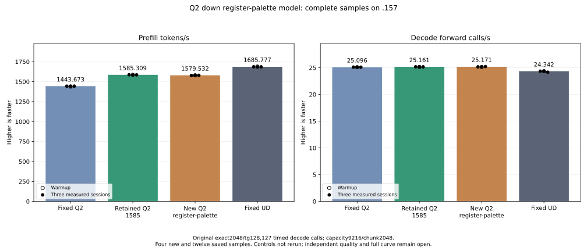

<!-- SPDX-License-Identifier: MIT -->
# Q2 down register-palette result

Keep **1585.308983 PP /25.16079073 TG**. The new down candidate completes
at **1579.532131 PP /25.17055431 TG**, nominal-0.364399% PP versus that saved
parent. All three new measured PP values are below the saved parent range.
The experiment is retained without promotion. Fixed UD remains1685.777092
PP /24.34174251 TG; the retained Q2 needs6.337447% more prefill throughput.
No qualified control or context curve is rerun.

The original exact2048/tg128 tester,128 outputs/127 timed decode calls,
capacity9216/chunk2048,C1 greedy,MTP off,one warmup/three measured sessions and
15-second cooldowns outside timers remain. Model compilation/loading are
excluded from PP/TG. Saved controls are historical cohorts, not contemporaneous
bookends or proof of a causal regression under matched instantaneous conditions.

| Arm | PP tokens/s | Prefill seconds | Decode calls/s | Decode seconds |
| --- | ---: | ---: | ---: | ---: |
| Saved fixed Q2 |1443.672867|1.418603928|25.09595499|5.060576497|
| Saved retained Q2 |1585.308983|1.291861727|25.16079073|5.047536119|
| New down register palette |1579.532131|1.296586476|25.17055431|5.045578196|
| Saved fixed UD |1685.777092|1.214869991|24.34174251|5.217375049|

| New sample | PP tokens/s | Prefill seconds | Decode calls/s | Decode seconds |
| --- | ---: | ---: | ---: | ---: |
| Warmup |1579.790625|1.296374322|25.11746341|5.056243058|
| Measured1 |1577.599898|1.298174526|25.15755518|5.048185290|
| Measured2 |1579.770045|1.296391210|25.17055431|5.045578196|
| Measured3 |1579.532131|1.296586476|25.20612279|5.038458356|

[CSV](figures/q2-down-register-palette-model.csv),
[PNG](figures/q2-down-register-palette-model.png),
[raw model and comparisons](../config/q2-down-register-palette-model-results.json).

## Scope and numerical checks

The1028-file provider changes only active BM128/BN48/BK2 Q2 down. It retains
original Q2_K bytes,scaled-half activation,input inverse scales,ordered WMMA
and F16 output. It replaces wave-private LDS code/affine staging with register
exchange and forms the same four-value rounded half palette once. Maps,grid,
eight waves,output transpose,allocations and model state remain unchanged.
The [static audit](../config/q2-down-register-palette-static.json) verifies161
other production bodies exact: LDS18560→8320,VGPR96→102,SGPR36→38,instructions
2641→2699,private0,WMMA12/barriers8 unchanged. Lower LDS did not establish
a useful model speed increase; the cause of the measured difference is not
isolated by resource records or the unavailable component timings.

All123 guarded component pairs are byte-exact,finite and fully written.
The41 cases cover affected BN48 tails,unchanged BN16/64 controls,inverse scales,
three weight rotations beyond32MiB,captured layers0/3/22 and immutable inputs.
All21 model files match retained1585 exactly; nine within-arm replays match.
Output tokens remain exact against saved Q2 and UD. Inherited matched-history
KL versus fixedQ2/UD remains0.001297699631/0.008794906721; the new candidate
introduces no observed parent drift in these frontiers. Independent task/model
quality remains open; differential equality is not upstream qualification.

## Invalid component timing and preserved orchestration failures

Every one of70 HIP elapsed values is zero despite API success. These timings
are rejected; no microbenchmark median or speed percentage is accepted. The
[component report](../config/q2-down-register-palette-component-results.json)
retains every raw zero and marks `component_timing_valid=false`. Its
[CSV](figures/q2-down-register-palette-component.csv) and
[figure](figures/q2-down-register-palette-component.svg) explicitly label the
timer unavailable. The cause remains unresolved. The model uses the unchanged
original wall timer, so its valid results above are retained independently.

The frozen analyzer initially rejects nonpositive timing; a first correction
also encounters the shared positive-only statistics guard. Both exit1 commands
remain. A separate bound analyzer records raw finite/nonnegative distributions,
marks the timing unusable and preserves every original numerical,guard,input,
geometry,artifact and ownership check. Frozen originals are unchanged. The
pre-admitted plan explicitly requires model measurement after safe timing or
numeric rejection. No component is rerun and no tolerance changes.

The original phase check then mistakes the last owned cohort end event for
the window event, refusing the model before its cohort exists. A separate
bound correction validates the latest admit/release event and rejects foreign
events since admission. Focused `.157` CTest1/1 passes two cases,including six
refusal subcases. Its first transport has a Python quoting SyntaxError before
any remote process/file/test starts; both the error and corrected driver remain.
The original SSH timeout/publication failure/no-route attempts remain. The
final audit classifies all10 failures as transport/orchestration/analysis,
not numerical/kernel failures, and retains their actual exit codes.

## Closure and next priority

Fresh host34+34,component and model yield13 zero primary command exits/37
verified artifacts. Supplemental registry CTest1/1 passes and its process/group
is revalidated retired before release. CPU/GPU peaks are84.375/74C with no
thermal stop. Resident43156012544,deferred7946240,session376777748 bytes remain.
All122 fixtures,13 manifests,1028 source files and both correction bindings
verify. Exports contain70 raw component and16 model/comparison samples; both
figures are visually checked.

Admission04:12:57UTC uses checkpoint `eeec6430`. The model finishes04:26:31UTC;
all three cohorts collect before release **04:27:46.757600UTC**, SHA
`e64145d666ce7ebcd470a7587a54979d6b11c8c909b073cc639c3d8071a652db`.
1351 primary/historical identities and1081 groups are retired,KFD empty,
four original leases free and seven model stat tuples unchanged. Canonical,
main and remote release-active-ready mirrors agree. Core receives closure
before local model analysis. No Q2 job,build,lease,waiter,reservation,restart,
remote cleanup or DS4 changes remain. Future GPU work needs fresh admission.

Next prioritize [HC normalized-input reuse](Q2-TARGET-PRIORITIES.md), starting
from retained1585 rather than this negative trial. Its private compiler probes
keep242VGPR/24576LDS/private0 and reuse inputs for injection,with increased
producer instructions/SGPRs. Full-cycle runtime replay/timing and executor
lifetime integration remain. The complete injection region was39.548835ms in
the saved1571 trace, so it cannot alone close the77ms budget. Full-row expert
producer/packing remains a separate larger redesign; its whole640-value scale
dependency must be preserved. Full curve,Q4 and independent quality stay open.

[Disposition](../config/q2-down-register-palette-disposition.json),
[final audit](../config/q2-down-register-palette-final-audit.json),
[source](../config/q2-down-register-palette-source.json),
[frozen plan](../config/q2-down-register-palette-plan-v2.json),
[release](../config/q2-down-register-palette-v2-window-release.json),
[provenance](../third_party/gufo/LIE-Q2-DOWN-REGISTER-PALETTE.md).
