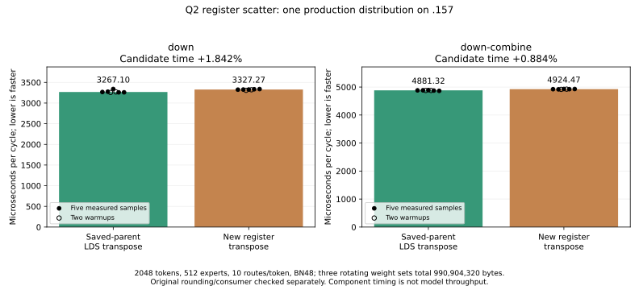
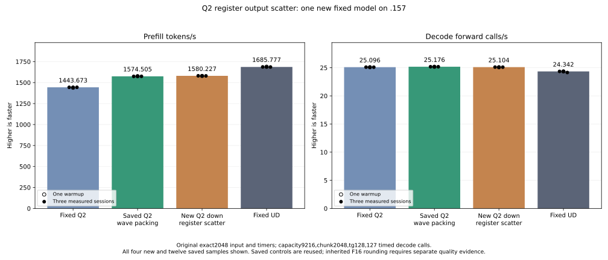

<!-- SPDX-License-Identifier: MIT -->
# Register transpose of Q2 half-output rows

The GPU component and original-model experiment are now complete. The new
candidate measures1580.226725 PP /25.10411864 TG at original exact2048/tg128,
nominal+0.363371% PP /-0.285080% TG versus saved1574.505432 /25.17589001.
All705 down pairs,93 consumer pairs and21 parent numerical files are exact.
Retain both sources and the new prefill candidate; independent inherited task
quality remains open. Fixed Q2/UD stay1443.672867 /1685.777092 PP; reaching UD
still requires6.679444% more PP. No control binary is rebuilt or replayed.
The preparation sections below retain the original scope and local evidence;
the completed execution is recorded at the end.

## Concrete mechanism

The retained half-down kernel restores its WMMA accumulators with the original
per-slot inverse scale and explicitly rounds each result to F16. It then writes
the halves into wave-private LDS, reads a transposed128-bit vector per lane,
and scatters that vector to its original token/expert slot. Eight waves reuse
4096 bytes of the larger matrix-stage LDS allocation for this epilogue.

The new aligned branch instead keeps the rounded half bits in four register
words per lane. Corresponding lanes in the two16-lane halves own alternating
columns of the same token. Each half sends the two words its partner needs;
two `permlanex16` instructions and bit interleaving form the contiguous eight
halves for one128-bit store. It removes this branch's LDS round trip and its
wave barriers, without changing the matrix-loop block barriers or allocated LDS.

The original multiply, F32 rounding anchor, RN-even half conversion, K/WMMA
order, routing and slot-major consumer contract stay intact. Both the output
base and row width must satisfy the existing128-bit-store alignment. Other
widths/bases use the retained LDS fallback. Invalid slots do not store; both
halves still execute the register exchange. For widths divisible by eight,
the final valid vector cannot cross the row boundary.

This is distinct from the already measured F32 block-wide scatter and the
half-wave weight decoder. It changes the output epilogue after arithmetic.
The earlier local four-word version remains preserved; only the two-word
candidate is prepared for GPU measurement. Fewer exchanges need not be faster:
selection instructions and the changed lane-to-store mapping can offset them.

## Local evidence

Both source variants derive independently from the retained1574 inventory.
Only `q2_down_half_storage.inc` changes among1027 provider files. Patch replay
reconstructs the changed file exactly; every other source hash stays fixed.
Comparison with the saved production assembly preserves159 of162 instruction
bodies, operands and resource metadata. Only the three half-down bodies change.

| Down width | VGPR, unchanged | LDS bytes, unchanged | Parent instructions | Two-word candidate instructions | New permlane instructions |
| --- | ---: | ---: | ---: | ---: | ---: |
| 16 | 85 | 14464 | 1209 | 1254 | 2 |
| 48 | 96 | 18560 | 2482 | 2641 | 6 |
| 64 | 104 | 20608 | 3131 | 3350 | 8 |

Private scratch is zero and SGPR/block-barrier counts are unchanged. Whole-body
instruction counts grow because the original fallback remains alongside the
new branch; these totals are not dynamic work or speed measurements.

CPU permutation checks cover256 unique source positions, all65536 raw half
patterns,4096 single-bit/position cases, and1632 ragged/invalid-slot geometries.
They exercise no CPU model forward and do not qualify GPU instruction semantics
or floating-point results. Local gfx1151 assembly and final fixture host/device
syntax checks pass. All140 launcher guards pass without executing SSH.

The shared format command retains exit1:88 diagnostics in seven files unchanged
by this candidate. The changed production template passes its focused format
check. That check initially compared differently trimmed final newlines and
returned1 despite identical formatted text; the original failure is preserved,
and correcting the checker required no production-source change.

[Initial source](../config/q2-down-register-scatter-source.json),
[selected source](../config/q2-down-register-scatter-pair-source.json),
[static analysis](../config/q2-down-register-scatter-static.json),
[fixture](../tests/q2_down_register_scatter.hip),
[frozen plan](../config/q2-down-register-scatter-plan.json).

## Prepared GPU and model scope

The new fixture compiles the literal saved1574 template as its component
control. It compares705 complete guarded down-output pairs and93 complete
consumer pairs, including independent integer RN-even conversion of the
unchanged F32 down output. Edge cases cover BN16/48/64, partial token/output
tiles, negative padding slots and a base requiring the original fallback.
Numerical differences preserve arrays and timing; unsafe/runtime failures exit2.

Timing is restricted to the actual fixed-point distribution:2048 tokens,
512 experts, ten experts/token and down BN48. Three weight sets rotate over
990904320 bytes, beyond the cache-sized case. Down alone and down plus the
unchanged ordered HC consumer have28 total samples, including warmups. Setup,
packing, transfers, validation and output reset stay outside the event timers.

After safe component execution, measure only the new candidate on the original
2048-token input/tg128, capacity9216, chunk2048, MTP off, one warmup/three timed
requests and15-second pauses outside timing. Safe numerical or timing rejection
does not suppress that owner-requested model experiment. Reuse saved Q2, UD and
1574 measurements; no Q4, control rerun or full context curve is scheduled.

The plan binds85 fixtures and four manifests. Local staging intercepts SSH and
verifies the actual source capsules. Remote27+27 host checks and GPU admission
remain pending. Core owns the coordinated .157 CPU window; Q2 has no remote
job, build, client, lease, reservation or waiter. Fresh core non-use and the
normal release/registry/lease/process/KFD/model-stat checks are required before
numerical work. The previous Q2 release remainsb52d7308; local preparation
does not extend that released window.

Before remote execution, plan revision2 corrects copied window state names;
the initial plan/helper and initial preparation record remain preserved. All85
fixture hashes, four manifest hashes and numerical scope are unchanged. The
first final-staging attempt exits2 because its local-only label exceeds the
launcher's length limit. The corrected shorter label reaches intercepted SSH
and verifies both new capsules; no remote process is started by either attempt.

## Larger fusion boundary

Removing the100MiB expert-output buffer still needs a different ownership
design: current down blocks own expert/output tiles, whereas the following
consumer needs all ten routed experts in deterministic FMA order. Unordered
atomic addition would change that order. A simple ten-pass F32 accumulator
would logically write200MiB and read180MiB, versus the current100MiB half write
and100MiB read; it does not automatically save traffic. Those are shape-derived
logical bytes, not measured DRAM transactions or a rejection of other fusions.

Likewise, the gate producer's640-value row maximum crosses five128-row tiles.
Preserving its scaled-F16 contract while fusing production and packing needs
explicit cross-tile ownership. The register epilogue does not claim to solve
either full fusion. Direct ordered expert consumption and F16 producer/down
fusion remain high-priority separate hypotheses.

## Provenance and acceptance

The provider derives from independently fetched official Gufo pin
`f783fedb9bea2ec7de941f6da4e02f4a4596b29e` and the retained LIE1574 lineage.
The existing permlanex16 weight-decoder experiment supplies a compiler-builtin
usage example; no DS4 or sibling CachyOS source/artifact is imported. MIT SPDX
markers and original attribution remain. No C17 ABI, persistent state, scheduler,
allocation policy, model weights or public metrics contract changes.

Inherited independent task-quality qualification remains open. Static checks
alone cannot establish byte-exact GPU output, throughput or full-curve Q2/UD parity.

## Completed GPU and original-model experiment — 5 October 2026 UTC

The aligned register exchange preserves all705 complete down outputs against
the literal saved1574 control, including the independent RN-even conversion
of the unchanged F32 path. All93 complete consumer comparisons pass. Allocation
guards, required writes, invalid slots, fallback alignment and immutable inputs
pass; all three component commands exit0. Every28 timing row remains available.

| Production component cycle | Saved-parent microseconds | Candidate microseconds | Time change |
| --- | ---: | ---: | ---: |
| Down only | 3267.104467 | 3327.269872 | +1.841551% |
| Down and ordered combine | 4881.320000 | 4924.466133 | +0.883903% |

This component is slower. The owner-requested model experiment still runs:
safe numerical/component timing results do not substitute for model timing.

| Model sample | PP seconds | PP tokens/s | Decode seconds | Decode calls/s |
| --- | ---: | ---: | ---: | ---: |
| Warmup | 1.297178708 | 1578.810990 | 5.063357039 | 25.08217355 |
| Measured1 | 1.295486041 | 1580.873846 | 5.057373249 | 25.11185031 |
| Measured2 | 1.296016557 | 1580.226725 | 5.061072080 | 25.09349758 |
| Measured3 | 1.296513428 | 1579.621125 | 5.058930841 | 25.10411864 |

The unchanged fixed input/timers, capacity9216/chunk2048/MTP off,128 outputs,
127 timed decode calls, one warmup/three measured sessions and15-second pauses
remain verified. Resident model bytes43156012544 are unchanged. All21 parent
numerical files and nine within-arm comparisons match, including all128 output
tokens. Existing differences from fixed Q2 and UD persist; matching this parent
does not close independent task quality.

Model PP increases5.721293 tokens/s nominally against the retained parent.
The measured ranges1579.621125–1580.873846 and1573.956493–1576.398959 do not
overlap, but the parent is historical, not a contemporaneous repeated control.
The slower component and faster model have different traffic/interleaving
contexts; the causal bandwidth/cache/clock contribution has not been isolated.
Neither result is suppressed or converted into an additive gain. Scalar decode
dispatch and bodies are unchanged; its small measured TG reduction is retained
without assigning it causally to the prefill epilogue.

Host Debug27/27 and ASan/UBSan27/27 pass. All13 runtime commands exit0;
37 standard artifacts,85 fixture hashes/four manifests and1027 numerical
provider files verify. Component CPU/GPU peaks68.5/43C; model/build81.125/75C.
No thermal stop occurs. Preparation failures remain preserved: inherited format
diagnostics, checker newline comparison, local staging label length, and one
sandbox-denied read-only SSH observation followed by a successful observation.
None is a failed GPU numerical result.

After core's CPU-smoke closure/non-use, admission19:40:28.546808UTC from6937344
checks1090 retired identities/869groups and original leases/model stats. Model
finishes19:46:31.101910UTC and is collected before release19:46:56.076123UTC.
Release SHA256b9e05fd2abb1736794dccca78250187522e9a5a3fe467bfdc3c3f3a0f49f422e
checks1099 identities/876groups retired,KFD empty,four original leases free,
seven model stat tuples unchanged. Canonical/main/remote release-active-ready
mirrors match; core is notified. No Q2 remote job, client, build, reservation,
lease, waiter, restart or cleanup remains. New work needs fresh admission.

[Component report](../config/q2-down-register-scatter-component-results.json),
[model report](../config/q2-down-register-scatter-model-results.json),
[final audit](../config/q2-down-register-scatter-final-audit.json),
[disposition](../config/q2-down-register-scatter-disposition.json),
[all model samples](figures/q2-down-register-scatter-model-wrapped.csv).

