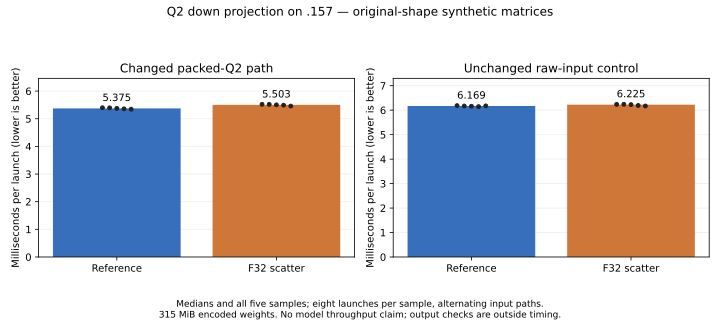

<!-- SPDX-License-Identifier: MIT -->
# Padded F32 expert scatter does not improve Q2 down

The candidate is **not selected**. Packed-Q2 down median time rises from
5375.014 to 5502.722 us (**+2.376%**) on `.157`; the unchanged raw-input control
changes +0.906%. All checked outputs remain exact. No complete-model run is
admitted by this screen, and the retained HC-up source stays selected.

## Mechanism exposed by the dataflow review

Wide UD F16 output already uses a padded block-wide LDS transpose and vector
stores. Packed Q2 F32 output uses a wave-local unpadded transpose and scalar
stores. The candidate applies the padded, cooperative F32 scatter only to
packed Q2 token tiles 48 and 64. Every wave writes 64 contiguous output columns
with float2 stores, with scalar bounds handling for odd output widths.

The existing LDS stage allocation is reused. The two-float row padding changes
the bank mapping; block-wide barriers replace wave-local barriers in this
epilogue. Original weight decoding, high/residual activation planes, ordered
WMMA accumulations and final correction are unchanged. Raw-input Q2, tile16,
IQ2 gate/up, HC, scalar decode and model bytes retain their previous paths.
Reduced conflict potential or wider stores do not imply lower complete time.

The [generator](../tools/prepare-q2-down-scatter.py),
[single-file patch](../experiments/q2-down-scatter.patch) and
[source manifest](../config/q2-down-scatter-source.json) derive solely from
the retained HC-up checkpoint and independently fetched official Gufo pin
`f783fedb9bea2ec7de941f6da4e02f4a4596b29e`. No model conversion or persistent
weight cache is introduced; upstream notices and first-party MIT markers remain.

## Static and numerical checks

Device-only gfx1151 compilation, both existing host fixture syntax checks,
changed-file formatting and exact 1019-file reconstruction pass. Of 28 routed
instruction bodies, only the two selected packed Q2 specializations differ.
The comparison normalizes function-local label prefixes. Tile48 VGPRs change
144 to 145; tile64 stays at 169. LDS remains 24,832 / 28,928 bytes respectively,
with no private scratch. [Static record](../config/q2-down-scatter-static.json).

Thirty independent Q2/IQ2 cases and 32 packing/down/chain checks pass. All 62
saved buffers reproduce the retained packed baseline. The shaped benchmark
compares all **52,428,800** output values exactly and independently recomputes
1024 FP64 dots: relative RMS 0.000192816 and error/peak 0.000224105, below the
unchanged 0.002 limits. Ragged output widths 5 and 129, small inputs and tile
boundaries remain covered by the existing fixture. No goldens or tolerances
are replaced.

## Component performance

Both arms use 2048 tokens, 512 experts, ten selected per token, M2560 and
logical/stored K640/768, with tile48. Original encoded synthetic weights occupy
315 MiB, allocated using the existing hipMalloc fixture. Three warmups precede
five samples of eight launches per path; raw/packed order alternates. GPU-event
timers exclude allocation, transfer, routing setup, validation and hashing.
Reference/candidate arms are sequential. This is not a complete-model or
production-mapping measurement.

| Path | Reference median [min, max], us | Candidate median [min, max], us | Time change |
|---|---:|---:|---:|
| Packed Q2 | 5375.014 [5344.679, 5397.691] | 5502.722 [5458.107, 5521.788] | +2.376% |
| Raw-input control | 6169.443 [6144.413, 6185.283] | 6225.351 [6169.947, 6238.661] | +0.906% |

[Full report](../config/q2-down-scatter-results.json),
[all twenty samples](figures/q2-down-scatter.csv) and
[PNG](figures/q2-down-scatter.png) retain the observed variation. The changed
path ranges do not overlap. The control also shifts, so the full 2.376% is not
claimed as an isolated causal epilogue penalty. There is no useful benefit to
justify a model trial. Additional block-wide synchronization is a possible
cost, not a hardware-counter finding.

## Code organization and reactive follow-up

The accompanying [GPU dataflow audit](Q2-GPU-DATAFLOW.md) maps dependencies,
buffer readers and existing overlap. A separate organization-only source
extracts 741 routed-template lines into `routed_gemm.inc` with ten indexed
regions. All 146 compiled kernel bodies and the entire assembly/metadata
remain exact after normalizing **only** the HIP compilation-unit identifier.
The raw assembly files are not byte-identical; the complete 25-line diff and
both hashes are retained in the [static record](../config/q2-routed-organization-static.json).
Its patch reconstructs all 1020 files exactly. This makes the code easier to
inspect without an arithmetic or runtime-speed claim. It is not selected by
the remote runner or promoted into the qualified runtime.

The next reactive hypothesis concerns shared/routed branch scheduling with
explicit scratch ownership and a final event join. Current GPU busy time does
not establish saturation, and current logical independence does not prove safe
concurrency. Keep C1 kernel improvement, PLE preparation overlap and native
multi-request batching as separate measured outcomes.

## Qualification and closure

Debug and ASan/UBSan each pass 12/12 on `.157`. Four source capsules reproduce
all 1019 source files and 42 frozen guard/fixture files; all fifteen commands
exit zero and 83 artifacts verify. GPU/CPU observed maxima are 49/80.75 C.
[Campaign validation](../config/q2-down-scatter-validation.json).

Release at **2026-10-03 08:12:19.882695 UTC** verifies four runners, fifteen
command identities/groups/sessions absent, empty KFD and original four leases
EX|NB/free. Independent observation at **08:12:57.917570 UTC** verifies the
closure observer retired. Both SSH commands exit zero. No model is opened,
no job/waiter/retry remains and no foreign resource is modified. Direct thread
transport fails; the agreed registry/ledger preserve handover without claiming
message delivery. Initial local source-path/count mistakes and their actual
failures remain under `evidence/`; no failed GPU command is hidden.
