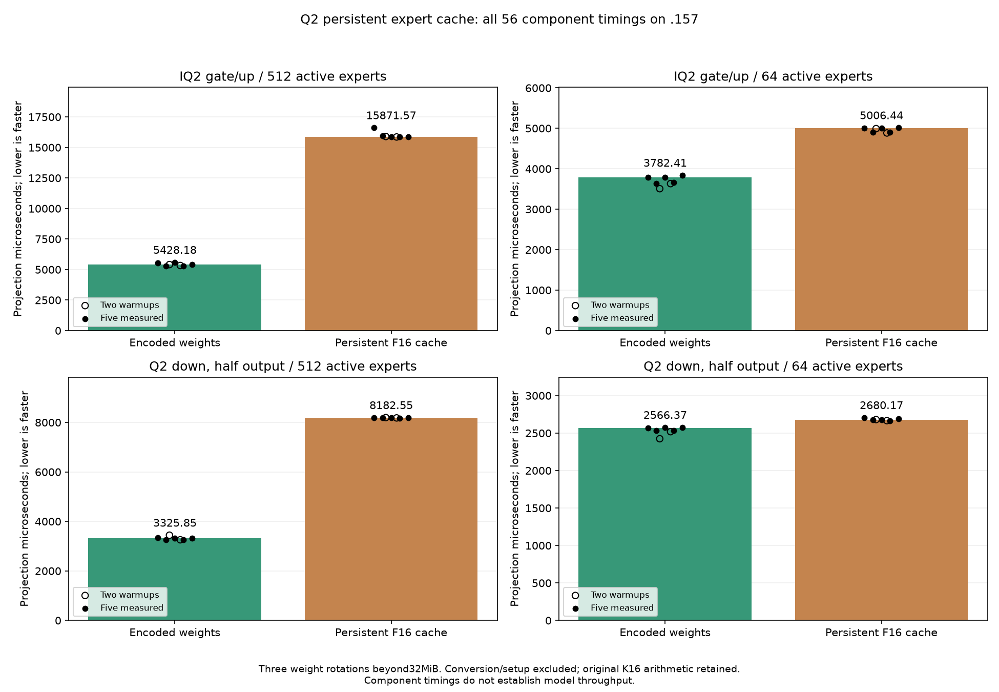
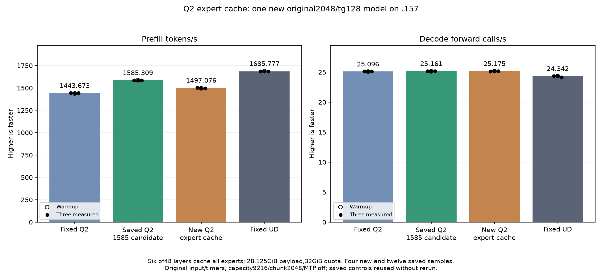

<!-- SPDX-License-Identifier: MIT -->
# Experimental FP16 mirrors of IQ2/Q2_K experts

The first interpretation of the owner's cache request produced this FP16
mirror experiment. The owner then clarified that the required reference is
**antirez/ds4**, with its bounded cache of still-compressed experts. This
experiment is not that requested mechanism. Its 225GiB full-expansion estimate
is not a DS4 requirement. This candidate starts from retained 1585.308983 PP /
25.16079073 TG and caches routed IQ2 gate/up plus Q2_K down operands. It is
not a shared-expert Q8 trial or a KV cache. The official Gufo DS4 port supplied the initial design precedent of
converted Q8 weights; that was the wrong reference for this request. No other
agent's DS4 project source is imported.

The cache keeps the exact half operands used by the retained prefill kernels,
in [expert][K16][output row][16 half values] layout. Every K16 accumulation,
SwiGLU, scaled activation, inverse scale, half down output and ordered HC
consumer remains. The cache kernels load these half fragments directly;
existing encoded kernels remain for uncached layers and scalar decode.

The budget is 32GiB with an 8GiB free-memory reserve. Layers 0/8/16/24/32/40
cache all512 experts, in complete gate/up/down groups. Expected auxiliary
allocation is 30199062528 bytes (28.125GiB payload plus73728 tail bytes), taking
resident model allocation from43156012544 to73355075072 bytes. All48 layers'
full mirrors would require225GiB payload alone. This experiment measures
six-layer coverage, not a full-model dequantized cache or demand-driven LRU.
Quota, free-memory or allocation exhaustion retains the original encoded route.
Conversion errors fail loading; the model owns all successful allocations and
publishes the cache only after synchronization. Model files remain unchanged.
Startup telemetry records admitted layers, bytes, budget and preparation time.

The first compilation fails on insufficient epilogue LDS and reordered include
dependencies. Its source/patch and exit1 remain. Revision2 preserves the LDS
correction before the include-order correction; revision3 compiles successfully.
All162 original kernel instruction/operand/resource bodies remain exact after
binding the added default-false template argument in symbols. Twelve new
kernels have zero scratch. Complete1029-file inventories and patches remain.

Fresh .157 host tests pass28 Debug and28 ASan/UBSan checks, including C17 quota,
reserve boundary, unsupported shape, exhaustion and null-output accounting.
The142 previous launch guards and eight new rejection/two acceptance checks
pass. Analyzer checks keep safe numeric failures timed and reject five unsafe
or scope-corrupted cases. Two staged capsules verify1029 provider files and98
fixtures; nine manifests and the window helper are frozen.

The component covers IQ2 gate/up widths16/48/64/128 with ragged15/17/129-token,
65-row edges; Q2 down float/half widths16/48/64 with129-row edges. Production
2048-token shapes use64 and512 active experts, ten routes/token, and three
weight rotations beyond32MiB. There are117 sampled-format records,216 complete
output comparisons (including post-timing replay), and56 timing samples. Each
arm has two warmups and five measured repetitions in alternating order.
Setup/conversion/readback/validation are outside projection timers. Independent
format checks use the upstream byte-magnitude table, parity signs and integer
binary32-to-binary16 rounding, not the GPU half-high-byte lookup helper.

Safe numerical or timing failure still proceeds to the original model test;
guard, missing-write and runtime errors stop device work. Only one new model
runs at the unchanged exact2048/tg128 point, capacity9216/chunk2048, greedy C1,
MTP off, one warmup plus three measured sessions,127 timed decode calls,15s
cooldown outside timers. Saved Q21443.672867, retained1585.308983 and
UD1685.777092 controls are reused without recompilation or execution.
No curve or Q4 run follows before point parity. Independent task quality and
whole-curve equality remain open. GPU measurements are complete below.

[Source](../config/q2-expert-cache-source-v3.json),
[static audit](../config/q2-expert-cache-static.json),
[plan](../config/q2-expert-cache-plan.json),
[staged capsules](../config/q2-expert-cache-staging.json),
[component fixture](../tests/q2_expert_cache.hip).
Actual commands and exit codes remain in evidence/q2-expert-cache-preparation/.

## Measured result: keep the saved 1585 candidate

The FP16 expansion loses 5.565692% prefill throughput against saved1585.
All 21 parent output/logit files remain byte-exact, with nine exact within-arm
checks. Independent format sampling passes 4,147,200 values in 117 records;
all216 component output pairs pass. This rejects this FP16 implementation as
an optimization; it does not test antirez/ds4 compressed slot caching.

| Model | Warm PP | PP1 | PP2 | PP3 | Median PP | Median TG |
| --- | ---: | ---: | ---: | ---: | ---: | ---: |
| Fixed Q2 (saved) | 1438.259006 | 1443.398207 | 1443.672867 | 1443.841794 | 1443.672867 | 25.09595499 |
| Retained Q2 (saved) | 1586.508538 | 1586.342395 | 1584.079076 | 1585.308983 | 1585.308983 | 25.16079073 |
| FP16 mirror (new) | 1495.969945 | 1502.106568 | 1496.914068 | 1497.07557 | 1497.07557 | 25.17520717 |
| Fixed UD (saved) | 1689.043527 | 1686.364042 | 1685.777092 | 1685.400011 | 1685.777092 | 24.34174251 |

New decode warmup and repetitions: 25.16679834, 25.11256708, 25.17587443, 25.17520717 calls/s.

| Component | Encoded us | FP16 cache us | Time change |
| --- | ---: | ---: | ---: |
| iq2-n2048-m640-e512-w0 | 5428.178787 | 15871.573130 | +192.392232% |
| iq2-n2048-m640-e64-w0 | 3782.408396 | 5006.443024 | +32.361250% |
| q2-n2048-m2560-e512-w48-half | 3325.846990 | 8182.547251 | +146.028975% |
| q2-n2048-m2560-e64-w48-half | 2566.373348 | 2680.170377 | +4.434157% |

Cache preparation takes0.733510805s; model load takes13.34206666s. Both are
excluded from PP/TG. Additional allocation30199062528bytes; resident model
73355075072bytes. Component CPU/GPU peaks64.625/48C, model77.25/73C.

All13 runtime commands exit0 and37 artifacts verify. Release at
2026-10-05T23:48:42.989734UTC (SHA14c2b9bb) retires1187 identities/947groups,
with KFD empty, four unchanged free leases and seven unchanged model stat
tuples. Main/remote/canonical mirrors agree and Core receives closure.
No remote cleanup occurs. The initial local compilation exit1 remains.

All samples: [component CSV](figures/q2-expert-cache-component.csv),
[model CSV](figures/q2-expert-cache-model.csv).
[Final audit](../config/q2-expert-cache-final-audit.json),
[release](../config/q2-expert-cache-window-release.json).
