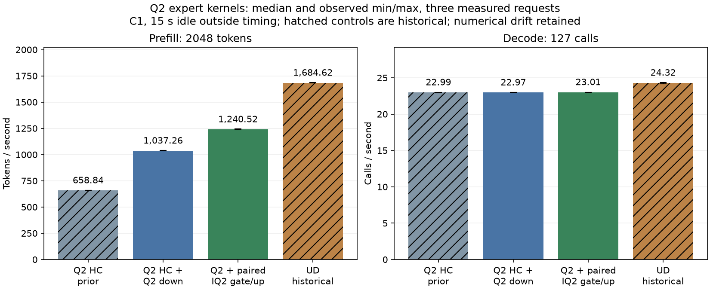

<!-- SPDX-License-Identifier: MIT -->
# Q2 expert kernels: combined performance experiment

The combined HC and compensated Q2 down path reaches **1037.26 prefill tok/s**.
Adding paired native IQ2 gate/up reaches **1240.52 tok/s**, another **19.60%**.
This is **88.29% above** the previous completed HC checkpoint. Decode stays
near **23 calls/s**. Against the earlier completed UD measurement, the best
candidate remains **26.36% below in prefill and 5.37% below in decode**.
The no-regression requirement is still unmet; neither experiment is promoted.

## Complete model measurements

Both new model arms ran sequentially on `.157`, using the original Q2 GGUF,
MTP off, C1, 2048 prompt tokens and 128 emitted tokens. Decode times cover
127 calls because the first token comes from prefill. Each arm has one warmup
and three measured fresh sessions, with 15 seconds idle before each request,
outside PP/TG timing. The maximum context setting is 9216, chunk size 2048.
This campaign does not measure long-context, continuous load or HTTP serving.

HC and UD controls below are earlier completed runs from the same day, using
the same request/timing protocol. They were not rerun in this window. Only
the combined-down and paired-IQ2 arms form the new sequential comparison.

| Arm | PP tok/s min / median / max | TG calls/s min / median / max | PP median s | TG median s |
| --- | ---: | ---: | ---: | ---: |
| Q2 HC, prior | 658.443 / 658.837 / 659.758 | 22.95619 / 22.98869 / 22.99405 | 3.108506 | 5.524456 |
| Q2 HC + compensated down | 1036.935 / 1037.258 / 1039.097 | 22.97096 / 22.97246 / 22.98479 | 1.974437 | 5.528358 |
| Q2 + paired IQ2 gate/up | 1239.402 / 1240.516 / 1244.538 | 23.00600 / 23.01026 / 23.01452 | 1.650925 | 5.519277 |
| UD, historical | 1681.350 / 1684.619 / 1685.163 | 24.17087 / 24.31592 / 24.32483 | 1.215705 | 5.222915 |

The new measured samples, in execution order:

| Arm / repetition | PP tok/s | PP s | TG calls/s | TG s |
| --- | ---: | ---: | ---: | ---: |
| Combined down / 1 | 1039.097473 | 1.970941180 | 22.97246286 | 5.528358050 |
| Combined down / 2 | 1036.934847 | 1.975051765 | 22.98479139 | 5.525392762 |
| Combined down / 3 | 1037.257735 | 1.974436951 | 22.97096025 | 5.528719679 |
| Paired IQ2 / 1 | 1240.516456 | 1.650925298 | 23.00599707 | 5.520299756 |
| Paired IQ2 / 2 | 1244.538287 | 1.645590193 | 23.01026138 | 5.519276723 |
| Paired IQ2 / 3 | 1239.401720 | 1.652410164 | 23.01452234 | 5.518254870 |

All controls, samples and durations are in the [JSON](../config/q2-expert-stack-results.json)
and [CSV](figures/q2-expert-stack.csv). The observed TG changes are below 0.2%
between the Q2 candidates; no decode improvement is claimed from this work.



The new model commands take 102.810 and 100.798 seconds, including loading,
semantic smoke and 60 seconds explicit idle. Each uses a complete MMQ rebuild;
no old archive is reused after the executor/header changes. Model resident
bytes remain 43,156,012,544, session bytes 376,777,748, deferred scratch bytes
7,946,240. No new persistent weight or scratch allocation is introduced.
Binary hashes and read-only model stat identities are unchanged across each run.

## What changed

The combined reference applies the existing four-wave HC decode and F16 HC
prefill patches, then the compensated Q2 down experiment. The latter expands
original Q2_K blocks inside the existing routed WMMA template, respects logical
K640 / stored K768, and represents F32 SwiGLU activations as a half plus scaled
residual for two accumulation paths. It avoids materializing a dequantized model
or converting model files. This is the earlier numerical experiment composed
with HC improvements, not a new claim of exact arithmetic equivalence.

The next patch specializes official Gufo's paired gate/up pipeline for native
IQ2_XXS blocks. Each original 66-byte block uses the existing upstream codebook
and parity sign table. Code values are unpacked into signed bytes, a block scale
is narrowed to F16, and WMMA consumes the original wide-path F16 activations.
Gate and up share routing and a launch, use FP32 accumulators, and write fused
F32 SwiGLU values into the existing slot buffer. Compensated Q2 down consumes
that buffer; the existing F32 expert epilogue remains in place.

The dispatch is limited to the original IQ2 gate/up + Q2 down combination,
hidden size 2560, expert width 640 and stored down width 768. Other formats and narrow
decode keep their existing paths. Tile widths 16/48/64/128 reuse existing compact
routing and, when available, the paired map. No antirez engine code is imported.

This is numerical-kernel and buffer reuse work. It changes no reactive
scheduling policy and supplies no evidence of a reactive C1 speedup. The
old phase profile motivated the selected operators, but does not establish
the remaining costs after this composition. A new candidate profile is needed.

## Numerical observations

All new synthetic GPU checks pass at the unchanged 0.002 limits for relative
RMS and maximum error divided by peak reference. They use independently decoded
original weight bytes and FP64 scalar dot products; they are not CPU model runs.

| Operator scope | Cases | Maximum relative RMS | Maximum error / peak |
| --- | ---: | ---: | ---: |
| Compensated Q2 down | 12 | 0.000363415946063 | 0.000406923991302 |
| Paired IQ2 gate/up/SwiGLU | 18 | 0.000569941123956 | 0.000521096293995 |

Cases cover ragged tokens/output rows, ordinary and tiny activations, multiple
experts including 511, supported tile widths, and two real 640-row IQ2 cases.
Input allocations have exact sizes; output guards, written values and finiteness
are checked. The IQ2 test uses both prefix and suffix guards. Twelve cross-width
IQ2 full-output comparisons are byte-exact. The older down test did not save
full outputs, so no historical byte-exact down replay is claimed.

Model comparison uses the original qualified Q2 run `q2-explore-reference-r1`,
not UD and not the intermediate HC4 reference used by the previous report.
All nine saved input/output token files match for each Q2 arm. Repeated sessions
within each arm reproduce their saved outputs/logits exactly on 9/9 checks.

| Q2 arm | Exact saved frontiers / 12 | Maximum KL(reference || candidate) | Maximum absolute logit difference |
| --- | ---: | ---: | ---: |
| HC, prior | 2 | 0.003925764262 | 3.069013357 |
| Combined down | 0 | 0.001814610419 | 3.038699627 |
| Paired IQ2 | 0 | 0.002742551050 | 2.939287782 |

Paired IQ2 exceeds the earlier 0.002 full-model KL diagnostic; combined down is
below it but still fails exact replay. The twelve frontiers include repeated
2K cases, not twelve independent tasks. Identical greedy output on these short
screens cannot establish broad accuracy or prove that logit flags are false
positives. The user explicitly authorized measuring performance before correcting
numerical differences. All raw differences and earlier failures remain retained;
no limit or expected output was silently replaced. The prior HC synthetic baseline
also fails some oracle checks, as documented in [HC prefill](Q2-HC-PREFILL.md).
That separate baseline issue does not explain away these new model differences.

### Offline probability audit

The follow-up [saved-logit audit](../config/q2-logit-shift-audit.json) checks
whether raw errors are mostly an irrelevant constant offset. At the first 2K
frontier, paired IQ2 has raw RMSE 0.537605 and centered RMSE 0.508094; subtracting
the mean offset removes only 10.68% of squared error. The difference therefore
is not explained by softmax's invariance to a constant logit shift.

| First 2K frontier versus qualified Q2 | Combined down | Paired IQ2 |
| --- | ---: | ---: |
| KL(reference || candidate) | 0.001814610 | 0.002742551 |
| Total variation, `0.5 * sum(abs(p - q))` | 0.003152369 | 0.004114854 |
| Maximum probability difference, percentage points | 0.234444 | 0.313803 |
| Reference top1 probability | 98.979352% | 98.979352% |
| Candidate top1 probability | 99.213797% | 99.293155% |

These distribution changes are real, but do not by themselves establish an
accuracy regression. All retained frontiers in these screens have a reference
top1 probability of at least 98.979%; unchanged greedy tokens are therefore weak
coverage for decisions with close alternatives. A later quality qualification
needs more diverse token histories with less concentrated distributions and an
independent teacher. Neither this audit nor the repeated counting prompt supplies
that evidence. The user-authorized performance exploration remains valid for its
measured workload; numerical thresholds and earlier failures are unchanged.

Reproduce the offline audit with `python3 tools/analyze-q2-logits.py`. It reads
and hashes only retained result files and performs no new model inference.

## Source, validation and reproduction

The qualified `patches/gufo-q2.patch` remains unchanged. Both experimental trees
reconstruct exactly from independently downloaded official Gufo at
`f783fedb9bea2ec7de941f6da4e02f4a4596b29e`. All 1019 files match their measured
source trees. Apply patches in this order, with
`patch --batch --fuzz=0 --no-backup-if-mismatch -p1`:

1. `patches/gufo-q2.patch` (already applied by `tools/prepare-gufo.py`).
2. `experiments/q2-hc-four-wave.patch`.
3. `experiments/q2-hc-prefill-wmma.patch`.
4. `experiments/q2-compensated-down-source.patch` → combined reference.
5. `experiments/q2-iq2-pair.patch` → paired IQ2 candidate.

The [source receipt](../config/q2-expert-stack-source.json) records inventory
and patch hashes. Both source trees pass official formatting across 486 files.
Static gfx1151 analysis of the four IQ2 templates reports no private segment,
82–148 VGPRs and 11,392–25,728 LDS bytes; this is compiler metadata, not runtime
occupancy or a performance measurement. See [the static receipt](../config/q2-iq2-static.json).

Debug 9/9 and ASan/UBSan 9/9 host fixtures pass on `.157`, including refusal of
MMQ archive reuse for changed executor/header sources before staging or SSH.
These host checks are separate from the independent GPU operators and model
inference. The fixed remote wrapper uses the corresponding prepared isolated
`.deps/gufo-q2-bench-stack` and `.deps/gufo-q2-bench-iq2-pair` directories:

```sh
python3 tools/q2-remote.py routed-operators q2-stack-operators-NEW --source-variant stack
python3 tools/q2-remote.py iq2-pair-operators q2-iq2-pair-operators-NEW --source-variant iq2-pair
python3 tools/q2-remote.py q2-bench2k q2-stack-model-NEW --source-variant stack --rebuild-mmq
python3 tools/q2-remote.py q2-bench2k q2-iq2-pair-model-NEW --source-variant iq2-pair --rebuild-mmq
```

Replace `NEW` with a unique lowercase label suffix. GPU work requires the next
coordinated window and fresh four-lease admission; these commands are not queued.
Regenerate the offline comparison and graphs from collected evidence with:

```sh
python3 tools/analyze-q2-stack.py \
  --arm hc=evidence/q2-hc-prefill-model-wmma-r1 \
  --arm stack=evidence/q2-stack-model-r1 \
  --arm iq2_pair=evidence/q2-iq2-pair-model-r1 \
  --arm ud_historical=evidence/q2-hc-model-ud-r1 \
  --numerical-reference evidence/q2-explore-reference-r1 \
  --output config/q2-expert-stack-results.json
python3 tools/plot-q2-stack.py --report config/q2-expert-stack-results.json \
  --output docs/figures/q2-expert-stack
```

## Campaign closure and remaining work

Five arms preserve 97 collected/SHA-verified artifacts and 20 successful command
exits; the [campaign manifest](../config/q2-expert-stack-campaign.json) records
the source capsules and result identities. Maximum GPU/CPU observations across
each full build/model arm are 81/90.125 C and 80/89.875 C. Neither reaches the
owner-approved 98 C inclusive ceiling; lower exposed hardware limits remain
strict. No thermal policy, model file or foreign process is changed.

Fresh closure at 2026-10-02T08:33:20.973977+00:00 verifies five runners absent,
20 command PID/start identities and owned groups retired, empty KFD and four
expected lease identities acquired EX|NB and released. Persistent local/remote
receipts and the shared registry record the release. The next window belongs
to core for its 14-arm SSD R2 campaign. No Q2 GPU job, waiter or retry remains.

Next performance work requires a profile of this best candidate, followed by
one measured change to the remaining dominant phase. Q2/UD parity, independent
teacher quality, long contexts and concurrent serving remain separate open
acceptance gates. A fresh UD control is still needed for a final parity verdict.
