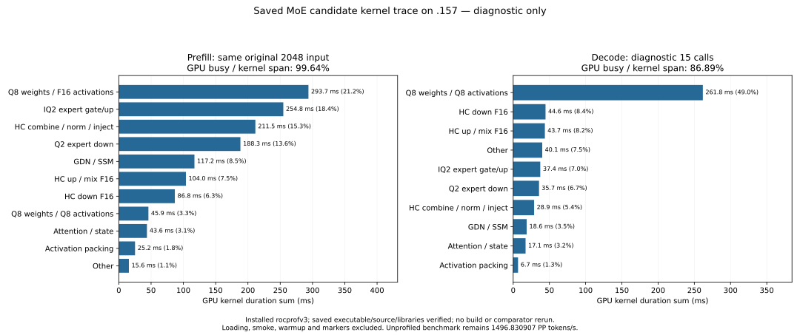

<!-- SPDX-License-Identifier: MIT -->
# Saved MoE candidate kernel diagnosis

The current best fixed model is 1496.830907 PP tokens/s, compared with saved
Q2 1443.672867 and UD 1685.777092. Parity still requires 12.623081% more
candidate throughput; the complete PP/TG context curve remains gated.

This separate diagnosis runs the saved MoE-only candidate executable under
installed rocprofv3 without compiling it or rerunning a qualified comparator.
It verifies the original result receipt, binary, all 1025 provider files,
counting fixture, marker fixture and 51 runtime library hashes.
The original built-in profile mode uses the same physical2048 input,
capacity9216/chunk2048, one16-output warmup and one16-output marked request
(15 timed decode calls). Its kernel timings are diagnostic and do not replace
the original unprofiled pp2048/tg128 benchmark or its one-plus-three samples.
Model loading, small smoke prompts, warmup and boundary kernels are excluded
from the marked stage costs. No new throughput headline or quality verdict.

The launcher rejects rebuild, detached execution, alternate source, control
replay and curve options. Local launch tests pass79/79; replay guards7/7 and
the existing trace/resource parser pass. On `.157`, 24/24 Debug and24/24
ASan/UBSan CPU tests pass; all six commands exit0 and seven artifacts verify.
The frozen source/runtime contracts are retained before fresh GPU admission.
The first admission helper incorrectly named its own nonexistent release as
the previous receipt and exited1 before admission. Its source/log remain;
v2 corrects only that previous path and retains the same runtime/host fixtures.

The diagnostic completes at 2026-10-04T23:07:52.199597Z: all five commands
exit0,24 artifacts verify, and there are no build commands. Saved source,
binary and all51 historical/current library hashes compare exactly. The input
has the original SHA75343e606f5b815fe01f69ddc6ce50a997e2de96d8a20304a82a7f24f1180b35.
Both diagnostic prefill frontiers match the saved candidate byte-for-byte;
both16-token prefixes match its first16 greedy tokens. The two diagnostic
last frontiers also match. Independent task quality remains unqualified.

| Measured diagnostic scope | Prefill2048 | Decode15 calls |
| --- | ---: | ---: |
| Dispatch count | 1909 | 23594 |
| GPU kernel duration sum, ms | 1386.587016 | 534.546293 |
| GPU kernel interval span, ms | 1391.616731 | 615.221609 |
| Gaps within kernel span, ms | 5.029715 | 80.675316 |
| GPU busy / kernel span | 99.638570% | 86.886788% |

GPU busy here means the union of dispatch intervals, divided by first-to-last
kernel span. It does not measure active-lane occupancy, memory bandwidth or
the unprofiled complete request. The marked wall values1.392139050 PP seconds
and0.617267302 TG seconds include profiler/boundary effects. Their printed
1471.117415/24.30065541 rates remain visibly diagnostic and are not comparison
results. The fixed benchmark remains1496.830907 PP /25.17435733 TG.

| Kernel family | PP GPU ms | PP kernel sum share | TG GPU ms |
| --- | ---: | ---: | ---: |
| Q8 weights / F16 activation dense | 293.725 | 21.183% | 0 |
| IQ2 expert gate/up | 254.797 | 18.376% | 37.376 |
| HC combine / norm / inject | 211.530 | 15.255% | 28.884 |
| Q2 expert down | 188.349 | 13.584% | 35.655 |
| GDN / SSM | 117.169 | 8.450% | 18.597 |
| HC up / mix F16 | 103.961 | 7.498% | 43.739 |
| HC down F16 | 86.810 | 6.261% | 44.638 |
| Q8 weights / Q8 activation dense | 45.881 | 3.309% | 261.781 |
| Attention / state | 43.577 | 3.143% | 17.097 |
| Activation packing | 25.158 | 1.814% | 6.688 |
| Other | 15.629 | 1.127% | 40.092 |

Classification follows instantiated weight flags and symbols. The three large
Q8/F16 projection variants alone total278.686 ms:159.701 for SSM projection
and convolution,70.361 for plain dense output,48.624 for fused attention
projection. All current dispatches report zero private bytes. Metadata therefore
does not support claiming spills are the observed bottleneck; zero private
metadata does not measure dynamic memory transactions or register occupancy.

The144 expert dispatches form exactly48 sequences of IQ2 gate128,gate64 and
Q2 down48. Actual maps have median140 wide IQ2 tiles,298 tail IQ2 tiles and
672.5 Q2 down tiles per layer. Across all layers,20480 routed rows occupy
57.992902% of the gate maps' reserved row slots and65.674705% of the down
maps' reserved slots. These are row-capacity fractions, not GPU utilization.
The trace contains no per-expert histogram, so it cannot justify tile64
selection for individual hot buckets or prove the old scaled-tile experiment
is profitable on this input.

The remaining unprofiled PP time gap against the fixed UD median is153.354028
ms. Kernel diagnosis changes the next action:

1. Prioritize the443.146 ms of routed gate/up and down, and the339.606 ms
   of Q8 dense kernels. Preserve actual quantization and K accumulation order
   while changing load/dequantization scheduling. Official pinned Gufo
   DeepSeek Q8 helpers remain a read-only numerical-port reference; inspect
   their packed decode alongside this provider's existing half-magic path.
2. Recover scaled-tile selection only with actual hot-bucket evidence and a
   complete new composition. Existing global tile64 regressions remain;
   changing launch geometry alone has already regressed HC variants.
3. Keep HC normalization/materialization work as a measured secondary path.
   HC down alone occupies only86.810 ms, less than the saved153.354 ms gap:
   even eliminating that stage cannot explain all remaining work under these
   diagnostic costs. No speedups from separate experiments are added.
4. Keep reactive responsiveness/concurrency separate. This warmed C1 prefill
   has only5.030 ms of gaps inside its marked GPU span. Extra scheduling
   callbacks cannot remove the numerical kernels'1386.587 ms. Decode has
   more gaps and Q8 GEMV cost, but this15-call diagnosis does not establish
   improvements at the original127-call scope or at high context.

No new candidate, performance increment, numeric acceptance, full curve or
goal completion follows from the trace. The next retained throughput must
come from a new candidate using the original one-plus-three2048/tg128 tester;
qualified comparators remain reused. Source/server/core ABI and policies are
not changed by this diagnostic tooling.

Admission23:07:02.490266Z from checkpoint4e88e56 verifies562 retired identities
and empty KFD, four original leases and six model stat tuples. The original
receipt/path failure and local collector API misuse remain in preparation
evidence; corrected admission/collection succeed. Observed maxima are
CPU87.25C/GPU58C. Release23:08:53.407509Z verifies568 retired identities/
444 groups, KFD empty, four leases free and six unchanged model tuples.
Core acknowledges; no Q2 GPU job,reservation,waiter,restart or cleanup remains.
Any later GPU work needs fresh admission anchored to releaseSHA
ffefaeb6b3426d484a7faaa62b1cbba921101808eb019db30c7c47d890bea71e.

[Frozen diagnostic plan](../config/q2-fixed-moe-profile-plan.json),
[corrected window binding](../config/q2-fixed-moe-profile-plan-v2.json),
[saved binary identity](../config/q2-fixed-moe-profile-binary.json),
[host results](../config/q2-fixed-moe-profile-host-results.json),
[verified trace and complete stage/resource values](../config/q2-fixed-moe-profile-results.json),
[closed window](../config/q2-fixed-moe-profile-window-release.json),
[stage CSV](figures/q2-fixed-moe-profile-stages.csv),
[all83 phase/kernel summaries](figures/q2-fixed-moe-profile-stages-kernels.csv),
[all48 routing maps](figures/q2-fixed-moe-profile-stages-routing.csv).

