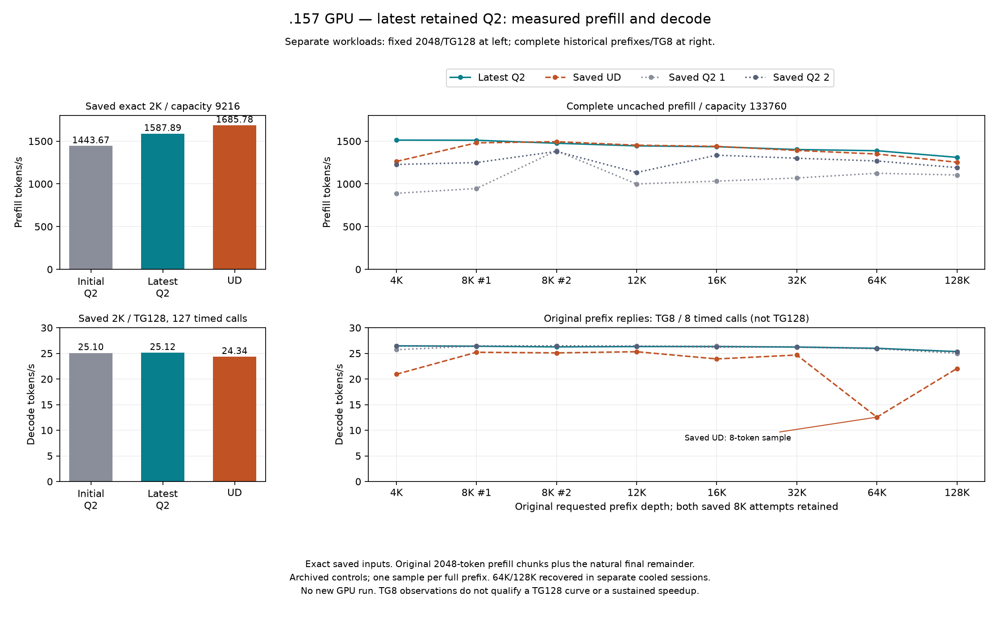
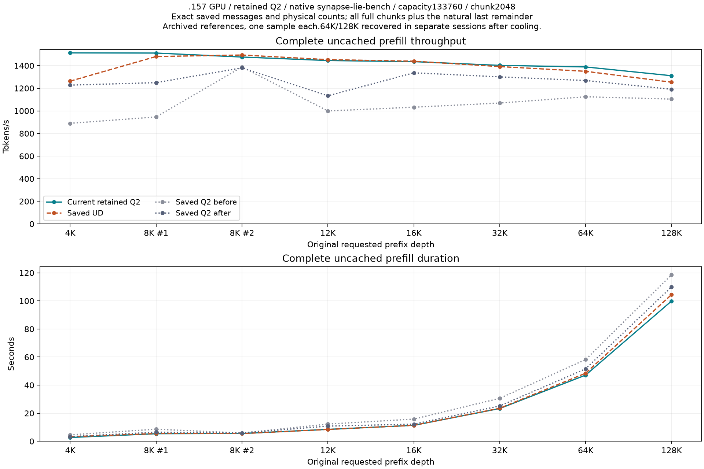

<!-- SPDX-License-Identifier: MIT -->
# Complete prefill through128K on the latest retained Q2

The complete-prefix extraction below starts at 4K because the historical
`prefix` phase starts there. The original summary omitted the already measured
2K point; it belongs in the comparison with its original conditions visible.

| Retained fixed reference | Physical input tokens | Context capacity | Prefill token/s | Prefill seconds | Decode token/s |
|---|---:|---:|---:|---:|---:|
| Initial Q2 | 2048 | 9216 | 1443.672867 | 1.418603928 | 25.09595499 |
| Latest Q2, IQ2 fixed bounds | 2048 | 9216 | 1587.893545 | 1.289759006 | 25.12414406 |
| UD | 2048 | 9216 | 1685.777092 | 1.214869991 | 24.34174251 |

These are the unchanged saved exact-2048/tg128 observations, with 127 timed
decode calls, original input and original aggregation. They were not rerun
during the 133760-capacity full-prefix campaign. Do not connect this separate
reference as if it were a newly measured point of that curve, or substitute
the 2055-token preparation warmup for it.
[Original reference](../config/q2-fixed-prefill-reference.json),
[latest Q2 measurements](../config/q2-iq2-fixed-bounds-model-results.json).

[SVG](figures/q2-full-prefill128/pp-tg.svg),
[full-prefix PP/TG CSV](figures/q2-full-prefill128/pp-tg.csv),
[fixed-2K PP/TG CSV](figures/q2-full-prefill128/fixed-2k-pp-tg.csv).
The two columns have different input, capacity and output-budget contracts;
no line joins the fixed point to the long-prefix curve. All values come from
existing measurements; generating this figure performs no GPU run.

The owner explicitly requests the entire prefill on the latest optimized
version, without invented token variations. Use the retained IQ2-fixed-bounds
provider1028 files, server9993fdce and native C synapse-lie-bench87d856cf.
The fixed benchmark reference remains unchanged; no numerical source, GPU
binary, model, scheduler, ABI or cache-policy change is introduced here.

The [input manifest](../config/q2-full-prefill128-inputs.json) binds exact saved
request bodies from the historical native-row Q2-before log. Eleven requests
replay the three original calibration/warmup inputs and eight complete-prefix
requests, retaining both8K attempts. No new prompt generation, padding,
truncation, token substitution or calibration is performed. Prefix requests
contain4088,8138,8177,12242,16317,32711,65440,130925 physical tokens.
Every prefix must report zero cached tokens and ceil(tokens/2048) prefill calls.
The128K input is63 full2048-token chunks plus1901 final tokens,64 calls total.

The existing native client's `--suite http --requests` facility replays these
bodies once. It uses SSE plus include_usage, while old prefix requests used
nonstream JSON; model messages, generation settings and expected physical
counts are unchanged. Compare the existing completed-executor prefill duration
only; keep HTTP wall and output time separate. Prefix output budget stays at
its original8, so it is not a128-token decode benchmark. Server capacity133760,
chunk2048, C1,16GiB prefix budget and original capture policy are unchanged;
measurements with any prefix reuse fail validation.

Saved UD and both historical Q2 controls provide references for those exact
messages and token counts. Historical variation, request ordering and transport
differences prevent a claim of isolated causality or statistical significance.
The earlier continuation-only curve was stopped and does not become a valid
whole-prefill result. No control rebuild/rerun, Q4, conversion, tuning, dependency
installation or remote cleanup is scheduled. Collect and release before analysis.

The initial whole-prefill replay completes through32K, then stops at CPU98.125C
against the configured inclusive98C limit during64K. Primary command exits are
0,0,0,-15; supervisor1. All nine artifacts collect before release17:15:45UTC /
46c4bae9. Completed short prefixes remain observations;64K and128K are incomplete.

Recovery selects only the exact saved64K and128K prefix requests. Each runs in
its own model session after the three original preparation inputs, with CPU<=60C
before launch. Cooling and model initialization stay outside prefill timers;
there are no pauses between2048-token chunks. The98C limit is unchanged. Already
completed short prefixes and archived controls are not rerun. This changes
request scheduling/initial thermal state, not tokens, numerical kernels, model,
server context, prefill chunk size or the completed-executor timer.

## Completed full-prefill observations — 2026-10-06 UTC

All eight historical prefix inputs now have completed current-Q2 observations.
Both8K calibration attempts are retained. Every request has the exact saved
model messages/settings and physical token count, zero cached tokens and the
expected number of2048-token prefill calls. No token padding, truncation or
substitution was introduced. The fixed2048 benchmark and its targets remain
unchanged.

| Requested depth | Physical tokens | Calls | Current Q2 token/s | Saved UD token/s | Q2 prefill seconds | UD prefill seconds | Q2 / UD |
|---|---:|---:|---:|---:|---:|---:|---:|
| 4K | 4088 | 2 | 1512.809054 | 1262.979592 | 2.702258 | 3.236790 | +19.781% |
| 8K attempt1 | 8138 | 4 | 1511.203024 | 1480.640887 | 5.385114 | 5.496269 | +2.064% |
| 8K attempt2 | 8177 | 4 | 1476.050829 | 1493.937128 | 5.539782 | 5.473457 | -1.197% |
| 12K | 12242 | 6 | 1445.124766 | 1453.118328 | 8.471241 | 8.424641 | -0.550% |
| 16K | 16317 | 8 | 1435.353775 | 1439.306934 | 11.367929 | 11.336706 | -0.275% |
| 32K | 32711 | 16 | 1402.245716 | 1391.617248 | 23.327581 | 23.505745 | +0.764% |
| 64K | 65440 | 32 | 1388.420346 | 1349.798341 | 47.132700 | 48.481316 | +2.861% |
| 128K | 130925 | 64 | 1310.874605 | 1253.555692 | 99.876067 | 104.442907 | +4.573% |

The128K observation covers63 full2048-token chunks plus1901 final tokens.
It measures99.876067 seconds /1310.874605 token/s, against the saved UD full
prefill104.442907 seconds /1253.555692 token/s, nominal+4.573%. The previously
quoted1280.583007 UD value is the subsequent2046-token continuation. These are
different recorded phases; neither replaces the frozen fixed-point target.

[All current and both archived Q2 controls, exact times and percentages](figures/q2-full-prefill128/comparison.csv),
[machine-readable audit](../config/q2-full-prefill128-results.json). Current Q2 is
nominally above both archived Q2 controls at every listed full-prefix observation.
At128K the changes are+18.728% versus the first old Q2 control and+10.089% versus
the repeated old control. Old control drift remains visible rather than selecting
a favorable control or averaging unrelated runs. Against archived UD, the current
8K second attempt/12K/16K observations are lower by1.197%/0.550%/0.275%; whole-curve
parity is not established.

[SVG export](figures/q2-full-prefill128/full-prefill.svg). A single observation
per exact prefix and archived controls do not isolate causality or establish
statistical significance. SSE transport and the omission of continuation requests
change scheduling/cache history;64K/128K use separate cooled sessions. The initial
continuous session stopped thermally, so these results do not establish sustained
operation above the configured limit. Independent model quality and the broader
Q2/UD performance goal remain open.

The64K recovery completes17:22:48UTC with four zero command exits. An initial
128K startup fails before inference at the port8000 bind probe; its five artifacts
and actual exit1 remain preserved. The unchanged runtime retry completes128K
17:29:46UTC with four zero exits, CPU peak97.5C and GPU edge peak99C. All29 model
artifacts from the three measured sessions plus5 pre-model failure artifacts
are collected. Final release17:30:32.435742UTC /9fffc2e2 verifies1643 identities
and1310 groups retired, empty KFD, original CPU/four GPU leases free and seven
unchanged model stat tuples. No remote cleanup, new GPU build or control rerun.

The [updated intervention order](Q2-REMAINING-WORK.md) prioritizes expert-chain
ownership and dense Q8 operand reuse on the unchanged fixed reference, followed
by an actual HC buffer-pass removal. Attention-capacity qualification for 256K
and reactive decode remain separate hypotheses; this report schedules no run.
