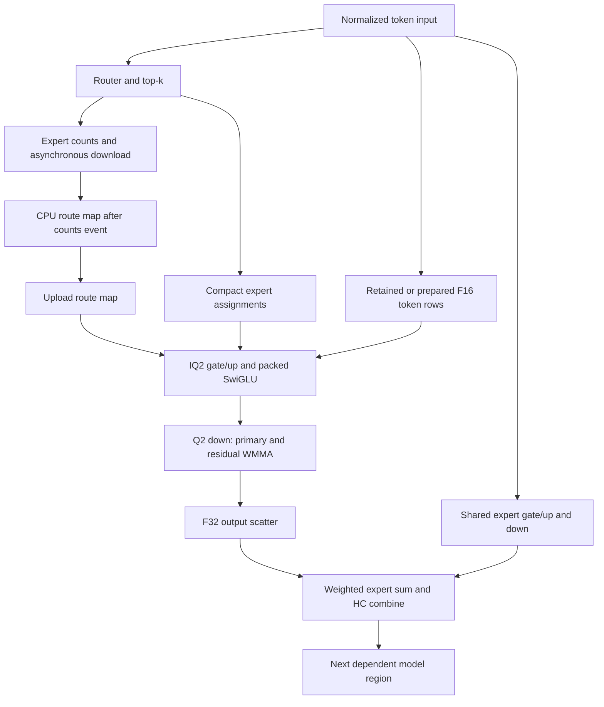

<!-- SPDX-License-Identifier: MIT -->
# Q2 GPU scheduling and code organization

The owner asks for reactive GPU management and a code organization that exposes
inefficient algorithms. The selected Q2 executor still queues most numerical
work on one HIP stream. It has useful existing overlap and buffer reuse, but
does not implement a general readiness/resource scheduler between its internal
GPU regions. This audit distinguishes that executor from the C inference
dispatcher in the core/server worktree and from the isolated C17 PLE lookahead.
The [audit receipt](../config/q2-gpu-dataflow-audit.json) pins the seven source
and document identities actually inspected, including the separate core branch.

## Current measured boundary

The latest selected-source diagnostic measures 1560.398 ms of Q2 kernels inside
a 1565.687 ms prefill span at C1 pp2048. The 5.289 ms between kernels makes
launch starvation a small observed contributor in that trace. **GPU busy time
does not establish compute or bandwidth saturation.** Concurrent complementary
work could still reduce the critical path; contending work can lengthen both
kernels. Hardware-counter attribution of these alternatives remains missing.
These are pp2048/tg16 profile times, not the unprofiled pp2048/tg128 benchmark.
See [the fresh Q2/UD profile](Q2-HC-SINGLE-CHAIN.md#fresh-diagnostic-q2ud-profiles).

The largest extra prefill costs versus UD are HC down (89.885 ms), expert down
(84.604 ms) and explicit activation preparation (64.949 ms): 74.94% of the
319.490 ms extra kernel time. Attention already uses fused WMMA. The goal is
still complete Q2/UD performance parity, including the broader context and
concurrency scope; this C1 attribution does not qualify those other workloads.

## Logical dependencies, versus actual scheduling

Arrows express data dependencies, not a claim that branches currently run on
separate streams. `Moe` queues the count download/event before the shared
expert. `RouteHints` waits only for that event, builds the route map on CPU
while queued shared-expert work may continue, and uploads the map to the same
stream. This is existing CPU/GPU overlap. Shared and routed projections are
still serialized by that stream.

The routed kernel itself already separates `fetch_stage`, `commit_stage` and
`compute_stage`, fetching the next stage before computing the current staged
data. That bounded instruction pipeline is distinct from a C reactive region
scheduler. Replacing its barriers with callbacks would not remove dependencies.

## Buffers and the safe concurrency boundary

| Buffer | Selected Q2 role | Lifetime / scheduling constraint |
|---|---|---|
| `x_half` | Narrowed token input reused by router and routed gate/up | Its validity is cached by pointer, rows and columns; every GPU reader must complete before replacement. |
| `shexp_half` | Private shared-expert down input | Already avoids overwriting `x_half`. Independence of this buffer alone does not prove all projection scratch is disjoint. |
| `gate_e` | Packed high/residual activations | 50 MiB at 2048 tokens × 10 experts × 640 × 4 bytes; gate/up must complete before down reads it. |
| `down_e` | F32 output per token/expert slot | 200 MiB at 2048 × 10 × 2560 × 4 bytes; retained through the following fused MoE/HC combine. |
| `up_e` | General routed fallback scratch | Allocated even when paired IQ2 prefill does not consume it; sizing/reuse must still preserve scalar/fallback calls. Allocation removal alone is not a speed result. |
| `ple_key`, `ple_query`, `ple_value` | Aliases of HC/normalization/block buffers | Current sequential completion makes the aliases safe; cross-region concurrency must preserve every last reader. |

The two-plane Q2 representation retains precision; HC's two accumulation chains
are a different mechanism. Neither can be eliminated by labeling a buffer dead.
RAM reclamation is allowed only after its last actual consumer completes, not
after a launch returns. Cancellation must drain in-flight readers before reuse.

## Reactive mechanisms and evidence

| Mechanism | Current evidence | Next acceptance requirement |
|---|---|---|
| Bounded PLE preparation overlapping GPU chunks | C17 two-slot experiment reduces first-access 8K prefill 10.982 → 7.791 s, exact saved frontiers; warm gain only 0.57%. | Integrate with the retained Q2 source, recheck complete replays and cold/warm timings. The latest HC-up source does not yet contain this experiment. |
| Ready-sequence batching | Core/server `lie_inference_prepare/run` reserves flow credits and invokes scalar/native batch decode. | Measure native C2/C4/C8 complete-token throughput, C1 latency and memory with the same Q2 kernels; an outer dispatcher does not reschedule internal kernels. |
| Shared/routed branches on separate GPU streams | The [C17-controlled experiment](Q2-SHARED-OVERLAP.md) passes all 32 GPU lifecycle cases and 21 model-file comparisons, but lowers complete-model prefill 1.03%; decode is unchanged. | Retain the sequential path. The independent shared/routed buffers permit concurrency, but readiness alone is insufficient to select it profitably. |
| Device-side route-map preparation | Current counts/event/CPU map is already partially hidden by shared work. | First attribute the CPU map/upload on the critical path; an extra setup kernel and excess grid must not outweigh the removed round trip. |
| Buffer retirement/reuse | Source shows concrete aliases and unused-in-this-branch allocation. | Record live ranges, allocation peak and completed-consumer events; measure speed separately from memory savings. |

A useful first GPU-reactive trial is therefore the shared/routed join, **after**
scratch ownership is explicit. Admission should bound simultaneous regions by
their measured resource demand, not by an arbitrary number of streams. Keep
the sequential fallback for shapes where overlap loses. The subsequent bounded
[fork/join trial](Q2-SHARED-OVERLAP.md) implements one side stream and two events,
with no new tensor allocation; its measured regression prevents selection.
The audit itself and the organization-only prototype change no runtime.

## Concrete code organization

The organization-only prototype extracts the existing 741-line routed template
verbatim from `kernels.hip.cpp` into `routed_gemm.inc`, included at the same
namespace and declaration location. It keeps specialization and arithmetic
visible, without turning every micro-operation into an indirect call. Its
[generator](../tools/prepare-q2-routed-organization.py),
[patch](../experiments/q2-routed-organization.patch) and
[source map](../config/q2-routed-organization-source.json) identify ten regions:
geometry/LDS, routing views, prefetch, staging, WMMA, stage loop, residual
correction, paired gate/up epilogue, F16 scatter and F32 scatter.
All 146 kernel bodies and assembly metadata remain identical after normalizing
only the HIP compilation-unit identifier. The raw files have different hashes;
the [static comparison](../config/q2-routed-organization-static.json) retains
that distinction and verifies exact reconstruction of all 1020 source files.

This review exposes a specific asymmetry: wide F16 output uses a padded,
block-wide transpose and vector stores; packed Q2 F32 output still uses a
wave-local unpadded transpose and scalar stores. The independent
[down-scatter experiment](Q2-DOWN-SCATTER.md) measures that mechanism without
changing quantization or accumulations. A cleaner file is useful for review;
only measured output and model performance can establish a faster algorithm.

Further separation should keep four explicit boundaries: format decoding and
rounding; register/LDS tile movement; arithmetic/epilogues; host dispatch and
buffer ownership. Preserve exact instruction bodies for organization-only
moves before combining them with scheduling or arithmetic changes. Both
prototype sources are isolated; the selected runtime is not silently replaced.

Read-only core references are `src/inference.c` and
`docs/INFERENCE-REACTIVE.md` in the sibling LIE `openai-reactive-api` worktree.
No core, DS4 or sibling CachyOS code is imported or modified. Q2 source derives
from independently fetched official Gufo pin
`f783fedb9bea2ec7de941f6da4e02f4a4596b29e` and the retained HC-up checkpoint.
