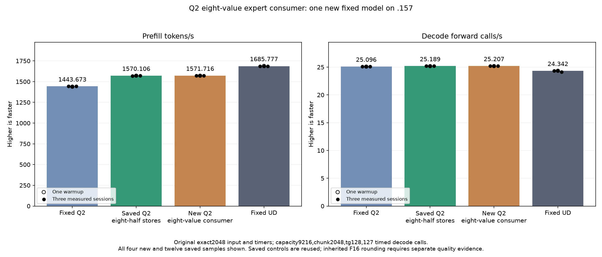
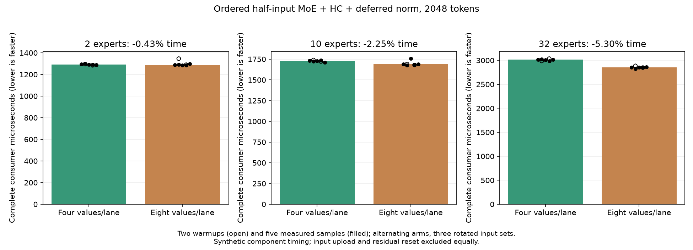

<!-- SPDX-License-Identifier: MIT -->
# Eight-value half-input expert consumer

One new candidate derives from the measured1570.106384 PP /25.18915597 TG
provider. It changes only the MoE weighted-sum part of
`HcCombineMoeHalfDeferredNormKernel`: eight hidden values per lane replace
four, leaving every per-value expert FMA chain and shared-expert FMA ordered.
At hidden2560, outer passes change from256/256/128 to256/64 live lanes.
Aligned inputs use one128-bit half payload load; the original Load4 operations
remain the fallback for four-byte-aligned inputs. Existing four-value loads
already compile to64-bit operations. Subsequent HC/residual/norm source,
producer, dispatch, output representation and allocation are unchanged.

The source derives from independently fetched MIT Gufo pin
`f783fedb9bea2ec7de941f6da4e02f4a4596b29e` and the retained LIE lineage.
No sibling DS4/CachyOS source or artifact is imported. The literal measured
parent consumer is included only in the new focused component fixture.

Local compilation finds160 instruction/operand/resource-exact kernel bodies
and one changed consumer. Consumer VGPR84, SGPR32, LDS10368 and zero private
bytes remain unchanged; static instructions rise1729 to1763. This is not
runtime evidence. Alignment branching and longer value ownership can offset
the reduced outer-loop count. An initial CMake wiring script exits1 on a
missing anchor after wiring the launcher; its receipt is preserved and the
remaining CMake change is completed separately.123 launcher guard cases pass.

[Source](../config/q2-half-consumer-eight-source.json),
[static comparison](../config/q2-half-consumer-eight-static.json),
[frozen plan](../config/q2-half-consumer-eight-plan.json),
[staging](../config/q2-half-consumer-eight-staging-results.json).

## Bounded qualification

The new component checks35 shapes with three deterministic input rotations:
16/17/33/129 tokens,1/2/10/32 selected experts, aligned16 and aligned4-only
input bases; additional2048-token shapes use2/10/32 experts. Gate stride1/5
and injection parts1/3/10 are covered. Expert allocations end at the final
valid half. Inputs include signed zero, small/subnormal halves and largest
finite half values. Every residual, norm scale and normalized half output is
compared with the literal parent and an unchanged F32 consumer on exactly
expanded halves. Guards/poison, finite values and input immutability are checked.
These are differential operator checks, not independent task quality.

Only the three2048-token shapes are timed: complete weighted combine,
shared expert, HC/residual, scales and F16 norm; alternating parent/candidate,
two warmups plus five measured samples, three rotating input sets exceeding
32MiB. Input upload/expansion and identical residual reset are outside both
component timers. No unchanged down-producer sweep or old cohort is rerun.
Safe numerical/timing rejection does not cancel the new original-model test;
guard corruption or unwritten output stops further device work.

The original direct executor retains the exact2048/tg128 input, C1 greedy,
MTP off, capacity9216/chunk2048, one warmup and three measured samples.
Saved Q2 PP1443.672867, UD1685.777092 and parent1570.106384 remain fixed;
compilation/loading are excluded. GPU tests run only on .157 following fresh
ownership admission. No Q4, full curve, cleanup, tuning or dependency install.

Host-only .157 checks pass27/27 Debug and27/27 ASan/UBSan, six commands exit0 and seven artifacts verify. The capsule checks all70 frozen fixtures; no GPU/model evidence is implied. [Host result](../config/q2-half-consumer-eight-host-results.json). GPU/model results are pending at preparation. Exact replay against the half-storage
lineage would still not close its inherited independent task-quality gap.
The complete requested context/concurrency curve and UD parity remain open.

## Completed GPU component and original model — 2026-10-05 UTC

All105 complete consumer comparisons,35 immutable-input cases and42 timings are retained. Both timed arms consume the same F16 representation; the unchanged F32 consumer receives exactly expanded halves. This is differential operator evidence, not independent model quality. Positive time changes mean slower.

| Scope / distribution | Reference median us | Candidate median us | Time change |
| --- | ---: | ---: | ---: |
| complete-consumer / n2048-u2-p64 | 1293.377320 | 1287.850698 | -0.427302% |
| complete-consumer / n2048-u10-p64 | 1727.792740 | 1688.853741 | -2.253685% |
| complete-consumer / n2048-u32-p64 | 3014.520009 | 2854.734103 | -5.300542% |

The original model follows the completed guarded component; safe numerical or timing rejection would not suppress its performance measurement. All three comparator columns below are saved evidence, without rebuild or rerun.

| Session | Fixed Q2 PP / TG | Saved best PP / TG | New eight-value consumer PP / TG | Fixed UD PP / TG |
| --- | ---: | ---: | ---: | ---: |
| Warmup | 1438.259006 / 25.08847266 | 1571.703662 / 25.17153751 | 1571.452532 / 25.18076430 | 1689.043527 / 24.34239962 |
| Measured 1 | 1443.398207 / 25.10565683 | 1569.317501 / 25.18109739 | 1572.749703 / 25.20732109 | 1686.364042 / 24.34621613 |
| Measured 2 | 1443.672867 / 25.08698337 | 1572.043501 / 25.19560864 | 1571.581590 / 25.21066467 | 1685.777092 / 24.34174251 |
| Measured 3 | 1443.841794 / 25.09595499 | 1570.106384 / 25.18915597 | 1571.716479 / 25.18988477 | 1685.400011 / 24.15102104 |
| Median measured | 1443.672867 / 25.09595499 | 1570.106384 / 25.18915597 | 1571.716479 / 25.20732109 | 1685.777092 / 24.34174251 |

There are0 changed parent model files. Within-arm replay is exact=True. PP change versus saved best=+0.102547%.

Resident model memory remains43,156,012,544 bytes. Compilation/loading stay outside PP/TG. Independent task quality and the context/concurrency curve remain open. The window releases at2026-10-05T13:49:16.626977+00:00 with958 retired identities/761 groups, empty KFD, four free original leases and unchanged seven model stat tuples. All37 artifacts verify across13 runtime commands; canonical/main/remote mirrors agree.

[All model samples](figures/q2-half-consumer-eight-model-wrapped.csv), [all component samples](figures/q2-half-consumer-eight-component.csv), [final audit](../config/q2-half-consumer-eight-final-audit.json).

The disposition is **retain the marginal experiment and its parent**. Prefill
changes+1.610095 tokens/s (+0.102547%) against the saved1570.106384 version;
the historical sample ranges overlap. Fixed Q2 improves8.869295%, while fixed
UD still requires7.257073% more throughput. The decode arithmetic is unchanged;
its nominal+0.072115% difference does not establish a causal decode gain.
All21 parent files are byte-exact, all9 within-arm replays are exact, parent
KL is0. Independent quality of the inherited F16 storage boundary remains open.

Component median time changes are-0.427302%/-2.253685%/-5.300542% for2/10/32
experts. Only the32-expert measured ranges do not overlap; the production10
expert case has one slower candidate sample, retained in the graph/CSV.
Thermal peaks are69.375 C CPU/41 C GPU for the component and80.375 C CPU/71 C
GPU for the model, including build/load. No thermal stop or runtime failure.
Loading10.64207068 seconds is excluded; session376777748 bytes and deferred
scratch7946240 bytes remain as recorded by the original executor.

[Disposition](../config/q2-half-consumer-eight-disposition.json),
[new fixed-width indexing proposal](../config/q2-half-consumer-fixed-width-opportunity.json).
