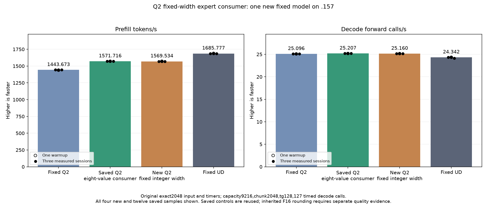
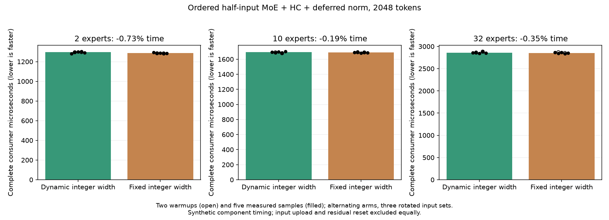

<!-- SPDX-License-Identifier: MIT -->
# Fixed integer geometry for the half-input expert consumer

The wrapper already accepts hidden2560 and streams4 only, but its consumer
kernel still uses the runtime hidden argument for row/stream indexing and
bounds. This isolated candidate makes those integer operations constant2560.
It retains the runtime float(hidden) normalization divisor to preserve the
original floating operation. The eight-value expert accumulation, shared
expert FMA, residual update, square contraction, wave reduction, ordered total,
rsqrt and normalized F16 rounding keep their source arithmetic. Wrapper,
producer, dispatch, output representation and allocation are unchanged.

The measured parent is1571.716479 PP /25.20732109 TG. Source derives from
independently fetched MIT Gufo pin f783fedb9bea2ec7de941f6da4e02f4a4596b29e
and the retained LIE lineage; no sibling DS4/CachyOS source or artifact is
imported. The literal parent consumer is included only in the new component.

Local assembly comparison finds160 other kernel bodies instruction/operand/
resource exact. The changed consumer has1763 to1093 static instructions
(-38.003403%), VGPR84 to91, SGPR32 to26, unchanged LDS10368 and zero private
bytes. These counts are not dynamic timing. Constant propagation can change
scheduling and register demand, so complete GPU outputs and model timing
remain necessary.125 launcher guard cases pass.

[Source](../config/q2-half-fixed-width-source.json),
[static comparison](../config/q2-half-fixed-width-static.json),
[frozen plan](../config/q2-half-fixed-width-plan.json),
[staging](../config/q2-half-fixed-width-staging-results.json).

## New candidate qualification

The new fixture retains the previous complete-consumer protocol but binds the
new candidate and literal1571 parent.35 shapes/three rotations yield105 checks
of all residuals, scales and half-normalized outputs against parent and the
unchanged F32 consumer on exactly expanded halves. Tokens16/17/33/129 cover
experts1/2/10/32 and aligned16/aligned4-only input bases; additional2048-token
shapes cover2/10/32 experts. Gate stride1/5, injection parts1/3/10, signed zero,
subnormal and extreme finite halves, allocation-end tails, output guards/poison
and immutable inputs remain covered. This is differential operator evidence,
not an independent task-quality oracle. Old cohorts are not rerun.

Only three2048-token shapes are timed, with two warmups/five measured samples,
alternating arms and three rotated expert inputs exceeding32MiB. Complete
MoE/shared sum, HC/residual, scales and half norm are timed; upload/expansion
and identical residual reset are outside both arms. Safe numeric or timing
failure does not suppress new model performance. Guard/unwritten-output
failure stops further device work.

Original direct-executor exact2048/tg128 input/timers remain fixed: C1 greedy,
MTP off, capacity9216/chunk2048, one warmup/three measured samples. Saved
Q2 PP1443.672867, parent1571.716479 and UD1685.777092 are reused. Loading and
compilation stay outside model PP/TG. .157 GPU admission is fresh; no Q4,
full curve, cleanup, tuning or dependency installation is scheduled.

Host-only .157 Debug27/27 and ASan/UBSan27/27 pass; six command exits0 and seven artifacts verify. All72 fixtures and the host source capsule are bound. [Host results](../config/q2-half-fixed-width-host-results.json). GPU/model results are pending at preparation. The inherited F16 task-quality
gap and full context/concurrency parity remain open even if parent replay is
exact. No production promotion or predicted gain is claimed.

## Saved-array diagnosis

The component completes all105 output triples and42 timings with intact
outputs/guards and immutable inputs. Its numerical command exits1: residuals
match105/105, scales12/105 and normalized halves44/105. Across saved failures,
1948 scale values differ by at most2 ULP (max absolute4.76837158203125e-7),
and637 half values differ by at most1 ULP (max absolute0.0078125).
These are real byte differences. Identical residuals locate the first observed
change at normalization; compiler reassociation is a hypothesis, not yet a
causally isolated explanation. The unchanged F32 consumer agrees with the
literal parent. The original failure, all837 differing-case array artifacts
and42 timing samples remain; no threshold/golden is altered.

The production10-expert consumer median improves only0.193375%, with overlapping
ranges. The38% static instruction reduction therefore does not establish a
substantial full-cycle saving. A bandwidth limit is plausible but unmeasured
by hardware counters. The original-model test proceeds despite the safe
numerical failure. [Saved-array analysis](../config/q2-half-fixed-width-differences.json).

## Completed GPU component and original model — 2026-10-05 UTC

All105 complete consumer comparisons,35 immutable-input cases and42 timings are retained. Both timed arms consume the same F16 representation; the unchanged F32 consumer receives exactly expanded halves. This is differential operator evidence, not independent model quality. Positive time changes mean slower.

| Scope / distribution | Reference median us | Candidate median us | Time change |
| --- | ---: | ---: | ---: |
| complete-consumer / n2048-u2-p64 | 1295.443296 | 1285.940329 | -0.733569% |
| complete-consumer / n2048-u10-p64 | 1692.734400 | 1689.461072 | -0.193375% |
| complete-consumer / n2048-u32-p64 | 2859.481812 | 2849.388758 | -0.352968% |

The original model follows the completed guarded component; safe numerical or timing rejection would not suppress its performance measurement. All three comparator columns below are saved evidence, without rebuild or rerun.

| Session | Fixed Q2 PP / TG | Saved best PP / TG | New fixed-width consumer PP / TG | Fixed UD PP / TG |
| --- | ---: | ---: | ---: | ---: |
| Warmup | 1438.259006 / 25.08847266 | 1571.452532 / 25.18076430 | 1571.864119 / 25.15820750 | 1689.043527 / 24.34239962 |
| Measured 1 | 1443.398207 / 25.10565683 | 1572.749703 / 25.20732109 | 1569.569346 / 25.13728924 | 1686.364042 / 24.34621613 |
| Measured 2 | 1443.672867 / 25.08698337 | 1571.581590 / 25.21066467 | 1568.270062 / 25.16043516 | 1685.777092 / 24.34174251 |
| Measured 3 | 1443.841794 / 25.09595499 | 1571.716479 / 25.18988477 | 1569.533792 / 25.16597874 | 1685.400011 / 24.15102104 |
| Median measured | 1443.672867 / 25.09595499 | 1571.716479 / 25.20732109 | 1569.533792 / 25.16043516 | 1685.777092 / 24.34174251 |

There are8 changed parent model files. Within-arm replay is exact=True. PP change versus saved best=-0.138873%.

Resident model memory remains43,156,012,544 bytes. Compilation/loading stay outside PP/TG. Independent task quality and the context/concurrency curve remain open. The window releases at2026-10-05T14:11:27.395434+00:00 with974 retired identities/774 groups, empty KFD, four free original leases and unchanged seven model stat tuples. All874 artifacts verify across13 runtime commands; canonical/main/remote mirrors agree.

[All model samples](figures/q2-half-fixed-width-model-wrapped.csv), [all component samples](figures/q2-half-fixed-width-component.csv), [final audit](../config/q2-half-fixed-width-final-audit.json).

The final disposition retains the experiment and keeps the1571.716479 parent.
The candidate median is1569.533792 PP /25.16043516 TG: PP-2.182687 tokens/s
(-0.138873%), TG-0.186001%. The decode kernel source is unchanged; this is a
historical sample difference, not a causal decode attribution. All three
candidate PP samples fall below the saved parent's range. No contemporaneous
control rerun or stability claim is added.

All generated model tokens match; eight prefill/last logit files differ with
max matched-history parentKL0.007411541178. All nine within-arm replays match.
The component's exit1 remains a real numerical rejection and the subsequent
model test completes with four exits0.837 saved case arrays plus37 ordinary
artifacts yield874 verified artifacts across13 runtime commands. No tolerance
or golden is replaced. Fixed Q2/UD/input/timers remain unchanged. The retained
1571 parent still requires7.257073% more PP to reach UD; full curves and
independent task quality remain open.

Thermal peaks are68.625 C CPU/41 C GPU for the component and77.625 C CPU/74 C
GPU for the model, including build/load. Loading10.88489496 seconds is excluded;
resident43156012544,session376777748 and deferred7946240 bytes remain as recorded.
The initial descriptive range flag checked only faster disjoint ranges; it
is corrected to include slower disjoint ranges, preserving the initial report
under preparation evidence. Measurements and disposition are unchanged.

[Disposition](../config/q2-half-fixed-width-disposition.json),
[saved-best diagnostic proposal](../config/q2-current-best-profile-opportunity.json).
