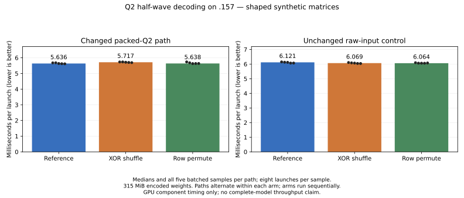

<!-- SPDX-License-Identifier: MIT -->
# Q2 paired half-wave decoding — no measured component benefit

The [LDS weight-staging candidate](Q2-STAGED-WEIGHTS.md) is exact but 4.94%
slower on the shaped down projection. The next hypothesis removes duplicate
decoding without expanding LDS. Both variants now preserve the tested outputs
on `.157`, but neither improves the shaped GPU component. They remain isolated
experiments; no complete-model run or runtime promotion follows this result.

## Measured result

| Source | Packed Q2 median, us | Change in packed time | Raw-input control, us | Change in control time |
| --- | ---: | ---: | ---: | ---: |
| Measured MoE/HC reference | 5635.715 | — | 6121.384 | — |
| Half-wave XOR shuffle | 5716.618 | +1.44% | 6068.835 | -0.86% |
| Half-wave row permute | 5638.434 | +0.05% | 6063.829 | -0.94% |

These are GPU-event times for the same original-shape synthetic down projection:
2048 tokens, 512 experts, ten selected, 2560 output rows, logical K640/stored
K768, tile48 and 315 MiB of encoded weights. Each path has five batched samples
of eight launches, after three warmups. Raw and packed paths alternate within
each arm; the three separate arms run reference, shuffle, permute in that order.
Transfers, routing construction, hashing and oracle checks are outside timing.
They are component measurements, not complete prefill rates or UD comparisons.

The unchanged raw controls are slightly faster in both candidate arms. Even
with that favorable drift, the changed path is slower or effectively equal.
Fewer decode instructions alone therefore do not establish a useful speedup.
The exchange/select overhead is a plausible explanation, not a profiled causal
finding. No claim of statistical equivalence is made from these five samples.

[All 30 timing samples as CSV](figures/q2-half-wave.csv),
[shuffle report](../config/q2-half-wave-results.json), and
[row-permute report](../config/q2-half-wave-permlane-results.json) retain the
actual numbers and checks. The chart starts at zero and shows every sample.

Both variants pass 30 independent operator cases plus 32 exact packing/down/
chain checks. All 62 saved buffers match the retained packed reference.
The shaped benchmark also matches all 52,428,800 F32 output values between
raw and packed paths and across all three arms. Its 1024 independent FP64 dot
products retain relative RMS 0.000192816 and error/peak 0.000224105 against the
unchanged 0.002 limits. GPU commands exit 0; full output hashes and independent
sample files agree. This does not resolve earlier complete-model drift from
the qualified Q2 runtime or establish an independent model-quality score.

The fresh host capsule passes 12/12 Debug and 12/12 ASan/UBSan checks, including
the source-admission guards. Across these six CPU/component arms, all 21 command
exits are zero and 154 artifacts hash-verify. Every GPU/build arm independently
acquires the four expected leases in the window explicitly returned by core.
The enclosing [half-wave/HC validation](../config/q2-half-wave-hc-validation.json)
records process retirement, artifact verification and lease release. Observed
thermal samples across that window peak at GPU 51 C and CPU 80.5 C; short
sampling intervals do not guarantee the true instantaneous maximum.

## Mechanism

The existing packed-Q2 kernel makes paired lanes in the two 16-lane halves
decode the same 32 weights. Each pair needs identical F16 weight fragments
for its WMMA instructions. The candidate assigns one K16 weight half to each
half-wave, decodes it with the original F32 affine/FMA and F16 rounding, then
exchanges the already-rounded 32-bit pairs with the corresponding peer lane.
Both lanes reconstruct the original low/high fragments in the original order.

The code/affine/activation LDS layout and size, compensated activation planes,
WMMA accumulation order and residual correction remain unchanged. The original
Q2 bytes are consumed directly; there is no persistent decoded-weight cache.
Only `kQ2 && kPacked` selects the new code. This is independent of reactive PLE,
the larger encoded-row cache and the rejected decoded-weight staging buffer.

Two isolated exchange primitives were measured:

- `half-wave`: HIP XOR shuffle, lowered by the installed compiler to sixteen
  static `ds_bpermute_b32` instructions in each affected specialization.
- `half-wave-permlane`: explicit `__builtin_amdgcn_permlanex16` with identity
  lane selectors inside the opposite 16-lane row; lowered to sixteen static
  `v_permlanex16_b32` instructions and no `ds_bpermute_b32`.

LLVM documents the latter's cross-row gather and scalar selectors in its
[AMDGPU intrinsic reference](https://llvm.org/docs/AMDGPUUsage.html), with the
[Clang builtin signature](https://clang.llvm.org/docs/AMDGPUBuiltinReference.html#builtin-amdgcn-permlanex16).
These specify the operation, not its superiority. The installed rocPRIM
`warp_reduce_dpp.hpp` explicitly notes that permlanex16 can be slower in some
cases; both numerical replay and actual timings are required before selection.
No rocPRIM or external project code is copied into the candidate.

## Static resource comparison

| Token tile | Reference VGPRs | XOR-shuffle VGPRs | Per-row-permute VGPRs | LDS, all three | Private bytes, all three |
| --- | ---: | ---: | ---: | ---: | ---: |
| 16 | 112 | 119 | 115 | 16,640 B | 0 |
| 48 | 144 | 146 | 145 | 24,832 B | 0 |
| 64 | 169 | 169 | 169 | 28,928 B | 0 |

Both candidates halve the static mixed-FMA-to-half count from 64 to 32.
WMMA instruction counts remain 8/24/32. The exchange instructions and selects
are additional work; static counts do not establish throughput or occupancy.
For comparison, rejected decoded-weight staging uses 169 VGPRs and 28,928 B
LDS at the main tile48 shape.

Device-only gfx1151 compilation and changed-file formatting pass for both
candidates. Their patches reconstruct all 1019 files byte-for-byte. The shared
formatter retains the already-recorded failures in two unchanged upstream test
files; they are not edited here. Actual command exits, assembly hashes and
compiler resource records are in
[shuffle static checks](../config/q2-half-wave-static.json) and
[permute static checks](../config/q2-half-wave-permlane-static.json).

## Reproduction and remaining scope

The existing packed operator suite and shaped benchmark supplied the runtime
checks above. Performance remains separate from numerical acceptance; failures
are never relabeled or hidden by relaxed tolerances. No component benefit was
found, so the conditional complete pp2048/tg128 Q2 baseline/candidate and UD
campaign is not warranted for these variants. Model quality, long context
support and the Q2/UD parity requirement remain open.

Generate either source into a fresh persistent directory using
`tools/prepare-q2-half-wave.py --exchange shuffle` or `--exchange permlane`.
The [shuffle source receipt](../config/q2-half-wave-source.json) and
[permute source receipt](../config/q2-half-wave-permlane-source.json) pin the
measured official-Gufo-derived base and each patch. Neither source replaces
the retained measured checkpoint or qualified runtime.

The fixed remote component modes now accept `--source-variant half-wave` and
`--source-variant half-wave-permlane` for `packed-operators` and `packed-bench`.
Both remain excluded from UD controls and require an explicit complete MMQ
rebuild for any eventual `q2-bench2k` model comparison. No launch is scheduled
by source preparation.

The existing `tools/analyze-q2-staged-weights.py` reader verifies each comparison;
`tools/plot-q2-half-wave.py` renders the two reports against their common fresh
reference. The initial plotting command named a nonexistent output directory
and exited 1; that attempt is retained under `evidence/`. The corrected command
uses `docs/figures/q2-half-wave` and exits 0.
