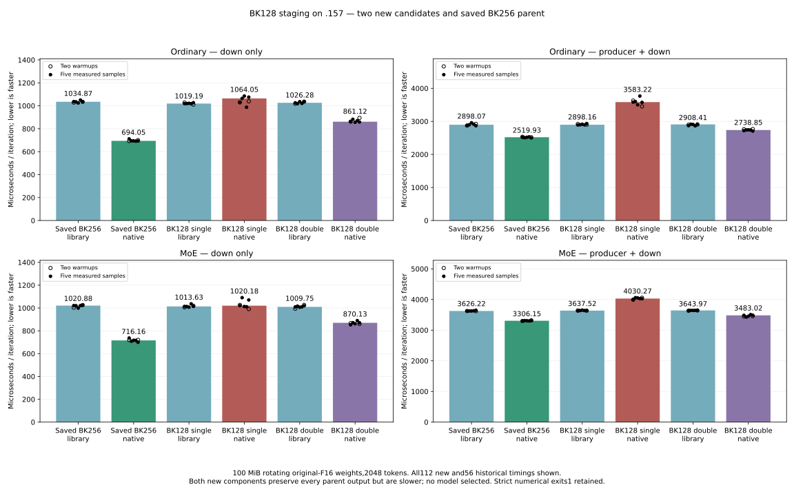

<!-- SPDX-License-Identifier: MIT -->
# HC-down BK128 staging experiment

Both new components are measured on `.157` and retained. Neither improves
the saved BK256 bounded parent, so no model is selected or run. The best
model observation remains 1477.969324 PP / 25.10545360 TG, below fixed UD PP.
The GPU window is released; no qualified inference comparator is relaunched.

## Complete-cycle performance

Both configure/build/fixture exits are 0/0/1; each verifies 44 artifacts,
finishes guards and input-immutability checks and records 56 timings. Each
scope uses 2048 tokens, 16 original-F16 matrices rotating 100 MiB, two warmups,
five measured repetitions and alternating library/native order.

| Candidate | Input/scope | Library median us | Native median us | Native time change |
| --- | --- | ---: | ---: | ---: |
| Single | Ordinary down | 1019.192219 | 1064.053416 | +4.402% |
| Single | Ordinary producer + down | 2898.156405 | 3583.223581 | +23.638% |
| Single | MoE down | 1013.634920 | 1020.182133 | +0.646% |
| Single | MoE producer + down | 3637.521982 | 4030.270576 | +10.797% |
| Double | Ordinary down | 1026.279926 | 861.117184 | −16.093% |
| Double | Ordinary producer + down | 2908.414602 | 2738.852024 | −5.830% |
| Double | MoE down | 1009.750366 | 870.131850 | −13.827% |
| Double | MoE producer + down | 3643.965244 | 3483.020067 | −4.417% |

The frozen selection uses the sum of complete native medians divided by the
sum of library medians. Saved BK256 ratio is 0.8929829913; new double-buffer
ratio is 0.9495591277, 6.335634% worse. This is a descriptive comparison to
historical paired component evidence, not a contemporaneous repeatability
claim. Both libraries remain around 2.9/3.6 ms for ordinary/MoE. The smaller
register/LDS counts do not outweigh the new runtime costs in these tests.

[Component report](../config/q2-hc-bk128-component-results.json),
[selection](../config/q2-hc-bk128-selection.json),
[all 112 new and 56 historical timings](figures/q2-hc-bk128.csv),
[PNG](figures/q2-hc-bk128.png).

## Numerical evidence with restored precision

All 40 saved tensors and all 22 full-buffer replay-hash records in each new
candidate match the saved BK256 parent. This includes full 2048 down outputs
and hashes of the 2048 F16 inputs. Both new siblings also match each other.
Residual/norm/F16 producers match the exact library, but down bytes differ
from the library. Strict exit 1 remains. Twenty independent norm checks pass.

The logging fix now exposes all down errors, including 2048, without treating
rounded 0.00 as zero. In each new fixture, native passes 11/12 independent
down cases; the library passes 0/10. The remaining native failure is 97 ordinary
error/peak 2.16019029529e−5, above the original 2e−5 limit. No threshold changes.
The twelve native checks include two benchmark-weight cases at 2048.

| 2048 shape/pattern | Native RRMS | Native error/peak | Library RRMS | Library error/peak |
| --- | ---: | ---: | ---: | ---: |
| Ordinary p0 | 1.606953e−5 | 1.504093e−5 | 3.155005e−5 | 3.373114e−5 |
| Ordinary p1 | 1.564792e−5 | 1.575043e−5 | 3.142626e−5 | 3.573349e−5 |
| MoE p0 | 1.592781e−5 | 1.322429e−5 | 3.182575e−5 | 2.716325e−5 |
| MoE p1 | 1.575384e−5 | 1.660508e−5 | 3.142951e−5 | 3.263537e−5 |

Every case samples 5040 independent FP64 dots. Native passes all four aligned
cases; library fails all four under the same limits. Both new candidates
produce identical values. The small-case results also reproduce the earlier
offline FP64 reconstruction. Full replay, deterministic unchanged weight
generation and identical arithmetic order support attributing these operator
results to the retained BK256 output, while its old rounded logs remain intact.
This is synthetic operator evidence, not an original-model teacher or task
quality qualification. It does not waive the 97-row failure or changed logits.
[All 44 new down checks](figures/q2-hc-bk128-fp64.csv).
The [additive oracle evidence](../config/q2-hc-native-down-oracle-update.json)
binds these new facts to the retained parent without changing its old verdicts.

## Instruction counts and next hypothesis

| Kernel object | Static instructions | Static VMEM loads | Static barriers | Static waits |
| --- | ---: | ---: | ---: | ---: |
| Bounded BK256 | 566 | 24 | 3 | 18 |
| BK128 single | 425 | 12 | 3 | 12 |
| BK128 double | 442 | 12 | 2 | 17 |

These are [static disassembly counts](../config/q2-hc-bk128-isa-results.json)
from retained device objects, not dynamic instruction/stall measurements.
BK128 doubles K steps 40→80; static reductions do not prove less executed work.
The timings reject smaller K staging as an improvement over the current parent.
Next investigate a wider token tile with the same original F16/two-chain
arithmetic, increasing work per load and weight reuse. That geometry needs
fresh component qualification; no claimed speedup or curve follows this result.

Release 2026-10-04T21:42:54.671907Z SHA256
`e59cb283620d253f08dd654b8413c76a9ddefeb2ddaa452faf5dd7ddca01c5fc`
verifies 528 recorded identities/411 groups absent, KFD empty, four original
leases free and six model stat tuples unchanged. No model inference, GPU
reservation, waiter, restart, tuning or remote cleanup remains.
[Release](../config/q2-hc-bk128-run-window-release.json).

## Source and compiler preparation

The measured original-F16 BK256 bounded parent gives1477.969324 PP on the
unchanged exact2048 model input. It is12.327120% below fixed UD1685.777092;
the full parity objective remains open. These two new candidates change only
the launch template in its attributed numerical include. No original provider
or qualified result is overwritten. Each complete source inventory has1023
files,1022 unchanged; patches reproduce the one-file changes.

| Candidate | BK | LDS buffers | LDS bytes | VGPRs | Private bytes/thread |
| --- | ---: | ---: | ---: | ---: | ---: |
| Measured bounded parent | 256 | 1 | 50688 | 138 | 0 |
| New single buffer | 128 | 1 | 26112 | 97 | 0 |
| New double buffer | 128 | 2 | 52224 | 98 | 0 |

Compiler observations use the same original numerical flags on the editing
host. Both configure-independent compile/unbundle/metadata commands exit0;
no device is executed. The shared upstream format check exits1 for74 inherited
violations in each source and reports no new numerical-include complaint.
Compilation/resource counts are not GPU numerical or performance evidence.

Both keep BM64/BN32,256 threads, two FP32 K16 chains and ascending K16 order.
BK128 is divisible by32, preserving which partial chain receives each K16.
Original F16 weights/activations and dispatch bounds96–2048/M320/K10240 remain.
Single buffering reduces LDS and the number of per-thread prefetched chunks,
but doubles K steps/barriers. Double buffering keeps the previous barrier
count and overlaps LDS stores with consumers, using roughly the same total
LDS as its parent. Generated full-buffer equivalence was subsequently verified
above; speed regresses against the saved parent.

The existing component fixture now prints unrounded error fields after
library diagnostics. Both new modes compare the exact library recipe,
retain independent FP64/full-buffer/guard checks and measure56 timings each
with100 MiB rotating weights. Numerical rejection never suppresses timing.
Model selection compares the summed complete-cycle native/library median
ratio against the saved bounded parent. At most one new model is admitted
if that ratio improves; even a marginal candidate is retained. Saved qualified
Q2/UD models are never relaunched. No context sweep precedes fixed-point parity.

Local77 launch checks pass. The `.157` CPU-only capsule verifies16 bound files,
with23/23 Debug and23/23 ASan/UBSan tests. Those tests do not execute HIP.
Fresh four-lease/process/KFD/registry/model-stat/thermal admission is required
before GPU build/run. No dependency installation, tuning or remote cleanup.

[Source and patches](../config/q2-hc-bk128-source.json),
[device objects](../config/q2-hc-bk128-object-results.json),
[host results](../config/q2-hc-bk128-host-results.json),
[frozen plan](../config/q2-hc-bk128-plan.json).
