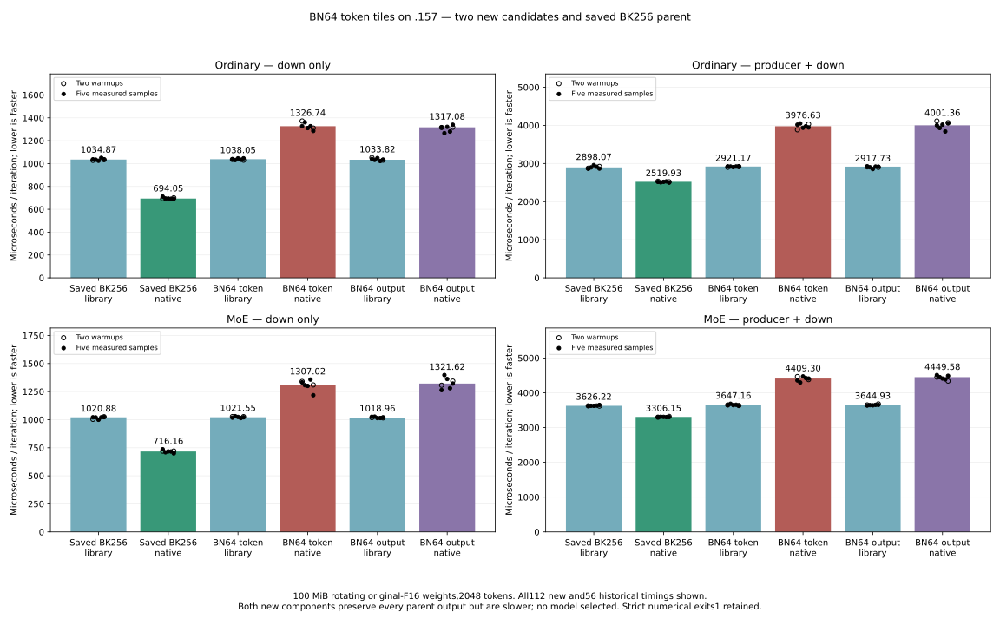

<!-- SPDX-License-Identifier: MIT -->
# HC-down with wider token tiles

The two new candidates derive from the measured original-F16 bounded provider
at 1477.969324 PP / 25.10545360 TG. Fixed Q2 1443.672867 / UD 1685.777092,
the original exact2048 input/timers and the full context-curve target remain.
No qualified provider or model evidence is overwritten or rerun.

The previous smaller K staging experiment regressed despite fewer static
instructions. These candidates increase the token tile from 32 to 64 instead:
each workgroup reuses its weights across twice as many tokens, with twice the
independent accumulator groups per wave. BK128 keeps LDS at 34816 bytes;
both use one LDS buffer. Only the launch template and corresponding token-grid
division change, in one file per 1023-file provider. All 1022 other files remain.

| Candidate | BM/BN/BK | WTM/WTN | VGPRs | LDS bytes | Private bytes/thread |
| --- | --- | --- | ---: | ---: | ---: |
| Measured parent | 64/32/256 | 16/16 | 138 | 50688 | 0 |
| Token-wide waves | 64/64/128 | 16/32 | 143 | 34816 | 0 |
| Output-wide waves | 64/64/128 | 32/16 | 144 | 34816 | 0 |

The 2048-token grid has 160 workgroups versus 320 in the parent. Each output
still receives the original ascending K16 sequence split into the same two
FP32 chains, then the same final addition. Original F16 bits, dispatch bounds,
allocation, streams and public transitional API remain. Ragged rows still
clamp loads to the final row and mask stores. Generated full-buffer equality
and speed require actual GPU evidence; source algebra and resource counts
alone do not establish either.

Both offline compile/unbundle/metadata sequences exit 0/0/0. The shared
format check retains exit 1 for 74 inherited violations, with no new include
complaint. Local 77 launch tests pass. The `.157` host CPU capsule verifies
16 fixtures and passes 23/23 Debug plus 23/23 ASan/UBSan, with no model or GPU.

The frozen runtime plan admits two new component candidates with independent
FP64 checks, full output hashes, guards and 100 MiB rotating original-F16 weights.
Numerical rejection does not suppress the 56 timings per candidate. At most
one new model follows if the summed native/library complete-cycle ratio
improves the saved bounded parent. Marginal/failed candidates remain retained.
No model reference rerun, full context curve, installation, tuning or cleanup.
The coordinated window completed both components and selected no model.

| Candidate | Ordinary down, library / native µs | Ordinary complete, library / native µs | MoE down, library / native µs | MoE complete, library / native µs |
| --- | ---: | ---: | ---: | ---: |
| Saved BK256 parent | 1034.87 / 694.05 | 2898.07 / 2519.93 | 1020.88 / 716.16 | 3626.22 / 3306.15 |
| BN64 token waves | 1038.053632 / 1326.741576 | 2921.169043 / 3976.627350 | 1021.551371 / 1307.016730 | 3647.157192 / 4409.300327 |
| BN64 output waves | 1033.824444 / 1317.082047 | 2917.729139 / 4001.355648 | 1018.962264 / 1321.617007 | 3644.926548 / 4449.584961 |

Each entry is the median of all five saved measured samples, with two warmups
also retained. These are component microseconds, not model prefill rates.
The best new summed native/library complete-cycle ratio is 1.276722 versus
0.892983 for the saved parent, a 42.972730% regression. Both new native cycles
are slower than their own library arms. Greater weight reuse and fewer workgroups
did not improve this measured implementation. No stall attribution follows from
this timing alone. The frozen selection therefore runs no model or curve;
the best measured fixed-model PP remains 1477.969324 versus UD 1685.777092.

Both components retain actual configure/build/test exits 0/0/1 and 44 verified
artifacts each. Each new candidate matches all 40 saved parent tensors and all
22 whole-buffer replay hashes. Unrounded independent FP64 checks reproduce
11/12 native passes versus 0/10 library passes under the original 2e-5 limits.
All four aligned 2048 cases and two benchmark-weight cases pass natively;
97 ordinary peak 2.16019029529e-5 still fails. Twenty independent norm checks
pass per arm. Strict byte replay against the library still rejects; neither
thresholds nor old reports are changed. This is synthetic operator evidence,
not original-weight model or independent task quality.

The window released at 2026-10-04T22:14:00.789800Z after verifying 543 retired
process identities/423 groups, empty KFD, four original leases free and six
unchanged model stat tuples. Core receives the release. No Q2 GPU job,
reservation, waiter, restart or cleanup remains; any new GPU run requires
fresh coordinated admission. All 112 new timings and 56 saved parent timings
remain in the graph and CSV. No qualified inference reference was rerun.

[Source and patches](../config/q2-hc-bn64-source.json),
[device objects](../config/q2-hc-bn64-object-results.json),
[host receipt](../config/q2-hc-bn64-host-results.json),
[frozen plan](../config/q2-hc-bn64-plan.json),
[component results](../config/q2-hc-bn64-component-results.json),
[selection](../config/q2-hc-bn64-selection.json),
[release](../config/q2-hc-bn64-run-window-release.json),
[all timings](figures/q2-hc-bn64.csv),
[all FP64 checks](figures/q2-hc-bn64-fp64.csv).

