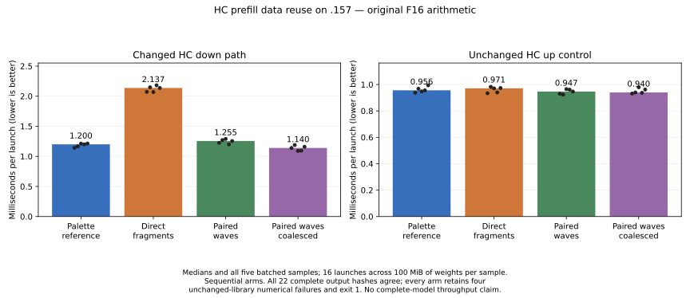
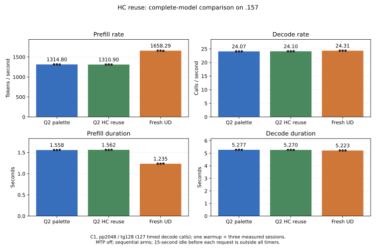

# HC prefill: data reuse and paired accumulation waves

<!-- SPDX-License-Identifier: MIT -->

All three HC down candidates are rejected after the `.157` measurements.
Direct global-to-register fragments increase component time 78.02%; splitting
the existing K16 chains across wave pairs increases it 4.59%. Combining those
wave pairs with coalesced stage loading reduces component time **5.04%**, but
complete-model prefill changes **1314.803 -> 1310.904 tokens/s (-0.30%)**.
The component benefit does not survive the model comparison. Every saved
reference/candidate output is exact, and the selected affine-palette source
stays unchanged. It still trails fresh UD by **20.71% prefill / 1.03% decode**;
the performance target remains unmet.



## Three isolated mechanisms

The [preceding profile](Q2-PREFILL-GAP.md) measured 128.083 ms in Q2's dominant
F16 HC down prefill path versus 41.034 ms in UD's dominant Q8 path. These formats
and numerical paths differ. All new candidates retain the original Q2 F16
weights, 64-row/128-token tile, five-row grouping, ordered low/high K16 sums
and their final F32 addition. They derive from the measured affine palette.

1. **Direct fragments:** read F16 operands directly from global memory into
   WMMA registers; shared memory remains only for the output transpose.
   Removing stage copies and block barriers also removes inter-wave reuse.
   The measured regression rejects this path; fewer registers do not establish
   a useful speedup or isolate the exact hardware bottleneck.
2. **Paired waves:** retain shared staging, but give the low and high K16
   accumulator chains to separate physical waves. Sixteen physical waves
   represent the same eight logical output tiles. Each computes the original
   ordered chain, then the high wave adds low+high through bounded shared
   storage and performs the original vector stores. Only HC down uses 512
   threads; other specializations stay at 256. This preserves arithmetic but
   does not by itself improve component time.
3. **Paired waves with coalesced fetches:** distribute 16-byte chunks across
   all 512 threads. Each thread fetches one weight chunk and two activation
   chunks per stage, replacing a complete K32 row assigned to a smaller subset
   of threads. Staged bytes, WMMA order and the paired-wave epilogue stay fixed.
   This is the candidate tested in the complete model and rejected there.

| Source | Threads | Static VGPR/thread | LDS bytes | Private bytes |
|---|---:|---:|---:|---:|
| Affine-palette reference | 256 | 251 | 24576 | 0 |
| Direct fragments | 256 | 138 | 18432 | 0 |
| Paired chains | 512 | 152 | 24576 | 0 |
| Paired chains/coalesced fetches | 512 | 129 | 24576 | 0 |

These are compiler resource records, not measured occupancy. Both original
staged chains and the paired chains consume the same K16 sequences; partial
results are not regrouped as in a conventional split-K reduction. The original
FP32 addition stays low+high. Weight files, quantization, KV state and PLE I/O
are unchanged by these kernels.

## Component results and numerical limits

The existing fixture rotates 16 synthetic F16 weight matrices over 100 MiB.
Every shape has five batches of sixteen launches after a warm rotation. GPU
events exclude transfers, allocation and numerical checks. HC up is an
unchanged control. Arms run sequentially in one coordinated window.

| Source | HC down median us | Down min–max us | Time change | HC up median us |
|---|---:|---:|---:|---:|
| Fresh reference | 1200.213 | 1142.921–1213.518 | — | 955.842 |
| Direct fragments | 2136.573 | 2068.912–2180.925 | +78.02% | 970.776 |
| Paired chains | 1255.352 | 1199.131–1290.194 | +4.59% | 946.677 |
| Paired/coalesced | 1139.751 | 1090.605–1188.560 | -5.04% | 939.768 |

All 22 full-output hashes, sampled FP64 oracle results and sampled coordinates
match for all three candidates. The same four unchanged-library controls fail
the original 2e-5 thresholds in every arm: n32/n95 HC down and ragged M319 or
K10208. All four component commands therefore retain **exit 1 / FAILED**, with
all performance samples present. No numerical limit or expected value changes.
Exact synthetic replay does not establish independent full-model quality.

The component reports are
[direct](../config/q2-hc-direct-results.json),
[paired waves](../config/q2-hc-chain-waves-results.json) and
[paired/coalesced](../config/q2-hc-chain-coalesced-results.json).
[CSV](figures/q2-hc-data-reuse.csv) retains all forty timing samples.

## Complete-model comparison

All three arms finish: affine-palette Q2, paired/coalesced Q2 and pristine UD.
They use original files, full MMQ rebuilds, C1 pp2048/tg128 with **127 timed
decode calls**, MTP off, capacity 9216 and 2048-token chunks. Each arm runs one
warmup and three measured fresh sessions with the same repeated-padding prompt;
a 15-second idle before each request is outside the timers. Arms are sequential,
not interleaved ABBA trials. Rates are medians, with all measured ranges below.

| Source | Prefill tokens/s median [min–max] | Decode calls/s median [min–max] | Prefill median s | Decode median s |
|---|---:|---:|---:|---:|
| Q2 palette reference, retained | 1314.803 [1311.863–1314.914] | 24.065021 [24.051945–24.076506] | 1.557648 | 5.277369 |
| Q2 paired/coalesced, rejected | 1310.904 [1309.565–1313.106] | 24.096790 [24.093205–24.115803] | 1.562280 | 5.270411 |
| Fresh pristine UD | 1658.287 [1652.144–1658.438] | 24.314854 [24.312630–24.327254] | 1.235009 | 5.223145 |

Candidate prefill changes -0.2965% against fresh Q2. The partly overlapping
three-sample ranges do not establish a robust small regression, but demonstrate
no complete-model benefit to retain. Decode changes +0.1320%; its path is
unchanged and this observation is not attributed to the prefill edit. The
unchanged HC up component also ran 1.68% faster in the candidate arm, so the
entire down component difference cannot be treated as an isolated causal gain.
No device-counter evidence identifies why the component result disappears.

All **21 reference/candidate files** match exactly: twelve full logit frontiers
and nine token/input files. The fresh reference also reproduces all 21 retained
palette files exactly; [the replay receipt](../config/q2-hc-chain-reference-replay.json)
records each file. Nine token/input files match UD, and all 27 within-arm
repetition checks pass. These checks preserve this checkpoint's outputs; they
do not resolve earlier drift or independent full-model quality qualification.

The selected reference remains 20.7132% below current UD prefill and 1.0275%
below decode. Current UD is itself below the earlier retained 1682.761 prefill
control; this screen does not weaken the no-regression requirement. It does not
measure new-input storage latency, long context, concurrency, HTTP serving or
reactive scheduling. The original PLE files/cache policy are unchanged.



[Complete report](../config/q2-hc-chain-model-results.json) and
[all-value CSV](figures/q2-hc-chain-model.csv) retain all samples and durations.
Each row below is one measured request, excluding the warmup:

| Source | Sample | Prefill tokens/s | Prefill s | Decode calls/s | Decode s |
|---|---:|---:|---:|---:|---:|
| Q2 palette | 1 | 1314.914312 | 1.557515940 | 24.06502059 | 5.277369263 |
| Q2 palette | 2 | 1314.802982 | 1.557647821 | 24.05194462 | 5.280238334 |
| Q2 palette | 3 | 1311.863058 | 1.561138556 | 24.07650578 | 5.274851806 |
| Q2 paired/coalesced | 1 | 1310.904238 | 1.562280402 | 24.09679036 | 5.270411458 |
| Q2 paired/coalesced | 2 | 1313.105710 | 1.559661179 | 24.09320504 | 5.271195750 |
| Q2 paired/coalesced | 3 | 1309.564851 | 1.563878260 | 24.11580332 | 5.266256252 |
| UD | 1 | 1658.286979 | 1.235009396 | 24.31485420 | 5.223144624 |
| UD | 2 | 1658.437834 | 1.234897057 | 24.32725426 | 5.220482289 |
| UD | 3 | 1652.143525 | 1.239601747 | 24.31263003 | 5.223622449 |

## Source and static checks

Official independently fetched Gufo pin:
`f783fedb9bea2ec7de941f6da4e02f4a4596b29e`. The three first-party MIT generators
are `tools/prepare-q2-hc-direct.py`, `tools/prepare-q2-hc-chain-waves.py` and
`tools/prepare-q2-hc-chain-coalesced.py`; their isolated deltas are under
`experiments/`. The combined patch applies after the paired-wave patch, while
the direct path independently derives from palette. Upstream notices remain.
No external engine or sibling project artifact is imported.

All three device-only gfx1151 compilations and changed-file format checks pass.
Each patch reconstructs all 1,019 files exactly. Full-upstream formatting
retains exit 1 in the same two unchanged test files. Source and static receipts
under `config/q2-hc-{direct,chain-waves,chain-coalesced}-*.json` bind the
identities and actual command exits. Runtime qualification stays on `.157`.

The selected development source remains `.deps/gufo-q2-bench-affine-palette`,
with kernel SHA256
`4de114a41d58e2b6f74038abfbf27bef8dc285dadf4b95ef69ae3b51b6b8a9fe`.
The qualified runtime source, `patches/gufo-q2.patch`, C ABI, model state and
metrics contracts do not change. The new kernels remain isolated experiment
patches, not a runtime promotion.

## Validation, closure and reproduction

Three chronological source-guard arms each pass **12/12 Debug and 12/12
ASan/UBSan** on `.157`. All ten runners and 42 commands finish; 38 commands
exit 0 and the four component commands retain their numerical-control exit 1.
All **291 artifacts**, source capsules, collections, binary identities and
original-model stat witnesses verify. Model arms rebuild all MMQ sources.
Observed model-arm maxima are GPU81 C / CPU92.875 C, within the applicable
bounds. Actual argv, stdout, stderr and exit codes remain in local `evidence/`.

Closure at **2026-10-03 00:04:15.591646 UTC** confirms all ten runner and 42
command identities/groups/sessions absent, empty KFD, four original leases
free and all five original model stat witnesses unchanged. Independent observer
retirement at **00:04:44.987086 UTC** also exits 0. No Q2 remote job, waiter,
lease or automatic retry remains. The
[validation](../config/q2-hc-data-reuse-validation.json),
[release](../config/q2-hc-data-reuse-window-release.json) and
[retirement](../config/q2-hc-data-reuse-observer-retired.json) receipts retain
those identities. Direct interthread MCP notification fails at its local
transport; the shared registry, persistent receipt and coordination ledger
record handover without claiming delivery.

Each source is reproduced by its `tools/prepare-q2-hc-*.py` generator. In an
admitted window, `tools/q2-remote.py hc-pp-bench LABEL --source-variant VARIANT`
selects `affine-palette`, `hc-direct`, `hc-chain-waves` or `hc-chain-coalesced`.
The complete Q2 arms use `q2-bench2k` with `affine-palette` or
`hc-chain-coalesced` plus `--rebuild-mmq`; UD uses `ud-bench2k --rebuild-mmq`.
Every arm is followed by `collect LABEL`. Exact analysis commands are retained
in `evidence/q2-hc-*-analysis-r1.json`; the model report can be plotted locally:

```sh
python3 tools/plot-q2-model-screen.py \
  config/q2-hc-chain-model-results.json docs/figures/q2-hc-chain-model \
  --reference-label 'Q2 palette' --candidate-label 'Q2 HC reuse' \
  --title 'HC reuse: complete-model comparison on .157'
```

## Next measured hypothesis: bounded library workspace

The [local source audit](../config/q2-hc-library-audit.json) finds that the
existing hipBLASLt fallback requests sixteen heuristic choices with **zero
workspace**, selecting the first supported result. `BlasLt::MakePlan` is
identical between the qualified and selected sources. The current large-HC
path uses custom WMMA, so this limit concerns the old library reference and
fallback, not an explanation of the selected kernel's timing.

The independently fetched official `tools/qwen-flash/dense_blaslt_sweep.hip`
already explores 32 choices and 64 MiB workspace, but has no independent
numerical check. Its four HC weight matrices occupy 25 MiB, below the stated
32 MiB cache capacity; activations add to the working set. It cannot simply
replace the current 100 MiB rotating-weight protocol for this comparison.

A useful next experiment is a bounded private-workspace algorithm comparison
with the existing original F16 row layout, rotation and sampled FP64 checks
for every measured algorithm. Accumulation-order changes still require model
qualification. This is a source-backed hypothesis only: no new library GPU
sweep, speedup or adopted implementation is claimed in this report.
