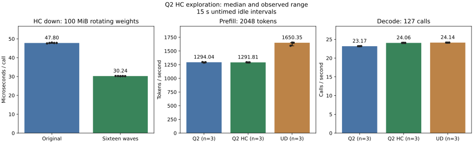

<!-- SPDX-License-Identifier: MIT -->
# Scalar HC down row parallelism

Sixteen waves improve the complete Q2 decode screen by **3.82%**, from
23.170514 to 24.055478 calls/s, with identical generated tokens. The changed
component saves 36.73% time. Eight waves improve less; 32 waves are 1.71%
slower than sixteen. Sixteen waves become the retained development candidate.
The performance goal remains unmet: this fresh UD control reaches 24.136370
calls/s and 1650.348 prefill tokens/s, versus Q2 24.055478 / 1291.808.

The measured MoE/HC checkpoint spends about 69.6 ms on 1455 scalar HC down
calls in a 15-step decode trace. Four wave32 groups cooperate on each
320-by-10240 F16 matrix row. Each thread processes twenty groups of four
elements. Earlier one/two-group register prefetch does not improve this cost.

This isolated experiment changes the row partition to eight, sixteen or 32
waves, reducing each thread to ten, five or two/three four-element groups.
The hypothesis is that more concurrent memory requests reduce row latency.
All candidates keep the
original F16 weight bytes, F32 activations/products/accumulators and one block
per row. The cross-wave partial reduction remains in bounded LDS. Dispatch
changes only for F16 SmallGemm, one token, M320 and K10240. Prefill, other
dimensions, memory allocation, C17 scheduling and cache policy are unchanged.

Thread assignments and the partial-sum tree change: byte-exact replay is not
assumed. The independent FP64 oracle retains its original 0.00002 relative RMS
and error-over-peak limits. Performance and numerical deltas are separate
observations; no model qualification or UD parity is established by preparation.

## Static preparation

| Waves per row | Threads | Groups per thread | VGPRs | LDS bytes | Private bytes |
| --- | ---: | ---: | ---: | ---: | ---: |
| 4, measured base | 128 | 20 | 13 | 16 | 0 |
| 8 | 256 | 10 | 13 | 32 | 0 |
| 16 | 512 | 5 | 13 | 64 | 0 |
| 32 | 1024 | 2–3 | 13 | 128 | 0 |

All candidates compile device-only for gfx1151 and reconstruct all 1019 source
files exactly. Changed-file formatting passes. Shared-tree formatting retains
exit 1 for unchanged upstream test files. Existing compiler switch warnings
remain in the logs. These are source/compiler checks, not GPU execution.

The first-party generator `tools/prepare-q2-hc-decode-waves.py --waves 8|16|32`
derives separate source trees from `.deps/gufo-q2-bench-hc-moe-fused`, official
Gufo pin `f783fedb9bea2ec7de941f6da4e02f4a4596b29e`. Only `kernels.hip.cpp`
changes. Original notices remain; the deltas are MIT. Source/static receipts
are `config/q2-hc-decode8-{source,static}.json` and the corresponding decode16/32
records. Runtime qualification follows fresh coordinated admission on `.157`.

## Component results

All four component arms pass the existing eleven independent FP64 operator cases.
The scalar shape covers ordinary, tiny and alternating-sign inputs; token
widths 2/3/8/9, ragged dimensions, HC up and router dimensions are controls.
All eight unaffected buffers match exactly. Only the three changed scalar
frontiers differ, at most 1.073e-6 for eight waves, 1.192e-6 for sixteen and
9.537e-7 for 32.
No limit is relaxed. Host source-admission fixtures pass 12/12 Debug and 12/12
ASan/UBSan on `.157` before GPU work.

| Waves | Minimum us | Median us | Maximum us | Median time change |
| --- | ---: | ---: | ---: | ---: |
| 4, fresh reference | 47.560 | 47.796 | 48.015 | — |
| 8 | 42.205 | 42.644 | 42.911 | -10.78% |
| 16 | 30.181 | 30.240 | 30.274 | -36.73% |
| 32 | 30.728 | 30.758 | 30.872 | -35.65% |

The unchanged fixture rotates sixteen original-layout `hipMalloc` matrices,
100 MiB total, beyond the 32-MiB cache. A warm traversal precedes five samples
of 128 launches; HIP events exclude transfers and numerical verification.
All samples, numeric deltas and independent errors are in
[eight-wave results](../config/q2-hc-decode8-results.json),
[sixteen-wave results](../config/q2-hc-decode16-results.json) and
[32-wave results](../config/q2-hc-decode32-results.json).
The component gain selects sixteen waves for the complete-model screen below.
The 32-wave follow-up passes numerics but is slower than sixteen, so no further
model arm is justified. It remains negative evidence for additional parallelism.

The first sixteen-wave analysis attempt exits 1 because collection had not yet
finished. After the original collection terminates with exit 0, analysis is
rerun successfully without any GPU rerun; both local exits are preserved.
A local CTest-summary validation also retains exit 1 for expecting the older
summary wording. The original logs already report 12/12 passes; the corrected
validator checks the current summary and all twelve individual pass records.

## Complete model screen

All three arms rebuild the complete model/MMQ sources, use the unchanged
original GGUFs, C1, 2048 physical prompt tokens and 128 generated tokens, with
127 subsequent timed decode calls. MTP and prefix reuse are disabled. Each has
one warmup and three measured fresh sessions; 15-second idle intervals precede
warmup and each request and are excluded from PP/TG. The same repeated-padding
input and token trajectory are verified across Q2 and UD. Model loading and
saved-file I/O are outside these request timers.

| Arm | PP tok/s min / median / max | TG calls/s min / median / max | Median PP s | Median TG s |
| --- | ---: | ---: | ---: | ---: |
| Q2 reference, four waves | 1286.890 / 1294.041 / 1297.144 | 23.16837 / 23.17051 / 23.20428 | 1.582639 | 5.481104 |
| Q2 sixteen waves | 1290.518 / 1291.808 / 1293.373 | 24.05148 / 24.05548 / 24.06995 | 1.585375 | 5.279463 |
| Fresh pristine UD | 1594.684 / 1650.348 / 1653.495 | 24.12628 / 24.13637 / 24.14307 | 1.240951 | 5.261769 |

[All plotted samples](figures/q2-hc-decode16.samples.csv) and
[summary CSV](figures/q2-hc-decode16.csv) accompany the complete result JSON.
Separate [eight-wave](figures/q2-hc-decode8.svg) and
[32-wave](figures/q2-hc-decode32.svg) component plots retain all five samples.

The fresh full-model sixteen-wave screen improves decode 23.170514 -> 24.055478
calls/s (+3.82%). PP changes 1294.041 -> 1291.808 tokens/s (-0.17%) with overlapping
samples; no zero-margin non-regression verdict follows from that overlap.
All nine token files match and all six prefill frontiers are byte-exact. Decode
frontiers differ, with maximum KL 3.15016e-6 and absolute logit delta 1.139718.
These deltas compare two Q2 implementations, not an independent teacher.
All three input files and six output token files also match across Q2 and UD;
their logits need not match across weight formats. Within each arm the repeated
PP and final decode frontiers are deterministic. The fresh Q2 reference matches
all 21 retained MoE/HC checkpoint files exactly.

The candidate is 0.335% below this fresh UD decode median and 21.725% below its
prefill median. UD's current medians are lower than the earlier MoE/HC campaign's
1682.761 PP / 24.326 TG; that historical result remains visible and is not
replaced by a weaker reference to claim parity. These sequential short-context
arms are a screening comparison, not interleaved zero-margin statistical
acceptance, sustained serving, HTTP, concurrency or long-context qualification.
Earlier Q2 drift from the qualified reference and missing independent full-model
teacher evidence also remain unresolved. The qualified runtime is not promoted.

## Validation and closure

Both source-guard host arms pass 12/12 Debug and 12/12 ASan/UBSan. All nine
runners and 36 remote commands finish with exit 0, and all 152 artifacts
hash-verify. The three shared-format failures and two corrected local analysis/
report-validation failures remain explicit. No failure is relabeled as a pass.

Sampled full campaign maxima are GPU 82 C and CPU 92.375 C. For the model
commands alone, reference/candidate/UD maxima are GPU 82/81/82 C and CPU
83.875/82/83.750 C; sampling does not bound brief unseen peaks. Original model
stat witnesses and binary hashes remain unchanged. No storage policy changes,
model conversion or foreign cache mutation occurs.

[Closure](../config/q2-hc-decode-validation.json) at 21:48:33 UTC verifies nine
runners and all 36 command identities/groups/sessions absent, empty KFD, four
original leases EX|NB/free and all five model stat witnesses unchanged.
Independent observer retirement at 21:49:31 also observes empty KFD. Both
observers exit 0. No Q2 remote job, waiter or automatic retry remains.

The existing `tools/analyze-q2-hc.py` creates the component and model reports.
`tools/plot-q2-hc.py --candidate-label 'Sixteen waves'` renders the retained
comparison, every measured sample and CSV exports. Exact command arguments and
exit codes are retained in the validation record and local evidence.
