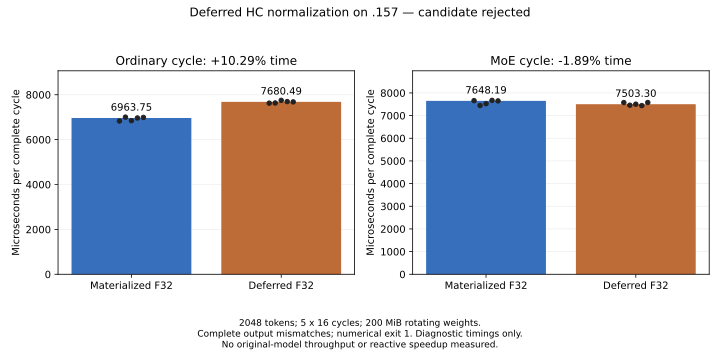

<!-- SPDX-License-Identifier: MIT -->
# Deferred HC normalization: complete-cycle screen

The candidate is **not selected**. Removing the materialized F32 normalized
buffer increases the ordinary cycle median by **10.29%**. The MoE cycle median
decreases **1.89%**, with overlapping sample ranges, but all 26 complete replay
checks have new differences. The component exits **1** after recording every
timing. No original-model arm follows this experiment; retained Q2 throughput
remains 1335.84 PP / 24.09 TG at C1 pp2048/tg128, below UD.

## Hypothesis and provenance

The [previous sequence screen](Q2-HC-SEQUENCE.md) showed that producing both
F32 and F16 normalized outputs together increased complete producer/down time.
This follow-up omits the 80 MiB F32 normalized buffer at 2048 tokens. It stores
four F32 scales per token (32 KiB) alongside the F16 down input. Both later
consumers reconstruct normalization from the updated residual, gamma and scales.
The intended rounded gamma-times-scale calculation does **not** preserve every
original F32 result in this build. Its exact cause is unresolved; the original
kernel bodies and thresholds have not been changed to accept the discrepancy.

The [source generator](../tools/prepare-q2-hc-deferred-norm.py) derives from the
retained HC-up-chains source and previously measured paired producer, both
independently based on official Gufo pin
`f783fedb9bea2ec7de941f6da4e02f4a4596b29e`. Only `kernels.hip.cpp` and
`kernels.hpp` change, as recorded in the
[source manifest](../config/q2-hc-deferred-norm-source.json) and
[reconstructible patch](../experiments/q2-hc-deferred-norm.patch).
No sibling workspace source or artifacts are imported. First-party fixture,
generator and reporting code retain MIT SPDX markers; upstream notices remain.

Static compilation, fixture syntax, patch reconstruction and changed-source
formatting pass. All 1019 source files reconstruct exactly; twenty original
control assembly bodies are unchanged. The new mix uses 242 VGPRs and 24 KiB
LDS without private scratch. These [static checks](../config/q2-hc-deferred-norm-static.json)
do not establish numerical equivalence or faster inference.

## Complete measured cycle

The reference performs ordinary or MoE combine, materializes F32 normalization,
narrows to F16, then runs original-F16 down, SiLU, low-rank narrowing, up/mix
and injection. The candidate substitutes deferred normalization in the producer,
mix and injection. Injection partials feed the next cycle. The down-input half
allocation is reused for mixed output, as in the production path.

Each path has five samples of sixteen cycles at 2048 tokens. Sixteen down and
sixteen up weight matrices rotate over 200 MiB, using `hipMalloc` as production
HC weights do. Equal allocation APIs do not establish identical placement or
full-model cache history. Arms alternate execution order and output allocations.
Reset, allocation, host copies, reconstruction diagnostics and oracles remain
outside the HIP-event interval; there are no internal timing fences.

| Producer | Materialized median [min, max], us | Deferred median [min, max], us | Time change |
| --- | ---: | ---: | ---: |
| Ordinary | 6963.755 [6828.904, 7002.046] | 7680.493 [7624.632, 7748.477] | +10.292% |
| MoE | 7648.191 [7444.503, 7671.596] | 7503.303 [7440.299, 7576.643] | -1.894% |

All [samples and numerical events](../config/q2-hc-deferred-norm-results.json),
[CSV](figures/q2-hc-deferred-norm.csv) and [PNG](figures/q2-hc-deferred-norm.png)
are retained. These are diagnostic component durations. Arithmetic differences
feed subsequent iterations, so the timing comparison does not qualify an
equivalent-output optimization or establish a model speedup.

## Numerical evidence

Eight operator cases cover 96, 97, 129 and 257 rows; ordinary/MoE producers;
normal, tiny and alternating inputs; and absent injection. At the initial
producer/down boundary, residual, F16 input and down output match exactly in
every case. Reconstructed F32 normalization differs in all eight. Subsequent
mix differs in all cases; injection differs whenever enabled. After repeated
feedback cycles, residual and down outputs differ as well.

All 26 complete replays fail exactness, including repeat captures after invalid
argument refusals. The 130 F32 buffer pairs and 52 half-buffer pairs retain their
full SHA-256 witnesses. Of 22 saved file pairs, six agree and sixteen differ.
All eight independent normalization oracles and eighteen independent consumer
oracles pass their unchanged limits. The ordinary 97-row tiny-input down case
still exceeds the independent peak-scaled limit: 2.16019029529e-5 versus 2e-5,
with identical immediate reference/candidate down output, as in the previous
sequence experiment. Passing sampled oracles does not erase the newly observed
complete-buffer differences. No tolerance is relaxed.

The [offline analyzer](../tools/analyze-q2-hc-deferred-norm.py) verifies source
capsules, frozen fixtures, every collected artifact, all sample identities,
complete hash witnesses and actual command exits. `validation_pass` refers to
evidence integrity; `numerical_qualification_pass` is false.

## Runtime ownership and next boundary

The `.157` host cohort passes 12/12 Debug and 12/12 ASan/UBSan. Two runners,
nine command exits (eight zero, one one) and 55 artifacts verify. No model is
opened. Observed GPU/CPU maxima are 52 / 81.25 C.

Window release at 2026-10-03 07:14:59.723399 UTC verifies both runners and all
nine command groups/sessions absent, empty KFD and four original leases free.
[Independent observer retirement](../config/q2-hc-deferred-norm-observer-retired.json)
at 07:15:31.721947 UTC verifies the closure process is also absent. The persistent
[release receipt](../config/q2-hc-deferred-norm-window-release.json), shared
registry and coordination ledger record handover. Direct thread notification
fails at the transport; delivery is not claimed. No GPU job or retry remains.

The isolated source has no executor dispatch, owned allocation or reactive
lifetime integration. The runner refuses original-model modes for this source.
Residual, gamma and scales would have to survive **both** mix and injection
before buffer reclamation could be safe. Scheduling their lifetime is a separate
task from reducing GPU memory traffic. This experiment measures no reactive gain.
Any revival first needs exact F32 reconstruction and a reproducible useful
complete-cycle benefit, followed by explicit executor integration and complete
model qualification. The retained implementation remains selected.
