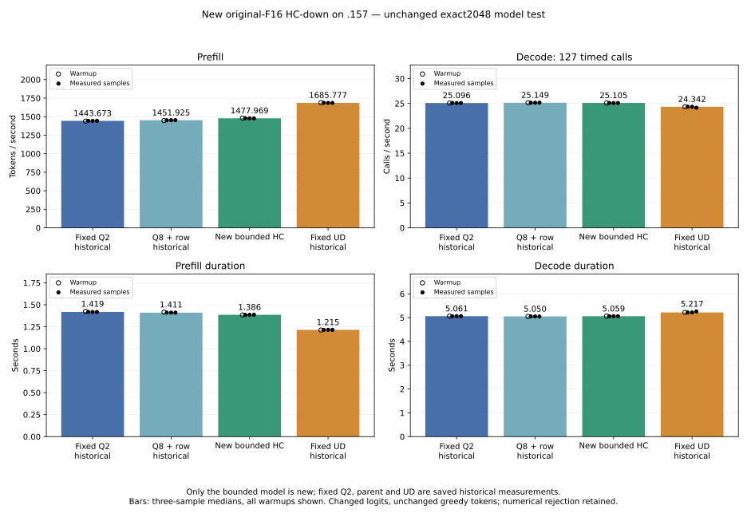
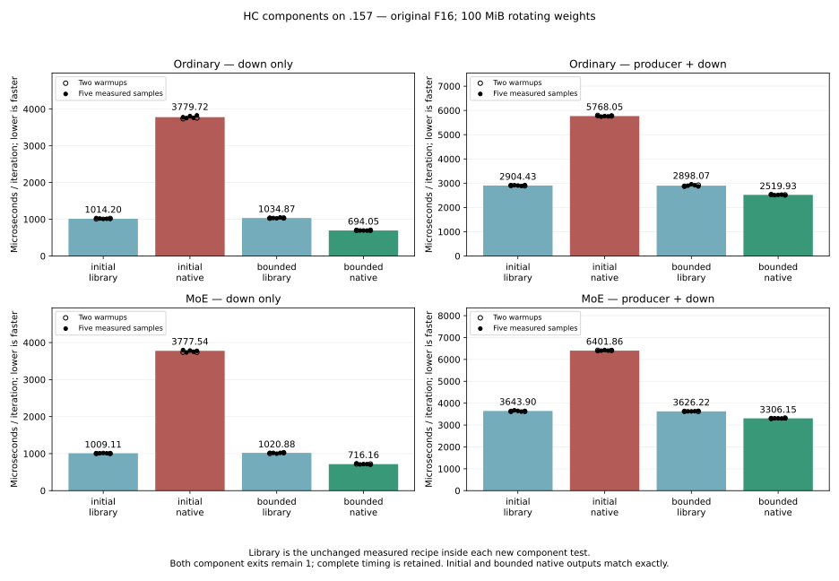

<!-- SPDX-License-Identifier: MIT -->
# Original-F16 HC-down candidate

The bounded candidate now measures **1477.969324 PP /25.10545360 TG** on
`.157` using the original exact2048 direct-executor test. It improves PP by
2.375639% against fixed Q2 and 1.793785% against its measured Q8+row parent.
Fixed UD remains 1685.777092 PP: the candidate is 12.327120% below it, requiring
another 14.060357% increase from the new rate to match. Qualified Q2/UD
inference controls are reused from saved evidence, never rerun.

The component's numerical rejection was retained and the model was still
tested under the owner's exploratory authorization. All128 greedy output
tokens match Q2, while eight logit files change. This establishes a performance
observation with changed arithmetic, not independent model/task quality.
Neither this port nor all nineteen historical failure records is declared
numerically qualified. Full context curves still wait for fixed-point parity.

## Fixed original2048 model results

Only the bounded new model ran. Capacity9216, chunk2048, MTP off,128 outputs,
127 timed decode calls and15-second cooldowns outside the timers are unchanged.
Physical input SHA256 remains
`75343e606f5b815fe01f69ddc6ce50a997e2de96d8a20304a82a7f24f1180b35`.
Configuration/build/library-check/model exits are0/0/0/0;26 artifacts verify.
The original147,207,127,040-byte Q2 model stat tuple is unchanged. Compilation
and cooldowns are excluded from PP/TG.

| New bounded sample | Prefill seconds | Decode seconds | PP token/s | TG calls/s |
| --- | ---: | ---: | ---: | ---: |
| Warmup | 1.383674613 | 5.061355419 | 1480.116771 | 25.09209283 |
| 1 | 1.384285416 | 5.057308457 | 1479.463683 | 25.11217203 |
| 2 | 1.385685052 | 5.060740655 | 1477.969324 | 25.09514094 |
| 3 | 1.386698885 | 5.058661835 | 1476.888762 | 25.10545360 |
| Three-sample median | 1.385685052 | 5.058661835 | 1477.969324 | 25.10545360 |

| Saved reference | PP token/s | TG calls/s | New PP change | New TG change |
| --- | ---: | ---: | ---: | ---: |
| Fixed Q2 | 1443.672867 | 25.09595499 | +2.375639% | +0.037849% |
| Parent Q8+row | 1451.924906 | 25.14929256 | +1.793785% | −0.174315% |
| Retained Q8+row+norm | 1452.143206 | 25.18103518 | +1.778483% | −0.300153% |
| Fixed UD | 1685.777092 | 24.34174251 | −12.327120% | +3.137454% |

All nine within-arm prefill/last-logit/token replays are exact. Comparison to
fixed Q2 verifies all21 files: inputs and greedy outputs match, eight2048-logit
files differ. Maximum matched-history KL is0.001731634024 at prefill;
last-logit KL is0.000000765218. Maximum absolute logit delta is2.191663.
The arithmetic/counting smoke logits remain exact. These simple workloads
cannot establish general task quality or harmlessness of changed logits.
Three descriptive measurements against historical controls do not provide
contemporaneous drift bounds or statistical zero-margin acceptance.

[Model report](../config/q2-hc-bk256-fixed-model-results.json),
[all16 plotted model samples](figures/q2-hc-bk256-model.csv),
[PNG](figures/q2-hc-bk256-model.png).

## Complete component results

Both new fixtures preserve strict0/0/1 exits, finish all guard/input-immutability
checks and verify44 artifacts each. Each candidate has56 timings: two warmups
and five measured repetitions per arm/scope, alternating library/native order,
16 original-F16 matrices rotating100 MiB. Library uses the exact7526 recipe.

| Candidate | Input | Scope | Library median us | Native median us | Native time change |
| --- | --- | --- | ---: | ---: | ---: |
| Initial | Ordinary | Down | 1014.20 | 3779.72 | +272.680% |
| Initial | Ordinary | Producer + down | 2904.43 | 5768.05 | +98.595% |
| Initial | MoE | Down | 1009.11 | 3777.54 | +274.344% |
| Initial | MoE | Producer + down | 3643.90 | 6401.86 | +75.687% |
| Bounded | Ordinary | Down | 1034.87 | 694.05 | −32.934% |
| Bounded | Ordinary | Producer + down | 2898.07 | 2519.93 | −13.048% |
| Bounded | MoE | Down | 1020.88 | 716.16 | −29.849% |
| Bounded | MoE | Producer + down | 3626.22 | 3306.15 | −8.827% |

All40 saved full-tensor hashes and22 full-buffer replay records are identical
between the two unroll siblings, including2048. Each sibling's residual,
F32 norm, F16 norm and scalar-half checks match the library in all22 records;
down outputs differ. All20 independent norm checks pass in each fixture.
The bounded version was selected from complete-cycle medians; the much slower
spilled first version and its outputs remain retained. No second model is run.

[Component report](../config/q2-hc-bk256-component-results.json),
[all112 timings](figures/q2-hc-bk256-component.csv),
[selection receipt](../config/q2-hc-bk256-component-selection.json).

## Unrounded FP64 recovery and its limits

Later [BK128 component evidence](Q2-HC-BK128.md#numerical-evidence-with-restored-precision)
verifies full byte agreement to this parent and exposes unrounded independent
2048 down errors: all four aligned native cases pass original limits while
the library fails them. That subsequent operator evidence closes the 2048
reporting gap below, without rewriting the original rounded logs or qualifying
model/task quality. The 97-row native failure remains.

Library plan diagnostics set cout to fixed precision2, so original component
error fields print0.00. They are rounded values, not zero error. Timing is
quantized to0.01us; pass/fail booleans were computed before formatting and
remain actual verdicts. The original measured fixture, capsules and logs are
immutable. A later [logging-only fix](../config/q2-hc-bk256-logging-fix.json)
restores defaultfloat precision12 and passes HIP syntax compilation. It changes
no provider arithmetic and triggers no GPU or model rerun.

Offline replay uses retained small-shape F16 activation bits and saved F32 down
outputs. It reconstructs the fixture's deterministic synthetic F16 weights
from its exact source arithmetic and computes sequential FP64 edge dots.
An old raw-weight payload hash was not captured; this source reconstruction
is a limitation. Original model weights are not replayed.2048 independent
down errors cannot be recovered because its F16 activation buffer was not saved.

| Tokens/input | Library RRMS | Native RRMS | Library error/peak | Native error/peak | Native original limits |
| --- | ---: | ---: | ---: | ---: | --- |
| 96 ordinary | 3.28770e−5 | 1.62255e−5 | 3.41257e−5 | 1.84913e−5 | Pass |
| 96 MoE | 3.28186e−5 | 1.62918e−5 | 3.42183e−5 | 1.71892e−5 | Pass |
| 97 ordinary | 3.13588e−5 | 1.57622e−5 | 3.98475e−5 | 2.16019e−5 | Fail |
| 97 MoE | 3.10301e−5 | 1.55444e−5 | 3.54755e−5 | 1.79640e−5 | Pass |
| 129 ordinary | 3.31214e−5 | 1.66711e−5 | 3.80092e−5 | 1.76007e−5 | Pass |
| 129 MoE | 3.33425e−5 | 1.67222e−5 | 4.16361e−5 | 1.71235e−5 | Pass |

Both original limits remain2e−5. Native passes5/6 recovered cases, library0/6;
native errors are roughly half the library errors. The failed97-row peak and
all strict byte differences are retained. Being different from the library
is not by itself evidence of less accuracy, but these six synthetic checks
cannot waive model/task-quality qualification. The
[FP64 report](../config/q2-hc-bk256-small-fp64-results.json) binds all315/350
sample values per case and both siblings' forty saved tensor hashes.

Release21:17:36UTC SHA256
`1ce3548048452661f65ebe3282a1ab1ccc571dfe1962553b499621d26be29810`
verifies513 recorded identities/399 groups absent, empty KFD, four original
leases free and six unchanged model stat tuples. Core acknowledges release;
no Q2 GPU reservation, process, waiter or cleanup remains.
[Release receipt](../config/q2-hc-bk256-run-window-release.json).

## Source and compiler preparation

This numerical port targets only M320/K10240 at 96–2048 token rows
on gfx1151. Its parent is the measured, model-exact Q8+row provider with
1451.924906 PP. It replaces that parent's hipBLASLt 7526 HC-down dispatch;
all other model kernels, original F16 weights and original F16 activations
remain unchanged. No F16-to-BF16 conversion, additional model copy, device
allocation, stream or context mechanism is introduced.

The native vector loaders, BK256 staging and direct accumulator stores derive
from the public MIT `mmb_hcd_kernel` and fragment helper in
[GSQHalo.cpp at 5fc881b](https://github.com/Aristo94/GSQHalo.cpp/blob/5fc881b114c1ea130f5df6a30a98be2f8d397de6/ggml/src/ggml-cuda/mmb.cu).
The imported copyright and full MIT text are retained in the numerical include
and [license](../third_party/gsqhalo/LICENSE). This adaptation uses the F16
WMMA intrinsic, two FP32 K16 accumulation chains, one LDS buffer and a
64-output-row by 32-token tile. Original half bits are loaded directly.
Ragged token loads clamp to the final valid row; stores remain bounds checked.

Two persistent source candidates were prepared and locally compiled with the
original Gufo numerical flags. These are compiler observations, not GPU tests:

| Candidate | K16 unroll | VGPRs | Fixed private bytes / thread | LDS bytes | Wave size |
| --- | ---: | ---: | ---: | ---: | ---: |
| Initial port | 16 | 256 | 500 | 50688 | 32 |
| Bounded sibling | 2 | 138 | 0 | 50688 | 32 |

The sibling changes only the K16 loop unroll pragma. It keeps all source
arithmetic and the same two accumulation chains; generated floating-point
equivalence was subsequently confirmed by the whole-buffer GPU checks above.
The first version and its spilled
device object are retained. The initial metadata reader failed because the
compiler produces an offload bundle; unbundling the gfx1151 member corrects
inspection without recompiling or replacing that failed command evidence.

Each complete provider has 1023 verified files. The initial candidate changes
three dispatch/declaration/include files and adds one numerical include against
the 1022-file measured parent. The sibling changes only that include against
the initial candidate. Both have reconstructible patches and full source
inventories. Neither is wired into the default backend. The separate formatted
runtime variants are wired into their bounded component/counting modes.

The subsequent runtime plan was: compare every output and guards against the unchanged
library route, independently check FP64 dot products on ordinary/tiny/ragged
inputs, and measure the complete norm/HC-down cycle with 16 original-F16
weight matrices rotating 100 MiB beyond MALL. Keep 2048 as the diagnostic
point, retaining 96/97/129 checks for launch tails. Preserve timing even when
a numerical verdict fails. Then run only the new fixed 2048 model candidate
against the saved Q2/UD input and measurements. No qualified inference control
rerun or context curve is scheduled by this preparation.

Preparation alone claimed no numerical acceptance or performance gain. The
later admitted window produced the measurements above, without promoting this
candidate. The fixed1443.672867 Q2 /1685.777092 UD comparator is unchanged.

[Initial source](../config/q2-hc-down-bk256-source.json),
[initial device object](../config/q2-hc-down-bk256-object-results.json),
[bounded source](../config/q2-hc-down-bk256-bounded-source.json),
[bounded device object](../config/q2-hc-down-bk256-bounded-object-results.json).

The shared upstream formatting check was run with the installed ROCm clang-format and exits 1 for both candidates, including inherited provider formatting and the new declaration alignment. No source is changed by that check. Formatting correction remains pending; this is separate from the successful numerical-target compilation and pending GPU qualification.

## Runtime qualification preparation

Two separate runtime source trees now format the new declaration, dispatch
and numerical include, preserving all noncomment source tokens against each
retained draft. The original drafts and objects remain unchanged. Both new
providers retain 1023-file inventories. The upstream formatting check still
reports 74 inherited violations, with no new HC API alignment complaint;
those formatting exits remain separate from numerical/GPU evidence.

The component target links a test-only copy of the exact measured library
recipe. Only its class name, include guard and header path are renamed, with
the Gufo license retained. Control algorithm7526, original row-major F16
operands, descriptor geometry and zero-workspace policy stay unchanged.
Both arms use the same paired norm producer. Five shapes/patterns and both
ordinary/MoE inputs retain full replay, guards and original FP64 limits.
Strict numerical rejection does not skip timing: 56 samples cover projection
and complete-cycle scopes with two warmups and five measured repetitions,
alternating arm order and rotating 100 MiB of weights.

The launcher permits only matched new component/counting modes. All 77 local
guard tests pass; the new fixture/control pass HIP syntax compilation. The
`.157` host capsule verifies 16 bound files, with 23/23 Debug and 23/23
ASan/UBSan CTest passes. These CPU checks do not execute the HIP fixture.
The frozen window permits two new components, then at most one new model:
select the faster complete-cycle candidate and retain any numerical rejection.
Use the unchanged original2048 input/timers and saved Q2/UD measurements;
no qualified inference control or full context curve is rerun.

[Runtime source identities](../config/q2-hc-bk256-run-source.json),
[frozen plan](../config/q2-hc-bk256-run-plan.json),
[host receipt](../config/q2-hc-bk256-run-host-results.json).
