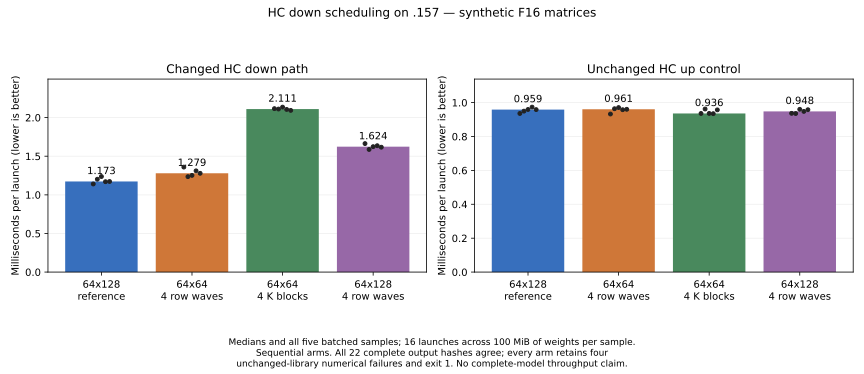

# HC down tile probe: fewer registers did not improve speed

<!-- SPDX-License-Identifier: MIT -->

The first 64x64 HC down tile is **5.93% slower** than the retained 64x128 tile
in the rotating-weight GPU component benchmark. All 22 complete output hashes
match. It is not retained for performance and no full-model arm was warranted.

| Tile | Static VGPR | LDS bytes | Private bytes | Median down microseconds |
|---|---:|---:|---:|---:|
| 64x128, two row waves | 251 | 24,576 | 0 | 1,185.290 |
| 64x64, two row waves | 184 | 18,432 | 0 | 1,255.558 |

Unchanged HC up control: 943.419 versus 954.741 microseconds. Each shape rotates
16 original F16 weight matrices (100 MiB), with a warm rotation followed by
five samples of 16 launches at 2,048 tokens. Both ordered K16 accumulation
chains remain unchanged. Static register count does not establish runtime
occupancy or memory-bandwidth benefit.

Both operator commands exit **1**, preserving the same four previously known
hipBLASLt control failures at tolerance 2e-5: n32, n95, m319 and k10208. These
cases do not dispatch the changed WMMA kernel. Every changed WMMA case passes;
all 22 output hashes, including those failing controls, match the reference.
The numerical limits are not relaxed and the nonzero exits are not relabeled
as an overall operator pass. See `config/q2-hc-down64-operators.json`.

The three follow-up scheduling sources now also have `.157` component results.
Their static resources were:

| Tile / change | VGPR | LDS bytes | Private bytes |
|---|---:|---:|---:|
| 64x64, four row waves | 183 | 18,432 | 0 |
| 64x64, four K32 blocks per stage | 256 | 32,768 | 100 |
| 64x128, four row waves | 256 | 24,576 | 16 |

A fresh reference and all three candidates use the same existing 22-case
operator/benchmark harness, five batches per shape, sixteen launches per
batch and 100 MiB of rotating synthetic F16 weights. Every complete output hash
matches, including the four unchanged-library cases that still fail the 2e-5
limit. All four operator/benchmark commands retain **exit 1**; performance is
reported under the owner's authorization without changing numerical verdicts.

| Source | Down median, us | Down time change | Unchanged up median, us |
| --- | ---: | ---: | ---: |
| Fresh 64x128 reference | 1172.898 | — | 958.800 |
| 64x64, four row waves | 1278.868 | +9.03% | 960.678 |
| 64x64, four K32 blocks | 2110.809 | +79.97% | 936.163 |
| 64x128, four row waves | 1623.730 | +38.44% | 948.251 |

All three are rejected for performance; no complete-model trial follows.
The changed mapping has not helped despite exact replay. The larger K stage
and wide four-wave tile also incur static private-memory use. That is a
plausible cost, not a measured causal decomposition. These medians are component
times, not prefill throughput or a Q2/UD comparison. Arms run sequentially;
the unchanged up control varies between -2.36% and +0.20% from the fresh reference.

[All 40 timing samples](figures/q2-hc-tiles.csv),
[64x64 four-wave report](../config/q2-hc-wave4-results.json),
[K4 report](../config/q2-hc-k4-results.json), and
[64x128 four-wave report](../config/q2-hc-128wave4-results.json) retain the
complete timing distributions, output hashes and numerical failures. The chart
uses zero-based axes and shows every sample. Reproduce it with
`tools/plot-q2-hc-tiles.py` and the three JSON reports in that order.

Four-row-wave candidates require an independently transposed one-row epilogue.
Their first compilation failed the original paired-row static assertion; the
next generator accidentally selected an earlier W8A8 assertion. Both failed
sources/logs remain under `evidence/`. The corrected generator scopes the edit
to `DenseF16GEMMKernel`; all three final sources compile statically, reconstruct
1,019 files exactly and pass the 486-file format check. The component results
above follow the completed PLE diagnosis. No GPU occupancy measurement or
complete-model qualification is inferred from static resource counts.

All variants derive from measured MoE/HC fusion, excluding the rejected norm
copy. Runtime patches and default dispatch remain unchanged. First-party MIT
generators, isolated patches and source/static receipts are named
`q2-hc-down64*` and `q2-hc-down-tiles*`. Two `.157` host capsules pass 10/10
Debug and 10/10 ASan/UBSan; each remote arm uses fresh four-lease admission.
The final half-wave/HC window also passes the updated 12/12 host checks in
both configurations. Its [validation receipt](../config/q2-half-wave-hc-validation.json)
retains all ten runners, 33 command exits, 346 verified artifacts and verified
process/lease release; four HC commands fail only their recorded numerical
controls. No original model is opened in this component campaign.
