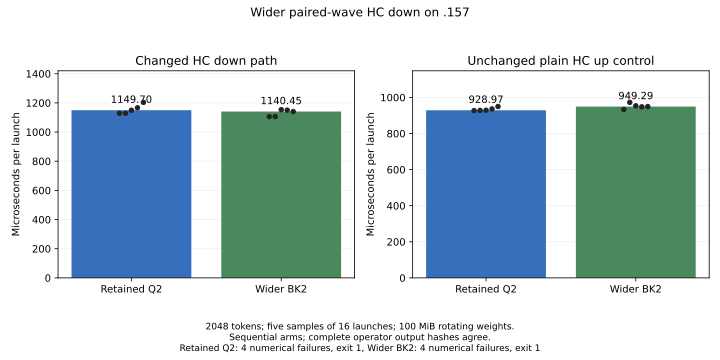
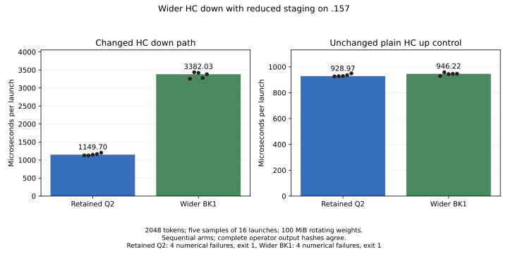
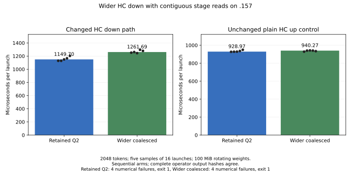

<!-- SPDX-License-Identifier: MIT -->
# Wider paired-wave HC down projection

None of the three wider HC down variants is selected. The two-block variant
reduces median component time by only **0.80%**, with overlapping samples;
one-block staging regresses **194.17%**, and contiguous stage reads regress
**9.74%**. All preserve the 22 complete operator output hashes and the same
four existing numerical-control failures. This is a component screen on `.157`,
completed on 2026-10-03 UTC; no original model was opened in this window.

The retained [paired HC up](Q2-HC-UP-CHAINS.md) source remains the development
candidate. Its previous complete-model result is **1335.84 PP / 24.0915 TG**,
with a 1.75% prefill gain and a 20.09% PP / 0.99% TG gap against that window's
fresh UD control. This experiment adds no complete-model performance claim.
The parity goal and independent model qualification remain open.

## Mechanism and limits

Original-F16 HC down at M320/K10240 and at least 96 tokens changes from
64x128/BK2/WM2/WN4 to **128x128/BK2/WM4/WN2**. A 512-thread block assigns each
original low/high K16 accumulation chain to one wave of a pair. The epilogue
publishes low to shared memory, adds high in F32 in the paired wave, and writes
the same vectorized output. All threads reach the block barriers. The final
64 padded output rows have zero weights and are never stored.

At 2048 tokens, three row tiles replace five: **48 blocks instead of 80**.
Each input stripe is staged three times instead of five. However, row padding
adds 20% matrix work, shared memory grows from 24 to 32 KiB and there are fewer
independent blocks. Those costs can outweigh the reduced input traffic.
The earlier [paired-down experiment](Q2-HC-DATA-REUSE.md) kept the 64x128 tile
and did not improve full-model performance; it does not answer this hypothesis.

The existing paired-chain template is generalized to support both projections.
The retained fused-up dispatch and every other specialization stay as before.
Original F16 weights and narrowed inputs, both K16 sum sequences, final
low+high addition, buffer ownership and stream ordering remain unchanged.
There is no model conversion, new persistent buffer or reactive flow change.

The second variant uses the same tile with BK1: it stages one K32 block at a
time, reducing LDS but doubling stage barriers. The third keeps BK2 and assigns
adjacent 16-byte weight/input chunks to neighboring lanes. All 512 threads
participate, fetching two chunks each for weights and activations. It retains
the same LDS layout, staged bytes, ordered chains and epilogue as wider BK2.

| Down specialization | VGPR | SGPR | LDS bytes | Private bytes |
| --- | ---: | ---: | ---: | ---: |
| Wider BK2 | 204 | 22 | 32768 | 0 |
| Wider BK1 | 161 | 22 | 18432 | 0 |
| Wider BK2, contiguous reads | 135 | 22 | 32768 | 0 |

The retained fused-up specialization remains 242 VGPR / 27 SGPR / 24576 LDS
bytes / zero private scratch in all three device-only gfx1151 compilations.
These counts describe compiled resources; fewer registers did not yield a
faster down projection. The measurements reject these mappings as a whole.
They do not isolate occupancy, barriers or memory bandwidth as the cause.

## Measured component results

The existing benchmark rotates 16 original-layout F16 matrices, **100 MiB**
total, with 2048 tokens, a complete warmup rotation and five samples of 16
launches. GPU-event timers exclude allocation, transfers and numerical checks.
HC down is M320/K10240; plain HC up, M10240/K320, is an unchanged control.
All four arms are sequential and compare with the same fresh retained source.
The plain-up control is separate from the retained fused-up specialization.

| Source | Down median us | Down time change | Plain-up median us | Control time change |
| --- | ---: | ---: | ---: | ---: |
| Retained paired-up reference | 1149.699450 | — | 928.965151 | — |
| Wider BK2 | 1140.452027 | -0.80% | 949.294567 | +2.19% |
| Wider BK1 | 3382.034063 | +194.17% | 946.215928 | +1.86% |
| Wider BK2, contiguous reads | 1261.691809 | +9.74% | 940.273106 | +1.22% |

Lower time is better. The first candidate's down range overlaps the reference,
and its nominal gain is smaller than the difference in the unchanged control.
No useful component gain is established, so the conditional complete-model
comparison was not admitted. The other two down ranges lie above the reference.

All down samples, in microseconds per launch:

| Sample | Reference | Wider BK2 | Wider BK1 | Contiguous BK2 |
| --- | ---: | ---: | ---: | ---: |
| 1 | 1128.847480 | 1105.567932 | 3256.235600 | 1252.449512 |
| 2 | 1128.677607 | 1105.875492 | 3436.656475 | 1261.691809 |
| 3 | 1149.699450 | 1153.464079 | 3419.729710 | 1245.264530 |
| 4 | 1166.341305 | 1150.301695 | 3278.011084 | 1296.067476 |
| 5 | 1203.362703 | 1140.452027 | 3382.034063 | 1279.585600 |

All unchanged plain-up samples, in microseconds per launch:

| Sample | Reference | Wider BK2 | Wider BK1 | Contiguous BK2 |
| --- | ---: | ---: | ---: | ---: |
| 1 | 926.805317 | 933.287501 | 929.109395 | 928.873658 |
| 2 | 928.112626 | 972.481430 | 958.517849 | 940.273106 |
| 3 | 928.965151 | 953.439415 | 944.431007 | 942.308009 |
| 4 | 936.079860 | 947.904587 | 946.215928 | 940.648139 |
| 5 | 949.634552 | 949.294567 | 947.198391 | 934.405804 |

Full precision, oracle metrics, durations and source paths are retained in the
[BK2 report](../config/q2-hc-down-wide-results.json),
[BK1 report](../config/q2-hc-down-wide-k1-results.json) and
[contiguous-read report](../config/q2-hc-down-wide-coalesced-results.json).



[PNG](figures/q2-hc-down-wide.png) · [CSV](figures/q2-hc-down-wide.csv)



[PNG](figures/q2-hc-down-wide-k1.png) · [CSV](figures/q2-hc-down-wide-k1.csv)



[PNG](figures/q2-hc-down-wide-coalesced.png) · [CSV](figures/q2-hc-down-wide-coalesced.csv)

## Numerical checks and preserved failures

The existing 22-case independent FP64 fixture covers the n96 dispatch boundary,
partial tokens, tiny inputs and cancellation-prone values. All full output
hashes agree with the retained source for every candidate; all 44 saved value
and coordinate files per comparison are byte-exact, as are the oracle metrics.
All cases using the changed WMMA down dispatch pass. Four unchanged library
controls fail the original 2e-5 relative RMS or error/peak limits in every arm:

| Failing control | Relative RMS | Error / peak |
| --- | ---: | ---: |
| 320x10240-n32-p0 | 3.253741784871e-5 | 3.326064574218e-5 |
| 320x10240-n95-p0 | 3.125109821246e-5 | 2.785131239016e-5 |
| 319x10240-n129-p0 | 3.196944341241e-5 | 3.306415773274e-5 |
| 320x10208-n129-p0 | 3.216009738955e-5 | 2.995923307594e-5 |

Each component command therefore retains actual **exit 1** and runner state
`FAILED`. Performance sampling completed under the owner's standing
authorization; neither the numerical verdict nor the tolerance is relaxed.
The 22-case suite is not reported as passing. Timed runs check finite values
and matching checksums after timing; they do not save a full timed-buffer hash.
The complete-output hashes above belong to the independent operator cases.

## Qualification and closure

Three successive guard cohorts each pass **12/12 Debug and 12/12 ASan/UBSan**
on `.157`. Every component capsule matches the appropriate host-qualified
guard versions, and the third cohort matches the final local guard source.
Only variant selection and its guard cases change; runner lifecycle, thermal
handling, fixtures, C ABI and scheduling contracts remain intact.

The [campaign validation](../config/q2-hc-down-wide-validation.json) verifies
seven runners, **30 command exits and 213 artifacts**, archive digests, exact
source reconstruction and binary stability. Four component commands exit 1
for the controls above; the other 26 commands exit 0. Every GPU/build arm
takes the four original leases. Maximum observed GPU/CPU temperatures are
50 C / 81.375 C, within the 98 C inclusive or lower exposed bounds. The
desktop remains visible; empty KFD and readable process checks are not proof
of exclusive physical GPU use.

[Release](../config/q2-hc-down-wide-window-release.json) at
**03:29:32.419115 UTC** verifies seven runners and 30 command identities,
groups and sessions absent, empty KFD and four original leases EX|NB/free.
[Independent observer retirement](../config/q2-hc-down-wide-observer-retired.json)
at **03:36:11.200633 UTC** verifies the release observer absent. Both observers
exit 0, and all seven remote result hashes match the local collection.
The persistent release receipt and shared registry record the handover;
the direct interthread notification failed at the MCP transport, so delivery
is not claimed. No Q2 remote job, waiter or automatic retry remains.

No further variant is queued in this released window. The next hypothesis
should return to routed-expert down and activation packing, whose earlier
[measured gaps](Q2-PREFILL-GAP.md) were 69.57 and 65.21 ms respectively.
Those figures predate the retained paired-up improvement and are diagnostic
priorities, not promised savings. Long-context, concurrency, independent
quality and complete Q2/UD parity gates remain open.

The first saved-report check caught one incorrectly rounded digit in the
sample table. The table was corrected against the unchanged raw JSON/CSV;
the initial check's actual exit 1 remains in local evidence.

## Source and reproducibility

The [tile generator](../tools/prepare-q2-hc-down-wide.py) and
[contiguous-read generator](../tools/prepare-q2-hc-down-wide-coalesced.py) derive from independently
fetched official Gufo pin `f783fedb9bea2ec7de941f6da4e02f4a4596b29e` plus this
workstream's retained changes. BK2 and BK1 apply separately to paired HC up;
the contiguous-read delta applies to wider BK2. Each changes one kernel file
and retains upstream notices. No external engine, DS4 source or sibling
artifact is imported. First-party tools are MIT.

| Variant | Patch | Prepared source | Static checks |
| --- | --- | --- | --- |
| BK2 | [Patch](../experiments/q2-hc-down-wide.patch) | [Identity](../config/q2-hc-down-wide-source.json) | [Checks](../config/q2-hc-down-wide-static.json) |
| BK1 | [Patch](../experiments/q2-hc-down-wide-k1.patch) | [Identity](../config/q2-hc-down-wide-k1-source.json) | [Checks](../config/q2-hc-down-wide-k1-static.json) |
| Contiguous BK2 | [Patch](../experiments/q2-hc-down-wide-coalesced.patch) | [Identity](../config/q2-hc-down-wide-coalesced-source.json) | [Checks](../config/q2-hc-down-wide-coalesced-static.json) |

All three patches reconstruct all 1019 files exactly, pass formatting and
compile device-only with the same two inherited enumeration warnings. A
separate replay of the final generators reproduces each tree and patch exactly.
The preparation receipts deliberately describe their earlier static scope;
the measured verdict is recorded here and in campaign validation. Raw command
logs, actual exits, telemetry, capsules and replay receipts remain in persistent
local `evidence/q2-hc-down-wide*`; remote capsules remain under the project's
persistent `run/` directory. No project source is stored in `/tmp`.

The [plot tool](../tools/plot-q2-hc-component.py) accepts the saved component
report and emits SVG, PNG and CSV with all five samples and the actual
numerical failures. For example:

```sh
python3 tools/plot-q2-hc-component.py \
  config/q2-hc-down-wide-coalesced-results.json \
  docs/figures/q2-hc-down-wide-coalesced \
  --candidate-label 'Wider coalesced' \
  --title 'Wider HC down with contiguous stage reads on .157'
```
