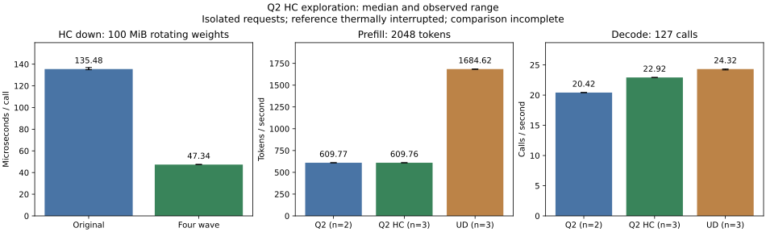

<!-- SPDX-License-Identifier: MIT -->
# F16 HC down exploration

The owner permits measuring speed before correcting numerical differences.
The overall requirement remains Q2 parity with UD in both prefill and decode.
This experiment changes one decode component and does not promote a runtime.

The retained phase profile attributes 152.960 ms of 15 Q2 decode steps to 1455
F16 HC down projections, shape 320x10240. The generic kernel assigns one wave
per output row. The experimental kernel assigns four wave32 groups per row,
then reduces four FP32 partials using 16 bytes of shared memory. It retains
original F16 weight bytes and F32 activations. Dispatch changes only for F16,
one token, M=320 and K=10240. It changes reduction order and therefore rounding.

Source: `experiments/q2-hc-four-wave.patch`, relative to the qualified original
Q2 runtime. The isolated `.deps/gufo-q2-bench-hc` tree differs from the frozen
1019-file Q2 reference in exactly one source file, `kernels.hip.cpp`.
The active `patches/gufo-q2.patch` and `.deps/gufo-q2` remain unchanged.

## Operator and microbenchmark evidence

Both arms complete 11 independent synthetic operator cases on `.157`:
normal/small/alternating-sign activations for the affected shape, token widths
2/3/8/9, ragged M/K controls, HC up and a router-shaped control. The scalar
FP64 oracle uses the exact rounded F16 weights; it is not CPU model inference.
Output guards remain intact. Both arms pass the predeclared relative RMS and
error-over-peak limits 0.00002. All eight unaffected frontier files are exact.
The three changed-shape frontiers differ, maximum absolute delta 1.90735e-6.
Their maximum relative RMS against the independent oracle improves from
3.48791e-7 to 1.93533e-7. This does not establish full-model numerical quality.

The microbenchmark matches the production `hipMalloc` weight allocation and
rotates 16 original-layout F16 matrices, 100 MiB total, beyond the 32 MiB cache.
One traversal warms the matrices; five batches each time 128 launches using HIP
events. The unchanged full kernel translation unit and its original wave64 link
dependency use the upstream numerical compilation flags. No model runs here.

| Arm | Minimum us | Median us | Maximum us |
| --- | ---: | ---: | ---: |
| Original F16 HC down | 134.8395 | 135.4764 | 136.8933 |
| Four-wave F16 HC down | 47.2348 | 47.3383 | 47.5807 |

The median component speedup is **2.86188x**. This is not a model throughput
multiplier. Short synthetic timing and the retained full-model profile have
different traffic and clock histories; their absolute latencies are not
interchangeable. Recorded CPU maxima for these arms are 78.000/77.875 C and
sampled GPU maxima 48/48 C. The two-second telemetry does not bound brief peaks.

Machine-readable full samples and numerical deltas: `config/q2-hc-results.json`.
Protocol: `config/q2-hc-protocol.json`. Successful arms:
`evidence/q2-hc-reference-r3` and `evidence/q2-hc-four-wave-r1`.

## Model screen and thermal policy

The next screen compares original Q2, four-wave Q2 and pristine UD at C1,
2048 prompt tokens, 128 emitted tokens and 127 timed decode calls. Each arm
has one warmup and three fresh measured sessions; MTP is disabled. PP and TG
remain separate. Each session, including warmup, follows an explicit 15-second
idle interval outside PP/TG timing. This measures isolated warm-model requests,
not sustained throughput; command wall time includes the pauses. Saved
original-Q2 logit and token frontiers accompany timings.
This bounded screen does not qualify 128K/256K or HTTP/reactive serving.

The runner now stops only its owned process group at CPU/GPU 85 C or a lower
exposed sensor max/crit threshold. Missing/malformed CPU/GPU sensors fail closed.
Eight host CTest cases pass in Debug and ASan/UBSan on `.157`, including thermal
thresholds, observer failure cleanup and source identity rejection for reuse.

Two complete-build attempts stop thermally before inference: the initial
two-job diagnostic build reaches CPU 86.625 C, and the one-job model build
reaches 86.250 C. Both retain command exit -15 and transport exit 1. A reduced
microbenchmark build first fails to link the original wave64 dependency;
that exit 1 is retained before the corrected successful arms. No failed arm
is treated as a numerical or performance result.

Bounded model builds reuse only the unchanged MMQ static archive from this
workstream's qualified `q2-explore-reference-r1` or `q2-explore-ud-r1`. All 1019
source files must match except the HC kernel; prior binary identity and copied
archive SHA are checked, including the archive after use. HC kernels, executor
and test harness are recompiled with original numerical flags. No foreign
project artifact, device tuning or replacement of qualified evidence is used.
An initial incremental CMake dependency visibility failure is also retained.

The uncooled model reference also stops at CPU 85.750 C (GPU 72 C), after
semantic smoke, warmup and one measured request. That incomplete arm remains
FAILED; its one 20.3994 decode-calls/s sample is not a completed comparison.
The common idle intervals are a new, explicit matched protocol for all arms.

## Exploratory model observations

All samples use 2048 prompt tokens and 128 outputs (127 timed decode calls).
The reference has **two** measured requests before thermal interruption;
the candidate and UD each complete **three**. The comparison is incomplete;
values below are observations, not a completed acceptance verdict.

| Arm | Completed samples | PP tok/s min / median / max | TG calls/s min / median / max | Median PP s | Median TG s |
| --- | ---: | ---: | ---: | ---: | ---: |
| Q2 reference, interrupted | 2 | 609.587 / 609.774 / 609.961 | 20.4214 / 20.4230 / 20.4246 | 3.358623 | 6.218471 |
| Q2 four-wave HC | 3 | 609.687 / 609.762 / 609.974 | 22.9111 / 22.9246 / 22.9364 | 3.358690 | 5.539905 |
| UD original | 3 | 1681.350 / 1684.619 / 1685.163 | 24.1709 / 24.3159 / 24.3248 | 1.215705 | 5.222915 |

Candidate decode is 12.25% above the two retained reference observations and
5.72% below UD. PP is unchanged relative to the reference and 63.80% below UD.
The speedup survives the model path, but the overall parity target is unmet.
These isolated-request results do not establish continuous throughput or a
zero-margin confidence bound. Both completed model process wall durations are
about 110.3 seconds including loading and 60 seconds of explicit idle time.
The interrupted reference wall duration must not be used as a completion rate.

The candidate matches all nine input/output token files of the qualified Q2
reference. Six of 12 logit frontiers match exactly; all six prefill frontiers
are exact, while decode frontiers differ. Maximum KL is 3.2777259434e-6 and
maximum absolute logit delta 1.164262295. Nine within-candidate replay checks
are exact. All 19 saved fresh-reference files match the historical qualified
Q2 bytes; numerical comparisons use that completed reference. Fresh UD also
matches all 21 corresponding historical files exactly. This is replay evidence,
not an independent teacher evaluation or a broad quality qualification.

Sampled model-arm maxima (whole build/run envelopes) are CPU 85.250/84.750/83.250 C
and GPU 77/77/83 C for reference/candidate/UD. The candidate completing under
the thermal limit is an observation, not a proven cooling benefit.

All 12 arms retain 153 hash-verified artifacts and 42 actual command exits.
Six arms succeed and six fail explicitly; no failure is discarded or relabeled.
Fresh closure at 2026-10-02 07:13:11.718 UTC verifies all runners and owned groups
retired, KFD empty and four expected lease identities acquired EX|NB/released.
GPU is 48 C and CPU 49.5 C at release. The persistent remote release receipt and
shared coordination event hand the window back; direct thread messaging is
currently failing with a transport error. No Q2 remote job or automatic retry
remains. Source, samples, failures and retirement details are recorded in
`config/q2-hc-campaign.json`; CSV and plots are retained beside this report.

Next work remains completing a thermally controlled reference comparison,
further HC bandwidth optimization, and the much larger prefill gap. None of
these are waived by the component gain or the owner's numerical-work ordering.
