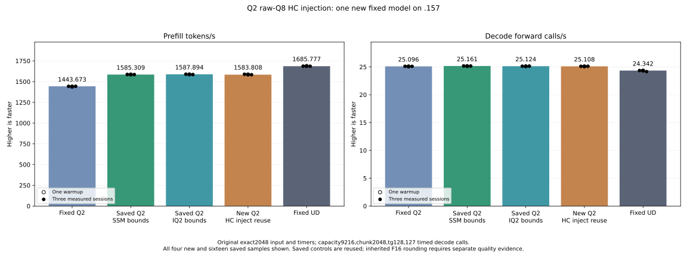

<!-- SPDX-License-Identifier: MIT -->
# HC raw-Q8 injection model integration

The completed model measures **1583.808188 PP / 25.10789589 TG**, nominally
**−0.257282% PP** against the retained **1587.893545 / 25.12414406** parent.
The marginal component saving does not become a measured model gain. Keep the
parent and preserve this negative trial, including its numerical differences.
Fixed UD remains **1685.777092 PP / 24.34174251 TG**; the parent still needs
**6.164365%** more PP, equivalent to **74.889015 ms** less prefill time.

The benchmark remains exact 2048 input, 128 output tokens, 127 timed decode
calls, capacity 9216, chunk 2048, C1 greedy, MTP off, one warmup and three
measurements with 15-second pauses outside the timers. Compilation and loading
are excluded. Saved reference cohorts are reused, not contemporaneous bookends.

| New sample | PP tokens/s | Prefill seconds | TG calls/s | Decode seconds |
| --- | ---: | ---: | ---: | ---: |
| Warmup | 1586.698726 | 1.290730223 | 25.09084939 | 5.061606247 |
| Measured 1 | 1588.804810 | 1.289019260 | 25.10789589 | 5.058169771 |
| Measured 2 | 1583.808188 | 1.293085877 | 25.09661100 | 5.060444217 |
| Measured 3 | 1583.437654 | 1.293388467 | 25.11711176 | 5.056313848 |

All output-token histories match the saved parents and all nine internal replays
are exact. Eight prefill/last-logit files differ from each parent, with maximum
matched-history KL **0.004175090750**; the small component differences can thus
propagate through the model. This benchmark shows no greedy-token change on
this prompt, and does not independently establish task-quality equivalence.
The saved full arrays and numerical verdicts are unchanged.

[All 20 samples, including prefill and decode durations](figures/q2-hc-inject-raw-q8-model.csv).

Only the raw-Q8 HC route changes. The producer uses normalized values already
in registers to emit compact injection products; the reducer consumes these
products instead of rereading four normalized streams. The existing numerical
component reported a marginal 0.211436% complete-cycle reduction and finite
injection differences up to 4.768371582e-7. Neither is a model-level gain or
independent task-quality result. The existing component is not rerun.

The 20 MiB product buffer borrows the original `down_e` allocation. The C17
policy requires the allocation base, sufficient bytes, exactly 2048 rows,
H2560/rank320/four streams, and no pending expert output. Offset RowScratch
views fail admission. Capacity arithmetic rejects overflow. The allocation
identity is owned by the executor and never modified by scratch view switches.
Combine, producer, reducer and the next expert writer use the same ordered
stream; no borrow remains published between calls. Failed launches return
before half/Q8 cache identities are published; no fallback retries after writes.
Other shapes and routes use the retained implementation. Device allocations,
streams, graph behavior and persistent caches do not change.

Static compilation preserves all 164 parent kernel bodies and both component
bodies instruction-for-instruction and resource-for-resource. The private
provider has 1030 files. All 37 CTests and 37 ASan/UBSan CTests pass on .157,
including allocation identity, offsets, pending readers, exact capacity and
overflow cases. CPU policy checks are not model inference or a GPU race proof.

The model-only plan binds 182 fixtures, six manifests and 1030 provider files.
Host 37+37 and all ten host/model commands pass. All 33 artifacts collect before
release at **2026-10-06T12:38:34.376132+00:00**, SHA
`962b229fcc7893b9bf2897f8fc68c447dd7312a2d03008250cc592b28dc8dcdd`. Closure retires 1484 process identities and 1189 groups;
KFD is empty, original leases are free and model stat tuples unchanged. Core
receives closure before local analysis. Device resident bytes remain
43,156,012,544; deferred scratch 7,946,240 and session 376,777,748 are unchanged.
There is no remaining job, reservation, waiter or remote cleanup.

The next local down-kernel draft fixes m2560/k640 and removes proven row bounds
and the aligned-output fallback only behind a proposed guarded selector. Static
instructions fall 1254→971, 2641→1729 and 3350→2152 for BN16/48/64; VGPR counts
are 85→85, 96→97 and 104→105, with identical LDS and zero spills. It has no
provider, selector or GPU evidence yet; these counts are not a throughput claim.

[Model results](../config/q2-hc-inject-raw-q8-model-results.json),
[final audit](../config/q2-hc-inject-raw-q8-final-audit.json).

[Source binding](../config/q2-hc-inject-raw-q8-source.json),
[static comparison](../config/q2-hc-inject-raw-q8-static.json),
[frozen plan](../config/q2-hc-inject-raw-q8-plan.json),
[component findings](Q2-HC-INJECTION-REUSE-RESULTS.md).
